# 用 pandas 编写高级 SQL 查询

> 原文：<https://towardsdatascience.com/writing-advanced-sql-queries-in-pandas-1dc494a17afe?source=collection_archive---------10----------------------->

## 利用您的 SQL 数据操作技能来学习熊猫

能够熟练地使用 SQL 和 pandas(Python 中的一个数据分析库)操作数据，对于数据分析师、数据科学家和任何处理数据的人来说都是一项很有价值的技能。在本帖中，我们将看看精选的一些高级 SQL 查询及其在 pandas 中的对应项。


照片由[法比奥](https://unsplash.com/@fabioha?utm_source=medium&utm_medium=referral)在 [Unsplash](https://unsplash.com?utm_source=medium&utm_medium=referral) 上拍摄

如果你还是熊猫新手，你可能想看看 [10 分钟见熊猫](https://pandas.pydata.org/docs/user_guide/10min.html)或[我之前的帖子](/writing-5-common-sql-queries-in-pandas-90b52f17ad76)，在那里我讨论了基本查询和它们在熊猫中的对等物的并排比较。这篇文章假设读者熟悉 SQL 查询。

# 0.资料组📦

我们将创建一个小数据集来使用。假设我们有两个假想的人在过去两年的旅行数据:

```
df = pd.DataFrame({'name': ['Ann', 'Ann', 'Ann', 'Bob', 'Bob'], 
                   'destination': ['Japan', 'Korea', 'Switzerland', 
                                   'USA', 'Switzerland'], 
                   'dep_date': ['2019-02-02', '2019-01-01', 
                                '2020-01-11', '2019-05-05', 
                                '2020-01-11'], 
                   'duration': [7, 21, 14, 10, 14]})
df
```

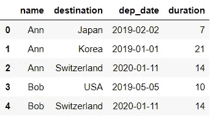

让我们将 *dep_date* 定义为前往目的地的出发日期，并假设 *duration* 以天数表示行程长度。

# 1.比较🔎

## 📍 1.1.换档:超前()和滞后()

我们先从基本版的`LEAD()` 和`LAG()`说起。对于每一次行程，我们来拉下一次行程的出发日期: *lead1* ，第二次下一次行程: *lead2* ，上一次行程: *lag1* ，第三次上一次行程: *lag3* **。**

```
SELECT name
       , destination
       , dep_date
       , duration
       , LEAD(dep_date) OVER(ORDER BY dep_date, name) AS lead1
       , LEAD(dep_date, 2) OVER(ORDER BY dep_date, name) AS lead2
       , LAG(dep_date) OVER(ORDER BY dep_date, name) AS lag1
       , LAG(dep_date, 3) OVER(ORDER BY dep_date, name) AS lag3
FROM df
```

为了在熊猫身上得到同样的产量，我们使用`shift()`:

```
df.sort_values(['dep_date', 'name'], inplace=True)
df.assign(lead1 = df['dep_date'].shift(-1),
          lead2 = df['dep_date'].shift(-2),
          lag1 = df['dep_date'].shift(),
          lag3 = df['dep_date'].shift(3))
```

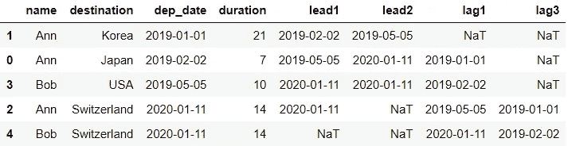

在第一行中，我们用`sort_values()`对数据进行了排序，因为我们对所有的移位操作使用了相同的逻辑。这样做比我们每次创建新列时都要对数据进行排序更有效，如下所示:

```
df.assign(lead1 = df.sort_values(['dep_date', 'name'])['dep_date']
                    .shift(-1),
          lead2 = df.sort_values(['dep_date', 'name'])['dep_date']
                    .shift(-2),
          lag1 = df.sort_values(['dep_date', 'name'])['dep_date']
                   .shift(),
          lag3 = df.sort_values(['dep_date', 'name'])['dep_date']
                   .shift(3))
```

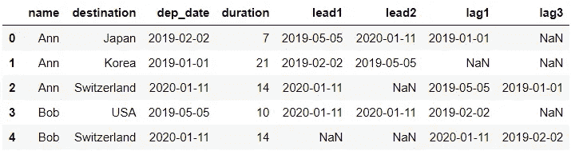

这种低效方法的输出将包含正确的值，但是行的顺序将与原始数据相同，并且不会被排序。

现在让我们看看剩下的 4 行代码。在熊猫中，我们可以用`assign()`创建多个栏目。但是，新的列还没有添加到 DataFrame 中。如果我们想添加新的列到`df`，我们需要这样分配:

```
df.sort_values(['dep_date', 'name'], inplace=True)
df = df.assign(lead1 = df['dep_date'].shift(-1),
               lead2 = df['dep_date'].shift(-2),
               lag1 = df['dep_date'].shift(),
               lag3 = df['dep_date'].shift(3))
```

我们将在最后一节看另一个带有`PARTITION BY()`的`LEAD()`的例子。现在，让我们看看如何操作日期/日期时间列。

## 📍 1.2.Date/datetime: DATENAME()，DATEDIFF()，DATEADD()

在本节中，我们将从出发日期开始提取一周的日名称:*日*，从出发日期开始的月份名称:*月*，从上一次旅行开始经过的天数:*差*和到达日期: *arr_date* 。

```
SELECT name
       , destination
       , dep_date
       , duration
       , DATENAME(WEEKDAY, dep_date) AS day
       , DATENAME(MONTH, dep_date) AS month
       , DATEDIFF(DAY,  
                  LAG(dep_date) OVER(ORDER BY dep_date, name), 
                  dep_date) AS diff
       , DATEADD(DAY, day, dep_date) AS arr_date
FROM df
```

首先，我们必须确保列数据类型是正确的:

```
# Convert to proper dtype
df['dep_date'] = pd.to_datetime(df['dep_date'])
df['duration'] = pd.to_timedelta(df['duration'], 'D')
```

将 *dep_date* 转换为 datetime 将允许我们使用`.dt`访问器访问许多日期部分。例如:`df[‘dep_date’].dt.year`将给出年份(相当于 SQL 中的`DATEPART(YEAR, dep_date)`)。

将*持续时间*转换为 timedelta 允许我们将其添加到一个日期时间列，以获得另一个日期时间列。

完成数据类型转换后，让我们来看一下比较:

```
df.sort_values(['dep_date', 'name'], inplace=True)
df.assign(day = df['dep_date'].dt.day_name(),
          month = df['dep_date'].dt.month_name(),
          diff = df['dep_date'] - df['dep_date'].shift(),
          arr_date = df['dep_date'] + df['duration'])
```

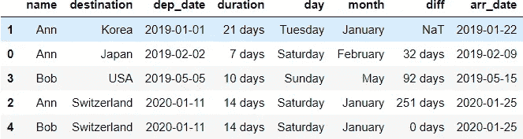

如您所见，一旦正确设置了数据类型，操作就变得简单了。值得注意的是，我们可以用 DataFrame 的`dtypes`属性检查列的数据类型。这里有一个例子:

```
df.sort_values(['dep_date', 'name'], inplace=True)
df.assign(day = df['dep_date'].dt.day_name(),
          month = df['dep_date'].dt.month_name(),
          diff = df['dep_date'] - df['dep_date'].shift(),
          arr_date = df['dep_date'] + df['duration']).dtypes
```

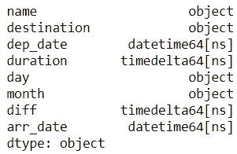

在 pandas 中，当发现两个日期之间的差异时，它返回一个 timedelta 列。因此，我们可以看到列 *diff* 实际上是一个时间增量。

## 📍 1.3.排名:ROW_NUMBER()，RANK()，DENSE_RANK()

您可能以前在 SQL 中至少使用过这些函数中的一个。这三者之间的关键区别是他们在排名关系和排名之后的待遇。让我们创建三个列，分别使用以下方法根据*持续时间*对每个记录进行排序: *row_number_d，rank_d* 和 *dense_rank_d.*

使用`ROW_NUMBER()`时，领带的等级与其他两种不同。为了控制如何用`ROW_NUMBER()`处理平局，我们使用*名称*来打破平局。

```
SELECT name
       , destination
       , dep_date
       , duration
       , ROW_NUMBER() OVER(ORDER BY duration, name) AS row_number_d
       , RANK() OVER(ORDER BY duration) AS rank_d
       , DENSE_RANK() OVER(ORDER BY duration) AS dense_rank_d
FROM df
```

pandas 中的查询可以通过`rank()`实现:

```
df.sort_values(['duration', 'name']).assign(
    row_number_d = df['duration'].rank(method='first').astype(int),
    rank_d = df['duration'].rank(method='min').astype(int),
    dense_rank_d = df['duration'].rank(method='dense').astype(int))
```

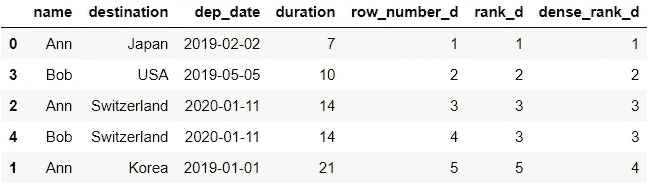

如上图所示，我们在`rank()`中指定了相关的方法。值得注意的是，这里还有我们没有涉及的其他变化。如果你有兴趣了解一下，看看[文档](https://pandas.pydata.org/pandas-docs/stable/reference/api/pandas.DataFrame.rank.html)。

我们在这个例子中做了一些稍微不同的事情。与前两节中的例子不同，我们没有对数据进行适当的排序。相反，我们将方法链接起来，根本没有修改数据。

你可能也注意到了我们已经包括了`astype(int)`。这是为了将浮点数中的秩转换成整数。如果您喜欢看到浮动，那么可以删除这部分代码:

```
df.sort_values(['duration', 'name']).assign(
    row_number_d = df['duration'].rank(method='first'),
    rank_d = df['duration'].rank(method='min'),
    dense_rank_d = df['duration'].rank(method='dense'))
```

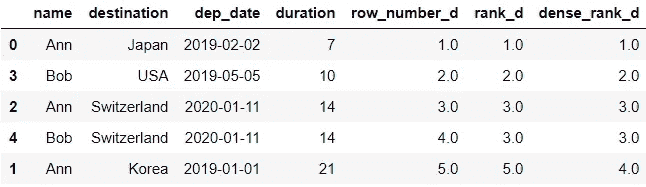

## 📍 1.4.聚合窗口函数和分区

在本节中，我们将为最长的旅行持续时间创建列: *max_dur* ，所有旅行的总持续时间: *sum_dur* ，每人旅行的平均持续时间: *avg_dur_name* 以及每人旅行时间的累计总和: *cum_sum_dur_name。*

```
SELECT name
       , destination
       , dep_date 
       , duration
       , MAX(duration) OVER() AS max_dur
       , SUM(duration) OVER() AS sum_dur
       , AVG(duration) OVER(PARTITION BY name) AS avg_dur_name
       , SUM(duration) OVER(PARTITION BY name ORDER BY dep_date
                            RANGE BETWEEN UNBOUNDED PRECEDING
                            AND CURRENT ROW) AS cum_sum_dur_name
FROM df
```

熊猫可以这样做:

```
df.assign(max_dur=df['duration'].max(),
          sum_dur=df['duration'].sum(),
          avg_dur_name=df.groupby('name')['duration']
                         .transform('mean'),
          cum_sum_dur_name=df.sort_values('dep_date')
                             .groupby('name')['duration']
                             .transform('cumsum'))
```

因为[广播](https://jakevdp.github.io/PythonDataScienceHandbook/02.05-computation-on-arrays-broadcasting.html)，所以在 pandas 中添加诸如 *max_dur* 和 *sum_dur* 之类的聚合统计数据很简单。本质上，如果我们试图给 pandas 中的一个新列分配一个标量值，该值将在所有行中传播。`PARTITION BY`由`groupby()`和`transform()`组合实现。

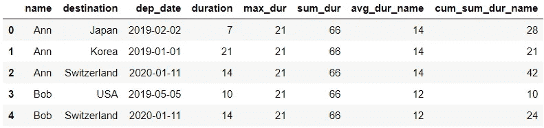

在此输出中，数据的顺序与之前相同(即未排序)，但它将按照 SQL 中每个人的 *dep_date* 排序。我们仅在创建 *cum_sum_dur_name* 时对数据进行了排序。如果我们希望对输出进行排序，代码将变为:

```
df.sort_values(['name', 'dep_date'], inplace=True)
df.assign(max_dur=df['duration'].max(),
          sum_dur=df['duration'].sum(),
          avg_dur_name=df.groupby('name')['duration']
                         .transform('mean'),
          cum_sum_dur_name=df.groupby('name')['duration']
                             .transform('cumsum'))
```

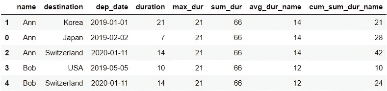

这将与 SQL 输出相同。

## 📍 1.5.把它放在一起

最后，让我们编写一个查询，覆盖我们刚刚访问过的四个不同区域。这是我们的最后一个例子:

```
SELECT ROW_NUMBER() OVER(PARTITION BY name 
                         ORDER BY dep_date) AS number
       , name
       , destination
       , DATENAME(MONTH, dep_date) AS dep_month
       , dep_date
       , DATEADD(DAY, duration, dep_date) AS arr_date
       , LEAD(dep_date) OVER(PARTITION BY NAME 
                             ORDER BY dep_date) AS next_dep_date
       , DATEDIFF(DAY, 
                  dep_date, 
                  LEAD(dep_date) OVER(PARTITION BY NAME 
                                      ORDER BY dep_date)) AS gap
       , duration
       , AVG(1.0 * duration) OVER() AS avg_dur
       , AVG(1.0 * duration) OVER(PARTITION BY name) AS avg_dur_name
       , SUM(duration) OVER(PARTITION BY name ORDER BY dep_date
                            RANGE BETWEEN UNBOUNDED PRECEDING 
                            AND CURRENT ROW) AS cum_sum_dur_name   
FROM df
ORDER BY name, dep_date
```

我相信当我们练习自己的时候，我们会学到更多。我鼓励您在看到我们将要看到的比较之前，自己尝试将这个 SQL 查询翻译成 pandas。👀

下面是对比:

```
# Convert to proper type
df['dep_date'] = pd.to_datetime(df['dep_date'])
df['duration'] = pd.to_timedelta(df['duration'], 'D')# Sort data
df.sort_values(['name', 'dep_date'], inplace=True)# Append new columns to data
df = df.assign(number=df.groupby('name')['dep_date']
                        .rank('min')
                        .astype(int),
               dep_month = df['dep_date'].dt.month_name(),
               arr_date = df['dep_date'] + df['duration'],
               next_dep_date = df.groupby('name')['dep_date']
                                 .transform(lambda x: x.shift(-1)),
               gap = df.groupby('name')['dep_date']
                       .transform(lambda x: x.shift(-1))-
                                            df['dep_date'],
               avg_dur = df['duration'].mean(),
               avg_dur_name = df.groupby('name')['duration']
                                .transform(lambda x: x.mean()),
               cum_sum_dur_name = df.groupby('name')['duration']
                                   .transform(lambda x: x.cumsum()))# Reorder columns
columns = ['number', 'name', 'destination', 'dep_month', 
           'dep_date', 'arr_date', 'next_dep_date', 
           'gap', 'duration', 'avg_dur', 'avg_dur_name', 
           'cum_sum_dur_name']
df[columns]
```

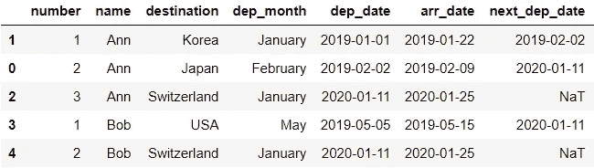

输出—第 1 部分

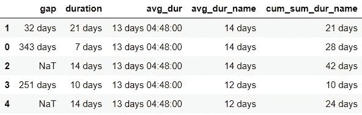

输出—第二部分

我们已经转换了数据类型，对数据进行了分类，并用新列对其进行了修改。为了以与 SQL 查询相同的方式查看列排序的数据，我们使用了一个列出列顺序的列表。如果只运行`df`，列的排序会有所不同。

你可能已经注意到 *avg_dur* 是用天数、小时数和分钟数的组合来表示的:“13 天 04:48:00”。这相当于 13 + (4*60+48) / (24*60) = 13.2 天。如果我们只想看到 13.2，那么我们可以用这个代码片段替换`df[‘duration’].mean()`，它在找到平均值之前将*持续时间*转换为数字类型:`pd.to_numeric(df[‘duration’].dt.days).mean()`。

当创建 *avg_dur_name* 和 *cum_sum_dur_name* 时，我们使用了`lambda`函数，而不是使用这样的语法:

```
avg_dur_name = df.groupby('name')['duration'].transform('mean'),
cum_sum_dur_name = df.groupby('name')['duration']
                     .transform('cumsum')
```

这是因为如果我们试图这样做，我们将会遇到一个在这里描述的问题。因此，我们使用了一种变通办法。

Voila❕这番话结束了我们的比较。


由 [Unsplash](https://unsplash.com?utm_source=medium&utm_medium=referral) 上的 [Shubham Dhage](https://unsplash.com/@theshubhamdhage?utm_source=medium&utm_medium=referral) 拍摄的照片

*您想访问更多这样的内容吗？媒体会员可以无限制地访问媒体上的任何文章。如果你使用* [*我的推荐链接*](https://zluvsand.medium.com/membership)*成为会员，你的一部分会费会直接去支持我。*

谢谢你看我的帖子。希望这篇文章对你有用，✂️，并了解更多关于熊猫的知识。如果你有兴趣了解更多关于熊猫的信息，这里有我的一些帖子的链接:

◼️️[pandas 中数据聚合的 5 个技巧](/writing-5-common-sql-queries-in-pandas-90b52f17ad76)
◼️️ [在 pandas 中编写 5 个常见的 SQL 查询](/writing-5-common-sql-queries-in-pandas-90b52f17ad76)
◼️️ [给 pandas 用户的 5 个技巧](/5-tips-for-pandas-users-e73681d16d17)
◼️️ [如何转换 pandas 数据框架中的变量](/transforming-variables-in-a-pandas-dataframe-bce2c6ef91a1)

再见🏃💨