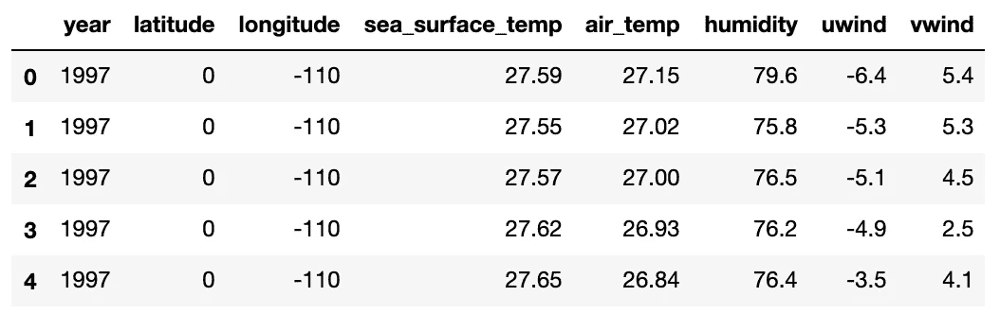
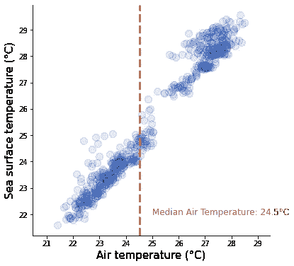
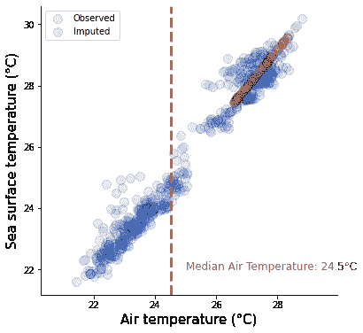

# 编写自定义 scikit-学习变形金刚

> 原文：<https://towardsdatascience.com/writing-custom-scikit-learn-transformers-e07a3cf7b559?source=collection_archive---------68----------------------->

## 当您需要量身定制的解决方案时。


[Samule 孙](https://unsplash.com/@samule?utm_source=unsplash&utm_medium=referral&utm_content=creditCopyText)在 [Unsplash](https://unsplash.com/s/photos/transformer?utm_source=unsplash&utm_medium=referral&utm_content=creditCopyText) 上的照片

scikit-learn 的 transformers API 是一个用于数据清理、预处理、特征工程和提取的强大工具。然而，有时，在众多可用的变压器中，没有一个能与手头的具体问题相匹配。在这些场合，能够自己写一个是很方便的。幸运的是，很容易利用 scikit-learn 的类来构建一个遵循包约定的转换器，并且可以包含在 scikit-learn 管道中。


# 问题设置

为了实用，我们来看一个例子。我们有一个名为`TAO` 的数据集，代表热带大气海洋。它包含一些天气测量，如温度、湿度或风速。R 库`VIM`提供了这些数据的子样本。这里，我们正在处理一个稍微预处理过的版本。



快速浏览一下数据框，我们会发现`air_temp`变量中有大量缺失值，我们需要在建模前对其进行估算。

```
<class 'pandas.core.frame.DataFrame'>
RangeIndex: 733 entries, 0 to 732
Data columns (total 8 columns):
year                733 non-null int64
latitude            733 non-null int64
longitude           733 non-null int64
sea_surface_temp    733 non-null float64
air_temp            655 non-null float64
humidity            642 non-null float64
uwind               733 non-null float64
vwind               733 non-null float64
dtypes: float64(5), int64(3)
memory usage: 45.9 KB
```

Scikit-learn 提供了输入转换器，如`SimpleImputer`，它通过变量的平均值、中间值或其他一些量来填充变量的缺失值。然而，众所周知，这种插补会破坏数据中的关系。

但是看，还有另一个叫做`sea_surface_temp`的变量没有丢失值！我们可以预期水温与气温高度相关！让我们画出这两个变量的对比图。



正如我们所料，存在明显的线性关系。此外，我们可以看到为什么均值或中值插补毫无意义:在水温为 22 或 29 的观测中，将气温设定为 24.5 度的中值完全破坏了这两个变量之间的关系。

似乎输入`air_temp`的一个好策略是使用带有`sea_surface_temp`的线性回归作为预测器。从 scikit-learn 0.21 版本开始，我们可以使用`IterativeImputer`并将`LinearRegression`设置为输入引擎。然而，这将使用数据中的所有变量作为预测值，而我们只需要水温。让我们编写自己的转换器来实现这一点。


# 定制变压器

scikit-learn 转换器应该是一个实现三种方法的类:

*   `fit()`，它简单地返回`self`，
*   `transform()`，它将数据`X`作为输入，并执行所需的转换，
*   `fit_transform()`，如果包含`TransformerMixin`作为基类，会自动添加。

在这些之上，我们有`__init__()`来捕获参数——在我们的例子中是空气和水温列的指数。我们还可以包含`BaseEstimator`作为基类，这将允许我们从 transformer 对象中检索参数。

总而言之，所有的工作都归结为实际编写`transform()`方法，该方法使用适当的列来拟合线性回归模型，并使用它来估算气温。整个事情只有几行代码:

我们现在可以像使用任何其他 scikit-learn 转换器一样使用我们的 imputer:

我们还可以提取它的参数:

```
{'air_temp_index': 4, 'sea_temp_index': 3}
```

让我们通过在之前的散点图上绘制估算值来检查估算器是否工作良好。



看起来不错:所有估算的数据点都在一条线上，这应该是线性回归预测的情况。更重要的是，估算的数据看起来与观察到的数据相似。


感谢阅读！如果你有兴趣学习更高级的插补方法，请查看我在 DataCamp 上教授的 [**课程。**](https://datacamp.com/courses/handling-missing-data-with-imputations-in-r)

如果你喜欢这篇文章，为什么不订阅电子邮件更新我的新文章呢？并且通过 [**成为媒介会员**](https://michaloleszak.medium.com/membership) ，可以支持我的写作，获得其他作者和我自己的所有故事的无限访问权限。

需要咨询？你可以问我任何事情，也可以在这里为我预约 1:1[](http://hiretheauthor.com/michal)**。**

**也可以试试 [**我的其他文章**](https://michaloleszak.github.io/blog/) 中的一篇。不能选择？从这些中选择一个:**

**[](/working-with-amazon-s3-buckets-with-boto3-785252ea22e0) [## 使用 Boto3 处理亚马逊 S3 桶。

### 完整的备忘单。

towardsdatascience.com](/working-with-amazon-s3-buckets-with-boto3-785252ea22e0) [](/uncertainty-from-imputation-8dbb34a19612) [## 插补的不确定性

### 你在预测中考虑到它了吗？

towardsdatascience.com](/uncertainty-from-imputation-8dbb34a19612) [](/a-comparison-of-shrinkage-and-selection-methods-for-linear-regression-ee4dd3a71f16) [## 线性回归中收缩法和选择法的比较

### 详细介绍 7 种流行的收缩和选择方法。

towardsdatascience.com](/a-comparison-of-shrinkage-and-selection-methods-for-linear-regression-ee4dd3a71f16)**