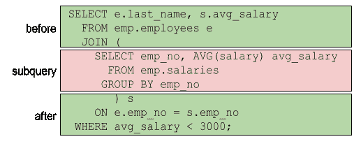
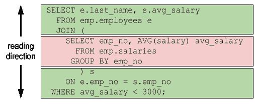
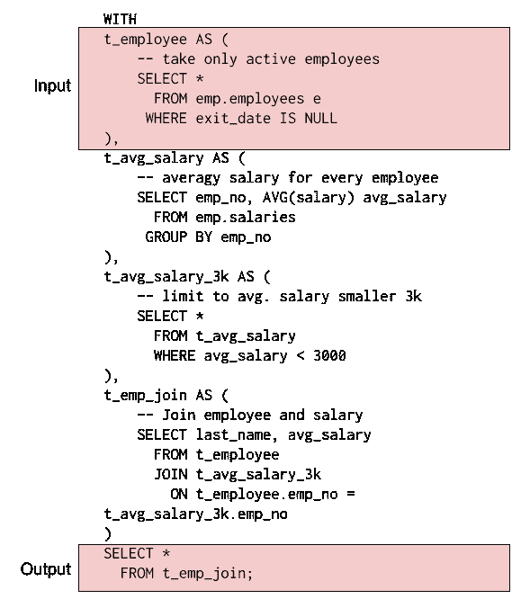

# 编写优秀的 SQL

> 原文：<https://towardsdatascience.com/writing-good-sql-ccb578ff9919?source=collection_archive---------7----------------------->

## 通过适配层来进一步结构化查询语言


[国家癌症研究所](https://unsplash.com/@nci?utm_source=medium&utm_medium=referral)在 [Unsplash](https://unsplash.com?utm_source=medium&utm_medium=referral) 上拍摄的照片

你想写出好的 SQL 吗？当然，但是“好”实际上是什么意思？

在某些实时环境中，只有性能被认为是“好的”,并且您以毫秒来度量您的执行时间。在商业智能和数据仓库环境中，性能仍然很重要，但通常可维护性更有价值。这可能是一个更好的解决方案，产生可读和可维护的 SQL 代码，即使它每月都要耗费大量的资金。请记住理解复杂查询的时间成本、潜在错误产生的成本以及修复错误的时间。根据您的数据库引擎优化器，您通常会两者兼得。因此，在本文中，我们关注可读性和可维护性。

我假设您已经知道 SQL 的基本和更高级的元素:连接、分组、子查询或分析函数。结合这些元素，你可以很快产生一个大混乱。但是，我们能做些什么来保持具有数百行和 20 个或更多表格的大型查询的可读性呢？

# 最基本的

当我们说可读性时，我们不得不谈论风格。Simon Holywel l 有一篇很棒的 [SQL 风格指南，看看吧。但是如果你很匆忙，你可以用这三个建议走得很远:](https://www.sqlstyle.guide)

*   对所有保留的关键字使用大写，如 SELECT、FROM 或 WHERE，对列、表和符号名称使用小写
*   通过将关键字对齐到右边，将值对齐到左边，创建一个间隙

```
SELECT first_name, last_name, birth_date
  FROM emp.employees
 WHERE gender = ‘F’;
```

*   每当查询变得比简单的 SELECT/FROM/WHERE 语句复杂时，就使用注释

```
 /* find highest actual salary for each employee */
SELECT first_name, last_name, MAX(salary)
  FROM emp.employees e
  JOIN emp.salaries s
    ON e.emp_no = s.emp_no
 WHERE current_date BETWEEN from_date AND to_date -- filter date
 GROUP BY first_name, last_name;
```

有了这些基本规则，您的 SQL 将很容易达到至少中等的可读性水平。随着您的 SQL 变得越来越大和越来越复杂，您将达到一定的极限，在这里您需要比样式指南提供的更多的结构。

# 子查询，或者痛苦从哪里开始

你知道子查询吗？子查询非常适合将问题封装在查询块中。基本上，SELECT 语句中有三种类型的子查询:

*   在 FROM 子句中，作为具有别名的派生表

```
SELECT COUNT(*)
  FROM (SELECT gender
          FROM emp.employees) e
```

*   作为限定符放在 WHERE 子句中

```
SELECT *
  FROM emp.employees e
 WHERE 0 < (SELECT COUNT(*)
              FROM emp.salaries s
             WHERE s.emp_no=e.emp_no
               AND salary > 3000)
```

请注意，这也是一个相关子查询，应该小心使用(参见[https://en.wikipedia.org/wiki/Correlated_subquery](https://en.wikipedia.org/wiki/Correlated_subquery))。

*   标量子查询(也称为相关子查询)

```
SELECT last_name, (SELECT MAX(salary)
                     FROM emp.salaries
                    WHERE emp_no=e.emp_no)
  FROM emp.employees e
```

# 那么问题出在哪里呢？

子查询可以有更多任意深度的子查询。当您从子查询开始时，随着时间的推移，很可能会出现更多的子查询。其他人会以你为榜样。每个子查询都需要缩进，行变得越来越长。这是更复杂语句可读性的主要问题。

更重要的是，每个子查询都将周围的查询分成代码“before”和“after”。



查询中间的子查询

在过程化时代，编码的黄金法则之一是:

> 不要写比你的屏幕大的块

(一个屏幕有 25 行)。但是如果中间有一个子查询，那么在 SELECT 块和 WHERE 子句的列之间可以有数百行。

这导致了一种有趣的阅读 SQL 查询的方式。通常，你从中间的某个地方开始，慢慢地向边缘发展。



带有子查询的读取方向

这种“从里到外”的阅读方向与我们通常的从上到下的阅读方向相反，我们大多数人都很习惯这种阅读方向。

# 的力量

我们中的一些人编写 SQL 多年，但从未使用过 WITH 子句。试试看，值得！

在 WITH 子句中，可以给子查询一个符号名，就像在 FROM 子句中一样，同时将它移到语句的开头。

```
WITH t_avg_salary AS (
    --averagy salary for every employee
    SELECT emp_no, AVG(salary) avg_salary
      FROM emp.salaries
     GROUP BY emp_no
)
SELECT e.last_name, avg_salary
  FROM emp.employees e
  JOIN t_avg_salary
    ON e.emp_no = t_avg_salary.emp_no
 WHERE avg_salary < 3000;
```

并且您可以构建一个子查询的“管道”,这些子查询相互建立

```
WITH t_avg_salary AS (
    -- average salary for every employee
    SELECT emp_no, AVG(salary) avg_salary
      FROM emp.salaries
     GROUP BY emp_no
),
t_avg_salary_3k AS (
    -- limit to avg. salary smaller 3k
    SELECT *
      FROM t_avg_salary
     WHERE avg_salary < 3000
),
t_employee AS (
    -- Join employee and salary
    SELECT e.last_name, avg_salary
      FROM emp.employees e
      JOIN t_avg_salary_3k
        ON e.emp_no = t_avg_salary_3k.emp_no
)
SELECT *
  FROM t_employee;
```

这带来了以下进步:

*   因为每个子查询本身都是一个块，所以功能是相互分离的
*   每个子查询都可以获得自己的标题注释，这明显提高了可理解性
*   你可以自上而下地阅读你的代码，这对可读性很好
*   每个子查询都以固定的缩进量从行首开始。因此，遵循团队的编码风格指南会有更少的问题，该指南通常将行长度限制在 80 个字符以内
*   向查询中添加功能(或更多子查询)不会强制您重新格式化整个查询。这导致了你的版本控制系统的细微变化。例如，取消平均工资限额:

```
7,12d6
< t_avg_salary_3k AS (
<     -- limit to avg. salary smaller 3k
<     SELECT *
<       FROM t_avg_salary
<      WHERE avg_salary < 3000
< ),
17c11
< JOIN t_avg_salary_3k
 ---
> JOIN t_avg_salary
```

保持子查询块较小，重点放在单一功能上。不要混合功能，例如连接、过滤、分组、映射。

最后但同样重要的是，使最后一个块非常简单，只有 SELECT 和 FROM。把它想象成一个层模型。第一个模块用于数据采集，最后一个模块仅用于输出。如果你把更多的功能放进去，你会像开始时一样结束。



用多个子查询分层

# 额外收获:构建特性在 SQL 中切换

在大型系统中使用 SQL 时，通常会涉及到变量替换。如果您试图在 SQL 的两个功能之间切换，很快就会得到难看的代码。

使用 WITH，您可以轻松地将数据库名称、表名称或不同的配置参数放入配置节中。而且，您可以使用它来打开和关闭块的使用。

假设您有一个前面讨论过的子查询流。其中一个实现了对“薪金< 3000”的限制，这应该只在您的代码的较新版本中有效。

将最后一个子查询中的连接表替换为变量“t_avg_salary”(此处为 python f-string 格式):

```
WITH
…
t_emp_join AS (
    -- Join employee and salary
    SELECT last_name, avg_salary
      FROM t_employee e
      JOIN t_avg_salary_3k s
        ON e.emp_no = s.emp_no
)
SELECT *
  FROM t_employee;
```

“t_avg_salary”的可能值现在是“t_avg_salary”和“t_avg_salary_3k”。

通过更改“t_avg_salary”切换变量，您可以更改 SQL 的输出，而无需更改代码。您是创建一个伪派生表，还是简单地使用下面的派生表取决于您。

简单地跳过中间的子查询。