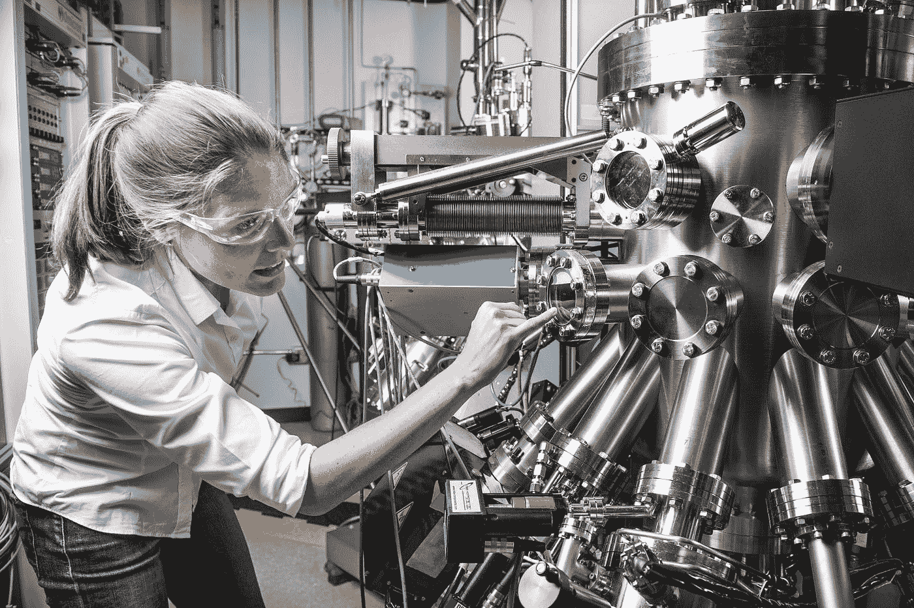

# 在介质上写作让我得到了一份数据分析的工作

> 原文：<https://towardsdatascience.com/writing-on-medium-got-me-a-job-in-data-analytics-586564d29264?source=collection_archive---------10----------------------->

## 这是我从工业工程过渡到数据分析和数据科学的故事

F 首先，我想说的是，我写的关于[走向数据科学](https://towardsdatascience.com/)的文章所得到的回应让我受宠若惊。我非常感谢那些关注我、持续阅读我的文章并给我反馈的人们——你们都很棒。

在开始讲述我的故事之前，我还想说明一点:我最近接受的职位名为“全球解决方案分析师”，它实际上是数据分析、一些数据工程、数据科学和一些工业工程的结合。

你好，我是梅根！(照片由[亚当·索罗门](https://unsplash.com/@solomac?utm_source=medium&utm_medium=referral)在 [Unsplash](https://unsplash.com?utm_source=medium&utm_medium=referral) 上拍摄)

对于那些不了解我个人，或者没有在 LinkedIn 上跟踪我的人，我从 2015 年到 2019 年参加了加州理工大学，并获得了工业工程学士学位。在加州理工大学期间，我有过两次实习，主要集中在制造业的流程改进(在是德科技和特斯拉)，目标是为公司省钱。我在两家公司都学到了很多东西，但我真的只是喜欢其中的一些工作。剧透——这是我处理大量数据的工作。

这不是我，但我是金发碧眼的，而且我戴了安全眼镜！(高清[科普](https://unsplash.com/@scienceinhd?utm_source=medium&utm_medium=referral)在 [Unsplash](https://unsplash.com?utm_source=medium&utm_medium=referral) 上拍摄)

我意识到我不想成为一名事必躬亲、深入工厂车间、掌握流程和修理机器的工业工程师。所以，我决定在毕业时找一份技术咨询的工作来改变现状。

(为一家会计公司)技术咨询并不是我想象中的那样。相比技术和数据，我更多地处理业务/变更管理，这与我寻找的和我认为我的技能所在的领域相反。很明显，我需要为我自己的幸福做出改变，所以我在仅仅 6 个月后就辞职了，这真的超出了我的舒适区，感觉…很可怕。

经过深思熟虑和查看工作描述后，我决定通过[Thinkful.com](http://thinkful.com)参加一个数据科学训练营。这是一个为期 6 个月的项目，我很高兴我抓住了这个机会。我选择的课程是自定进度和完全在线的，所以我可以自由地在对我来说有挑战性或有趣的概念上花更多的时间。我也有额外的时间写中型文章，因为我没有兼职做全职工作。

数据数据数据数据数据。由[克里斯·利维拉尼](https://unsplash.com/@chrisliverani?utm_source=medium&utm_medium=referral)在 [Unsplash](https://unsplash.com?utm_source=medium&utm_medium=referral) 上拍摄

我开始写中型文章，为申请工作建立我的简历/文件夹。然后我意识到:1。我真的很喜欢写作。似乎缺少适合数据科学初学者的好文章。我阅读(并欣赏)了许多关于统计和特定数据科学技术的技术文章，但我没有看到许多人试图让数据科学概念真正易于非技术或初学者阅读。

我有史以来最受欢迎的文章是关于向一个五岁的孩子解释数据科学概念和机器学习模型的最酷的是:人们开始在 LinkedIn 上联系我，因为他们读了我的文章。后来，因为我的写作，我得到了斯坦利·布莱克和德克尔公司的面试机会，这给了我一份全职工作。说实话，我对整件事还有点震惊。

我有一种感觉，我会收到一些 LinkedIn DM 的咨询，询问我关于转行、获得数据分析工作、参加训练营等方面的建议。我不是一个有经验的专业人士，但我会积极主动地提供我的一般建议:努力工作，利用免费资源，在你想要的领域建立人际关系，并试图找到一种让自己与众不同的方法。无论是写文章，活跃在 LinkedIn 上，建立一个很酷的投资组合网站，发布 YouTube 视频，还是其他什么，你都可以为自己建立一个“品牌”，这对求职真的有帮助。

此外，我相信帮助我改变职业生涯的是突出我的工业工程领域知识作为一种资产。不管你的背景是什么，如果它能让你更好地理解你正在分析的数据，或者更好地，让你根据分析做出改变，那就非常有价值！

请随时在 LinkedIn 上与我联系，但请记住，我可能无法回答您的所有问题。(出于某种原因，我在 LinkedIn 上收到了很多提问，好像我是一个经验丰富的专业人士，或者好像我主动提出成为每个人的私人导师。)并且，无论你处于数据科学职业生涯的哪个阶段，还是媒介作家之旅的哪个阶段，我都祝你好运！

以下是我在过去 6 个月的数据科学训练营中学到的一些其他文章:

 [## 我研究了 500 多个数据科学面试问题

### 以下是我一路走来学到的东西

towardsdatascience.com](/i-worked-through-500-data-science-interview-questions-51e2e4dead9d)  [## 参加新兵训练营？这里有一些注意事项

### 经过 4 个月的数据科学课程，我学到了一些东西

medium.com](https://medium.com/thinkful/enrolling-in-a-boot-camp-here-are-some-dos-and-don-ts-95c93acff5d1) 

此外，如果您希望开始或继续学习数据科学，这里有一篇文章提供了大量免费学习资源的链接:

 [## 免费数据科学资源汇编

### 对于那些对学习数据科学感兴趣的人

towardsdatascience.com](/a-compilation-of-free-data-science-resources-7861f572cc85) 

一如既往的感谢阅读:)