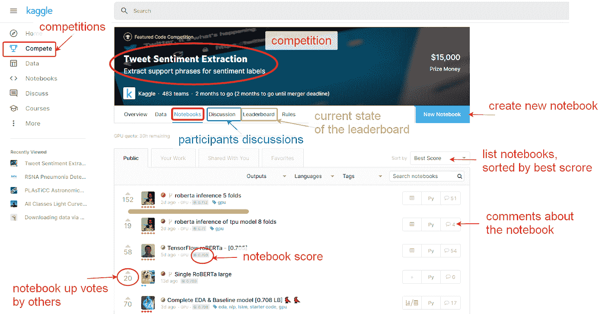

# Kaggle 比赛后撰写论文/技术报告

> 原文：<https://towardsdatascience.com/writing-papers-tech-reports-after-kaggle-competitions-ee504fc0c4c1?source=collection_archive---------29----------------------->

照片由[帕特里克·福尔](https://unsplash.com/@patrickian4?utm_source=unsplash&utm_medium=referral&utm_content=creditCopyText)在 [Unsplash](https://unsplash.com/s/photos/writing?utm_source=unsplash&utm_medium=referral&utm_content=creditCopyText) 拍摄

## **我参加机器学习挑战赛后发表科技论文的经历**

# 关于 Kaggle

[Kaggle](https://www.kaggle.com/) 是最受欢迎的机器学习竞赛平台。它举办免费的课堂竞赛、CVPR 和 NIPS 等会议的挑战、科学竞赛和商业挑战。挑战组织者通常提供数据、评估标准和评估测试集。该测试集用于形成公共排行榜，允许近似比较参与者的模型性能，并在挑战的追逐游戏中驱动游戏化能力。许多人被公众排行榜的追逐所消耗和摧毁，而不是相信他们的本地验证。

图片来自 [Pixabay](https://pixabay.com/?utm_source=link-attribution&utm_medium=referral&utm_campaign=image&utm_content=862274) 的 [morzaszum](https://pixabay.com/users/morzaszum-1241839/?utm_source=link-attribution&utm_medium=referral&utm_campaign=image&utm_content=862274)

Kaggle 平台也有讨论、笔记本和数据集，参与者可以分享他们的想法、数据和代码样本。这有助于加快这一进程，因为在一定程度上，这一挑战正得到集体解决。也为学习提供了很大的支持；因此，许多学生和起义机器学习专家选择 Kaggle 平台进行首次比赛。

Kaggle 网站界面。

当然还有其他的机器学习比赛平台，比如 [topcoder](https://www.topcoder.com/) 、 [Codalab](https://competitions.codalab.org/competitions/22393) 、 [Zindi](https://zindi.africa/competitions/2030-vision-flood-prediction-in-malawi) 等等【更多是[这里](https://mlcontests.com/)。但是由于缺少笔记本和良好的论坛，他们更倾向于既定的专业人士，而不太适合学生和学习者。因此，Kaggle 通常是练习机器学习的首选。

Kaggle 经常为谷歌云平台提供凭证，可以在有限的挑战时间内使用。荷兰互联网服务提供商 HOSTKEY b . v .([https://www.hostkey.com/gpu-servers#/](https://slack-redir.net/link?url=https%3A%2F%2Fwww.hostkey.com%2Fgpu-servers%23%2F))也可以提供对 GPU 服务器的访问和技术援助。你可以在这里申请他们的资助:【http://landing.hostkey.com/grants】T2。

# 为什么要在 Kaggle 比赛后写论文/技术报告

[安德鲁·尼尔](https://unsplash.com/@andrewtneel?utm_source=unsplash&utm_medium=referral&utm_content=creditCopyText)在 [Unsplash](https://unsplash.com/s/photos/writing?utm_source=unsplash&utm_medium=referral&utm_content=creditCopyText) 上拍照

在机器学习竞赛期间，通常会尝试和验证许多方法和想法，通常会为给定的任务产生最先进的模型。太多时候，所有这一切都没有结果，除了前三名的解决方案可能会去挑战组织者那里。这显然是对知识和(通常是巨大的)计算资源的浪费，这很遗憾。

近年来，许多顶级参与者撰写文章描述他们的解决方案，甚至在比赛结束后公开他们的代码。这是一个伟大的创举。然而，简短的记录通常不足以再现结果，Kaggle 风格的代码通常有些混乱，没有注释很难理解。在挑战过程中，每个人都在匆忙追逐排行榜，只有少数参与者为生产质量代码而烦恼。

以下是考虑在比赛后将你的顶级 Kaggle 解决方案模型形成一份详细的技术报告/论文，而不是我们通常看到的一个小时的书面报告的主要原因。

1.这是对人类知识基础的巨大贡献，它确实产生了影响。通常，在竞赛期间，几个想法被实施，许多尝试(和失败)被执行，有时甚至可以在获奖模型中看到 SOTA 解决方案。详细总结这一切将有助于其他研究人员和学生在选择方法、模型架构、损失函数或增强时节省时间。

即使你没有明确地看到影响，它也是存在的——在你论文的所有引用和 GitHub repo 的分叉中。

2.挑战后适当的技术报告/论文迫使你清理你的代码，使其可读和可复制。作为 GitHub 上的一个迷你项目，它看起来很不错，引用了 arXiv 和一个干净的项目代码——你可以把它添加到简历中，在没有 nd a 问题的情况下分享。

3.向 arXiv 投稿没有同行评审程序，而向期刊/会议投稿则有。在 arXiv 上发布技术报告后，您可以将其发送到会议论文集或相关期刊。这件事也发生在我身上:在 arXiv 上发表了一份草稿后，它被邀请到一家 T2 杂志。将你的作品提交给会议和期刊会对你的模型和使用的方法进行适当的同行评审。是的，有时审查意味着你需要做额外的计算，烧蚀研究和重写一半的论文(我知道那种感觉)，但值得知道的是，这种反馈使你的研究和技术部分更好。

4.你已经准备好了一切:数据分析、工作管道代码、你的结果甚至数字。挑战结束后直接把它们放在一起会更容易。

5.最后是很好的长期公关。Kaggle post 每天都很受欢迎，一篇好的同行评审论文会持续很长时间，它会出现在 arXiv 和相关的会议记录上，从而为你和你的公司(如果你有的话)创造一个长期的公关。

# 竞赛后写论文/技术报告的一些顾虑

图片由 [Gerd Altmann](https://pixabay.com/users/geralt-9301/?utm_source=link-attribution&utm_medium=referral&utm_campaign=image&utm_content=513529) 从 [Pixabay](https://pixabay.com/photos/despair-alone-being-alone-archetype-513529/) 拍摄

1.  天下没有免费的午餐。写一份技术报告或论文意味着花时间制作适当的文件，浏览相关文献，回顾当前的艺术水平，详述你的方法，绘制结果，起草文本等等。这需要时间。找到对此感兴趣的合作者是有用的，即使他们没有参与挑战。
2.  做一份合适的论文通常意味着重新运行你在挑战追逐中快速做出的所有计算，所有这些尝试和失败现在都需要重现，消融研究也需要执行。在研究中没有失败，只有有价值的信息，所以是的，你需要运行所有那些未改进的模型来衡量你的改进的影响。这意味着更多的计算，更多的尝试和系统的研究。有时，你可能会找到一个比你提交的挑战更好的解决方案。很正常。
3.  经历会议/期刊投稿和所有这些同行评审过程有时真的很痛苦。有时审查意味着你需要做额外的计算，烧蚀研究和重写一半的论文。记住，它让你工作得更好。它教会你耐心。
4.  有时候，在竞争追逐之后，你太累了，以至于不能再看一遍代码，让它变得干净，添加所有那些文档字符串和注释。这也很正常。但是记住，编写一个好的代码并以 GitHub repo 的形式打开它也有助于你的简历。
5.  同行评审过程可能会遭到拒绝。不要对此过于沮丧:考虑审稿人的反馈，然后重新提交给更相关的期刊或会议。

图片由来自 [Pixabay](https://pixabay.com/?utm_source=link-attribution&utm_medium=referral&utm_campaign=image&utm_content=413690) 的 [Ryan McGuire](https://pixabay.com/users/RyanMcGuire-123690/?utm_source=link-attribution&utm_medium=referral&utm_campaign=image&utm_content=413690) 拍摄

去年，我成功地提交了两篇关于挑战的技术论文。我在 [arXiv](https://arxiv.org/abs/1909.05032) 和 [GitHub](https://github.com/tatigabru/kaggle-rsna) 上发表了它们。一篇论文被邀请到天文学会杂志，第二篇论文被 CVPR 研讨会接受。以下是如何实现这一目标的分步指南。

# 赛后撰写论文/技术报告的步骤

1.  做你的研究当前的艺术状态，用于类似任务的方法，阅读最近的相关论文。最有可能的是，你已经在一次竞赛中尝试实施这些论文中的想法。现在，是时候把东西放在一起，参考所有以前的工作，并在引言中用几句话形成一个概述。

关于深度学习的新方法的最新信息，一个很好的来源是[**papers with code**](https://paperswithcode.com/)。它提供了带有可用代码的出版物参考，并提供了流行数据集的最新排行榜。

2.清理代码并添加注释。您可以考虑使用 [**黑色**](https://black.readthedocs.io/en/stable/) 进行样式格式化， [**isort**](https://github.com/timothycrosley/isort) 进行导入排序，[**flake 8**](https://flake8.pycqa.org/en/latest/)**和**[**Mypy**](https://mypy.readthedocs.io/en/stable/)进行检查。这篇博文提供了如何让你的代码更具可读性的有用信息。编写一个自述文件，说明如何设置环境和下载数据，如何训练模型和再现实验。****

********

****图片来自 [Pixabay](https://pixabay.com/?utm_source=link-attribution&utm_medium=referral&utm_campaign=image&utm_content=4420676) 的[丹尼尔·基尔希](https://pixabay.com/users/danielkirsch-4218687/?utm_source=link-attribution&utm_medium=referral&utm_campaign=image&utm_content=4420676)****

****3.做消融研究。修正所有的随机种子和超参数，对所有有用的和不太成功的技巧重复计算，一个一个地引入变化，重复所有你尝试过但被拒绝的尝试，记录每次的度量。这将给你一个关于你所实现的模型改进的真正贡献的消融研究。****

****4.浏览 Kaggle 上分享的其他顶级解决方案，联系获胜者，询问如何使用他们的想法/代码作为参考。值得在您的消融研究中添加他们的改进，并在论文讨论环节中纳入他们的想法。总的来说，Kagglers 对此非常开放:我询问了大约 3-4 个人关于使用他们的参考内容的问题，并且总是得到许可。你甚至可以进一步改进你的模型，然后迟些提交参赛作品。Kaggle 平台允许迟交。****

****5.制作一个数据集描述，准备几个说明数据的图表，显示数据类别分布，给出所有使用的额外数据的来源。它应该遵循介绍。描述给定的任务和使用的指标。****

****6.当您完成消融研究，用改进的方法重新训练您的模型，并在排行榜上取得好成绩时，是时候写下来了。描述您使用的模型、您如何分割数据、使用的超参数以及培训过程。简洁明了，参考你的 GitHub repo。不要忘记引用你在文中使用的所有资源。****

****7.写下你的结果。制作一些图表，说明不同模型的训练和数据扩充；添加一个表格，列出您的实验和消融研究的评分结果。****

****8.最后，反思你的结果。你可以添加一个讨论区，也可以添加失败的尝试，提到什么没有成功。此外，您可以将其他参与者分享的观点纳入本部分。****

****9.不要忘记一个致谢环节，感谢挑战组织者、Kaggle 平台和任何你认为有用的东西。****

****10.要制作纸张样式，您可以使用 LaTex 编辑器(即 WinEdit)或在线编辑器(即背面)，并从背面的[下载不同的样式。一旦完成，用](https://www.overleaf.com/latex/templates.)[从语法上](https://www.grammarly.com/)检查你的文本是个好主意。****

****11.首先向 arXiv 提交您的作品。然后，确定相关的会议和期刊，在选择会议时注意即将到来的提交截止日期，阅读他们对作者的说明，下载他们的 latex 模板，并将您的内容复制到其中。准备好后，通过会议或期刊网站提交，等待评审。****

****同行评审过程可能会遭到拒绝。不要对此过于沮丧:每个期刊/会议都有它的范围。尽可能遵循评论者的指导方针，并考虑他们的反馈。然后，将改进后的文章重新提交给另一个相关的期刊或会议。****

****经过所有的工作，一些挫折和改进，你的工作会看到世界。到那时，它将更具可读性和实用性。还有，很有可能，会让你开心:)。对于你的简历和 GitHub repo 来说都会是一笔很好的资产。****

********

****图片来自 [StartupStockPhotos](https://pixabay.com/users/StartupStockPhotos-690514/?utm_source=link-attribution&utm_medium=referral&utm_campaign=image&utm_content=593313) 来自 [Pixabay](https://pixabay.com/photos/children-win-success-video-game-593313/)****