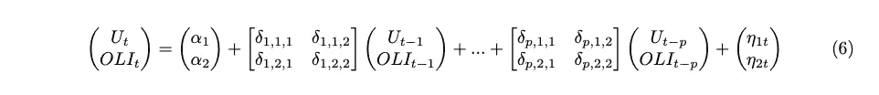

# 撰写专业数据科学文档

> 原文：<https://towardsdatascience.com/writing-professsional-data-science-documentation-1141737836fa?source=collection_archive---------57----------------------->


安妮·斯普拉特在 [Unsplash](https://unsplash.com/s/photos/stash-paper?utm_source=unsplash&utm_medium=referral&utm_content=creditCopyText) 上的照片

文档是成为数据科学家的重要组成部分。我建议使用 R Markdown 和 LaTeX 来记录数据科学模型。

好的文档有几个可取的特性

*   容易接近
*   易读的
*   跨项目保持一致
*   可再生的

在 R Markdown 中使用 LaTeX 允许用户在多个项目中使用一致的 LaTeX 格式，编写解释给定模型的专业数学公式，一致地引用图形/文章，并从模型的输出中动态地生成图形。

LaTeX 是一个文档准备系统，最初是为学者设计的，用于在科学出版物的格式上引入一致性。它还可以成功地用于记录机器学习模型。

为了使用它，你需要安装 LaTeX 发行版。不需要安装完整版的 LaTeX。可以使用 R 包 tinytex 来呈现带有 LaTeX 代码的文档。

```
tinytex::**install_tinytex**()
```

要安装缺失的 LaTeX 库，可以使用 tinytext 通过粘贴错误消息作为参数来安装。

```
tinytex::**parse_install()**
```

例如，您可以通过日志文件来修复所有缺失的库错误。

```
tinytex::**parse_install**("filename.log")
```

LaTex 在 R Markdown 中的主要用途是键入数学公式和编号方程，添加引用。这是我为格兰杰因果关系键入的代码示例。

```
\begin{equation}\begin{pmatrix}U_{t} \\OLI_{t} \\\end{pmatrix}=\begin{pmatrix}\alpha_{1} \\\alpha_{2} \\\end{pmatrix}+\begin{bmatrix}\delta_{1,1,1} & \delta_{1,1,2} \\\delta_{1,2,1} & \delta_{1,2,2} \\\end{bmatrix}\begin{pmatrix}U_{t-1} \\OLI_{t-1} \\\end{pmatrix}+ ... +\begin{bmatrix}\delta_{p,1,1} & \delta_{p,1,2} \\\delta_{p,2,1} & \delta_{p,2,2} \\\end{bmatrix}\begin{pmatrix}U_{t-p} \\OLI_{t-p} \\\end{pmatrix}+\begin{pmatrix}\eta_{1t} \\\eta_{2t} \\\end{pmatrix}\end{equation}
```

这就是它在渲染文档中的样子。



图 1:格兰杰因果关系

我意识到上面的代码可能看起来很吓人。LaTeX 可能有一个陡峭的学习曲线，但是一旦你在谷歌的帮助下键入几个第一方程，它就会变得明显更容易和更自动化。

R Markdown 允许您将文档划分为节/子节，添加标题，添加目录，并生成可以记录给定模型输出的图表。您可以在代码块中编写 R/Python 代码，并在代码块之间编写 LaTeX 公式和文本。R Markdown 文档易于编辑和呈现。要了解更多关于 R Markdown、设置参数和渲染 HTML/pdf 的信息，我推荐使用 R Markdown Cookbook[https://bookdown . org/易慧/rmarkdown-Cookbook/rmarkdown-process . HTML](https://bookdown.org/yihui/rmarkdown-cookbook/rmarkdown-process.html)

为 agile R Markdown 文档提供 LaTeX 的一致性和可能性，为您提供了一个记录数据科学模型的强大工具，这对于未来从事您的项目的数据科学家以及希望了解您的工作的更多细节的技术利益相关者来说至关重要。

我建议将 R Markdown 文档和呈现的 HTML/PDF 一起包含在您的项目 git 存储库中，在 documentation 文件夹中。这将允许您轻松访问模型的更多技术细节，并进行任何必要的更正。此外，您只能在渲染 pdf 时使用 LaTeX。否则，请随意使用 HTML。

LaTeX 和 R Markdown 的有用资源列表

[1][https://book down . org/易慧/rmarkdown-cookbook/rmarkdown-process . html](https://bookdown.org/yihui/rmarkdown-cookbook/rmarkdown-process.html)

[2]https://bookdown.org/yihui/rmarkdown/pdf-document.html

[3]https://wch.github.io/latexsheet/

[4][https://www . over leaf . com/learn/latex/书目 _ 管理 _with_bibtex](https://www.overleaf.com/learn/latex/bibliography_management_with_bibtex)