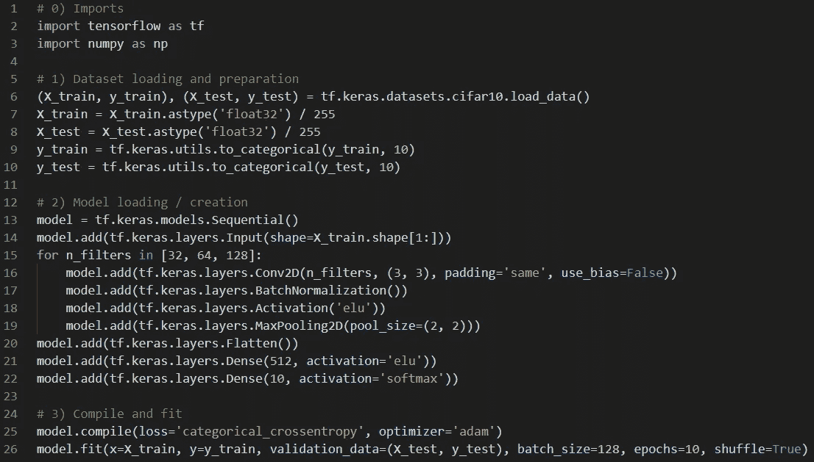
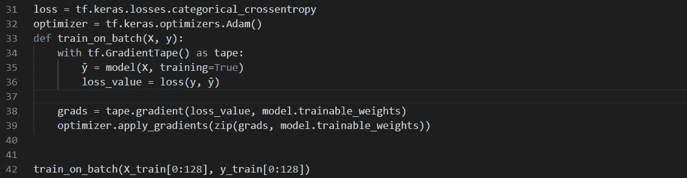
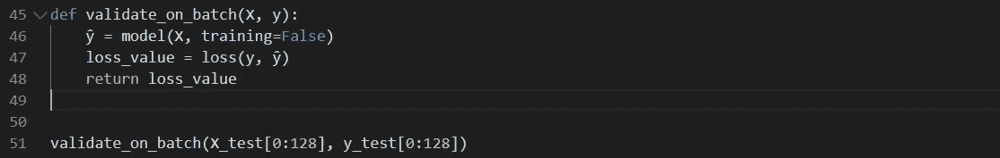
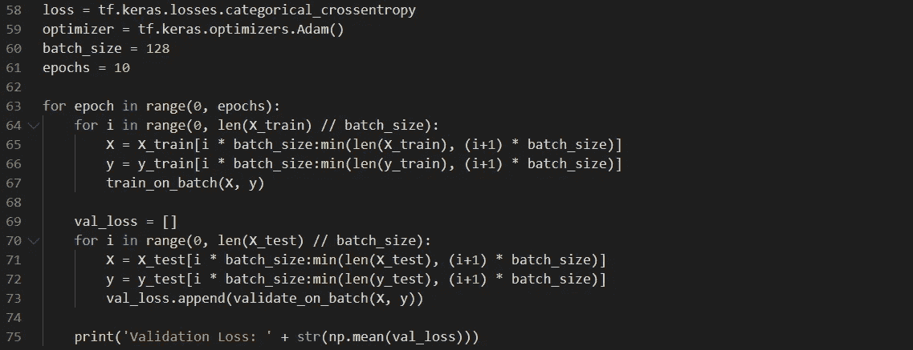
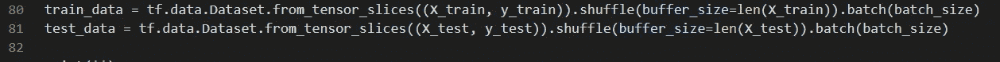
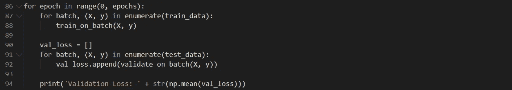
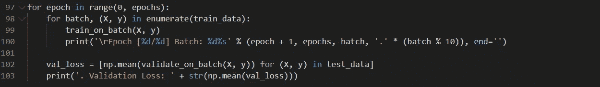
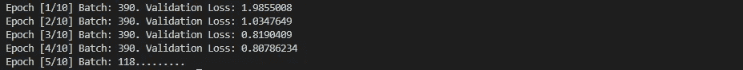
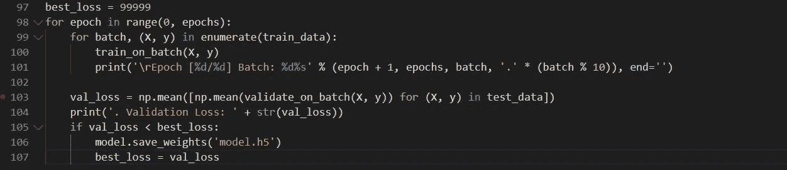
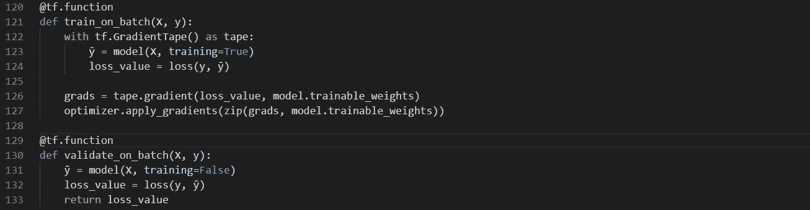

# 如何编写 TensorFlow 2 自定义循环

> 原文：<https://towardsdatascience.com/writing-tensorflow-2-custom-loops-438b1ab6eb6c?source=collection_archive---------19----------------------->

## 从 Keras 到 TensorFlow 2 的分步指南

由 [Georg Eiermann](https://unsplash.com/@georgeiermann?utm_source=medium&utm_medium=referral) 在 [Unsplash](https://unsplash.com?utm_source=medium&utm_medium=referral) 上拍摄

我使用 Keras 已经有一段时间了，我从来没有找到一个好的理由去其他地方。TensorFlow 1 笨拙，PyTorch 虽然性感，但不太懂我。我倾向于做原型的时候学的最多，Keras 是这里的王者。快进到 2019 年 9 月，TensorFlow 2 发布。不久之后，我把所有的`import keras`通话都切换到了`import tensorflow.keras`。

如果这篇文章只是关于从 Keras 迁移到 TensorFlow 2，它可以在这里结束。真的。然而，在 TensorFlow 2 附带的所有功能中，自定义训练循环无疑是 Keras 用户的最佳新功能。在本文中，我解释了它们为什么重要以及如何实现。

**免责声明:**我已经将所有代码添加为图片，因为它在智能手机上显示得更好。[所有代码都可以作为 GitHub gist](https://gist.github.com/nuzrub/f1527654572b3e2da5125d0581e7bdad)获得。如果你知道或者更喜欢发布代码的其他替代方法，请写信给我。

# 张量流 2

对于外行人来说，TensorFlow 2 的问题在于，它抛弃了 TensorFlow 1 的大多数习惯用法和 Keras 上的几个 API，Keras 是唯一一个用于定义神经网络的 API。此外，他们热衷于执行死刑。

这两个变化一起解决了早期张量流的许多批评:

1.  **不再有几个 API。**
2.  **不需要手动管理变量。**
3.  **会话没了。**
4.  **可以调试执行流程。**
5.  动态模型现在是可能的。

与此同时，他们成功实现了这一点，同时保留了使 TensorFlow 1 闻名遐迩的部署能力和速度。

对于 Keras 用户来说，新的 API 意味着四件事:

1.  我们不再处于抽象层。
2.  创作新技术要容易得多。
3.  编写定制的训练循环现在是可行的。
4.  执行速度大大加快。

其中，自定义循环是 TensorFlow 2 对 Keras 用户如此重要的原因。定制循环提供了对训练的最终控制，同时使训练速度提高了约 30%。

> 老实说，TensorFlow 2 更好的名字应该是 Keras 3。

我知道一些谷歌开发人员可能会在我写这篇文章的时候死去，但这是事实。TensorFlow 1 是 Keras 的后端，在升级后基本保持不变。大多数新事物都比张量流更经典。

# 训练循环

本质上，所有 Keras 计划都遵循以下结构:

这一切都从导入开始，然后是数据集加载和准备、模型加载/创建，最后是编译和拟合调用。Keras 独有的编译方法将模型与损失函数和优化器相关联，而拟合函数执行所谓的“训练循环”

训练循环是将整个训练集逐批提供给算法、计算损失、其梯度并应用优化器的代码。然后，验证集被用于计算验证损失和验证指标。最后，整个过程重复几个“时期”

在训练循环期间，fit 方法还执行其他功能，例如操作几个工作线程、对模型进行检查点操作以及将结果记录到磁盘。自定义代码也可以通过回调在特定事件中插入。

> Keras 用户习惯于根本不用编写任何训练循环。fit 函数完美地完成了这一切，并允许对大多数用例进行适当的定制

固定训练循环的问题是，当不同的用例出现时，你就不走运了。最初的 Keras 很少提供定制的训练循环。

例子可以很容易地在 GAN 教程中找到。为了训练敌对网络，你必须交错他们的训练。为此，`train_on_batch` 方法是交错生成器和鉴别器训练的最佳方法，让您手动批处理和混洗数据集，编写您的进度条形码，并将其打包到每个历元的 For 循环中。

在 2017 年， [Wasserstein GAN](https://arxiv.org/abs/1701.07875) 被提出，它要求在训练中加入梯度裁剪，这是一个简单的要求。为了保持文明，Keras 中的 WGAN 实现是臃肿的。

这些都不是孤立的例子。任何多网络设置、渐变技巧或开箱即用的解决方案都可能需要您编写大量代码。这就是为什么 Keras 在研究者中如此不受欢迎(也是为什么 PyTorch 如此受欢迎)。

# 自定义循环

TensorFlow 2 为 Keras 用户带来的是打开`train_on_batch` 调用的能力，公开损失、梯度和优化器调用。然而，要使用它，您必须放弃编译和拟合功能。

从好的方面来看，Keras 不再是 TensorFlow 上的抽象。它现在是它的一部分了。这意味着我们不再需要在 Keras 中创建定制逻辑的所有奇怪的东西。一切兼容。我们不再需要。

首先，您必须自己获得损失和优化器对象。然后，定义 train_on_batch 调用。在我看来这很像 PyTorch 代码。你只需调用传递 x 的方法来得到ŷ，然后与 y 比较，得到损失值。

这一切都发生在梯度带的环境中，梯度带只是一种跟踪应该区分哪些操作的方法。使用磁带，我们可以得到关于每个训练变量损失的梯度。然后，梯度变量对被馈送到优化器，优化器将更新网络。

最后一行只是一个例子，说明如何提取一批 128 个样本来调试我们的新方法。

它的孪生兄弟`validate_on_batch`，只是它的一个简单版本。我们只需要摆脱胶带和梯度逻辑。

本质上，它是我们在渐变磁带中找到的相同代码，但是没有磁带(和渐变/优化器逻辑)。

**关于“训练=真”和“训练=假”参数的说明:**这改变了一些层的行为。例如， *dropout* 层在训练期间会丢弃一些连接，但在测试期间不会。这不会直接影响优化或任何其他与训练相关的任务。

完整训练循环的最小示例如下所示:

至此，我们有了一个最小的工作示例。然而，它缺少几个基本特征:

1.  当前的批处理逻辑笨拙且容易出错。
2.  **除了每个时期打印一张以外，没有进度指示器。**
3.  **没有模型检查点逻辑。**

这使我们想到以下一点:

> 做自己的循环很好，但是它也需要你重新编码一些你认为理所当然的特性

谢天谢地，改进它并不难:)

# 改善环路

首先要注意的是`tf.data`包。它包含 tf.data.Dataset 类，该类封装了几个数据集任务。

数据集 API 使用“流畅的风格”这意味着对 Dataset 对象的所有调用都返回另一个 Dataset 对象。这使得链接调用成为可能。下面是一个用它来解决我们的问题的例子:

这些调用为定型和测试数据创建一个 dataset 对象，为洗牌做准备，并对实例进行批处理。在我们的循环中，笨拙的批处理代码如下所示:

整洁多了。新代码只需枚举数据集中的所有批次。这也为我们处理洗牌，这总是一个好主意。

为了让我们的代码看起来更加生动，我们可以添加一些打印语句。我们还可以使我们的验证逻辑更短一些:

现在我们打印当前的纪元和批次，以及一些点来保持它的移动。为了验证，我们创建了一个每批平均损耗的列表，然后打印出最终的平均损耗。这是它在控制台中的样子:

对于模型检查点，我们必须跟踪到目前为止最好的验证准确性，以便我们只保存提高了我们性能的模型。这要求我们跟踪最佳损失，并将新的损失与之进行比较。就代码而言，这变成如下:

这完成了我们的目标，即改进数据集处理，看到更频繁的屏幕更新，并在训练时保存模型检查点。

最后一步是让它具有性能。

# tf .函数

到目前为止，我们正在所谓的“渴望模式”下运行这意味着如果你写“a + b ”,求和的结果会立即计算出来。虽然这简化了调试，但不是性能最好的方法。

深度学习发生在 GPU 上。每个“求和”和“相乘”命令都有成本。CPU 必须调用 GPU 并告诉哪些变量需要操作，等待操作完成，并取回结果。*这是慢*。一种更快的方法是给 GPU 一大堆要做的事情，并且只等待一次。

这种替代方法被称为“延迟模式”或“计算图”这个想法是让 TensorFlow 把你的网络变成一组对数据进行运算的数学步骤。这个命令列表再发送到 GPU，整体处理，速度快很多。

创建命令列表对于优化也是至关重要的。InceptionNet 等模型有多条路径，可以并行计算。简单的运算可以合并，例如乘法后接加法，等等。

要让 TensorFlow 为您构建这个图，您只需要用@tf.function 注释来注释`train_on_batch` 和`validate_on_batch` 调用。就这么简单:

第一次调用这两个函数时，TensorFlow 将解析其代码并构建关联的图。这将比平常花费更长的时间，但会使所有后续的调用明显更快。

一个很好的方法是在里面放一个 print 语句。在计算图形构建期间，打印将仅执行一次或两次。然后，它将不再打印，因为该函数不再被调用。

**在数值上，使用 RTX 2070 GPU，原始 Keras fit 函数需要 18 秒，自定义循环需要 40 秒，优化循环需要 20 秒。**这个简单的注释使它的速度比急切模式快了一倍。与 Keras fit 相比，它慢了 2 秒，显示了原始 fit 的优化程度。对于较大的问题和网络，优化的自定义循环优于原始拟合。在实践中，我发现使用定制循环可以提高 30%的纪元速度。

使用@tf.function 注释的缺点是它的错误消息很糟糕。经验法则是先在没有它的情况下开发，然后添加它只是为了验证，然后再添加到培训中。这样，您可以更容易地确定错误。

# 后续步骤

切换到自定义循环的用户正在不断改进他们的工作流程。例如，我已经在我的自定义代码中实现了回调和度量，以及一个漂亮的进度条。在互联网上，你可以找到一些软件包，如 [TQDM](https://pypi.org/project/tqdm/) 或非常 Keras [进度条](https://www.tensorflow.org/api_docs/python/tf/keras/utils/Progbar)。

实现自定义循环看起来像是额外的工作，但是它很快就有了回报，并且您只需要做一次。它允许您完全控制何时进行验证、计算哪些指标、复杂的培训计划等等。就模型而言，篡改训练过程要容易得多。您可以添加梯度惩罚，训练几个模型，或轻松创建虚拟批次。

事实上，PyTorch 用户多年来一直在这么做。

我把如何实现这些留给了你。如果你有任何问题，欢迎在评论区提问。

在我离开之前，有一个好消息即将发布。T **ensorflow 2.2 将允许您将自己的** `**train_on_batch**` **和** `**validate_on_batch**` **函数反馈给原始函数。安装 API** 。这意味着我们将两全其美。fit 调用将更加模块化，同时我们保留从头开始实现它的可能性。

这篇文章的代码可以在[这里](https://gist.github.com/nuzrub/f1527654572b3e2da5125d0581e7bdad)找到。

**更新:我最近发表了一份关于 TensorFlow 和 Keras 的技巧列表。在那里，我描述了如何创建定制的训练循环，而不需要重新实现整个。适合功能。**

 [## 让 Keras 和 TensorFlow 更上一层楼

### 充分利用 Keras 和 TensorFlow 的 11 个技巧和诀窍

towardsdatascience.com](/taking-keras-and-tensorflow-to-the-next-level-c73466e829d3) 

如果您对本文有任何问题，请随时发表评论或与我联系。如果你刚接触媒体，我强烈推荐[订阅](https://ygorserpa.medium.com/membership)。对于数据和 IT 专业人士来说，中型文章是 [StackOverflow](https://stackoverflow.com/) 的完美搭档，对于新手来说更是如此。注册时请考虑使用[我的会员链接。](https://ygorserpa.medium.com/membership)

感谢阅读:)