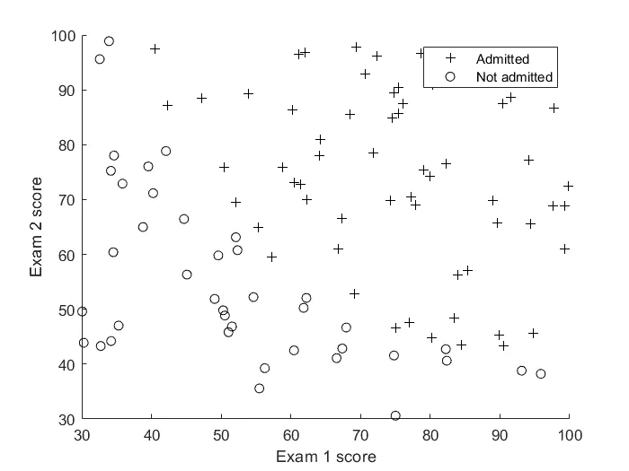
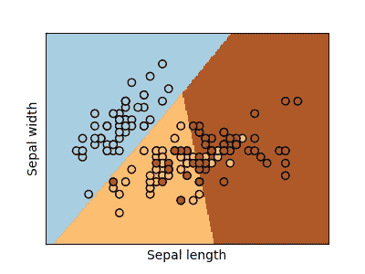
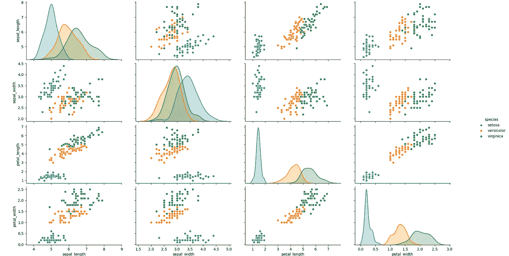
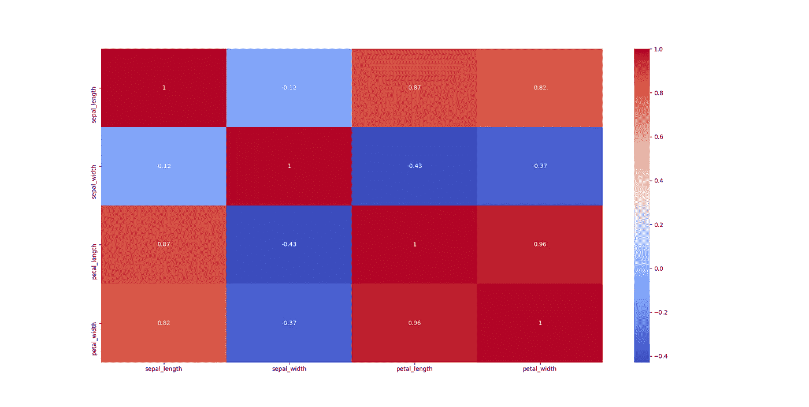
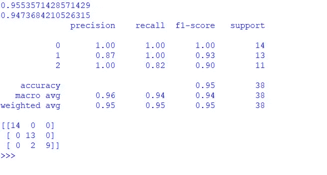
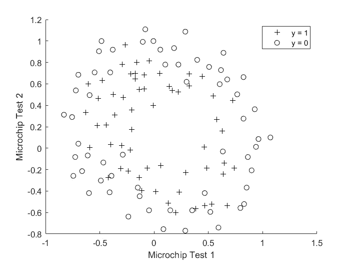
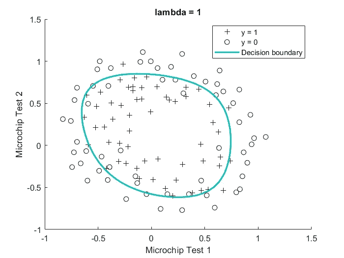
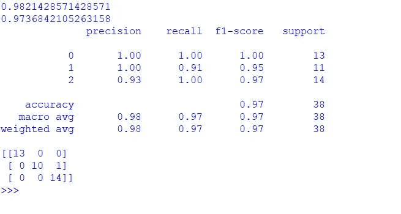
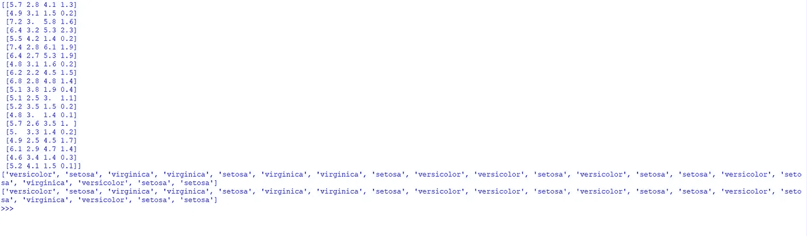

# 编写你的第一个人工智能/机器学习程序

> 原文：<https://towardsdatascience.com/writing-your-first-ai-machine-learning-program-92a590df86de?source=collection_archive---------17----------------------->

## 用于分类的鸢尾花数据集上的多项式逻辑回归


来源:[https://pix abay . com/photos/work-typing-computer-notebook-731198/](https://pixabay.com/photos/work-typing-computer-notebook-731198/)

你可能已经学到了很多关于人工智能和机器学习的理论，并且觉得很有趣。但是没有什么比看到模型和算法在真实数据上工作并产生结果更好的了，不是吗？有很多资料教你如何着手编写你的第一个 ML 程序，但我发现在大多数情况下，没有多少关于如何着手解决特定问题的分步指导。写得好的代码到处都是，但是缺乏方法论，这和学习如何写程序一样重要。所以我决定写一篇著名的《人工智能世界入门》——鸢尾花分类问题。

# 使用的数据集和算法

Iris flowers 数据集基本上包含 150 种花的实例。每朵花有 4 个属性:萼片长度、萼片宽度、花瓣长度和花瓣宽度(每一个都以厘米为单位),它可能属于 3 个可能的类别:刚毛花、蠕虫花和海滨花。更多信息，请访问网站:【https://archive.ics.uci.edu/ml/datasets/iris 

我们的目标是开发一个分类器，它可以基于 4 个特征将花准确地分类为 3 类中的一类。有很多算法可以做到这一点，但是因为这是你的第一个人工智能程序，让我们坚持一个最简单的算法，它也可以在这个数据集上相对较好地工作——逻辑回归。如果你刚开始学习机器，不知道它是什么，可以看看 Andrew NG 的流行的机器学习课程中的这一系列讲座。它们是一个完美的开始方式。如果你不熟悉正则化，也可以看看下一个系列的讲座，即第 7 讲。

如果你已经精通线性代数、一元和多元微积分、概率以及统计，并且想要更深入的数学理解，那么看看斯坦福在线的这个视频

是啊，我有点喜欢吴君如！总之，总结一下逻辑回归的作用，假设我们有以下数据集-



2D 数据集的散点图

旁边的数字显示了学生在两次考试中的录取分数，以及他们是否根据分数被学校/学院录取。逻辑回归所做的是，它试图找到一个线性决策边界，以最好地区分类别。


逻辑回归决策边界

正如我们所看到的，LR 很好地分离了这两个类。但是如果有两个以上的类呢，就像我们的例子一样？在这种情况下，我们为 n 个类别中的每个类别训练 n 个分类器，并让每个分类器尝试将一个类别从其余类别中分离出来。这种技术被正确地称为“一个对所有的分类”。最后，对于实例的预测，我们选择检测到其类最强的分类器，并将该类指定为预测类。这里的决策界限有点难以想象，但这里有一个来自 Sklearn 的例子



来源:[https://sci kit-learn . org/stable/auto _ examples/linear _ model/plot _ iris _ logistic . html](https://scikit-learn.org/stable/auto_examples/linear_model/plot_iris_logistic.html)

# 入门指南

好了，必要条件讲够了，现在让我们开始写代码。当然，我们将使用 Python 以及以下模块:Numpy、Matplotlib、Seaborn 和 Sklearn。如果你像我一样在你的电脑上工作，确保你已经安装了这些模块。要安装它们，只需打开命令行/终端，输入命令“pip install <module-name>”。要检查安装了哪些模块，请输入“python”，然后输入“help('modules ')”以生成所有已安装模块的列表。</module-name>

# 数据分析和可视化

首先，我们需要了解数据集中数据的分布情况。为此，让我们导入 matplotlib 和 seaborn 模块，并加载包含在 seaborn 模块中的 iris 数据集。

```
import matplotlib.pyplot as plt
import seaborn as sns
iris = sns.load_dataset(‘iris’)
```

这将把数据集加载到数据框架‘iris’中，这将使可视化更加容易。由于数据集有 4 个特征，我们不能直接将其可视化，但我们可以通过 seaborn 强大的 pairplot 获得一些直觉。pairplot 的作用是在数据集中的每对变量之间绘制散点图，以及每个变量的值的分布(沿对角线图形)。这可以用来分析哪些特征是数据的更好的分离器，哪些特征是密切相关的，以及数据分布。

```
sns.pairplot(iris, hue='species') #hue parameter colors distinct species
plt.show()
```



Iris 数据集上的 Seaborn Pairplot

Seaborn 的另一个强大工具是相关性热图。相关性是两个变量相互依赖程度的统计度量。如果一个变量的增加导致另一个变量的粗略增加，反之亦然，那么他们被称为正相关。如果一个变量的增加导致另一个变量的减少，反之亦然，它们是负相关的，如果它们之间没有这种相关性，它们就没有相关性。这就是我们如何用 Seaborn 绘制相关性图

```
sns.heatmap(iris.corr(), annot=True, cmap='coolwarm')
plt.show()
```

iris.corr()生成一个 4*4 矩阵，每个条目(I，j)代表 iᵗʰ和 jᵗʰ变量之间的相关性。显然，矩阵是对称的，因为 I 和 j 之间的依赖关系与 j 和 I 之间的依赖关系是一样的(希望这也适用于人类)。对角线元素是 1，因为一个变量显然完全依赖于它自己。annot 参数决定是否在热图顶部显示相关值，colormap 设置为 coolwarm，这意味着低值为蓝色，高值为红色。



Iris 数据集上的相关热图

# 数据准备和预处理

现在我们对数据有了一个直觉，让我们将数据装载到 numpy 数组中并对其进行预处理。预处理是至关重要的一步，它可以极大地提高算法的性能。我们导入所需的模块，以字典的形式从 sklearn 的 iris datasets 类中加载数据集，将特性和目标分别放入 numpy 数组 X 和 Y 中，并将类名放入 names 中。由于数据集中指定的目标是 0、1 和 2，代表 3 类物种，我们希望从这些整数映射到它们所代表的类的名称。为此，我们创建了一个从整数 0，1，2 到花名的字典映射。

```
import numpy as np
from sklearn.datasets import load_iris
dataset = load_iris()
X, Y, names = dataset['data'], dataset['target'], dataset['target_names']
target = dict(zip(np.array([0, 1, 2]), names))
```

让我们前进到预处理步骤。我们使用 sklearn 的 train_test_split 将数据分为训练集和测试集，使用 25%的测试集大小，然后使用 sklearn 的 StandardScaler 类。StandardScaler 所做的是计算数据集中每个要素的平均值和标准差，然后减去平均值并除以数据集中每个示例的标准差。这使得所有特征具有零均值和单位标准差/方差。将所有要素纳入同一范围也称为要素归一化，它有助于梯度下降等优化算法正常工作并更快收敛。

```
from sklearn.preprocessing import StandardScaler
from sklearn.model_selection import train_test_split
X_train, X_test, Y_train, Y_test = train_test_split(X, Y, test_size=0.25)
scaler = StandardScaler()  #create object of StandardScaler class
scaler.fit(X_train)        #fit it to the training set
X_train_pr = scaler.transform(X_train) #apply normalization to the training set
```

# 建立模型并评估它

是时候做真正的交易了。现在你会觉得非常感激 sklearn 让你的生活变得简单。我们创建了一个名为 model 的 LogisticRegression 类的对象，并使我们的训练数据集适合它，所有这些都使用了 3 行代码

```
from sklearn.linear_model import LogisticRegression
model = LogisticRegression()
model.fit(X_train_pr, Y_train)
```

现在，为了进行预测，我们首先使用标准定标器对测试集进行归一化。注意，该变换与应用于训练集(我们将缩放器安装到该训练集)的变换相同。这很重要，因为我们必须根据训练集的平均值和标准偏差来标准化测试集，而不是测试集。然后，我们使用预测函数在训练集和测试集上生成预测的 1D 数组。sklearn 的度量类中有许多可用的度量，但我们将使用 3 个最相关的度量——准确性、分类报告和混淆矩阵。

```
from sklearn.metrics import accuracy_score, classification_report, confusion_matrix
X_test_pr = scaler.transform(X_test)
Y_train_pred, Y_test_pred = model.predict(X_train_pr), model.predict(X_test_pr) 
print(accuracy_score(Y_train, Y_train_pred))
print(accuracy_score(Y_test, Y_test_pred))
print(classification_report(Y_test, Y_test_pred))
print(confusion_matrix(Y_test, Y_test_pred))
```

数据集非常小，因此，每次训练模型时，您可能会得到非常不同的结果。这是我得到的输出-



训练模型的评估

如果你不理解你看到的任何指标，请随意搜索它们，它们非常简单易懂。训练集精度约为 95.5%，测试集精度约为 94.7%。测试集中所有不同类别的 F1 分数的加权平均值是 0.95，并且测试集中的 2 个实例被错误地分类。第一次训练集上 94.7%的准确率确实很好，但我们可以做得更好。

# 改进模型

下面介绍多项式逻辑回归。事实证明，我们可以通过在模型中引入多项式特征来建立一个更好的模型，就像 x₁、x₁x₂、x₂那样，产生一个非线性的决策边界来更好地划分类别。这种模式比较实用。例如，让我们看看下面的数据集



2D 数据集的散点图

这个数据集看起来更实用一点，不是吗？它显示了在不同微芯片上的测试成绩和它们所属的类别。很明显，没有一个线性的决策边界能够令人满意地分离数据。使用多项式逻辑回归，我们可以得到一个决策边界，如下所示，它做得更好。



多项式逻辑回归决策边界

图中的λ= 1 指的是正则化参数。在处理非线性模型时，正则化变得非常重要，因为您不想过度适应训练集，也不想让您的模型在它没有见过的新示例上表现不佳。

要将多项式要素添加到数据集中，我们使用 sklearn 中的多项式要素类。这将作为附加步骤进入您的预处理，类似于特征标准化步骤。我们增加了 5 次幂项，你可以试着改变它，看看它对你的准确度有什么影响。结果是模型开始过度适应更高的程度，我们不希望这样。

```
from sklearn.preprocessing import PolynomialFeatures
X_train, X_test, Y_train, Y_test = train_test_split(X, Y, test_size=0.25)
poly = PolynomialFeatures(degree = 5)
poly.fit(X_train)
X_train_pr = poly.transform(X_train)
scaler = StandardScaler()
scaler.fit(X_train_pr)
X_train_pr = scaler.transform(X_train_pr)
```

然后继续上面讨论的相同步骤来拟合模型。要进行预测，不要忘记首先使用 poly 转换测试集。

```
X_test_pr = poly.transform(X_test)
X_test_pr = scaler.transform(X_test_pr)
Y_train_pred, Y_test_pred = model.predict(X_train_pr), model.predict(X_test_pr)
```

然后使用上面讨论的指标评估模型。同样，每次训练模型的结果都会不同。这是我的输出-



改进模型的评估

相当不错的成绩！使用像逻辑回归这样的简单算法，大约 98.2%的训练集精度和大约 97.4%的测试集精度是非常好的。测试集的加权 F1 分数已提高到 0.97，并且该模型仅错误地分类了测试集中的 1 个示例。

# 生成预测

是时候使用模型来生成预测了。我们给它一组 4 个数字——代表一朵花的 4 个特征，它会告诉我们它认为它属于哪个物种。我们从数据集中随机选取 20 个例子，对它们进行预处理，得到预测类。

```
indices = np.random.randint(150, size=20)
X_pred, Y_true = X[indices], Y[indices]
X_pred_pr = poly.transform(X_pred)
X_pred_pr = scaler.transform(X_pred_pr)
Y_pred = model.predict(X_pred_pr)
```

注意，Y_true 表示示例的真实类，Y_pred 是预测类。它们都是整数，因为模型处理的是数字数据。我们现在将创建 2 个列表，使用我们已经创建的名为 target 的字典映射来存储每个例子中物种的真实名称和预测名称。

```
target_true, target_pred = [], []
for i in range(len(Y_true)):
    target_true.append(target[Y_true[i]])
    target_pred.append(target[Y_pred[i]])
print(X_pred)
print(target_true)
print(target_pred)
```

这是我得到的输出-



对 20 个随机例子的预测

由于我们模型的高精度，生成的 20 个预测全部正确！这是我们创建的最终模型的完整代码-

尝试对模型进行一些修改，看看是否可以进一步改进它，以做出更现实的预测。你可以尝试不同的模型，如 KNN 分类器，支持向量分类器，甚至是一个小型的神经网络，尽管我不喜欢用神经网络来完成这项任务，因为特征和数据集的数量都很少，机器学习模型也能很好地执行。

# 结论

希望这能给你一些关于如何着手建立一个简单的人工智能，或者具体地说，解决一个特定问题的机器学习模型的想法。基本上有五个阶段-

1.  为该任务获取合适的数据集。
2.  分析和可视化数据集，并尝试获得关于您应该使用的模型的直觉。
3.  将数据转换成可用的形式，然后对其进行预处理。
4.  建立模型，并对其进行评估。
5.  检查模型的不足之处，并不断改进。

在处理构建人工智能应用程序时，需要进行大量的反复试验。即使你的第一个模型效果不好，也不要灰心。大多数情况下，通过调整它可以显著提高性能。获得正确的数据集是非常关键的，而且我觉得，当涉及到现实世界的模型时，它会改变游戏规则。该说的都说了，该做的都做了，尽可能地保持学习新东西，为了乐趣而做 AI！