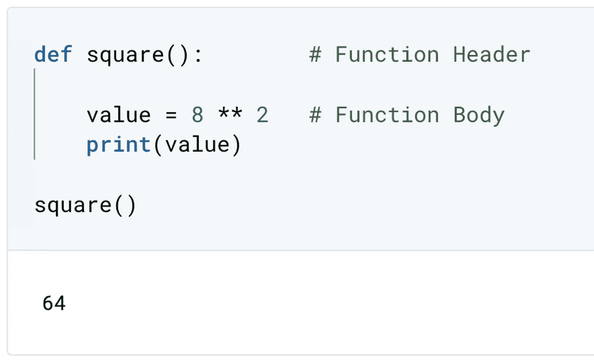
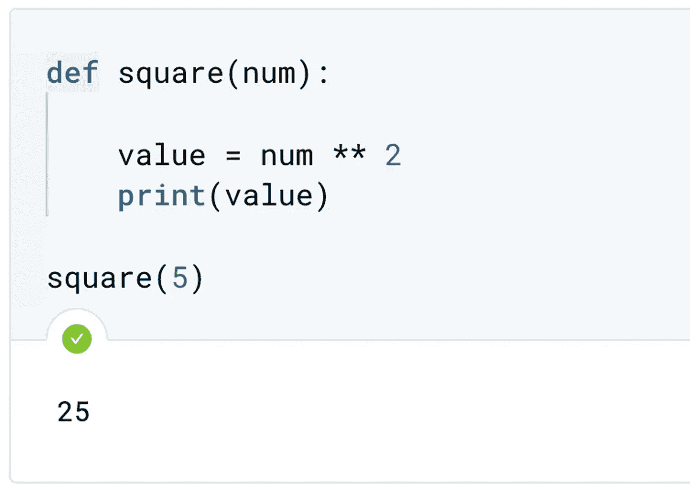
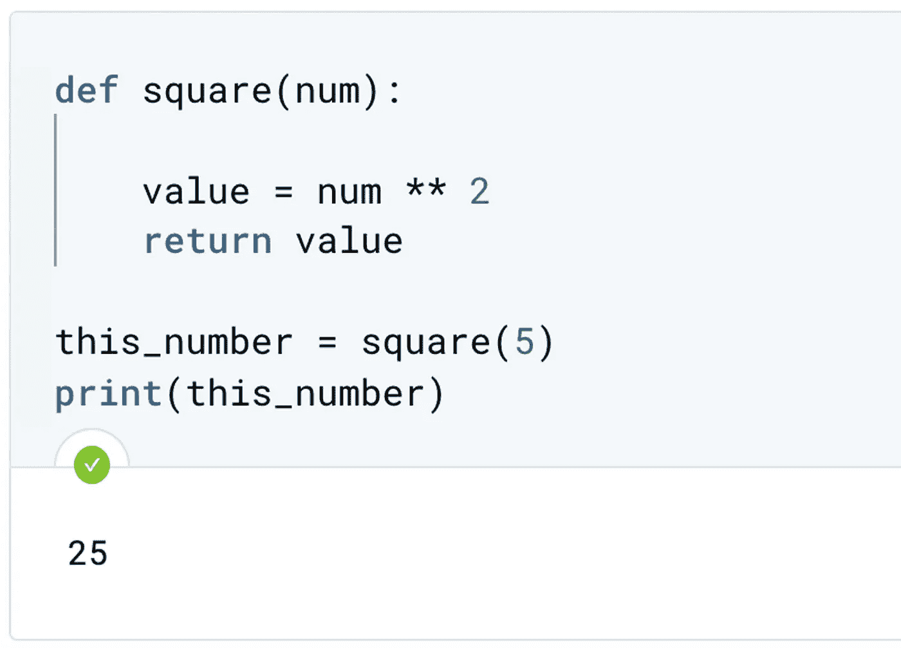
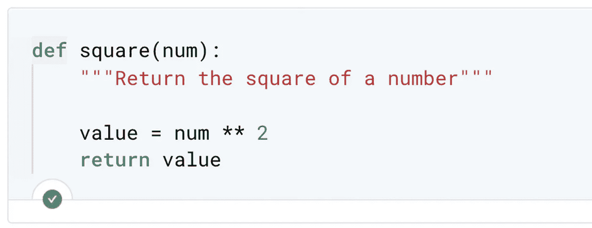
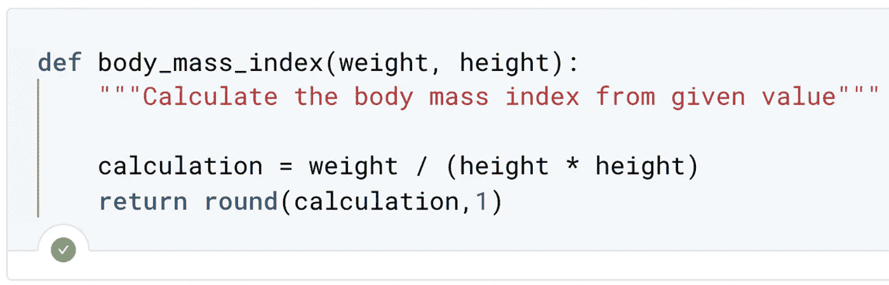
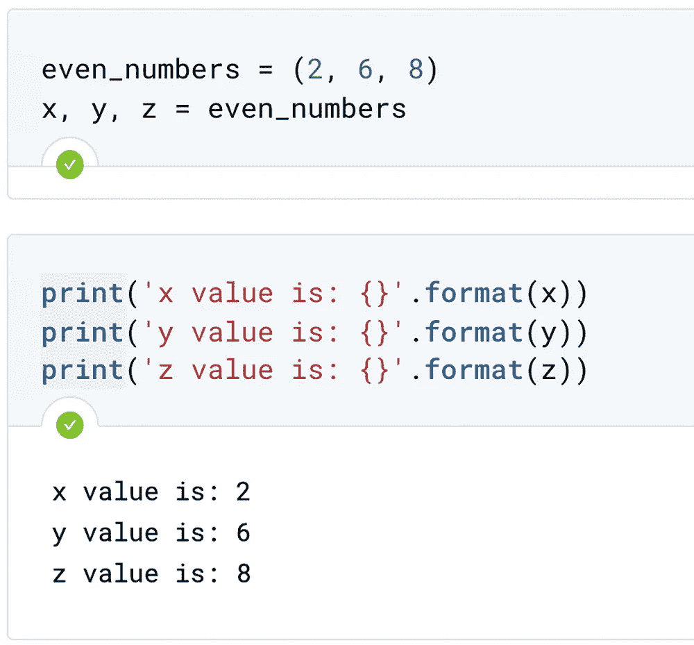
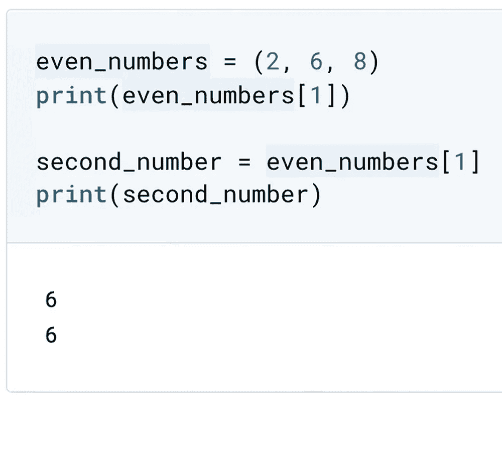

# 编写自己的函数

> 原文：<https://towardsdatascience.com/writing-your-own-functions-40d381bd679?source=collection_archive---------50----------------------->


用 Python 编写自己的函数。照片由[妮可·沃尔夫](https://unsplash.com/@joeel56?utm_source=unsplash&utm_medium=referral&utm_content=creditCopyText)在 [Unsplash](https://unsplash.com/s/photos/code?utm_source=unsplash&utm_medium=referral&utm_content=creditCopyText) 拍摄

## PYTHON 编程

## 数据科学家需要具有特定功能的函数

**在 Python 中，你可以定义自己的函数。**

## 先决条件

如果你不熟悉 Python，下面的文章会给你一点点 Python 的介绍。

[](/python-procedural-or-object-oriented-programming-42c66a008676) [## Python:过程化编程还是面向对象编程？

### 过程化和面向对象之间有点争议，我们为什么要关心它？

towardsdatascience.com](/python-procedural-or-object-oriented-programming-42c66a008676) 

您将有机会了解这些在数据科学背景下新发现的技能。

1.  定义不带参数的函数
2.  用单个参数定义函数
3.  定义返回单个值和多个值的函数

为了定义一个函数，我们从关键字 **def** 开始，然后是函数名、一组括号和一个冒号。这段代码叫做函数**头**。为了完成函数定义，您可以编写函数体**并打印输出。**



无参数函数。图片作者[作者](https://medium.com/@wiekiang)

如果调用函数，则执行函数体内的代码。当您像使用预构建函数一样调用函数时，这应该会返回值。如果你想在函数内部附加一个参数呢？



单参数函数。图片作者[作者](https://medium.com/@wiekiang)

要添加该功能，可以在括号之间的函数定义中添加一个参数。你可以看到我们将一个参数`num`作为变量[添加到新的函数体中。该函数现在接受单个参数并打印出其值。如果我们不想直接打印该值呢？是否可以返回值并将其赋给一个](/scope-of-variable-and-legb-rule-4d44d4576df5)[变量](/scope-of-variable-and-legb-rule-4d44d4576df5)？



返回值而不是打印出来。图片由[作者](https://medium.com/@wiekiang)

您的函数可以通过添加`return`关键字，后跟要返回的值来返回新值。我们可以给一个[变量赋值](/scope-of-variable-and-legb-rule-4d44d4576df5)当函数的结果被调用时。用 Python 编写函数的另一个重要方面是**文档字符串**。它用来描述你的功能。



Docstring 放在三个引号之间。图片作者[作者](https://medium.com/@wiekiang)

这些描述是你的函数文档。任何一个阅读你的函数的人都可以理解这个函数，而不需要追溯所有的代码。函数文档字符串放在函数头后的下一行，并放在三个引号之间。

如果您想向函数传递多个参数，并返回不止一个值，而是多个值，该怎么办呢？

您可以通过让函数接受两个参数而不是一个来实现这一点。您还可以考虑更改函数名和文档字符串来反映这种新的行为。您可以通过给定两个参数来调用该函数，因为它有两个参数，如函数头中所述。



多参数函数。图片作者[作者](https://medium.com/@wiekiang)

参数的顺序必须与函数头参数的顺序相匹配。您也可以指定函数返回多个值。您可以通过在函数中创建称为元组的对象来实现这一点。

一个元组可以像一个列表一样包含多个值。但是，也有一些不同之处:

*   与列表不同，元组是不可变的，一旦创建，就不能修改元组中的值
*   虽然列表是使用方括号[]声明的，但是元组是使用一组括号()构造的



将元组元素分配到变量中。图片作者[作者](https://medium.com/@wiekiang)

你可以在一行中将一个元组解包成多个[变量](/scope-of-variable-and-legb-rule-4d44d4576df5)，并将其赋给[变量](/scope-of-variable-and-legb-rule-4d44d4576df5)。此外，您还可以像处理列表一样访问特定的元组元素。您可以使用零索引来访问元素。

你准备好定义自己的函数了吗？

```
**Other Interesting Articles**#1 [Function Arguments: Default, Keyword, and Arbitrary](/function-arguments-default-keyword-and-arbitrary-9588b5eaaef3)#2 [Scope of Variable and LEGB Rule](/scope-of-variable-and-legb-rule-4d44d4576df5)#3 [Python: Procedural or Object-Oriented Programming?](/python-procedural-or-object-oriented-programming-42c66a008676)#4 [Data Science with Python: How to Use NumPy Library](/data-science-with-python-how-to-use-numpy-library-5885aa83be6b)#5 [Do you have the Software Engineer and Data Scientist skills?](/do-you-have-the-software-engineer-and-data-scientist-skills-probably-not-7e8fb069e067)
```

## **关于作者**

Wie Kiang 是一名研究员，负责收集、组织和分析意见和数据，以解决问题、探索问题和预测趋势。

他几乎在机器学习和深度学习的每个领域工作。他正在一系列领域进行实验和研究，包括卷积神经网络、自然语言处理和递归神经网络。

*连接上* [*LinkedIn*](https://linkedin.com/in/wiekiang)