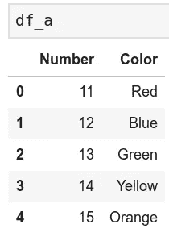
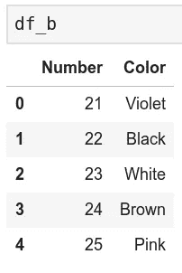
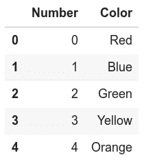
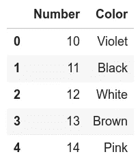

# 为初学者编写自己的 Scikit-learn 类。

> 原文：<https://towardsdatascience.com/writing-your-own-scikit-learn-classes-for-beginners-1e4e7d4de203?source=collection_archive---------20----------------------->

## 让你尽快入门的基础知识


图片来自:[https://en . Wikipedia . org/wiki/File:Scikit _ learn _ logo _ small . SVG](https://en.wikipedia.org/wiki/File:Scikit_learn_logo_small.svg)

S cikit-learn 是用于监督机器学习的最流行的 Python 库之一，它是一个非常强大的工具，同时也很简单。但我认为，它成功的原因主要不是因为它的核心功能，而是因为它的所有模块都具有很好的内聚性和一致性。这也是除了它的流行之外，为什么许多其他流行的库如 XGBoost、pyGAM、lighGBM 和 pyEarth 都是以 Scikit-learn 的风格编写的，并确保与它兼容，几乎就像它们是核心库的一部分一样。许多与 Scikit-learn 兼容的有用项目可以在[这里](https://scikit-learn.org/stable/related_projects.html)找到。

这种内聚兼容性是 Scikit-learn 拥有自己的一套简单指南的结果，如果遵循这些指南，将确保一切正常运行。它还提供了一组基类，使得创建自己的类的过程更加容易。如果您是编写自己的类的新手，无论是为了自己使用还是为了一个库，本文都可以为您提供一个坚实的起点。

# 作为一个初学者，为什么要编写自己的类？

现在，您可能想知道为什么有人要编写自己的类，如果已经有这么多专业编写的类可以使用的话？你考虑一下是对的，因为如果免费提供的软件能完全满足你的需要，你就不应该再费心去写自己的了。然而，即使作为一个初学者，你也有可能在你自己独特的工作流程中遇到一些你想做的操作，但是没有什么东西可以完全按照你想要的那样去做。如果这个操作是您经常要做的，那么为它编写自己的类会很有用。

此外，如果您的操作处于一系列具有预写类的操作之间，它可能会阻止您将其添加到管道中以实现完全自动化。此外，使用 Scikit-learn 工具(如 GridSearchCV)不可能在整个过程中使用模型选择。

其他一些很好的理由是:

*   它发展你的编程技能。
*   它可以随着时间的推移而发展，为您自己的工作提供更多的选项和功能，也可能最终对他人有用。
*   它使您能够为开源社区做出贡献。理解你所使用的大多数极其强大的工具之所以可以免费获得是因为这些贡献。

因此，让我们直接开始创建自己的类。

假设您想要构建一个转换器，从列中的所有值中减去列中的最小数字。例如，假设一列有数字[10，11，12，13，14，15]，我们的转换器将把它改为[0，1，2，3，4，5]。这可能不是一个特别有用的变压器位，这是一个非常简单的例子，刚刚开始。

让我们创建两个玩具数据帧:

```
import pandas as pddf_a = pd.DataFrame({‘Number’:[11, 12, 13, 14, 15],’Color’: [‘Red’, ‘Blue’, ‘Green’, ‘Yellow’, ‘Orange’]})
df_b = pd.DataFrame({‘Number’:[21, 22, 23, 24, 25],’Color’: [‘Violet’, ‘Black’, ‘White’, ‘Brown’, ‘Pink’]})
```

这是它们的样子:



现在让我们编写转换器:

```
# These allow us the class to inherit Scikit-learn methods
# such as fit and transform
from sklearn.base import BaseEstimator, TransformerMixin# This function just makes sure that the object is fitted
from sklearn.utils.validation import check_is_fittedclass SubtractMin(BaseEstimator, TransformerMixin):
     def __init__(self, cols_to_operate):
         self.columns = cols_to_operate def fit(self, X, y = None):
         self.min_val_ = X[self.columns].min()
         return self

     def transform(self, X):
         # make sure that it was fitted
         check_is_fitted(self, ‘min_val_’)

         X = X.copy() # This is so we do not make changes to the            
                        original dataframe
         X[self.columns] = X[self.columns] — self.min_val_
         return X
```

我们从 sklearn.base 导入的类是使它工作的粘合剂。正是它们让我们的功能适合 Scikit-learn 的管道和模型选择工具。BaseEstimator 只是给了它所有 Scikit-learn 估算器都需要的 get_params 和 set_params 方法。TransformerMixin 为它提供了 fit_transform 方法。

BaseEstimator 文档可以在[这里](https://scikit-learn.org/stable/modules/generated/sklearn.base.BaseEstimator.html)找到，TransformerMixin 文档可以在[这里](https://scikit-learn.org/stable/modules/generated/sklearn.base.TransformerMixin.html#sklearn.base.TransformerMixin)找到。

根据您想要构建的估计器的类型，还有其他类型的“[mixin](https://scikit-learn.org/stable/modules/classes.html#module-sklearn.base)”可用，例如 ClassifierMixin 和 RegressorMixin，它们提供了对评分方法的访问。您可能知道，一般来说，数据处理器使用 fit 方法(以及 fit_transform ),模型(回归器和分类器)使用 predict 方法。因此，在创建评估器时，您需要添加适当的类作为父类。例如，一个自定义回归器需要 BaseEstimator 和 RegressorMixin，其他更复杂的类根据其功能可能需要更多。

check_is_fitted 只是一种验证方法，用于确保在尝试对对象进行某些操作之前，已经对其进行了拟合。

在 __init__ 方法中，我们为它添加了转换器需要的所有初始参数。在这里，我们需要操作的只是数据帧的列名。

fit 和 transform 方法是所有 Scikit-Learn 转换器的必需方法(对于回归和分类器，它将是 fit 和 predict)。在我们的例子中，fit 方法只是找出列中的最小值并存储它。你可能注意到了，这里有一个 y = None，尽管我们在 fit 方法中没有用到 y。这是为了与 Scikit-learn 中的其他类保持一致，并确保管道中的兼容性。合体的方法也**总是**得回归自我。

transform 方法完成工作并返回输出。我们制作一个副本，这样原始数据帧就不会被触及，然后减去 fit 方法存储的最小值，然后返回输出。显然，这将在您自己的有用方法中更详细地说明。

让我们看看我们的变压器在工作。

```
sub = SubtractMin(‘Number’)
sub.fit_transform(df_a)
```



```
sub.transform(df_b)
```



您可能注意到的第一件事是，我们使用了 fit_transform 方法，尽管我们没有明确使用它。如前所述，这是从 TransformerMixin 基类继承的。

我们的转换器实际上从 df_a (10)中“学习”了最小值，并在调用 fit_transform 方法时从列中减去该值。然后，当调用 transform 方法时，它从 b 中减去相同的最小值。

Scikit-learn 有一套更详细的指南，需要遵循这些指南才能有所帮助，但是这些指南应该足以确保兼容性，并帮助您为自己的项目编写类。一旦你习惯了写你的课程，看看他们的指导方针(在这里)是个好主意，这样你就可以为社区做贡献了。这些指南更适合于为 Scikit-learn 或类似的库做出贡献。没有必要全部遵守，但建议遵守。有很多项目并没有按照写的那样进行。把在自己的班级里努力当作一个长期目标。

希望这能成为一个足够快的指南，帮助您开始编写自己的自定义 Scikit-learn 类。祝你好运！