# WSDM——KKBox 的音乐推荐挑战

> 原文：<https://towardsdatascience.com/wsdm-kkboxs-music-recommendation-challange-bf15214c6635?source=collection_archive---------33----------------------->

音乐与自然！！莱奥·麦克拉伦(@leiomclaren) 在 [Unsplash](https://unsplash.com?utm_source=medium&utm_medium=referral) 上的照片

**目标:**

在这项任务中，我们必须预测用户在一个时间窗口内第一次可观察到的收听事件被触发后重复收听一首歌曲的机会。

概述:[https://www . ka ggle . com/c/kkbox-music-recommendation-challenge/overview](https://www.kaggle.com/c/kkbox-music-recommendation-challenge/overview)

**大纲:**

1.  商业问题
2.  数据讨论
3.  电子设计自动化(Electronic Design Automation)
4.  特征工程
5.  数据预处理
6.  模型
7.  比较
8.  结论和未来工作
9.  参考

# **简介**

> “**音乐是人类意识不到自己在计数而通过计数体验到的快乐”——**莱布尼茨****

音乐帮助任何人与你正在做的事情联系起来。它能提升情绪，让思想的浪潮恢复活力。人们每次都喜欢听音乐，无论是通勤时间、工作时间还是专注时间。不同的人有不同的音乐风格。音乐已经为其用户提供了各种平台，如 waves of Victrola、磁带文化、随身听时代、i-pods、FM 收音机以及最新的音乐应用程序，如 Spotify、亚马逊 Prime Music、Deezer、SoundCloud、Gaana 等。

互联网在选择用户喜欢的音乐方面使生活变得容易，但仍然需要算法来向用户推荐喜欢的音乐，而不需要手动选择。

# **1。业务问题和限制:**

我们的经营宗旨是为用户提供他们喜欢的歌曲！这一建议不需要几个小时，几秒钟就足以预测收听的机会。

*   **ML 问题公式化**

我们必须建立模型，通过评估用户和歌曲的给定特征来预测用户是否会重新收听歌曲。我们可以把这个问题转化为分类问题，可以应用各种分类算法。

# **2。资料讨论:**

数据集来源:[https://www . ka ggle . com/c/kkbox-music-re commendation-challenge/data](https://www.kaggle.com/c/kkbox-music-recommendation-challenge/data)

该问题有 6 个数据文件:

**1.train.csv** :该文件包括

user_id (msno)、song_id、source_system_tab(事件被触发的位置)、
source_type(用户首先播放音乐的入口点)、source_screen_name(用户看到的布局的名称)和 target ( 1 表示在用户第一次可观察到的收听事件之后的一个月内有重复的收听事件被触发，否则 target=0)。

**2。test.csv** :这个文件包括

user_id (msno)、song_id、source_system_tab(事件被触发的位置)、
source_type(用户首先播放音乐的入口点)和 source_screen_name(用户看到的布局的名称)。

**3。songs.csv:** 这个文件有如下特点

歌曲 id、歌曲长度、流派 id、艺术家姓名、作曲家、作词人和语言。

**4。members.csv:** 这个文件有 msno (user_id)、city、bd(可能包含离群值)、性别、register_via (register method)、register_init_time (date)和 expiration _ date(date)。

**5。song_extra_info.csv:** 该文件具有用于识别歌曲的特征宋立科 id、歌曲名称和
ISRC(国际标准录音代码)。

# **3。EDA:**

让我们探索我们的数据，并了解每个特征的行为与情节。

一、列车特点:

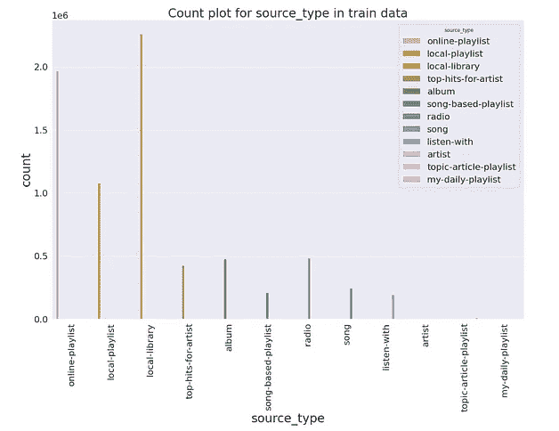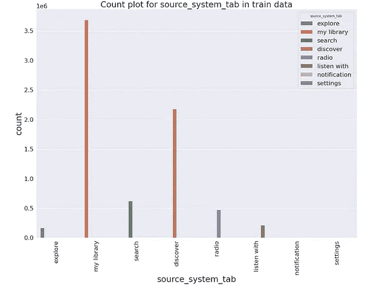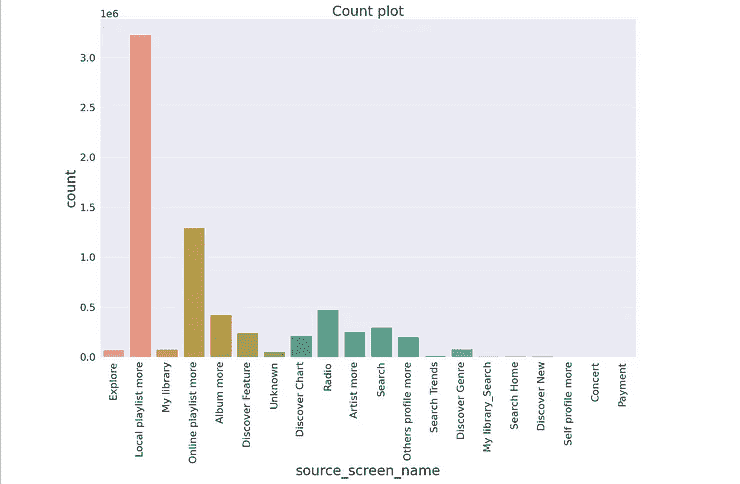

源类型、源系统选项卡和源屏幕名称的计数图

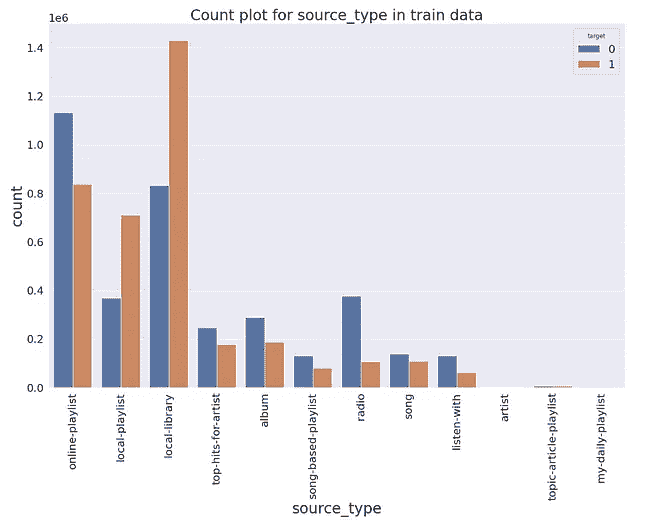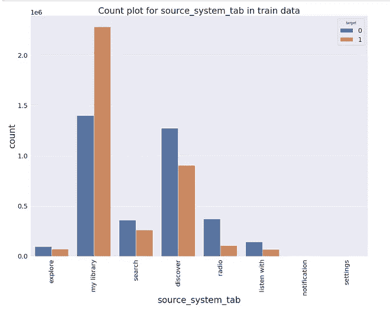

我们有 source_type、source_system_tab 和 source_screen_name 的计数图。从图中我们可以看到，我们所有的特性在特性的每个值中几乎都是平衡的。

二。歌曲特色:

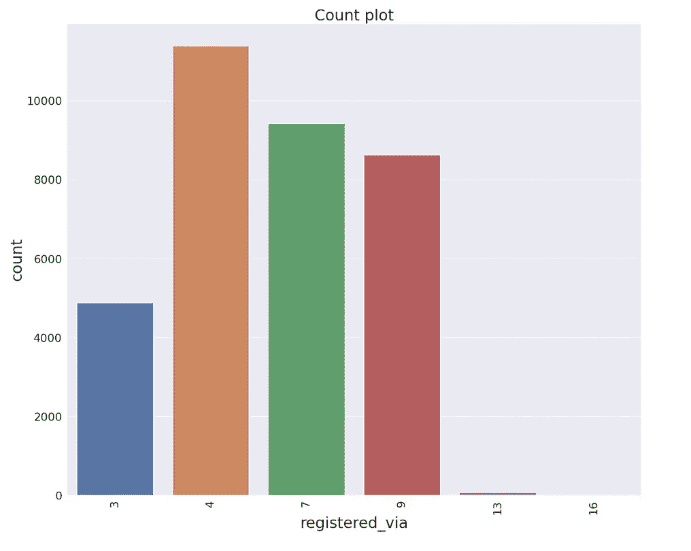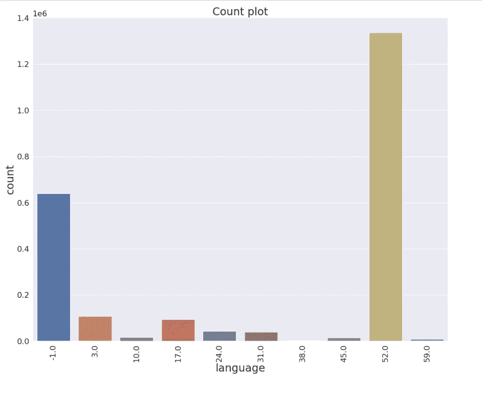

registered_via 和语言的计数图

歌曲数据中有不同类型的语言，用数字表示。我们可以看到，大多数用户更喜欢听来自'-1 '和' 52 '语言的歌曲。

大多数用户更喜欢通过“4”、“7”和“9”方式注册。

三。成员数据:

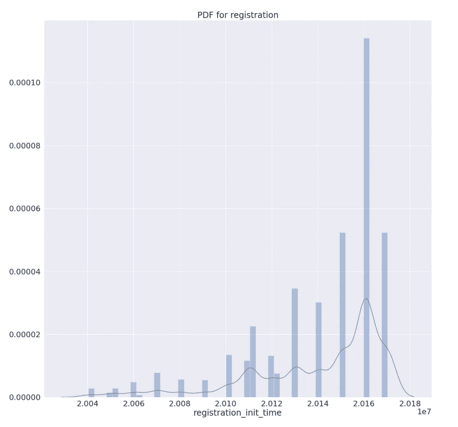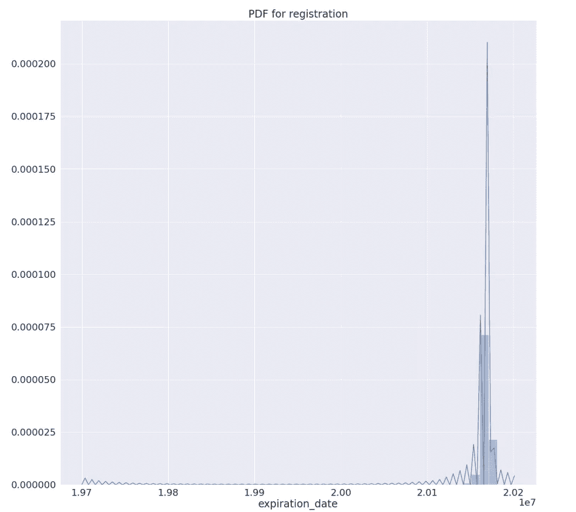

注册开始时间和截止日期的 PDF

从上面的 pdf 我们可以说，在 2012 年之后，人们开始注册自己听音乐，因此他们的有效期也被发现接近 2020 年。

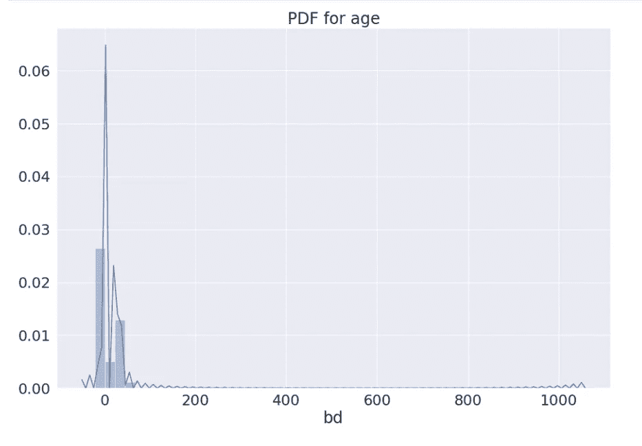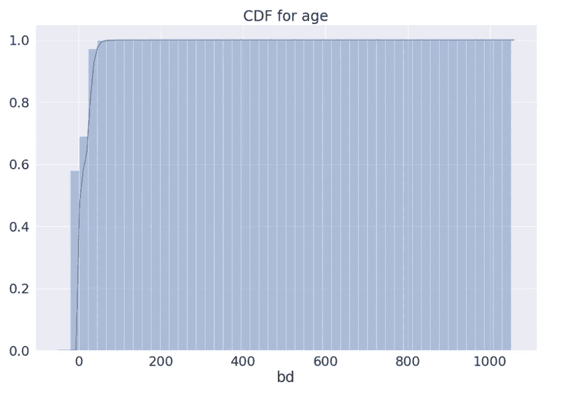

适合用户年龄的 PDF 和 CDF

嗯！50 岁以下的人说“你好！”听音乐并享受它！！

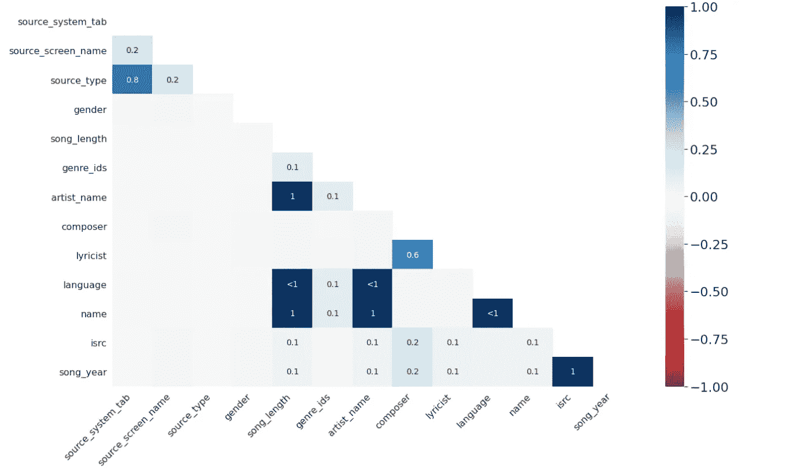

缺失值的热图

我们可以说作曲家、作词家、isrc 特征有更多缺失的价值。

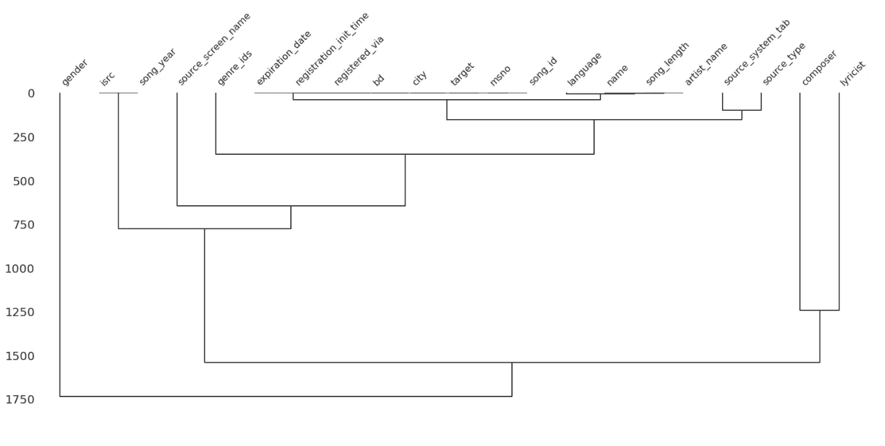

特征树状图

这是特征的树状图。我们可以看到一个 source_system_tab -> source_type，composer ->作词人，语言-> (song_length，artist_name，name)，isrc -> song_year 之间的关联。

正如我们所知，一些作曲家对某些艺术家、语言、歌词作者有偏见。

# **4。特征工程:**

到目前为止，我们已经通过计数图和 PDF-CDF 研究了这些数据。让我们放弃那些丢失值超过 25%的特性，开始特性工程。我们还将根据特征填充缺失的值。

填充缺失值

根据维基百科， [**特征工程**](https://en.wikipedia.org/wiki/Feature_engineering) 是利用领域知识通过[数据挖掘](https://en.wikipedia.org/wiki/Data_mining)技术从原始数据中提取[特征](https://en.wikipedia.org/wiki/Feature_(machine_learning))的过程。提取的特征有助于提高机器学习算法的性能。

*   我们将提取独立于成员、歌曲和歌曲 _extra 的个人特征。合并所有文件后，我们将提取按特征分组。
*   我们将过滤 0 到 75 岁之间的年龄。

过滤器年龄

*   我们将从到期和初始日期中提取成员资格 _ 天、年、月和日。

计算日期功能

*   我们将从流派 id 和艺术家中提取流派 id 计数、艺术家计数。一些歌曲有许多艺术家和流派，所以我们还将提取第一个艺术家的名字和第一个流派 id。

计算艺术家特征

以下片段是艺术家的特点。

计算艺术家特征

*   我们将从 isrc 特征中提取`song_year`、`country_code`和`registration_code`。

计算歌曲特征

*   就艺术家、语言、流派和年龄组而言，每个人都有自己最喜欢的音乐风格。我们将基于这些来提取 group_by 特征。

group_by 功能

# **5。数据预处理:**

从数据文件中提取所有特征后，是时候转换所有这些特征了。我们有数字和分类特征。有标准化、规范化、十进制等技术。我们将使用标准化，因为它通过移除平均值和缩放到单位方差来标准化特征。对于分类特征，我们有一次性编码、标签编码、响应编码等。我们将尝试对我们的分类特征进行标记编码。

转换数字特征

编码分类特征

# **6。型号:**

正如我们先前所述，我们将把这个问题作为一个分类问题提出，我们可以在我们的数据点上应用各种分类算法。所以我们一个一个来试试。我们将在本节的最后讨论每个模型的特性重要性。在比较部分，我们将讨论结果。

**1。逻辑回归**

这是一种简单的分类技术，尽管它的名字中有“回归”这个词。我们将使用带有 log_loss 的[SGD 分类器](https://scikit-learn.org/stable/modules/generated/sklearn.linear_model.SGDClassifier.html)。我们将使用 [GridSearchCV](https://scikit-learn.org/stable/modules/generated/sklearn.model_selection.GridSearchCV.html) 调整超参数，如惩罚和 alpha。

使用 GridSearchCV 调整逻辑回归超参数

**2。支持向量机**

我们将使用带铰链损耗的[SGD 分类器](https://scikit-learn.org/stable/modules/generated/sklearn.linear_model.SGDClassifier.html)执行线性 SVM，并使用 [GridSearchCV](https://scikit-learn.org/stable/modules/generated/sklearn.model_selection.GridSearchCV.html) 进行超参数调谐。

使用 GriSeachCV 进行 SVM 超参数调谐

**3。决策树**

决策树是一组轴平行的超平面或决策规则，也可以对非线性可分的数据点进行分类。sklearn 提供了[决策树分类器](https://scikit-learn.org/stable/modules/generated/sklearn.tree.DecisionTreeClassifier.html)。我们将调整参数，如`max_depth,` `min_samples_split`和`max_leaf_nodes.`

决策树分类器超参数调整 GridSearchCV

**4。随机森林**

元估计器在数据集的各种子样本上拟合多个决策树分类器，并使用平均来提高预测精度和控制过拟合。我们将使用 [RandomForestClassifier](https://scikit-learn.org/stable/modules/generated/sklearn.ensemble.RandomForestClassifier.html) 并使用[randomsearchv](https://scikit-learn.org/stable/modules/generated/sklearn.model_selection.RandomizedSearchCV.html)进行超参数调整。

随机森林及其超参数调谐

**5。XgBoost**

XgBoost 是一个实现梯度提升决策树的库，它包含决策树作为基础学习器，并试图降低整体偏差。[这里的](https://www.youtube.com/watch?v=8b1JEDvenQU)是对 XgBoost 及其背后的深入数学的有用视频解释。

XgBoost 及其超参数调谐

6。LightGBM

LighGBM 也是一个梯度提升决策树的框架，但是它速度更快，占用内存更少。你可以从[这里](https://lightgbm.readthedocs.io/en/latest/)了解更多。

LGB 超参数调谐

**7。堆叠**

堆叠是一种集成技术，其中多个分类器的预测被用作训练元分类器的新特征。我们将使用[堆叠分类器](https://scikit-learn.org/stable/modules/generated/sklearn.ensemble.StackingClassifier.html)和决策树，RF 和 GBDT 作为一级分类器，逻辑回归作为元分类器。

堆积分类器

**8。投票分类器**

投票分类器是许多分类器的包装器。它将以软或硬的方式为来自基本分类器的预测投票。我们将执行来自 sklearn 的 [VotingClassifier](https://scikit-learn.org/stable/modules/generated/sklearn.ensemble.VotingClassifier.html) 。

投票分类器

**9。深度学习**

我们也将尝试基于深度学习的方法。我们将构建基于 MLP 的架构，该架构将所有特征作为输入，并将基于 sigmoid 概率生成适当的类别标签。我们将使用 Adam 作为优化器，使用二进制交叉熵作为损失函数。

MLP 模型与培训

**(a)特征重要性:**

为了更好地理解任何模型，建议检查特性的重要性。每一个特性都对模型的性能有积极或消极的影响。基于树的算法具有内置的特征重要性，而在 SVM LR 的情况下，我们必须通过`model.coef_`提取它

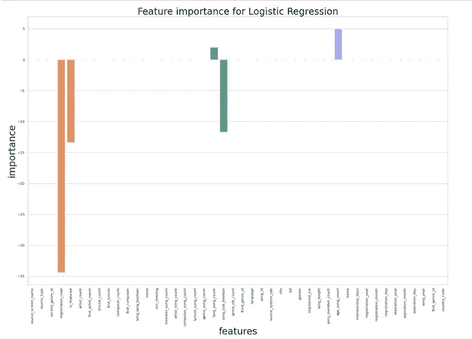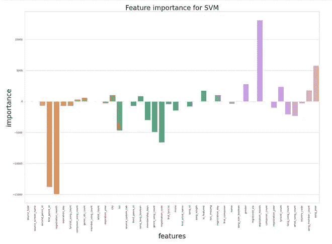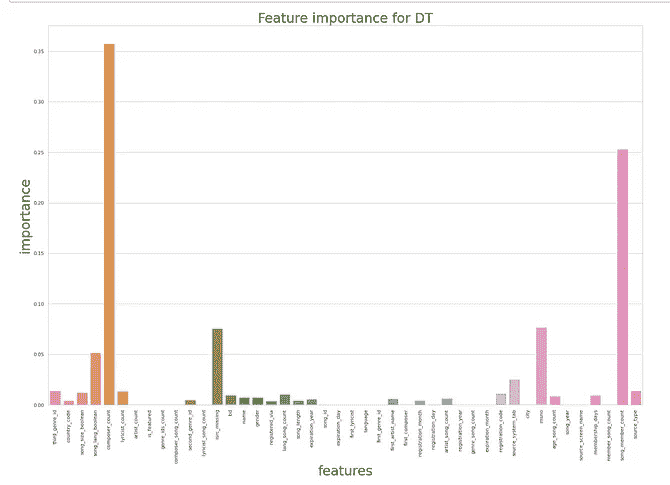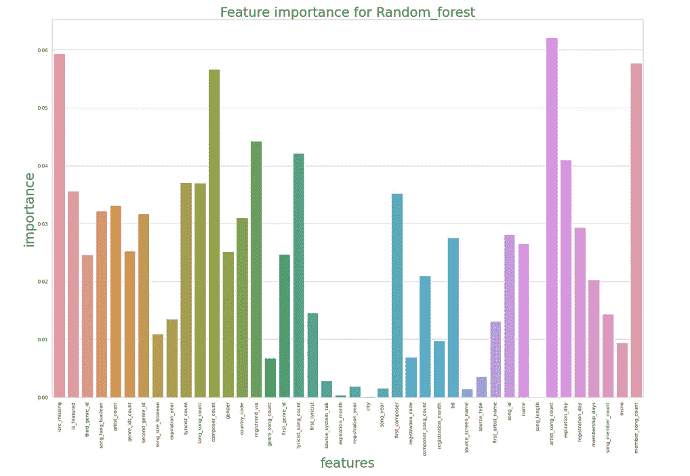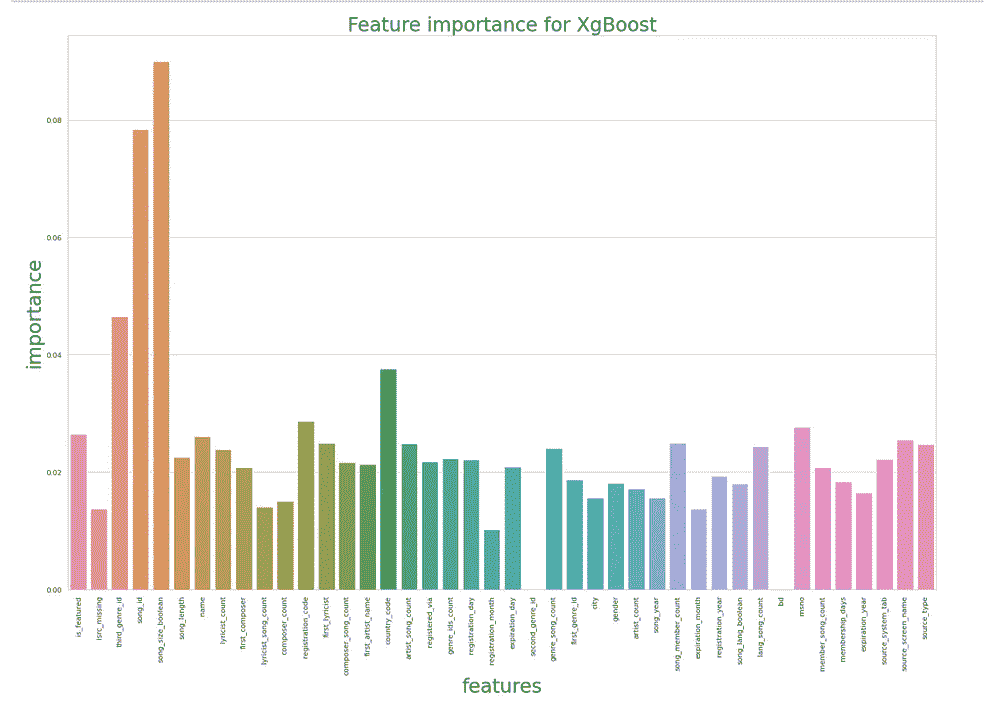

特征重要性

**(b)特征选择和提取**

特征选择意味着选择原始特征池的子集，而特征提取意味着从现有数据中获取有用的特征。我们使用[选择测试](https://scikit-learn.org/stable/modules/generated/sklearn.feature_selection.SelectKBest.html#sklearn.feature_selection.SelectKBest)进行特征选择，使用 [PCA](https://scikit-learn.org/stable/modules/generated/sklearn.decomposition.PCA.html) 进行特征提取。我们还可以从 DT、RF 或 XgBoost 等算法中选择基于特征重要性的特征。我们从 DT 中选择了最重要的特征，并在这些选择的特征上应用了最佳模型。[这里的](https://github.com/khushi810/KKBOX_Music_Recommendation_Challenge/blob/master/Music_Recommendation_models.ipynb)是型号和功能重要性的详细记录。

# **7。对比:**

在对我们的数据集和特征重要性应用所有模型之后，我们可以说 LR 和 SVM 不太适合我们的数据集。他们还对具体特征给予更多负面的重视。基于树的算法工作得更好，具有更好的特征重要性。当我们使用 LighGBM 时，与其他模型相比，它提供了更高的性能。LightGBM 和 XgBoost 是 Kaggle 社区的热门。特征选择也推动分数。

下面是不同算法的对比表。

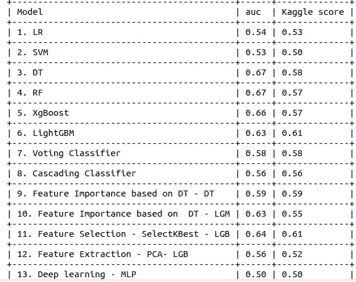

比较表

# **8。结论&未来工作:**

*   从上表中，我们可以看到，与其他模型相比，基于 LightGBM 的模型给出了更高的分数。在基于特征提取和选择的模型中，选择最佳模型的特征选择给出了更好的结果。
*   由于资源限制，我只使用了 30%的数据点。如果我们使用所有数据点并进行更多的超参数调整，我们可以获得更好的结果。
*   深度学习需要大量的数据点。
*   我们还可以想到更多的特征提取。

# **9。参考文献:**

1.  [https://www . ka ggle . com/c/kkbox-music-recommendation-challenge/overview](https://www.kaggle.com/c/kkbox-music-recommendation-challenge/overview)
2.  [https://github . com/lyst do/Codes-for-WSDM 杯-Music-Rec-first-place-solution](https://github.com/lystdo/Codes-for-WSDM-CUP-Music-Rec-1st-place-solution)
3.  [https://www . ka ggle . com/asmitavikas/feature-engineered-0-68310](https://www.kaggle.com/asmitavikas/feature-engineered-0-68310)
4.  [https://www . ka ggle . com/rohandx 1996/re commendation-system-with-83-accuracy-lgbm](https://www.kaggle.com/rohandx1996/recommendation-system-with-83-accuracy-lgbm)
5.  【https://www.appliedaicourse.com/course/11/Applied-Machine-】
    [学习-课程](https://www.appliedaicourse.com/course/11/Applied-Machine-)

感谢您的关注。如果你有任何想法，可以留下评论、反馈或任何
建议。

你可以在我的 Github repo 上找到完整的代码([这里](https://github.com/khushi810/KKBOX_Music_Recommendation_Challenge/tree/master))。

很高兴在 [LinkedIn](https://www.linkedin.com/in/khushali-vithani/) :)上与您联系