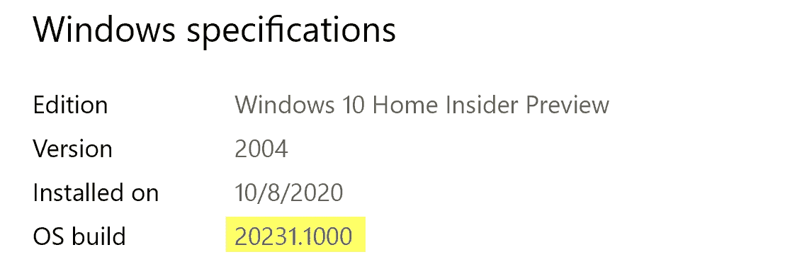
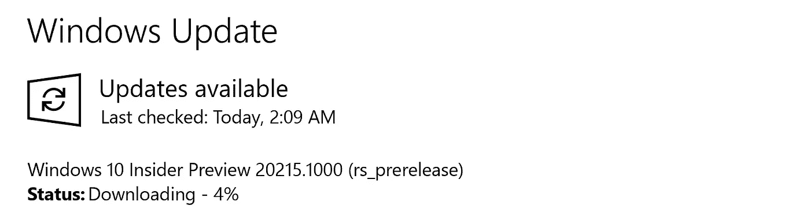
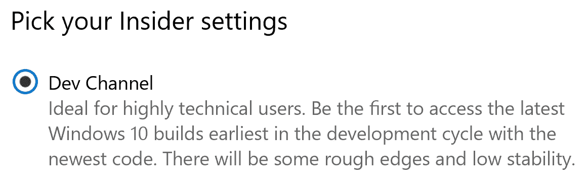
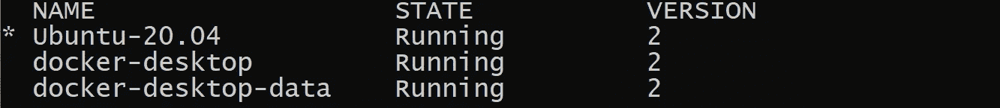
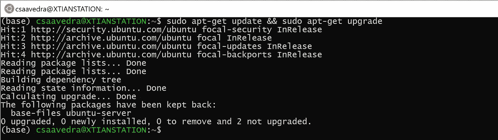
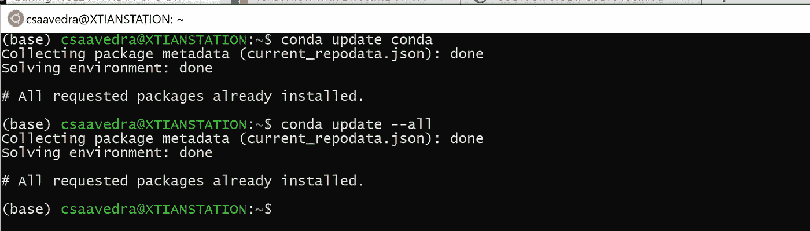
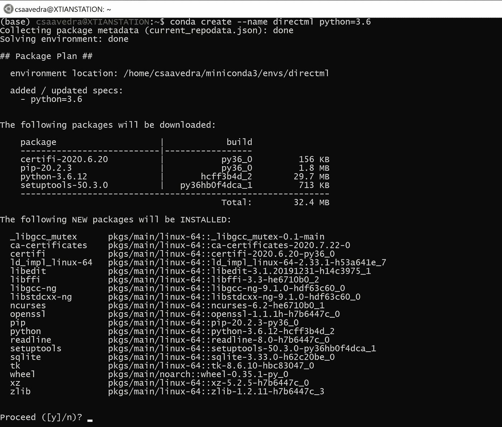
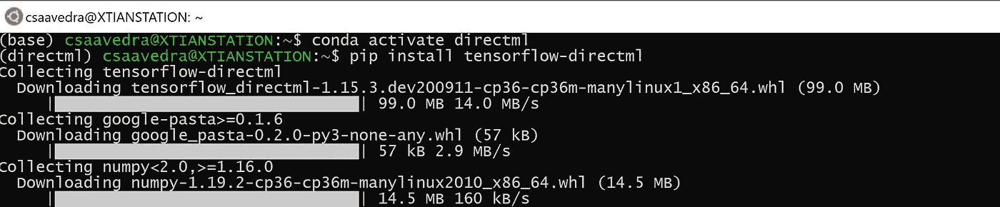
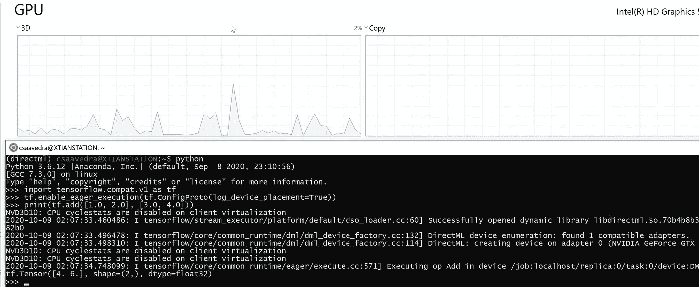
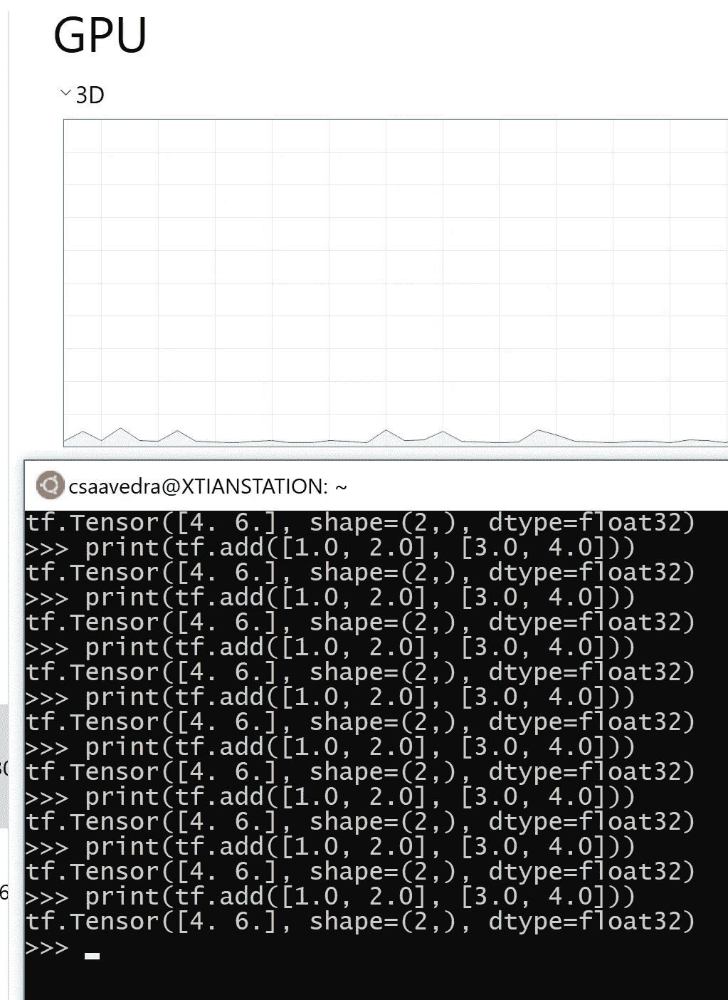

# 用于 DirectML 和张量流的 WSL2 / NVIDIA GPU 驱动程序

> 原文：<https://towardsdatascience.com/wsl2-nvidia-gpu-driver-for-directml-and-tensor-flow-82996bb080b0?source=collection_archive---------29----------------------->

## 为 Linux 2 的 Windows 子系统配置 NVIDIA GPU


在 [Unsplash](https://unsplash.com/?utm_source=unsplash&utm_medium=referral&utm_content=creditCopyText) 上由 [Vinayak Sharma](https://unsplash.com/@vinayak_125?utm_source=unsplash&utm_medium=referral&utm_content=creditCopyText) 拍摄的照片

2020 年 9 月， [NVIDIA 在最新版本的预览版驱动程序中宣布了 Linux(wsl 2)Windows 子系统上的](https://news.developer.nvidia.com/preview-for-cuda-on-wsl-updated-for-performance/)原生 CUDA 特性，这促使我写了这篇文章。

我会讲解如何在 [WSL2(微软子系统 Linux)](https://docs.microsoft.com/en-us/windows/wsl/about) 上安装 NVIDIA 驱动，测试 TensorFlow 的并行执行。

一些主要的变化是:

*   改善 CUDA 用户的使用体验
*   TensorFlow 支持基于 DirectX 12 的 GPU 加速
*   对 PTX JIT 的支持将使我们能够运行[并行执行(PTX](https://docs.nvidia.com/cuda/parallel-thread-execution/index.html#introduction) )代码。

# 设置

在 Microsoft Windows build 20145 对公众不可用之前，要在 WSL 版本 2 上使用 GPU，您需要执行以下操作:

1.  激活[微软内部程序](https://insider.windows.com/en-us/getting-started)
2.  检查您的 Windows Linux 子系统(WSL)版本。
3.  在 [NVIDIA Developer](https://developer.nvidia.com/) 中登录或创建一个帐户
4.  下载并安装 [NVIDIA 驱动程序](https://developer.nvidia.com/cuda/wsl/download)
5.  测试 WSL2 对 GPU 的使用

# 检查您当前的 Microsoft 版本

为了激活 Microsoft Insider 计划，我们将检查所需的版本是否可用。为此，首先，转到**检查更新**并验证您是否有最新的更新。


Microsoft Windows 检查更新的图像


Windows Update、Microsoft Windows 的图像

下一步是转到“关于您的电脑”,验证操作系统是否符合 Windows 规范。


关于您的电脑的图片，Microsoft Windows



关于您的电脑的图片，Microsoft Windows

如果你的版本大于 **20145，**你可以跳过下一节。

# 1.激活 Microsoft Insider 计划

在[https://insider.windows.com/en-us/getting-started](https://insider.windows.com/en-us/getting-started)注册并按照步骤操作。重启后，你会得到一个新的设置选项， **Windows Insider 程序设置。**


Microsoft Windows 的搜索图像



Windows Update、Microsoft Windows 的图像

经过多次更新后，如果您有 20145 或更高版本的操作系统，您可以通过 WSL 使用 GPU。如果你没有最低版本，在 Windows Insider 程序设置中切换到**开发频道**或**快速环**并重新运行 Windows Update。


Microsoft Windows 的 Windows Insider 程序设置的图像



Microsoft Windows 的 Windows Insider 程序设置的图像

# 2.检查您的 Windows Linux 子系统(WSL)版本

您需要适用于 Linux 的第二版 Windows 子系统。要检查您是否正在使用 WSL 2，请在提示符下运行以下命令

```
wsl --list -v
```



运行 WSL list 命令的 Ubuntu Windows 终端的图像

如果你有版本 1，可以用下面的[链接](https://docs.microsoft.com/en-us/windows/wsl/install-win10)更新。如果你没有安装 WSL，我推荐你阅读我的[上一篇文章](/configuring-jupyter-notebook-in-windows-subsystem-linux-wsl2-c757893e9d69)。

下一步是更新您的 WSL 发行版。为此，打开一个提示符并执行:

```
sudo apt-get update && sudo apt-get upgrade
```



运行更新和升级命令的 Ubuntu Windows 终端的图像。

# 3.在 NVIDIA Developer 中登录或创建一个帐户

NVIDIA 开发者页面有一些不常见的登录或创建帐户的方法；进入[https://developer.nvidia.com](https://developer.nvidia.com)和右上角的**账户**，选择电子邮件登录或创建新账户。然后输入您当前的电子邮件和密码或点击**创建账户**并按照步骤操作。

# 4.下载并安装 NVIDIA 驱动程序

要下载最新版本的 NVIDIA 驱动程序，请前往[https://developer.nvidia.com/cuda/wsl/download](https://developer.nvidia.com/cuda/wsl/download)，根据您当前的硬件选择 GEFORCE 或 QUADRO。

我准备用 GeForce 和 express 安装版本[**460.20 _ gameready _ win 10-dch _ 64 bit _ international . exe**](https://www.nvidia.com/en-us/geforce/release-notes/GFE/3_20_4/Web/gfe-v3_20_4-web-release-highlights/)

安装完成后，进入 **GEFORCE Experience** 选择设置，**启用实验功能**，按重启键。

# **5。通过 WSL2 测试 GPU 使用情况**

在开始之前，我建议查看一下 NVIDIA WSL 文档。[进行下一步](https://docs.microsoft.com/en-us/windows/win32/direct3d12/gpu-tensorflow-wsl)并安装 **Miniconda。**没有的话在我的[上一篇](/configuring-jupyter-notebook-in-windows-subsystem-linux-wsl2-c757893e9d69)里会发现很有帮助。

您至少需要 Linux 内核版本 4.19.121。要了解您的 Linux 版本，请运行 **cmd** 或命令提示符并执行以下命令:

```
wsl cat /proc/version
```

您将看到与此类似的内容:

```
Linux version 4.19.128-microsoft-standard
```

接下来，更新 Miniconda，用 python 3.6 创建一个名为 DirectML 的新环境，安装 Tensor Flow / Direct ML。

```
conda update conda
conda update --allconda create --name directml python=3.6
conda activate directmlpip install tensorflow-directml
```



更新 conda 的 Ubuntu Windows 终端的图像



创建 DirectML 环境的 Ubuntu Windows 终端的图像



Ubuntu Windows 终端激活 DirectML 环境的图像

然后打开一个交互式 Python 并执行以下操作:

```
import tensorflow.compat.v1 as tf tf.enable_eager_execution(tf.ConfigProto(log_device_placement=True)) print(tf.add([1.0, 2.0], [3.0, 4.0]))
```

您将获得当前的硬件。



Ubuntu Windows 终端和 Windows 任务管理器的图像，用于测试 TensorFlow

为了仔细检查，我多次运行最后一条语句，在每次执行之间等待不同的时间，以尝试它是否会影响 GPU 的使用趋势:



Ubuntu Windows 终端和 Windows 任务管理器的图像，用于测试 TensorFlow

# 谢谢

最后，我要感谢我的兄弟迈克尔·萨维德拉，他鼓励我继续写这些话题。

# 有用的资源

[](https://news.developer.nvidia.com/preview-for-cuda-on-wsl-updated-for-performance/?mkt_tok=eyJpIjoiT1RobVl6STVabVkxTmpjMiIsInQiOiJOZExCNVVIYjN4VUZKVUswVHhpUmF2SVhZMVNGaUNWelNDWE03V203OU1zbFhcL3o4dWJDdGlyM291dnRCeDhHUWFPVzM5SWJEWWJaaDlYNE9HOUhweE9xTmpXSVZDVHVWUzVlNFdyQkVQTGduRmRaZnFPOTRtRDZKVlVjUkdhdmEifQ%3D%3D) [## WSL 上的 CUDA 预览更新了性能

### 最近，微软宣布了他们的 Windows 子系统 Linux ( WSL)功能的公开预览计划…

news.developer.nvidia.com](https://news.developer.nvidia.com/preview-for-cuda-on-wsl-updated-for-performance/?mkt_tok=eyJpIjoiT1RobVl6STVabVkxTmpjMiIsInQiOiJOZExCNVVIYjN4VUZKVUswVHhpUmF2SVhZMVNGaUNWelNDWE03V203OU1zbFhcL3o4dWJDdGlyM291dnRCeDhHUWFPVzM5SWJEWWJaaDlYNE9HOUhweE9xTmpXSVZDVHVWUzVlNFdyQkVQTGduRmRaZnFPOTRtRDZKVlVjUkdhdmEifQ%3D%3D) [](https://developer.nvidia.com/cuda/wsl) [## 用于 Linux (WSL)的 Windows 子系统中的 GPU

### CUDA on Windows Subsystem for Linux(WSL)—公共预览版 Microsoft Windows 是一个无处不在的企业平台…

developer.nvidia.com](https://developer.nvidia.com/cuda/wsl) [](https://developer.nvidia.com/blog/announcing-cuda-on-windows-subsystem-for-linux-2/) [## 在 Linux 2 的 Windows 子系统上发布 CUDA | NVIDIA 开发者博客

### 为了响应大众的需求，微软宣布了 Linux 2 (WSL 2)的 Windows 子系统的一个新特性——GPU…

developer.nvidia.com](https://developer.nvidia.com/blog/announcing-cuda-on-windows-subsystem-for-linux-2/) [](https://github.com/microsoft/DirectML) [## 微软/DirectML

### DirectML 是一个高性能、硬件加速的 DirectX 12 库，用于机器学习。DirectML 提供 GPU…

github.com](https://github.com/microsoft/DirectML) [](https://devblogs.microsoft.com/commandline/gpu-compute-wsl-install-and-wsl-update-arrive-in-the-windows-insiders-fast-ring-for-the-windows-subsystem-for-linux/) [## GPU 计算、WSL 安装和 WSL 更新在 Windows 的最新内部版本中发布…

### 在最新的 Windows Insider 预览版中，针对 Linux 的 Windows 子系统(WSL)有三个激动人心的新更新…

devblogs.microsoft.com](https://devblogs.microsoft.com/commandline/gpu-compute-wsl-install-and-wsl-update-arrive-in-the-windows-insiders-fast-ring-for-the-windows-subsystem-for-linux/) [](https://devblogs.microsoft.com/commandline/whats-new-in-the-windows-subsystem-for-linux-september-2020/) [## 面向 Linux 的 Windows 子系统的新功能-2020 年 9 月| Windows 命令行

### 这篇博客文章强调了 WSL 的更新。在过去的几个月里，除了一些预览…

devblogs.microsoft.com](https://devblogs.microsoft.com/commandline/whats-new-in-the-windows-subsystem-for-linux-september-2020/)