# WTH 是 R 平方和调整后的 R 平方？

> 原文：<https://towardsdatascience.com/wth-are-r-squared-and-adjusted-r-squared-7b816eef90d9?source=collection_archive---------13----------------------->

## 理解 R 平方背后的数学和直觉。


Daria Nepriakhina 在 [Unsplash](https://unsplash.com/s/photos/r?utm_source=unsplash&utm_medium=referral&utm_content=creditCopyText) 上拍摄的照片

T 今天我将从机器学习的角度来解释 R 平方和调整的 R 平方的概念。我还将向您展示如何找到 ML 模型的 R 平方值。让我们开始吧…

# r 平方

它充当回归模型的评估指标。为了更好地理解它，让我引入一个回归问题。假设我正在构建一个模型，根据我在某个月的空闲时间来预测我在这个月会写多少文章。因此，这里的**目标变量**是文章数量，空闲时间是**独立变量**(也称为特性)。这是我创建的虚拟数据。

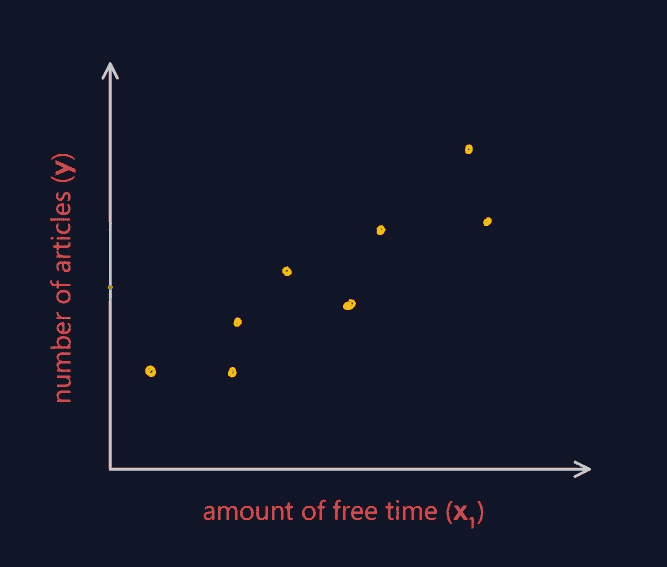

在这种情况下，简单的线性回归模型应该足够了。该模型的方程是…

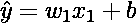

模型的参数(***w1***和 ***b*** )可以通过最小化所有数据点的平方误差来找到。这也被称为最小平方损失函数。

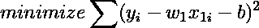

在这个优化步骤之后，我们发现红线是我们的模型(**最佳拟合线**)。

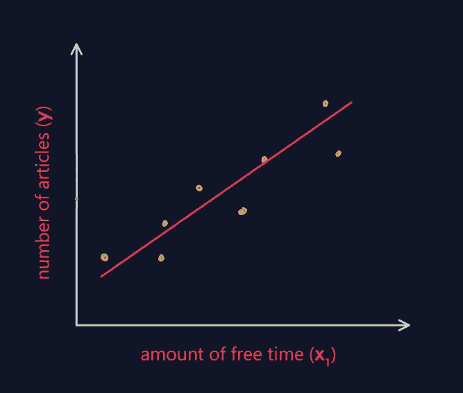

现在我们想知道我们的模型有多好。这可以通过许多方式实现，但 R-squared 使用一种叫做**方差的统计方法。**方差表示数值围绕其平均值分布的程度。数学上，

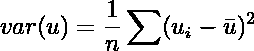

n 是数据点的数量

R-squared 计算模型(独立变量的函数)解释了目标变量的多少方差。但是要找到它，我们需要知道两件事。 **1)目标变量围绕平均值的方差(平均方差)，2)目标变量围绕最佳拟合线的方差(模型方差)。**

平均方差也可以被视为模型的方差，该模型输出每个输入的目标变量的平均值。我们可以把这个模型想象成一条水平线，它在所有数据点的 y 坐标的平均值处切割 y 轴。看图中的绿线。

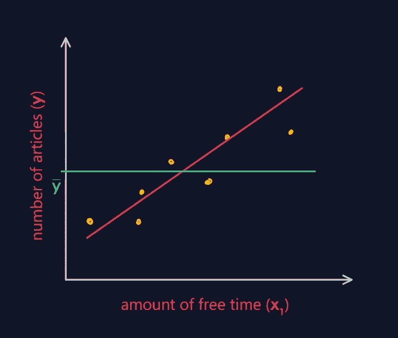

忽略因子 ***1/n，*** 我们可以写…

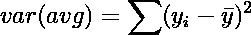

模型方差的公式是…

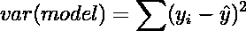

现在我们可以理解 R 平方的公式了。

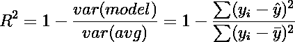

# 如何解读？

> 正如我前面提到的，R 平方值表示可以用你的模型解释的目标变量的方差的比例。解释的方差比例越多，你的模型就越好。因此，接近 1 的 R 平方值对应于好模型，接近 0 的值对应于坏模型。

假设我们模型的 R 值是 ***0.78。*** 这种说法意味着我们的模型解释了 ***78%*** 的文章数量对应的数据的方差。它接近于 ***1*** 所以我们可以说这是一个很好的模型。

# R 的可能值

***R = 0*** 当我们的模型与平均模型相同时。 ***R > 0*** 表示我们的模型比一般模型要好。R 的最大可能值等于 ***1*** 。虽然它的名字中有一个正方形，但它可能取负值。 ***R < 0*** 表示我们的模型比一般模型差。这种情况一般不会发生，因为优化步骤会产生比平均模型更好的模型。

# R 平方的问题

起初，看起来一切都很好，但是随着我们添加更多的特性，R 出现了一个巨大的问题。随着新要素添加到模型中，r 平方永远不会减少。

> 这是一个问题，因为即使我们向我们的模型添加无用的或随机的特征，R 平方值也会增加，这表明新模型比以前的模型更好。这是错误的，因为新特征与输出变量无关，只会导致过度拟合。

# 为什么 R 的平方永远不能减小？

为了理解这一点，让我们为我们的模型引入一个新特性，它与我写的文章数量(输出变量)没有关系。我将一个月的平均温度作为我们的新特征。姑且称之为 ***x_2。*** 所以我们的模型就变成了……

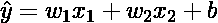

在优化之后，对于 w_2 可能出现两种情况:

1.  我们得到 ***w_2*** 为 ***0*** 。这意味着 ***x_2*** 和输出变量之间没有相关性，我们被之前的损失函数最小值卡住了。因此，我们的模型与之前的模型保持不变。所以，在这种情况下，R 值保持不变。
2.  我们得到一个非零值 ***w_2*** 。这意味着已经找到了***x2***和输出变量之间的一些相关性，并且我们实现了损失函数的更好的最小值。所以，R 值增加。

几乎总是出现第二种情况，因为在随机性中很容易找到小的相关性。但是这种小的相关性过度拟合了模型。为了解决这个问题，我们使用调整的 R 平方。

# 调整后的 R 平方

调整后的 R-squared 背后的想法是，随着我们向模型中添加更多的特征，我们会对分数进行惩罚。我们来看看调整后的 R 平方的公式。

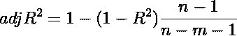

n 是数据点的数量；m 是独立特征的数量

分母 ***(n-m-1)*** 随着特征数量的增加而增加。因此，如果我们没有发现 R 的显著增加，那么整个表达式的值不会增加(甚至可能减少)。这就是为什么调整后的 R 在某种程度上抵抗了我们在普通 R 中所面临的问题。

# 如何求 R(使用 StatsModels)？

Statsmodels 库提供了一种执行许多统计任务的简单方法。首先，我创建了一个假数据集，并建立了一个线性回归模型。之后，我通过调用 **summary()** 函数打印了 R 和调整后的 R 值。下面是代码…

```
from pandas import DataFrame
import statsmodels.api as sm# making the fake dataset
data = { 
         'month': [12,11,10,9,8,7,6,5,4],
         'free_time': [120,110,100,90,80,85,60,50,40],
         'num_articles': [8,8,7,6,6,7,6,4,5]
       }df = DataFrame(data, columns=['month', 'free_time', 'num_articles'])# features
X = df[['free_time']] 
# target variable
Y = df['num_articles']
# adding a constant
X = sm.add_constant(X)# applying method of least squares
model = sm.OLS(Y, X).fit()
predictions = model.predict(X)print_model = model.summary()
print(print_model)
```

现在关注输出的选定部分。

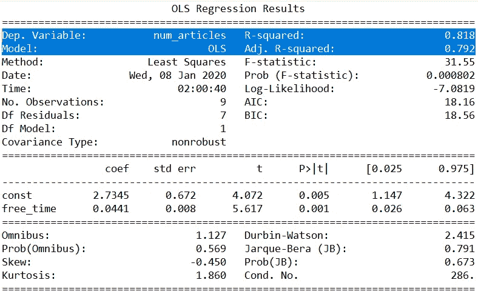

## 还好奇？看一个我最近做的视频…

我希望你喜欢阅读。下次见…学习愉快！