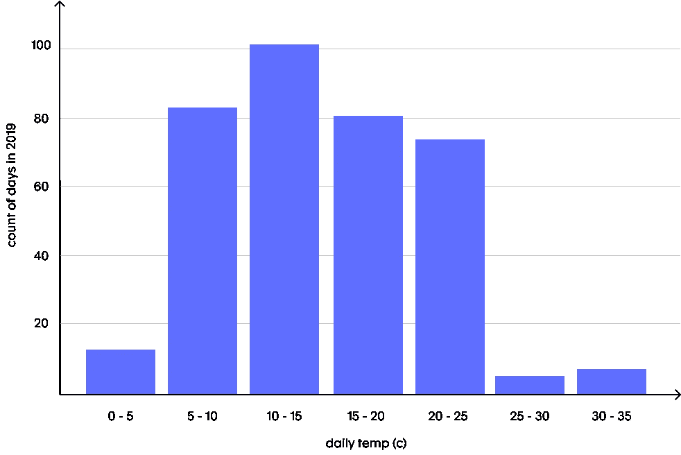
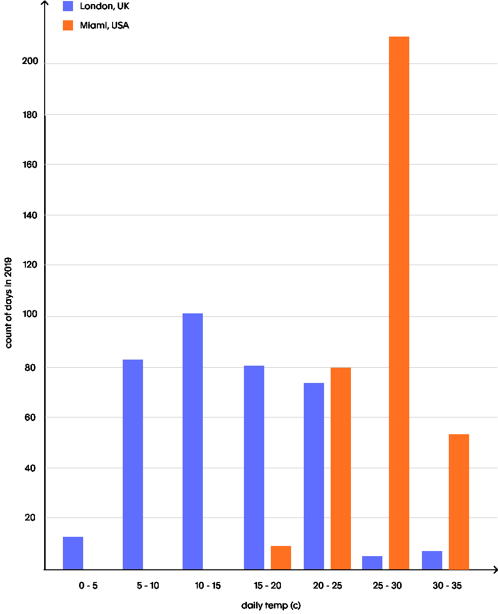
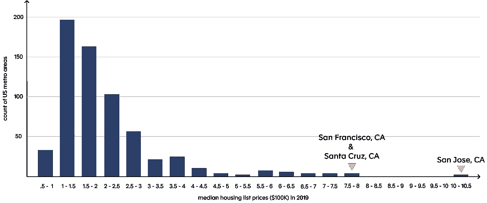

# WTH 是一个直方图🤷

> 原文：<https://towardsdatascience.com/wth-is-a-histogram-dd63a70cc056?source=collection_archive---------35----------------------->

## 用简单的英语说…

在本期数据技能药丸中，我们将触及难以捉摸的直方图。好吧，也许这不是难以捉摸的，但这是你的团队中的一些人可能会纠结的概念之一，但当它被分解时，实际上是非常简单的。这篇文章的互动版本[在这里](https://count.co/n/v9gcmoQQsui)。

# 你的形状

直方图揭示了数据的*形状*。特别是，它们显示了数字在整个数据集中的分布趋势。通过观察数据集的形状，我们可以确定:

1.  最常见的价值观是什么
2.  值的变化有多大



数据来自[气象](https://www.metaweather.com/api/)，分析来自[统计](https://count.co)

MetaWeather 的这一数据列出了 2019 年伦敦每天的气温中位数。每个条形代表有多少天属于指定的 5 度温度范围。

从这里我们可以看到，伦敦的天气分布相当均匀，这是因为它以非常温和而闻名。

如果我们将其与迈阿密的相同数据进行比较，我们可以了解到更多信息:



来自[气象](https://www.metaweather.com/api/)的数据

首先，我们可以看到:

1.  🥵:对我的美国朋友来说，大多数日子都是在 25-30 华氏度或 77-86 华氏度之间。
2.  与伦敦的天气相比，迈阿密的天气非常稳定(例如，它的变化低于伦敦)。这从迈阿密的酒吧数量较少就可以明显看出，其中大多数酒吧都比伦敦的酒吧高。

# 这些东西中的一个与另一个不同

查看直方图，可以很容易地识别出似乎与其他点不匹配的点。这些通常被称为异常值，如果不小心处理，会严重影响您的分析和结果。



来自 [Zillow](https://www.zillow.com/research/data/) 的数据

在本例中，我们仅使用了 Zillow 关于 2019 年美国约 700 个大都市地区房屋挂牌价格中值的数据。

每个条形代表在指定范围内有多少城市地区的房价中值。因此，2019 年，不到 200 个都会区的挂牌价格中值在 10 万美元至 15 万美元之间。

我们可以看到，美国大部分都会区的挂牌价格中值在 10 万美元到 25 万美元之间。

直方图还快速突出了异常值，尤其是一个房价中值超过 100 万美元的大都市地区😂。

如果你在意识到圣何塞和它的邻居旧金山和圣克鲁斯是如此异常之前进行分析，你的结果将会严重失真。例如:

*   2019 年美国平均房价(包括圣何塞、旧金山和圣克鲁斯):43.75 万美元
*   2019 年美国平均房价(不包括圣何塞、旧金山和圣克鲁斯):37.5 万美元

这超过了 60，000 美元(16%)的差距！一定要花时间检查那些异常值！

# 为什么它们很重要

除了前面两点，直方图还有一些好处，如:

## 🔮预测未来

通过理解共同的价值观和这些价值观的差异，你可以开始思考*在未来*会发生什么。

如果你必须猜测伦敦或迈阿密明天的气温，如果你猜对了，你会得到 100 美元，你会预测哪一个？(希望你说的是迈阿密:)

## 🚧提高直觉

主要的好处(IMO)是直方图是如此丰富的上下文来源。通过更深入地理解数据，你对世界的直觉会得到提高。

如果你在圣克鲁斯偶然发现一栋售价 200 美元的房子，你现在应该会有一种奇怪的感觉。你对数据有了一种直觉，如果没有丰富的研究和经验，你是不可能得到这种直觉的。

# 迪伊伊

如果你想自己做直方图，下面是步骤！

## 0.确保你的数据只是数字

抱歉，没有文本字段。您还将决定如何处理空值，是过滤掉它们，还是包含一个空值存储桶。

## 1.创建您的桶

挑选水桶有两种方法:

1.  挑选一些有意义的东西:

对于温度示例，我们选择了 5 度的桶尺寸，因为这很容易理解。如果我们愿意，我们可以轻松地选择 1 度、2 度或 7.2343 度，但要获得相同的见解会困难得多。

2.选择你想要的桶数

我们也可以说我们想要 10 个桶，不管它们有多宽。为了计算出在这种情况下每个桶的宽度，我们可以使用:

```
bucket_size = (max_value - min_value)/number_of_buckets
```

做这件事没有对错之分。我建议尝试不同的桶大小，看看你的直方图如何变化！

## 2.将每个观察(行)分配给一个存储桶

## 3.绘制直方图

**x 轴**:铲斗升序排列

**y 轴**:有落入每个桶的观测值的计数。

## 针对工具的教程，我推荐这些给 [Excel](https://www.excel-easy.com/examples/histogram.html) 和 [SQL](http://www.wagonhq.com/sql-tutorial/creating-a-histogram-sql) 。

# 下一步是什么？

你告诉我们！

你想看什么？我们正在为下一篇文章寻求建议。人头[这里](https://counthq.typeform.com/to/QT3JDf)投出您的一票！