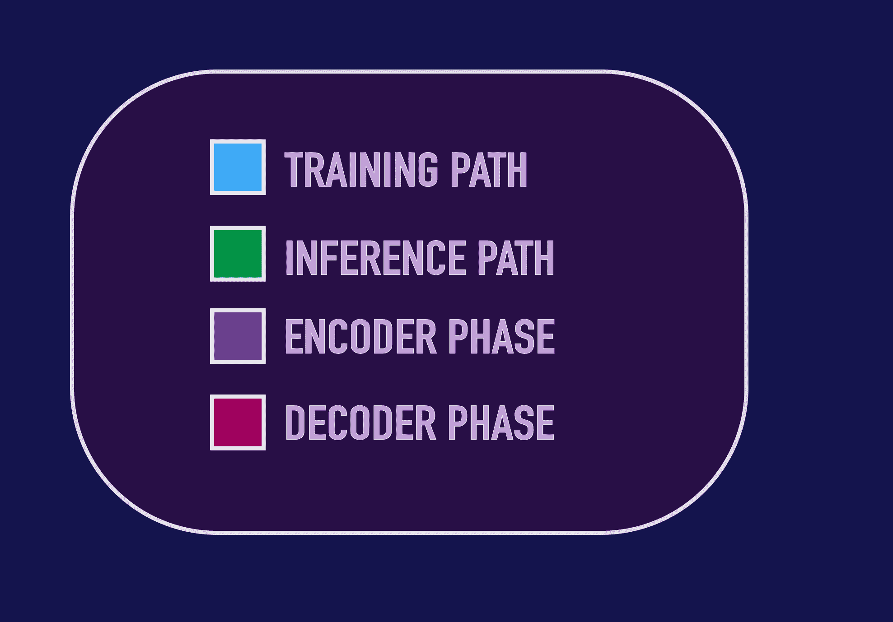
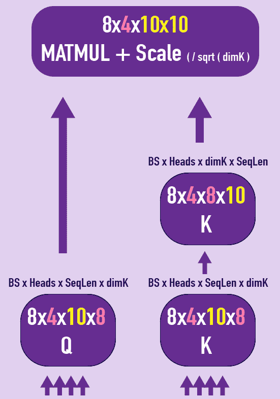

# x 射线变压器信息图

> 原文：<https://towardsdatascience.com/x-ray-transformer-dive-into-transformers-training-inference-computations-through-a-single-visual-4e8d50667378?source=collection_archive---------41----------------------->

## 通过一个单一的视觉潜入变形金刚训练和推理计算

本文末尾提供了完整信息图的更高分辨率版本的链接。哈维尔·Ideami@losslandscape.com 的可视化

transformer 架构已经在 **NLP** 领域和深度学习领域产生了一场革命。大量的应用程序受益于这些模型并行处理序列的能力，同时通过它们实现的注意机制来实现对它们的上下文的更深入理解。而 **GPT-3** 现在是深度学习社区的热门话题。

一开始，理解转换器如何处理序列可能有点困难。当处理一个复杂的模型时，许多人喜欢研究模型的计算如何改变通过它的张量的形状。

为此，我创建了 **X 射线变压器信息图**，它允许你在**训练和推理**阶段完成从变压器计算开始到结束的旅程。它的目标是通过对单个可视资产的分析和探索，快速而深入地理解变压器模型的内部计算。

*本文末尾有一个链接，可以下载下面完整信息图的更高分辨率版本。*

本文末尾提供了分辨率更高的完整信息图的链接。哈维尔·Ideami@losslandscape.com 的可视化

# **颜色代码**

在查看该信息图时，首先要考虑的是图右下方显示的代表不同重要阶段的颜色。

*   蓝色灯**表示**训练**阶段。**
*   绿灯**绿色**表示**推断**阶段。
*   **紫色**表示编码阶段(用于两个阶段)，在编码器中，紫色模块属于训练阶段，绿色模块属于推理阶段。
*   深色**红色**表示解码阶段(用于两个阶段)。在解码器中，紫色模块表示编码器数据，深红色模块表示解码器数据，绿色模块通常表示推理阶段。

一旦弄清楚了颜色代码，接下来就是注意里面有数字的**粉色**圆圈。这些帮助我们看到执行的一般路径，首先通过编码器，然后是解码器。

两侧的两个大箭头是编码器和解码器阶段执行的一些关键阶段的提示。

# 模型

为了生成这个信息图，我使用了一个生成聊天机器人的小型 transformer 模型。聊天机器人通过成对的问题和答案进行训练。这个特定的模型是针对与**电影**和连续剧，尤其是**科幻**相关的问题和答案进行训练的。问答示例:

*   "在《扩展》系列中，你最喜欢的角色是什么？":“娜奥米永田肯定！”
*   "你最喜欢太空堡垒卡拉狄加中的哪个角色？":“卡拉·瑟瑞斯，她很棒”

在信息图的标题下面，我们可以回顾一下在研究计算的形状时要考虑的最重要的**参数**。

*   这个小模型是用 8 的**批量训练出来的。**
*   该模型的多头关注部分有 **4 头**。
*   有 **3 个编码器层**和 **3 个解码器层**。
*   该模型的**输出词汇**的**大小**为 **950**
*   横跨模型使用的**嵌入尺寸**为 **32** 。

# 培训阶段。新的一批

当我们开始训练模型时，我们从信息图的左下方开始旅程。

我们从数据加载器中获得一个批处理。我们使用的批量大小为 8，因此每批包含 8 个输入序列和 8 个输出序列。

# 标记化、数值化、填充和遮罩

8 个输入序列根据需要进行填充(添加填充标记)，以便它们都具有相同的长度，在该特定批次的情况下，长度为 10(该批次中最长序列的长度)。批处理的输出序列也是如此。

这些序列已经被标记化和数值化，以准备被模型摄取。当训练循环提取新的一批时，序列被数值化并以维度为 **8x10 (BS x SeqLen)** 的张量来构造。

# 编码器中的屏蔽

接下来，我们需要创建一个**遮罩**，它将帮助我们确保序列中的额外填充元素不会被注意机制所考虑。因此，我们将掩码中属于输入序列中填充标记的那些位置设置为假或 0。

# 嵌入和位置编码

现在我们必须创建我们的嵌入，所以我们将 8x10 张量发送到嵌入模块，并得到一个**8x 10x 32(BS x SeqLen x EmbedSize)**张量，因为在这个小示例中我们的嵌入大小是 32(512 是 transformer 模型的典型嵌入大小)。

为此，我们添加了位置编码模块的结果，这将有助于模型考虑整个序列中定位的差异。

我们编码器的第一层准备接收这个 8x10x32 张量。

# **编码器**

编码器做的第一件事就是创建 3 个 8x10x32 张量的副本来产生模型的 **Q，K，V** 元素，也就是**查询，键和值。**

这 3 个张量首先通过 **3 个线性模块**(每个张量一个)。在这个小例子中，这些线性模块不会改变维度(但是如果我们希望的话，它们可以)。

在通过这些线性模块之后，我们到达必须将计算分成 4 个头的点(8 是头的数量的典型值。在这个小例子中，我使用 4)。使用 **4 个头部**将**允许注意力机制从不同角度解释序列。**

在计算上，我们可以用两个简单的步骤来准备这个阶段。

*   首先，我们可以将张量重新配置为**将**嵌入大小维度 **32** 拆分为两个维度 **4 和 8** 。4 是人头数。8，在我们的例子中，等于**嵌入维数/头数** 32 / 4 = **8，**我们称之为 **dimK 或 dK** (这个 dimK 值可以用不同的方法计算)。
*   现在我们做一个转置操作来定位批量大小为 1 之后的头数的维度。这就产生了新的形状:**8 x 4 x 10 x 8(BS x Heads x SeqLen x dimK)**。这个形状告诉我们:对于该批中的每个元素，我们将有 4 个头。并且这些头部中的每一个都将具有 10(序列长度)x 8(dimK)的矩阵。

# 自我关注

我们现在的目标是计算注意力得分。编码器执行所谓的**自我关注**。自我关注有助于我们将每个输入序列的不同部分与它们自身以及序列本身的其余部分进行比较。

从概念上来说，我们正在探索**序列的不同部分应该给予自身的不同部分多大的关注。**

为了找出这一点，我们将把**查询**和**键**张量相乘。

*   为了将它们相乘，我们需要转置 K 张量的后一半。
*   一旦 K 张量被转置，我们得到两个可以相乘的形状: **8x4x10x8 * 8x4x8x10** 。
*   注意，我们真正相乘的是最后两个维度: **10x8 * 8x10** 。
*   这将产生**注意力分数**张量，其形状为:**8 x4 X10 x 10(BS x Heads x SeqLen x SeqLen)**。
*   这些是我们的**自我关注分数**。对于批次中的每个元素，以及 4 个头中的每一个，我们有一个 **10x10 矩阵**，它表示我们序列中的每个部分应该对同一序列中的每个部分给予多少关注。

接下来我们要做的是应用一个面具。这是因为，请记住，我们确保了批处理中的所有序列都具有完全相同的长度。为此，我们必须将**填充标记**添加到比该批中最大的序列更短的序列中。

所以我们现在应该**屏蔽**(使之非常小或非常负)那些张量部分，这些张量部分引用序列中有填充标记的**部分。因此，我们应用掩码并消除序列中与这些填充标记相对应的部分的影响。**

现在我们将把一个 **softmax 模块**应用于张量的 10x10 矩阵，这样每一行的所有数字总和为 1，将每一行转换成一个**概率分布**。

这些是我们的**软自我关注分数**。对于每批中的每一个序列，在每一个头部中，序列的每一部分和它自身的每一部分之间的联系有多强，对序列的每一部分的所有影响的总和等于 1。

现在我们有了注意力分数，我们应该把它们应用到 V 张量的值上。我们希望**根据****自关注**计算的**结果来转换编码器**的值。

我们的**关注分**有**8 x4 X10 X10(BS x Heads x SeqLen x SeqLen)**的形状。而我们的 **V 张量**的形状是**8 x4 X10 x8(BS x Heads x SeqLen x dimK)**。请记住，我们实际上是在乘以后两个维度，所以我们是在乘以 **10x10 * 10x8** 。这就产生了一个新的维度为**8 x4 X10 x8(BS x Heads x SeqLen x dimK)的张量。**

至此，我们已经结束了**自我关注**阶段。我们通过**乘以查询和关键字**得出了注意力分数。然后**将**这些**注意力分数应用于值**以获得最终的注意力张量。

是时候让**把 4 个头**合二为一了。要做到这一点，我们做之前的逆操作，结合**换位和重新配置**得到一个新的形状**8 X10 x32(BS x Heads x EmbSize)**。

在将结果张量通过一个**线性模块**之后，我们到达了我们的第一个**跳跃连接**。我们将**把我们当前的张量添加到进入编码器层的原始张量**中。然后我们将**应用层标准化**来保持数据值在一个好的范围内。

接下来，我们将我们的 **8x10x32** 张量通过一个前馈层，然后应用**另一个跳过连接**，将结果张量添加到进入前馈层的张量中(并像前面一样归一化结果)。

我们可以**可选地**在先前计算的不同阶段应用**丢失模块**，例如在执行跳过连接添加时或在注意阶段结束时。

# 重复和上升

精彩！这是编码器的一层。完全相同的计算将被应用 x 次，对应于我们在编码器中的层数。

注意，进入编码器层**的**张量和退出**编码器层的**张量具有完全相同的形状** : **8x10x32。**这就是为什么**我们可以一个接一个地链接尽可能多的编码器层。****

一旦我们到达最终的编码器层，我们就获得了最终的 **8x10x32** 张量。该编码器输出张量稍后将在**编码器-解码器注意机制**(出现在**解码器层)**中使用，以提供将与解码器的问题张量交互的键和值。

# **解码器**

但在此之前，让我们进入下一步。解码器的底部。

在解码器的底部，我们有一个 **8x14 张量(BS x SeqLen)** ，它包含 8 个回复短语序列。像往常一样，在创建数据集和数据加载器时，这些短语已经被标记化和数值化了(并且它们根据需要包含填充标记)。

# 移动一位

需要注意的是，在**解码器**中，我们将序列向右移动一个位置。因此**第一个记号将是句子的开始记号**，而不是句子的第一个单词。我们为什么要这样做？

我们这样做是因为我们不希望我们的模型只是将解码器的输入复制并粘贴到其输出中。我们**希望它预测下一个单词**(或者字符，但是在这个例子中我们是预测单词)**。**因此，如果我们不将所有内容向右移动一位，位置 N 的预测将是解码器输入中位置 N 处的当前单词，我们可以直接访问它。为了防止这种情况发生，我们将解码器的输入向右移动一个位置。这样，在每个阶段，解码器必须预测位置 N，但是只能看到现有短语的位置 N-1。

# 解码器中的掩蔽

我们还创建了**解码器掩码**，它包含对角线上方的**真**和对角线下方的**假**。这个掩码有助于防止解码器考虑尚未看到的句子部分。

让我们更深入地了解这一点，因为它至关重要。**解码器的自我关注掩码**确保每个自我关注向量不会关注未来的位置。

因此，如果我在计算序列中位置 3 的单词的自我关注分数，我会屏蔽掉那个位置之后的所有位置。这是必要的，因为当我们构建我们的输出短语时，我们需要基于迄今为止生成的单词来执行我们的计算，并且我们不应该能够知道稍后将出现的未来单词。

在某种程度上，我们正在防止解码器在训练过程中作弊。例如，如果我们想要预测一个短语的第二个单词，我们应该只考虑输出短语的第一个位置。如果我们想预测第五个单词，我们应该只考虑第一、第二、第三和第四个位置。

请注意，解码器的掩码也屏蔽了输出序列中可能存在的填充标记。因此**解码器的屏蔽将**填充标记**的**屏蔽**添加到序列中未来位置**的屏蔽**中。**

与编码器一样， **8x14** 张量被发送到嵌入模块，该模块输出一个**8x 14x 32****(BS x Heads x SeqLen x EmbSize)**张量，因为嵌入大小是 32。接下来，将位置编码模块的结果添加到其中。

在这一点上，我们到达第一个解码器层，这将被重复许多次，作为我们希望有多少解码器层。

在解码器层，我们进入**两个连续的注意阶段**。

*   首先，我们将有一个**自我关注阶段**，非常类似于编码器阶段，但使用解码器数据。
*   接下来，我们将有一个**编码器-解码器关注阶段**，其中**问题(Q)张量**将来自解码器的**，但是**键(K)和值(V)张量**将来自**之前执行的**编码器**的输出**。您可以在信息图中找到这个混音阶段，如大的**箭头**所示，该箭头**将编码器的末端连接到解码器层的第二个注意阶段的键和值**。**

解码器的**第一自关注级**与编码器的相同，除了使用输出序列作为数据，并使用解码器的掩码。

在**第二注意阶段**、**编码器-解码器注意**中，发生了类似的过程，但有一些关键区别:

*   **问题 Q 矢量**由 **8x14x32 (BS x SeqLen x EmbSize)解码器矢量**构成
*   **键**和**值**向量、 **K 和 V** 由来自编码器相位结果的相同**8x10x 32(BS x SeqLen x EmbSize)**张量的两个副本形成。

我们在屏蔽阶段使用的**屏蔽**是在**编码器**中使用的，即输入序列一。这样，我们确保只考虑输出序列和没有填充标记的输入序列部分之间的连接。输出序列本身已经被解码器层的第一级屏蔽。

注意力分数不再是一个方阵。我们在**8x 4x 14x10(BS x Heads x InSeqLen x outeqlen)**张量内获得一个 14x 10 的矩阵，反映出我们正在获得的不同**部分**、**的输出**序列**与**的不同**部分**输入**序列**之间的**关系。**

像往常一样，在执行注意力计算之后，我们将结果连接起来，在这种情况下获得一个 **8x14x32 (BS x SeqLen x EmbSize)张量。**

在我们执行解码器层的自关注和编码器-解码器关注阶段之后，我们移动到同一层内的最后阶段，首先将 **8x14x32** 张量通过前馈模块，然后，正如我们在编码器中所做的那样，将该计算的结果添加到该模块(前馈模块)的输入，并将层归一化模块应用于该结果。(如编码器部分所述，在此过程以及其他过程中使用 dropout 是一种潜在的可选添加。)

然后，在现有数量的解码器层上重复该解码器层过程**。像以前一样，每个解码器层的输入和输出具有相同的形状，**8x 14x 32(BS x Heads x EmbSize)**，这使得很容易将这些层/过程中的一些链接起来。**

# **解码器的输出**

**一旦我们对所有解码器层进行了**迭代**，我们就获得了一个**最终的 8x14x32 张量**，然后我们将该张量传递给一个线性层，该层的输出形状为**8 x14 x950(BS x SeqLen x OutVocabSize)**， **950** 是聊天机器人输出的**词汇大小。****

**这个 **8x14x950** 张量包含了我们对于这次迭代的**预测**。对于该批中的每个序列，并且对于每个序列的 14 个部分中的每一个，我们获得 950 个值，对应于作为输出短语的下一个位置的候选的潜在的 950 个单词。**

****

**是时候计算损失了，我们的目标和我们当前的预测之间的差异。**

**我们将那个**预测**张量放入一个**交叉熵损失模块**，它也接收我们的 8x14 **目标**张量。交叉熵模块结果是训练过程的这次迭代的损失值。**

**该损失值然后通过网络**反向传播**，权重**被**更新**，并且过程**再次重启**，编码器处理新的批次。****

****

**我们继续尽可能多的时期的训练过程，直到我们达到我们的目标(在准确性、损失值、验证损失等方面)。每 x 次迭代或历元，我们保存网络的权重，以防我们想在其他时间重新开始训练，或者让最近训练的权重准备好随时执行推理。**

# **推理**

**这就是训练过程。现在让我们快速看一下推理过程。一旦转换器被训练，我们如何执行和运行它？**

**为此，我们必须关注信息图的绿色部分。**

**在图形的左下方，我们看到开始推理过程的绿色的**推理列。****

**当我们运行训练好的变形金刚时，我们将输入一个**的单一输入短语，例如****:你最喜欢《扩展》系列中的哪个角色？****

**这就是为什么我们的**批量**会是 **1** 的原因。我们仍然需要指定批量大小，因为计算需要它。这个短语被标记化和数字化，得到一个 **1x9 (BS x SeqLen)** 张量，因为这个示例短语有 9 个标记(["what's "，" your "，" favourite "，" character "，" in "，" The "，" expanse "，" series '，'？'].请注意，我们可以用许多不同的方式来标记短语，并且有许多标记器可供您使用。这个小例子使用了一种简单的方法来标记短语。**

**我们还创建我们的输入掩码，在这个推断阶段，它将在每个位置都有**真**。**

****

**接下来，我们将输入张量传递给嵌入模块，并将其与位置编码模块输出相加，以获得一个**1x9x 32(BS x Heads x EmbSize)**张量。**

****

# **编码器相位，推断**

**编码器的第一层以与训练迭代期间类似的计算开始，但这次使用这个 **1x9x32** 张量。编码器层重复直到我们到达最后一层，在那里我们获得一个 **1x9x32** 张量，它将被解码器用来提供编码器-解码器注意阶段的键和值。**

****

**我们转到解码器，这里的情况有所不同。**

# **解码器阶段、推理**

*   **我们对解码器的输入最初将由**句首**令牌形成。(请记住，我们将所有内容向右移动一个位置，以防止解码器将其输入复制到输出中)。**
*   **然后，解码器将输出我们应该添加到回复句子中的下一个单词作为结果(最初仅由**句首**标记形成)。**
*   **我们将采用新的预测单词并将其添加到解码器的输入端，**重复过程**和**生成回复句子的下一个单词**。**
*   **这再次被添加到解码器的输入，我们继续这样，直到解码器输出**句尾**标记。**

**因此，我们对解码器的输入最初将具有 **1x1** 的形状。在下一次迭代中，它将变成 **1x2** ，然后是 **1x3** 等等，直到它达到 **1xN** ，其中 **N** 是解码器循环的迭代次数，直到我们获得**句尾**令牌。**

**在循环中的每一点，我们创建一个适应每次迭代的新掩码。初始形状为 **1x1x1 (BS x SeqLen x SeqLen)** 。在下一次迭代中，它变成 **1x2x2** ，然后是 **1x3x3** ，直到到达 **1xNxN** ，这时我们到达了**句尾**标记。像以前一样，这个掩码帮助我们防止模型在计算注意力分数时关注序列中的未来位置(超出它正在考虑的当前位置)。**

****

**然后，我们将浏览多个**解码器层，**，每一层都执行我们之前看到的相同计算:**

*   **一个**自我关注**阶段**
*   **一个**编码器-解码器**注意级**
*   ****前馈**阶段。**

****

**在解码器层的末尾，我们将获得一个**1 NX 950(BS x SeqLen x OutVocabSize)**张量，其中 N 是我们在解码器循环中的位置。第一次迭代我们得到一个 **1x1x950 张量**，第二次得到一个 **1x2x950 张量**等等。**

**我们将得到的张量通过一个 **softmax** 模块来获得一个**概率分布**。这种分布给了我们对于输出短语的每个**单词**获得**输出词汇表**的每个元素的**概率**。我们将考虑张量最后部分的概率，属于我们想要预测的下一个单词的概率。**

**我们可以从这个概率分布中以多种方式对**进行采样，以获得一个 **1x1 张量**，它包含将被添加到当前输出句子末尾的新单词**。******

****

**然后我们**继续循环并添加**新单词到输出句子中，直到我们找到**句尾标记**。**

**就是这样，我们有一个很酷的变形金刚聊天机器人，它的计算已经通过这个 **x 射线**变形金刚可视化展示给我们了。**

**您可以**从专门的 [github repo](https://github.com/javismiles/X-Ray-Transformer) 下载更大版本(10488 x 14000 像素)的 x 射线变压器可视化**:**

** [## javismiles/X 射线转换器

### 通过一个单一的视觉潜入变形金刚训练和推理计算。X 射线转换器信息图…

github.com](https://github.com/javismiles/X-Ray-Transformer)**