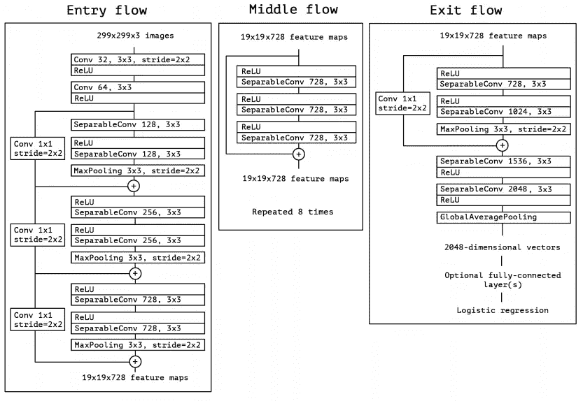
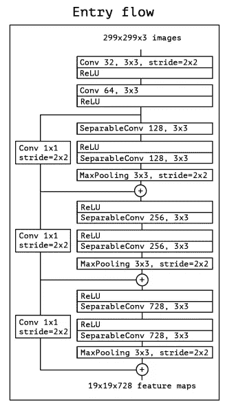
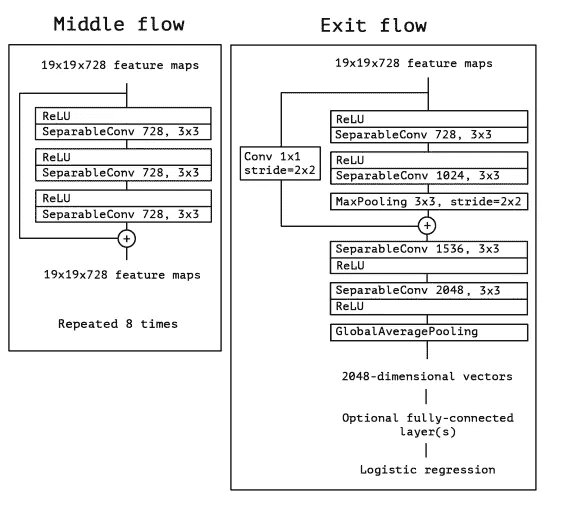
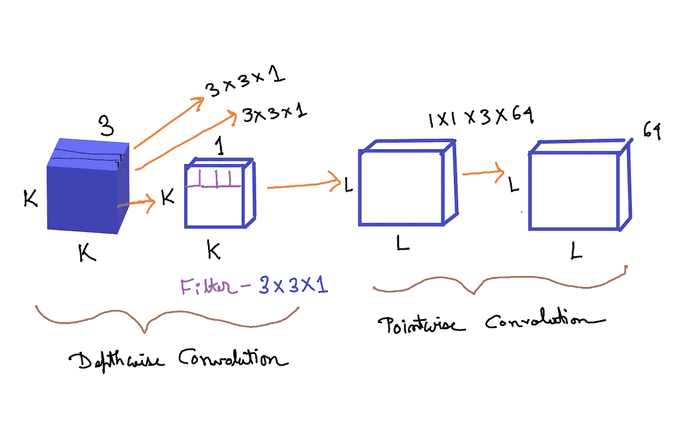
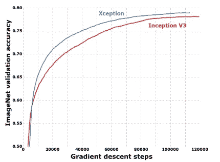
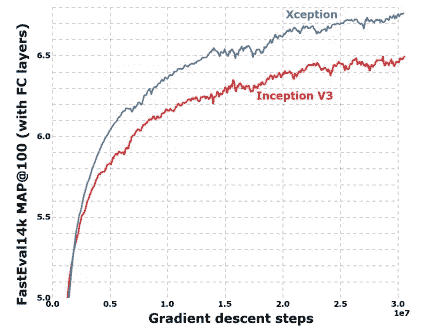
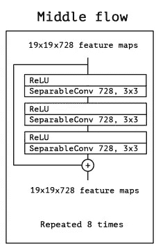
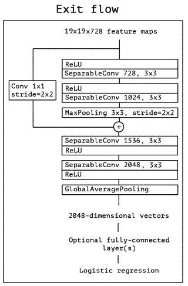
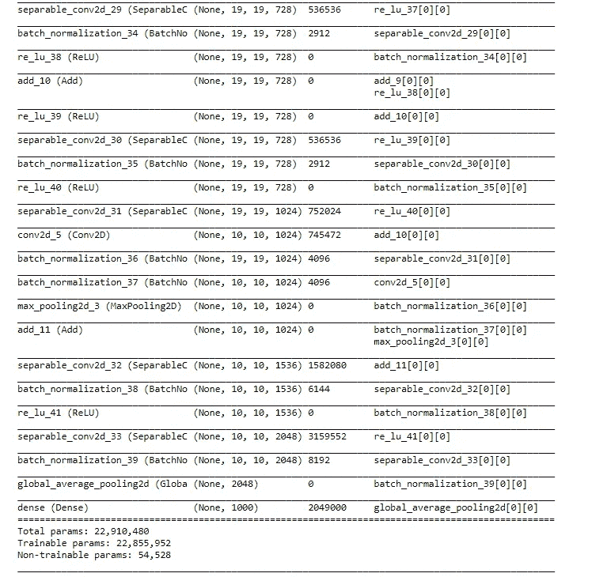
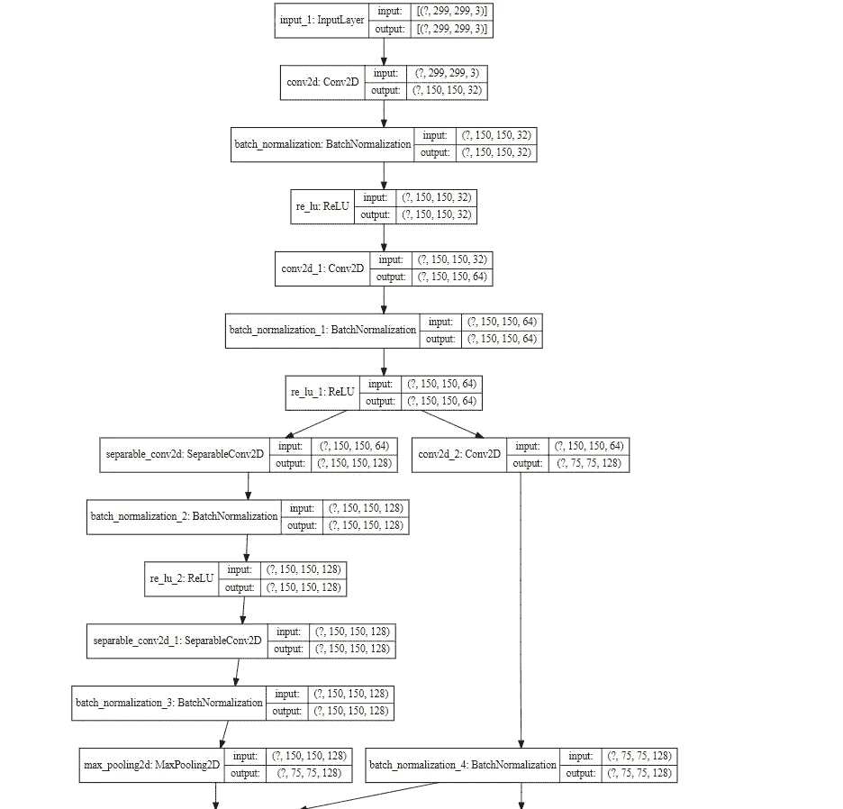

# 例外:使用 Tensorflow 从头实现

> 原文：<https://towardsdatascience.com/xception-from-scratch-using-tensorflow-even-better-than-inception-940fb231ced9?source=collection_archive---------6----------------------->

## 甚至比《盗梦空间》还要好



图一。Xception 架构(来源:图片来自原论文)

卷积神经网络(CNN)已经走过了漫长的道路，从 LeNet-style、AlexNet、VGG 模型(使用简单的卷积层堆栈用于特征提取，最大池层用于空间子采样，一个接一个地堆叠)到 Inception 和 ResNet 网络(在每层中使用跳过连接和多个卷积和最大池块)。自从引入以来，计算机视觉中最好的网络之一就是盗梦空间网络。Inception 模型使用一堆模块，每个模块包含一堆特征提取器，这允许它们用更少的参数学习更丰富的表示。

例外纸—[https://arxiv.org/abs/1610.02357](https://arxiv.org/abs/1610.02357)

正如我们在图 1 中看到的，异常模块有 3 个主要部分。入口流、中间流(重复 8 次)和出口流。



图二。Xception 架构的入口流(来源:图片来自原论文)

入口流具有两个卷积层块，后跟一个 ReLU 激活。该图还详细提到了过滤器的数量、过滤器大小(内核大小)和步长。

还有各种可分离的卷积层。还有最大池层。当步幅不等于 1 时，也提到步幅。也有跳过连接，我们使用“添加”来合并两个张量。它还显示了每个流中输入张量的形状。例如，我们从 299x299x3 的图像大小开始，在进入流之后，我们得到 19x19x728 的图像大小。



图 3。Xception 架构的中间和出口流程(来源:图片来自原论文)

类似地，对于中间流和出口流，该图清楚地解释了图像大小、各种层、过滤器的数量、过滤器的形状、池的类型、重复的数量以及最后添加完全连接的层的选项。

此外，所有卷积和可分离卷积层都要进行批量归一化。

## 可分离卷积层



图 4。可分离卷积层(来源:图片由作者创建)

> 可分离卷积包括首先执行深度方向的空间卷积(其分别作用于每个输入声道),然后执行混合所得输出声道的点方向卷积。-来自 Keras 文档

假设我们有一个大小为(K，K，3)的输入张量。k 是空间维度，3 是特征图/通道的数量。正如我们从上面的 Keras 文档中看到的，首先我们需要对每个输入通道分别实施深度方向的空间卷积。所以我们用 K，K，1——图像/张量的第一通道。假设我们使用大小为 3x3x1 的过滤器。并且该滤波器应用于输入张量的所有三个通道。因为有 3 个通道，所以我们得到的维数是 3x3x1x3。这在图 4 的深度方向卷积部分中示出。

在这之后，将所有 3 个输出集合在一起，我们获得大小为(L，L，3)的张量。L 的维数可以与 K 相同，也可以不同，这取决于先前卷积中使用的步长和填充。

然后应用逐点卷积。该滤波器的尺寸为 1x1x3 (3 个通道)。过滤器的数量可以是我们想要的任何数量。假设我们使用 64 个过滤器。所以总尺寸是 1x1x3x64。最后，我们得到一个大小为 LxLx64 的输出张量。这显示在图 4 的逐点卷积部分。

**为什么可分卷积比正规卷积好？**

如果我们在输入张量上使用正常卷积，并且我们使用 3x3x3 的滤波器/核大小(核大小— (3，3)和 3 个特征图)。我们需要的过滤器总数是 64 个。所以一共 3x3x3x64。

相反，在可分离卷积中，我们首先在深度方向卷积中使用 3x3x1x3，在点方向卷积中使用 1x1x3x64。

区别在于过滤器的维度。

**传统卷积层= 3 x3x 3 x 64 = 1728**

**可分离卷积层=(3 x3x 1 x 3)+(1 x1 x3 x 64)= 27+192 = 219**

正如我们所见，无论是在计算成本还是在内存方面，可分离卷积层都比传统卷积层更具优势。主要区别是在正常卷积中，我们是多次变换图像。而每一次变换都要用掉 3 x3x 3 x 64 = 1728 次乘法。在可分离卷积中，我们只对图像进行一次变换——在深度方向卷积中。然后，我们把变换后的图像简单地拉长到 64 通道。不必一次又一次地变换图像，我们可以节省计算能力。



图 5。ImageNet 上的异常性能 vs Inception(来源:图片来自原始论文)



图 6。JFT 数据集上的异常性能与初始(来源:图片来自原始论文)

**算法:**

1.  导入所有必要的层
2.  为以下各项编写所有必要的函数:

a.conv-巴特诺姆块体

b.可分离 Conv- BatchNorm 块

3.为 3 个流中的每一个写一个函数——入口、中间和出口

4.使用这些函数构建完整的模型

# 使用张量流创建异常

```
*#import necessary libraries*

**import** **tensorflow** **as** **tf**
**from** **tensorflow.keras.layers** **import** Input,Dense,Conv2D,Add
**from** **tensorflow.keras.layers** **import** SeparableConv2D,ReLU
**from** **tensorflow.keras.layers** **import** BatchNormalization,MaxPool2D
**from** **tensorflow.keras.layers** **import** GlobalAvgPool2D
**from** **tensorflow.keras** **import** Model
```

**创建 conv-巴特诺姆块:**

```
*# creating the Conv-Batch Norm block*

**def** conv_bn(x, filters, kernel_size, strides=1):

    x = Conv2D(filters=filters, 
               kernel_size = kernel_size, 
               strides=strides, 
               padding = 'same', 
               use_bias = **False**)(x)
    x = BatchNormalization()(x)**return** x
```

Conv 批处理范数块将张量——x、滤波器数量——滤波器、卷积层的内核大小——内核大小、卷积层的步距——步距作为输入。然后我们对 x 应用一个卷积层，然后应用批量归一化。我们添加 use_bias = False，这样最终模型的参数数量，将与原始论文的参数数量相同。

**创建 SeparableConv- BatchNorm 块:**

```
*# creating separableConv-Batch Norm block*

**def** sep_bn(x, filters, kernel_size, strides=1):

    x = SeparableConv2D(filters=filters, 
                        kernel_size = kernel_size, 
                        strides=strides, 
                        padding = 'same', 
                        use_bias = **False**)(x)
    x = BatchNormalization()(x)**return** x
```

与 Conv 批处理范数模块结构相似，只是我们使用了 SeparableConv2D 而不是 Conv2D。

**入口、中间和出口流量功能:**

```
*# entry flow*

**def** entry_flow(x):

    x = conv_bn(x, filters =32, kernel_size =3, strides=2)
    x = ReLU()(x)
    x = conv_bn(x, filters =64, kernel_size =3, strides=1)
    tensor = ReLU()(x)

    x = sep_bn(tensor, filters = 128, kernel_size =3)
    x = ReLU()(x)
    x = sep_bn(x, filters = 128, kernel_size =3)
    x = MaxPool2D(pool_size=3, strides=2, padding = 'same')(x)

    tensor = conv_bn(tensor, filters=128, kernel_size = 1,strides=2)
    x = Add()([tensor,x])

    x = ReLU()(x)
    x = sep_bn(x, filters =256, kernel_size=3)
    x = ReLU()(x)
    x = sep_bn(x, filters =256, kernel_size=3)
    x = MaxPool2D(pool_size=3, strides=2, padding = 'same')(x)

    tensor = conv_bn(tensor, filters=256, kernel_size = 1,strides=2)
    x = Add()([tensor,x])

    x = ReLU()(x)
    x = sep_bn(x, filters =728, kernel_size=3)
    x = ReLU()(x)
    x = sep_bn(x, filters =728, kernel_size=3)
    x = MaxPool2D(pool_size=3, strides=2, padding = 'same')(x)

    tensor = conv_bn(tensor, filters=728, kernel_size = 1,strides=2)
    x = Add()([tensor,x])**return** x
```

这里我们只需遵循图 2。它从分别具有 32 和 64 个滤波器的两个 Conv 层开始。每次激活后都有一个 ReLU 激活。

然后是一个跳过连接，这是通过使用 Add 完成的。

在每个 skip 连接块中，有两个可分离的 Conv 层，后跟 MaxPooling。跳跃连接本身具有跨度为 2 的 1x1 的 Conv 层。



图 7。中流量(来源:图片来自原论文)

```
*# middle flow*

**def** middle_flow(tensor):

    **for** _ **in** range(8):
        x = ReLU()(tensor)
        x = sep_bn(x, filters = 728, kernel_size = 3)
        x = ReLU()(x)
        x = sep_bn(x, filters = 728, kernel_size = 3)
        x = ReLU()(x)
        x = sep_bn(x, filters = 728, kernel_size = 3)
        x = ReLU()(x)
        tensor = Add()([tensor,x])

    **return** tensor
```

中间的流程遵循图 7 所示的步骤。



图 8。退出流程(来源:图片来自原纸)

```
*# exit flow*

**def** exit_flow(tensor):

    x = ReLU()(tensor)
    x = sep_bn(x, filters = 728,  kernel_size=3)
    x = ReLU()(x)
    x = sep_bn(x, filters = 1024,  kernel_size=3)
    x = MaxPool2D(pool_size = 3, strides = 2, padding ='same')(x)

    tensor = conv_bn(tensor, filters =1024, kernel_size=1, strides =2)
    x = Add()([tensor,x])

    x = sep_bn(x, filters = 1536,  kernel_size=3)
    x = ReLU()(x)
    x = sep_bn(x, filters = 2048,  kernel_size=3)
    x = GlobalAvgPool2D()(x)

    x = Dense (units = 1000, activation = 'softmax')(x)

    **return** x
```

退出流程遵循图 8 所示的步骤。

**创建异常模型:**

```
*# model code*

input = Input(shape = (299,299,3))
x = entry_flow(input)
x = middle_flow(x)
output = exit_flow(x)

model = Model (inputs=input, outputs=output)
model.summary()
```

输出片段:



```
**from** **tensorflow.python.keras.utils.vis_utils** **import** model_to_dot
**from** **IPython.display** **import** SVG
**import** **pydot**
**import** **graphviz**

SVG(model_to_dot(model, show_shapes=**True**, show_layer_names=**True**, rankdir='TB',expand_nested=**False**, dpi=60, subgraph=**False**).create(prog='dot',format='svg'))
```

输出片段:



```
**import** **numpy** **as** **np** 
**import** **tensorflow.keras.backend** **as** **K** np.sum([K.count_params(p) **for** p **in** model.trainable_weights])
```

输出:22855952

上述代码显示了可训练参数的数量。

**使用 Tensorflow 从头开始创建异常模型的完整代码:**

```
***#import necessary libraries***

**import** **tensorflow** **as** **tf**
**from** **tensorflow.keras.layers** **import** Input,Dense,Conv2D,Add
**from** **tensorflow.keras.layers** **import** SeparableConv2D,ReLU
**from** **tensorflow.keras.layers** **import** BatchNormalization,MaxPool2D
**from** **tensorflow.keras.layers** **import** GlobalAvgPool2D
**from** **tensorflow.keras** **import** Model***# creating the Conv-Batch Norm block***

**def** conv_bn(x, filters, kernel_size, strides=1):

    x = Conv2D(filters=filters, 
               kernel_size = kernel_size, 
               strides=strides, 
               padding = 'same', 
               use_bias = **False**)(x)
    x = BatchNormalization()(x)**return** x***# creating separableConv-Batch Norm block***

**def** sep_bn(x, filters, kernel_size, strides=1):

    x = SeparableConv2D(filters=filters, 
                        kernel_size = kernel_size, 
                        strides=strides, 
                        padding = 'same', 
                        use_bias = **False**)(x)
    x = BatchNormalization()(x)**return** x***# entry flow***

**def** entry_flow(x):

    x = conv_bn(x, filters =32, kernel_size =3, strides=2)
    x = ReLU()(x)
    x = conv_bn(x, filters =64, kernel_size =3, strides=1)
    tensor = ReLU()(x)

    x = sep_bn(tensor, filters = 128, kernel_size =3)
    x = ReLU()(x)
    x = sep_bn(x, filters = 128, kernel_size =3)
    x = MaxPool2D(pool_size=3, strides=2, padding = 'same')(x)

    tensor = conv_bn(tensor, filters=128, kernel_size = 1,strides=2)
    x = Add()([tensor,x])

    x = ReLU()(x)
    x = sep_bn(x, filters =256, kernel_size=3)
    x = ReLU()(x)
    x = sep_bn(x, filters =256, kernel_size=3)
    x = MaxPool2D(pool_size=3, strides=2, padding = 'same')(x)

    tensor = conv_bn(tensor, filters=256, kernel_size = 1,strides=2)
    x = Add()([tensor,x])

    x = ReLU()(x)
    x = sep_bn(x, filters =728, kernel_size=3)
    x = ReLU()(x)
    x = sep_bn(x, filters =728, kernel_size=3)
    x = MaxPool2D(pool_size=3, strides=2, padding = 'same')(x)

    tensor = conv_bn(tensor, filters=728, kernel_size = 1,strides=2)
    x = Add()([tensor,x])**return** x***# middle flow***

**def** middle_flow(tensor):

    **for** _ **in** range(8):
        x = ReLU()(tensor)
        x = sep_bn(x, filters = 728, kernel_size = 3)
        x = ReLU()(x)
        x = sep_bn(x, filters = 728, kernel_size = 3)
        x = ReLU()(x)
        x = sep_bn(x, filters = 728, kernel_size = 3)
        x = ReLU()(x)
        tensor = Add()([tensor,x])

    **return** tensor***# exit flow***

**def** exit_flow(tensor):

    x = ReLU()(tensor)
    x = sep_bn(x, filters = 728,  kernel_size=3)
    x = ReLU()(x)
    x = sep_bn(x, filters = 1024,  kernel_size=3)
    x = MaxPool2D(pool_size = 3, strides = 2, padding ='same')(x)

    tensor = conv_bn(tensor, filters =1024, kernel_size=1, strides =2)
    x = Add()([tensor,x])

    x = sep_bn(x, filters = 1536,  kernel_size=3)
    x = ReLU()(x)
    x = sep_bn(x, filters = 2048,  kernel_size=3)
    x = GlobalAvgPool2D()(x)

    x = Dense (units = 1000, activation = 'softmax')(x)

    **return** x***# model code***

input = Input(shape = (299,299,3))
x = entry_flow(input)
x = middle_flow(x)
output = exit_flow(x)

model = Model (inputs=input, outputs=output)
model.summary()
```

**结论:**

如图 5 和图 6 所示，与 ImageNet 数据集相比，Xception 架构在 JFT 数据集上显示出比 Inception 网络更好的性能提升。《例外》的作者认为，这是因为《盗梦空间》被设计成专注于 ImageNet，因此可能过度适合特定的任务。另一方面，这两种架构都没有针对 JFT 数据集进行过调整。

此外，Inception 有大约 2360 万个参数，而 Xception 有 2280 万个参数。

如图 1 所示，本文中很容易解释 Xception 架构，这使得使用 TensorFlow 实现网络架构变得非常容易。

**参考文献:**

1.  Franç ois Chollet，Xception:深度可分卷积深度学习，[arXiv:1610.02357 v3](https://arxiv.org/abs/1610.02357v3)**【cs。CV]，2017**