# 例外:迎接极限开端

> 原文：<https://towardsdatascience.com/xception-meet-the-xtreme-inception-db569755f4d6?source=collection_archive---------29----------------------->

除了作者的极端盗梦空间- *图片*

# 异常简介

例外-极限盗梦空间！听起来又酷又极端！而是“为什么取这样的名字？”，有人可能会想！一个显而易见的事情是，作者 Francois Chollet(《Keras》的创作者)受到了《盗梦空间》架构的启发。他在他的摘要中讲述了他是如何看待盗梦空间架构的，我在下面引用了他的摘要。

> 我们将卷积神经网络中的初始模块解释为常规卷积和深度方向可分离卷积运算之间的中间步骤
> 
> ——弗朗索瓦·乔莱在《例外报》

今天另一个新的深度学习术语，“*”深度可分卷积。现在，我知道你们大多数人会猜测它是某种层次。但是对于那些从未听说过的人来说，不要担心。我在这篇文章中为你做了介绍。我们将深入了解什么是 ***深度方向可分离卷积*** 以及如何使用它来构建异常模型。以及它是如何建立在盗梦空间假设上的。和往常一样，我会试着插入更多的插图，让细节更加清晰。让我们开始吧！*

# *盗梦空间假说*

*在“ ***用卷积*** ”一文中介绍了 Inception 风格的架构。作者将论文中介绍的模型称为 ***GoogLeNet，*** 使用了 Inception 块。这是一个新颖和创新的建筑，现在仍然如此。此外，由于当时的许多体系结构是越来越多的层的堆叠，以增加网络容量，因此它受到了广泛关注。另一方面,《盗梦空间》更有创意，更巧妙！*

*它不仅仅是通过简单地增加更多的层而变得更深，还变得更广。我们很快就会明白我所说的“宽”是什么意思。初始块接受输入张量，并并行执行卷积和池化的组合。*

*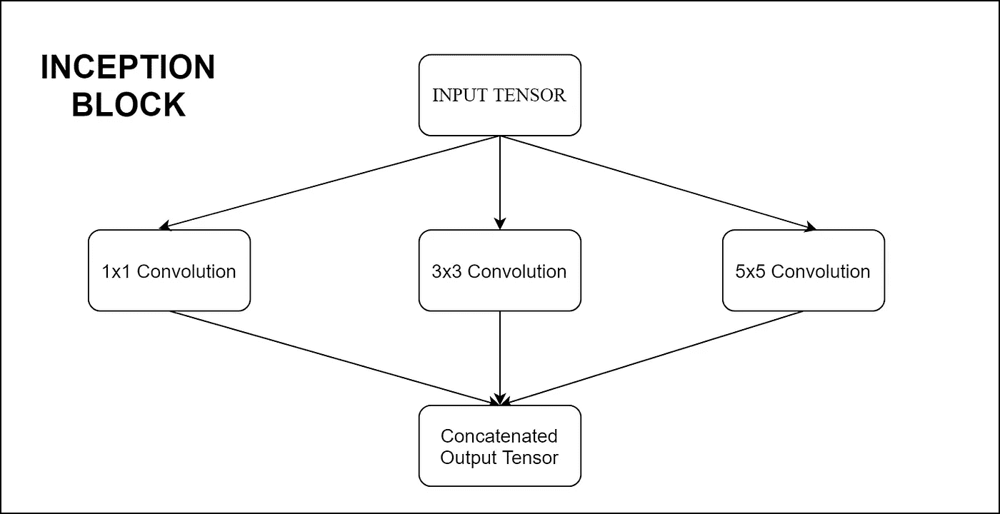*

**作者图片**

*对于看过或读过《盗梦空间》的人来说，你可能会发现这并不完全像一个盗梦空间。是啊，你说得对！我只是用这种方式举例说明，这样每个人都能大致了解它的功能。正如作者所说，你可以称之为“天真版的盗梦空间”。*

*现在，实际的 Inception 块在卷积的数量、大小以及分层方式方面有一点不同。但是这个幼稚的插图传达了我之前说的“宽”的意思。该模块并行执行不同滤波器大小的卷积。并且输出张量沿着信道维度连接，即一个接一个地堆叠。*

## *再深入一点*

*现在您已经看到了并行卷积模块，我将更深入地介绍上面的模块。由不同卷积处理的输入张量将是形状(批量、高度、宽度、通道)。在初始块中，在应用 3x3 或 5x5 卷积之前，使用 1x1 卷积来降低输入张量的通道维度。这种通道尺寸的减小是为了在将该张量馈送到后续层时减少计算。你可以在 [1x1 卷积](https://hackerstreak.com/1x1-convolution/)文章中找到这个概念的详细解释。*

*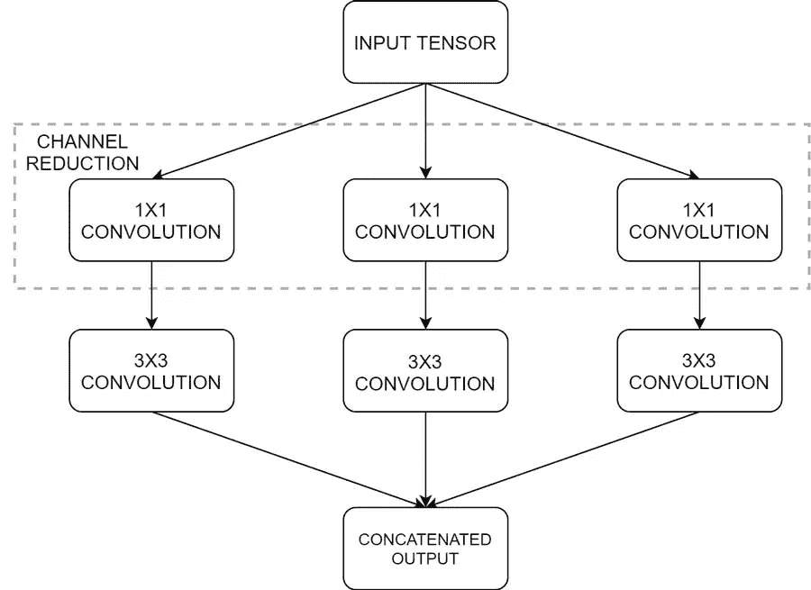*

**作者图片**

*同样，这只是另一个需要理解的描述，并不与最初的 Inception 块相同。你可以给或拿一些层，甚至更宽，并做出你自己的版本。输入张量由三个卷积塔分别处理。并且三个独立的输出张量沿着信道维度连接。GoogLeNet 使用多个 Inception 块和一些其他技巧和调整来实现它的性能。我相信，现在你已经知道盗梦空间是做什么的了。*

*接下来，我们将改造上述区块，使其成为**“极限”！***

## *让它成为极致*

*我们将用单层替换每个平行塔中的三个独立的 ***1x1*** 层。它看起来会像这样。*

*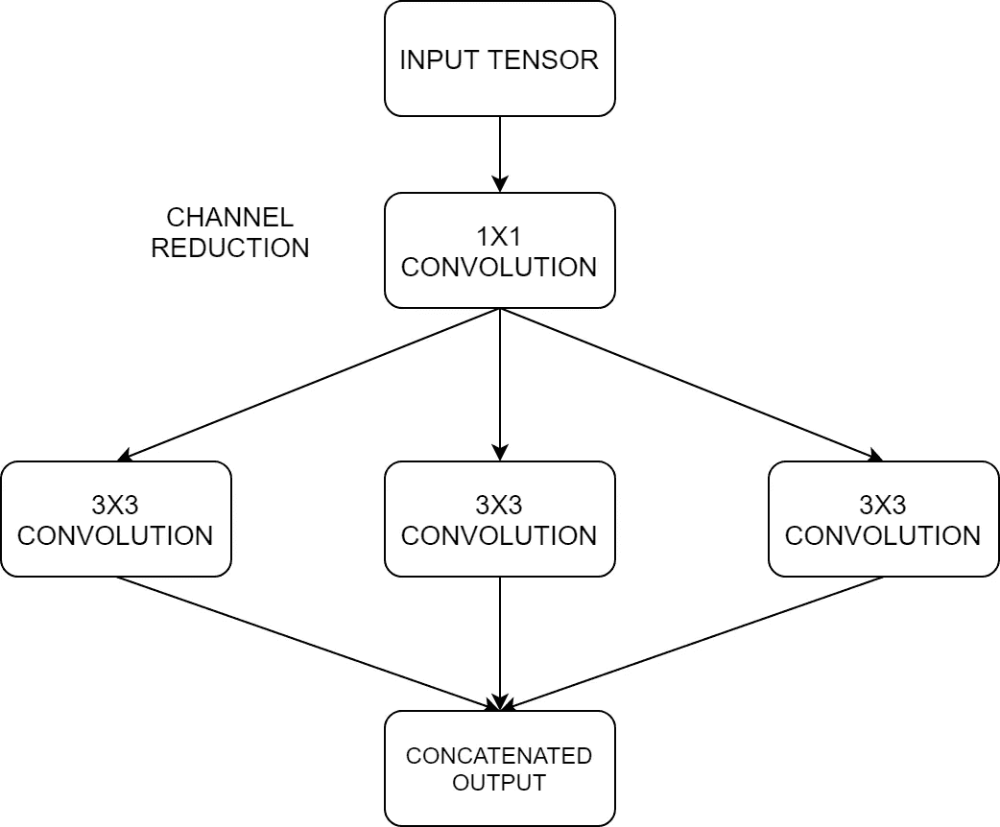*

*具有*普通 1x1 层的盗梦空间-作者图片**

*我们不是将 1x1 层的输出传递给后面的 3x3 层，而是将它切片并分别传递每个通道。我举个例子说明一下。比方说， ***1x1*** 层的输出是形状 ***(1x5x5x5)。*** 我们先不考虑批量维度，只把它看成一个 ***(5x5x5)*** 张量。这是*沿通道尺寸切割*，如下图所示，并分别送入后续层。*

*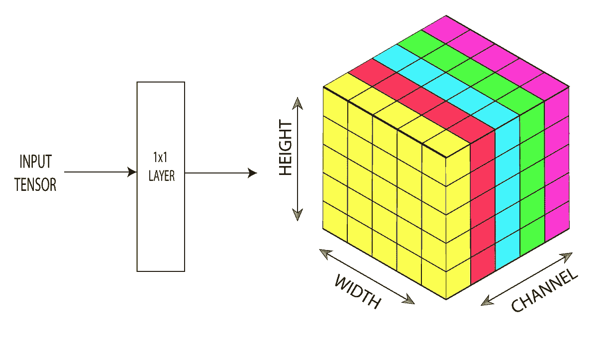*

**作者沿信道维度对 1x1 卷积的输出张量进行切片-图像**

*现在，每个切片都被传递到一个单独的 3x3 层。这意味着每个 3x3 块将不得不处理一个形状为 ***(5x5x1)的张量。*** 因此，将有 5 个单独的卷积块，每个切片一个。并且每个卷积块将只有一个滤波器。*

*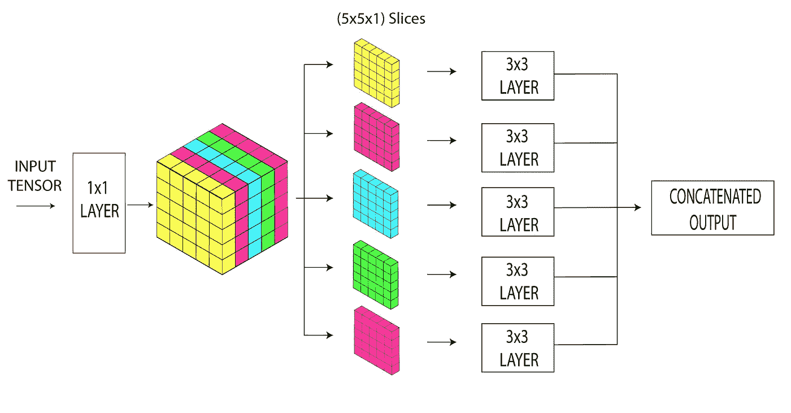*

*每个通道切片被馈送到一个单独的 3×3 层，每个层只有一个过滤器*

*同样的过程也适用于更大的输入张量。如果逐点卷积的输出是***(5x5x 100)***，则有 100 个卷积块，每个卷积块有一个滤波器。他们所有的输出最终会被连接起来。这种做卷积的方式就是它被命名为 ***极端*** 的原因，因为输入张量的每个通道都是单独处理的。*

*我们已经看够了《盗梦空间》的想法和它的一个 ***极限*** 版本。现在，让我们进一步看看是什么驱动了 Xception 架构。*

# *深度方向可分卷积:驱动异常的东西*

*深度方向上可分离的卷积层是这个例外的动力。它在建筑中大量使用了这一点。这种卷积类似于我们上面看到的初始块的极端版本。但其工作原理略有不同。让我们看看如何！*

*考虑在***(1x 10 X10 X100)***张量上操作的具有十个 5×5 滤波器的典型卷积层。十个滤波器中的每一个都具有 ***(5x5x100)*** 的形状，并且在输入张量上滑动以产生输出。每个 5x5 滤波器在滑过输入时覆盖整个通道尺寸(整个 100)。这意味着典型的卷积运算包括空间维度(高度、宽度)和通道维度。*

*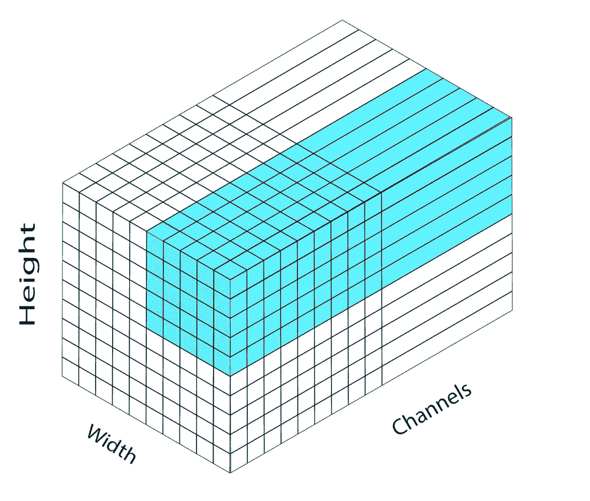*

*作者在(10x10x100)张量上滑动的 5x5 卷积滤波器— *图像**

*如果你不熟悉卷积，我建议你浏览一下[卷积是如何工作的？](https://hackerstreak.com/1x1-convolution/#how-convolution-works)*

*深度方向可分离层具有两个功能部分，这两个功能部分分割了传统卷积层的工作。这两部分是深度方向卷积和点方向卷积。我们会一个一个地检查。*

## *深度方向卷积*

*让我们以具有*滤波器的深度方向卷积层为例，该滤波器对形状为***(1×5×5×5)***的输入张量进行操作。同样，为了简单起见，我们去掉批处理维，因为它不会改变任何东西，并将其视为一个 ***(5x5x5)*** 张量。我们的深度方向卷积将具有五个 ***3x3*** 滤波器，每个滤波器用于输入张量的每个通道。并且每个滤波器将在空间上滑过单个通道，并为该通道生成输出特征图。**

**由于滤波器的数量等于输入通道的数量，输出张量也将具有相同数量的通道。让我们在卷积运算中没有任何零填充，保持 ***步距*** 为 *1。***

**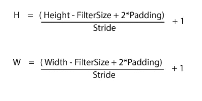**

**作者应用卷积- *图像后输出高度和宽度计算***

**按照卷积后输出大小的公式，我们的 ***(5x5x5)*** 将变成一个 ***(3x3x5)*** 张量。下面的插图将使这个想法变得清晰！**

**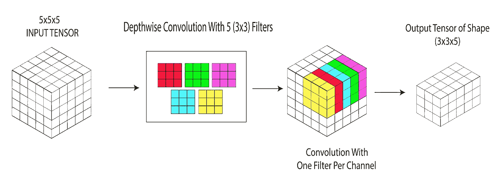**

***作者对深度方向卷积运算-图像的说明***

**这是深度方向的卷积！你可以看到这和我们在《盗梦空间》中做 ***极限*** 卷积的方式差不多。**

**接下来，我们必须将这个输出张量馈送到执行**跨通道相关**的逐点卷积。这仅仅意味着它在张量的所有通道上运行。**

## **逐点卷积**

**逐点卷积是 ***1x1*** 卷积的另一个名字。如果我们想增加或减少张量的深度(通道维度)，我们可以使用逐点卷积。这也是为什么在《盗梦空间》中使用它来减少 ***3x3*** 或 ***5x5*** 层之前的深度。在这里，我们要用它来增加深度。但是怎么做呢？**

**逐点卷积只是一个普通的卷积层，滤镜大小为**一个** ( ***1x1*** 滤镜)。因此，它不会改变卷积后的空间输出大小。在我们的例子中，深度方向卷积的输出张量的大小为 ***(8x8x5)*** 。如果我们应用 50 个 ***1x1*** 滤镜，我们将得到输出为 ***(8x8x50)*** 。并且 ***RELU*** 激活被应用于逐点卷积层。**

**参见[逐点卷积](https://hackerstreak.com/1x1-convolution/)了解更多详细说明及其优点。**

**结合深度方向卷积和点方向卷积，我们得到了**深度方向可分离卷积。**从这里姑且称之为 ***DSC*** 。**

# **DSC 和 e Xtreme Inception 的区别**

**在初始块中，首先是逐点卷积，然后是 3x3 或 5x5 层。因为我们将把 ***DSC*** 模块堆叠在其他模块之上，所以顺序并不重要。初始块在逐点和随后的卷积层上应用激活函数。但是在 ***DSC 中，*** 只是应用一次，在逐点卷积之后。**

**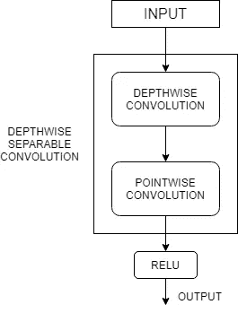**

***作者图片***

**e Xception 作者讨论了激活对 DSC 中深度方向和点方向步骤的影响。并且观察到当没有中间激活时，学习会更快。**

**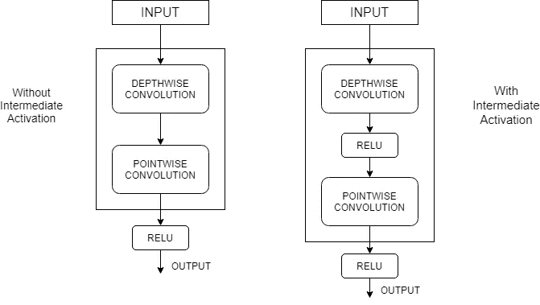**

***作者对带有和不带有中间激活图像的 DSC 的图解***

# **例外架构**

**作者将整个 Xception 架构分成 14 个模块，其中每个模块只是一堆***【DSC】和池层。这 14 个单元分为三组，即入口流、中间流和出口流。并且每个组分别具有四个、八个和两个模块。最后一组，即出口流，可以选择性地在末端具有完全连接的层。*****

> ***注意:架构中的所有 DSC 层都使用 3x3 的滤波器大小、步长 1 和“相同”填充。并且所有的 MaxPooling 层都使用 3x3 内核和步幅 2。***

## ***异常的进入流程***

***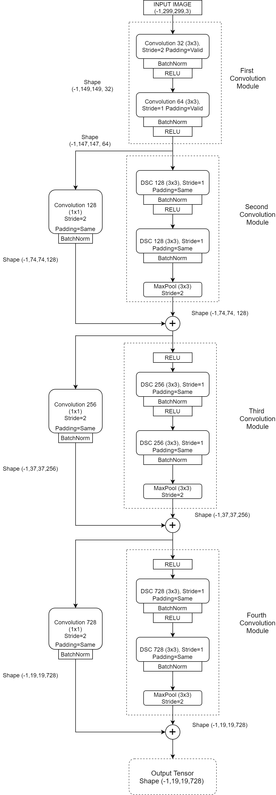***

***作者的 exception-*图片进入流程****

***上图是例外论文中给出的详细版本。乍一看可能有点吓人，但再看看，这非常简单。***

***第一个模块包含常规卷积层，它们没有任何 ***DSC*** 层。它们接受大小为(-1，299，299，3)的输入张量。第一维度的 **-1** 代表批量。负的 **-1** 仅表示批量大小可以是任何值。***

**常规卷积层和 DSC 卷积层之后都有一个批量归一化层。步幅为 2 的卷积将其减少了近一半。输出的形状显示在使用我们之前看到的卷积公式计算的一侧。**

**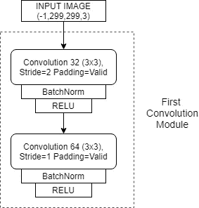**

**入口流中的第一个卷积模块- *作者的图像***

**除了第一个模块，入口流中的所有其他模块都有剩余的跳过连接。并行跳跃连接具有一个逐点卷积图层，该图层被添加到主路径的输出中。**

## **例外的中间流程**

**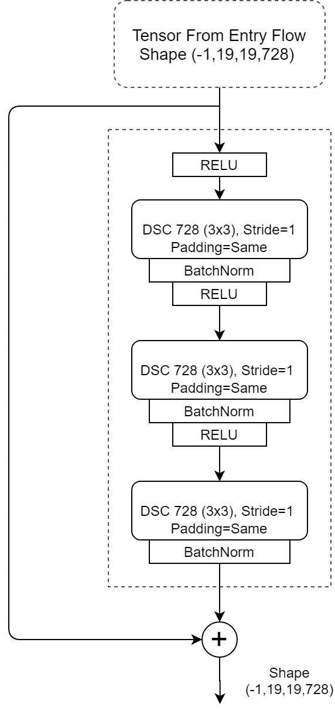**

***作者对中间流图像的说明***

**中间流程中，有 ***八个*** 这样的模块，一个接一个。以上模块重复八次，形成中流。中间流中的所有 8 个模块都使用 1 的步距，并且没有任何池层。因此，从入口流通过的张量的空间大小保持不变。通道深度也保持不变，因为所有中间流模块都有 728 个过滤器。这与输入的深度相同。**

## **例外的出口流量**

**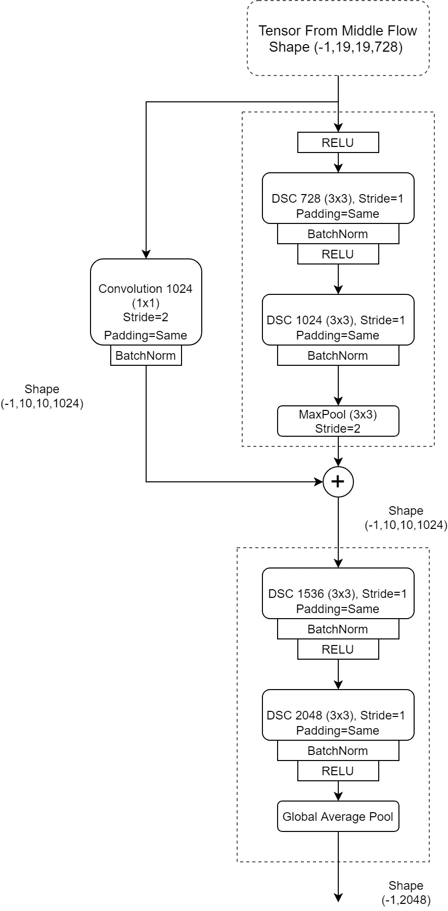**

**退出流程- *作者图片***

**出口流只有两个卷积模块，第二个没有任何跳过连接。第二个模块使用全局平均池，不像前面的模块使用最大池。平均汇集层的输出向量可以直接馈送到逻辑回归层。但是我们也可以选择使用中间全连接层。**

# **综上**

**Xception 模型包含与 Inception V3 几乎相同数量的参数，但是在 ImageNet 数据集上比 Inception V3 略胜一筹。但它在 JFT 图像分类数据集(谷歌的内部数据集)上以更好的优势击败了 Inception V3。在几乎相同的参数数量下表现更好，可以归功于其架构工程。**