# XGBoost

> 原文：<https://towardsdatascience.com/xgboost-b736c2ab10ce?source=collection_archive---------18----------------------->

## [梯度助推器](http://towardsdatascience.com/tagged/the-gradient-boosters)

## 震撼世界的 GBM

来源: [Unsplash](https://unsplash.com/photos/-IZ2sgQKIhM)

现在让我们来解决这个问题——XGBoost。这是梯度推进家族里最受欢迎的堂弟。XGBoost 以其闪电般的速度冲进了现场，几乎一致地扭转了对它有利的局面。很快，通过 XGBoost 的梯度推进成为 Kaggle 竞赛中的王者，很快，它就渗透到了商业世界。

有几项关键创新让 XGBoost 如此有效:

# 显式正则化

与正则化贪婪森林相似，XGBoost 在目标函数中也有一个显式正则项。

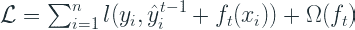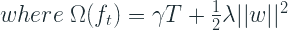

γ是惩罚 *T* 的正则项，即树中叶子的数量，λ是惩罚 *w* 的正则项，即不同叶子的权重。

这是一个比我们在正则化贪婪森林中看到的一些方法简单得多的正则化术语。

# 目标函数不可知的实现

梯度推进算法的关键要素之一是目标函数的梯度或导数。我们之前看到的所有实现都使用了针对特定损失函数的预先计算的梯度公式，从而将算法中可以使用的目标限制为库中已经实现的集合。

XGBoost 使用我们在本系列前一部分讨论过的牛顿-拉夫森方法来逼近损失函数。

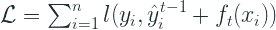

现在，由树结构组成的复杂递归函数可以使用泰勒近似法近似为可微分形式。在梯度推进的情况下，我们采用二阶近似，这意味着我们使用两项——一阶导数和二阶导数——来近似函数。

让，

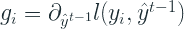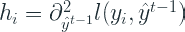

近似损失函数:

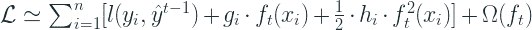

第一项，损失，在树构建阶段 t 是恒定的，因此它不会给优化目标增加任何值。所以去掉它并简化我们得到的，

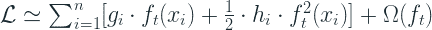

将ω代入正则项，我们得到:

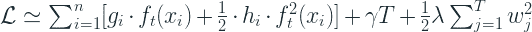

我们正在讨论的 f(x)本质上是一棵具有叶权重 w 的树。因此，如果我们将 Iⱼ定义为叶 j 中的实例集，我们可以将树结构直接代入方程，并简化为:

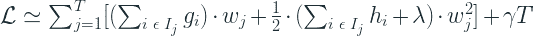

将该等式设为零，我们可以找到 wⱼ的最佳值，如下所示:

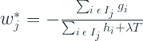

将它放回损失函数并简化，我们得到:

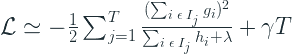

所有这些使我们能够做的是将目标函数从算法的核心工作中分离出来。通过采用这个公式，对目标函数/损失函数的唯一要求是它必须是可微的。具体来说，损失函数应该返回一阶和二阶导数。

参见[此处的](https://xgboost.readthedocs.io/en/latest/parameter.html#learning-task-parameters)获取所有预构建到 XGBoost 中的目标函数列表。

# 树构建策略

树构建策略在某种程度上介于经典梯度推进和正则化贪婪森林之间。传统的梯度增强将每一阶段的树视为一个黑盒，而正则化贪婪森林通过在每一步更新森林的任何部分来在叶子级别上操作。XGBoost 采取了中间立场，认为在前一次迭代中生成的树是神圣不可侵犯的，但是在为任何迭代生成树时，它不使用标准的杂质度量，而是使用我们在树构建过程的上一节中导出的基于梯度的损失函数。在经典的梯度提升中，损失函数的优化发生在树建立之后，而 XGBoost 也在树建立过程中得到优化。

通常不可能列举出所有可能的树形结构。因此，实现了一种贪婪算法，该算法从单叶开始，并基于简化的损失函数迭代地向树添加分支

# 分裂查找算法

树学习的一个关键问题是寻找最佳分裂。通常，我们必须列举所有特征上所有可能的分裂，然后使用杂质标准来选择最佳分裂。这就是所谓的*精确贪婪算法*。它需要大量的计算，尤其是对于连续的和高基数的分类特征。当数据放不进内存时，这也是不可行的。

为了克服这些低效，本文提出了一种近似算法。它首先根据特征的百分位数提出候选分割点。概括地说，算法是:

1.  使用特征的百分位数为所有特征提出候选分割点
2.  将连续要素映射到由候选分割点分割的桶
3.  基于候选分割点聚合所有要素的梯度统计数据
4.  根据汇总统计数据在建议中寻找最佳解决方案

## 加权分位数草图

上面讨论的算法中的一个重要步骤是候选分裂的提议。通常，特征的百分位数用于使候选项在数据上均匀分布。一组以分布式方式快速有效地完成这项工作的算法称为分位数绘制算法。但是在这里，问题有点复杂，因为需要一个加权分位数草图算法，该算法根据梯度对实例进行加权(这样我们就可以从误差最大的实例中学习到最多的东西)。因此他们提出了一种新的数据结构，这种数据结构具有可证明的理论保证。

# 稀疏感知的分裂发现

这是 XGBoost 的另一个关键创新，它来自于现实世界的数据集是稀疏的。这种稀疏性可能有多种原因，

1.  数据中存在缺失值
2.  频繁零值
3.  特征工程的产物，例如一键编码

为此，作者决定使算法意识到稀疏性，以便它能被智能地处理。他们制作的方式简单得令人难以置信。

他们在每个树节点给出了一个默认的方向。即，如果值缺失或为零，则该实例在分支中沿默认方向向下流动。并且从数据中学习最佳默认方向

这项创新有双重好处-

1.  它有助于对丢失的值进行分组，学习处理它们的最佳方式
2.  它通过确保不浪费计算能力来寻找缺失值的梯度统计数据，从而提高了性能。

# 性能改进

梯度推进算法的所有实现的主要缺点之一是它们非常慢。虽然随机森林中的森林创建是开箱即用的，但梯度提升是在旧基础上建立新基础学习者的顺序过程。XGBoost 出名的原因之一是它的速度惊人。它比现有的实现至少快 10 倍，并且由于具有核外学习功能，它能够处理大型数据集。性能改进的主要创新包括:

# 用于并行学习的列块

树学习最耗时的部分是将数据排序。该论文的作者建议将数据存储在内存单元中，称为块。每个块中的数据以[压缩列(CSC)格式](http://netlib.org/linalg/html_templates/node92.html)排序。这种输入数据布局在训练之前计算一次，然后再使用。通过以这种排序格式处理数据，树分裂算法简化为对排序列的线性扫描

# 缓存感知访问

虽然所提出的块结构有助于优化分裂查找的计算复杂度，但是它需要通过行索引间接获取梯度统计。为了克服过程中缓慢的读写操作，作者为每个线程实现了一个内部缓冲区，并在迷你批处理中累积梯度统计信息。当行很大时，这有助于减少运行时开销。

# 核外计算的块

算法的目标之一是充分利用机器的资源。当 CPU 被进程的并行化利用时，可用的磁盘空间被核外学习利用。我们之前看到的这些数据块存储在磁盘上，一个单独的预取线程不断将数据提取到内存中，以便计算继续进行。他们使用两种技术来提高磁盘 I/O 操作的速度

*   数据块压缩，即每个数据块在存储前被压缩，在读取时被动态解压缩。
*   块分片，将一个块分成多个部分，并存储在多个磁盘上(如果有)。并且预取器通过在两个盘之间交替来读取块，由此增加了盘读取的吞吐量。

# 超参数

XGBoost 有很多关于它的文章和博客，涵盖了超参数以及如何调优它们，所以我甚至不打算尝试。

任何超参数的唯一真实来源是官方文档。看着那里长长的超参数列表可能有些吓人，但是在正常的用例中，您不会碰到其中的大多数。

主要的有:

**eta[默认值=0.3，别名:learning_rate]**

*   更新中使用的步长收缩以防止过度拟合。每一步 boosting 后，我们可以直接得到新特征的权重，eta 收缩特征权重，使 boosting 过程更加保守。
*   范围:[0，1]

**伽马[默认值=0，别名:min_split_loss]**

*   在树的叶节点上进行进一步划分所需的最小损失减少。伽玛越大，算法就越保守。
*   范围:[0，∞]

**最大深度[默认值=6]**

*   树的最大深度。增加该值将使模型更加复杂，并且更有可能过度拟合。当 tree_method 设置为 hist 时，0 仅在损失导向增长策略中被接受，并且它指示对深度没有限制。请注意，XGBoost 在训练深度树时会大量消耗内存。
*   范围:[0，∞](当 tree_method 设置为 hist 时，仅在损失导向增长策略中接受 0)

**最小 _ 子 _ 重量[默认值=1]**

*   一个孩子所需的最小体重总和。如果树划分步骤导致实例权重之和小于 min_child_weight 的叶节点，则构建过程将放弃进一步的划分。在线性回归任务中，这仅仅对应于每个节点中需要的最小实例数。min_child_weight 越大，算法就越保守。
*   范围:[0，∞]

**子样本[默认值=1]**

*   训练实例的子样本比率。将其设置为 0.5 意味着 XGBoost 会在生成树之前随机采样一半的训练数据。这将防止过度拟合。子采样将在每个提升迭代中发生一次。
*   范围:(0，1)

**列样本 _ 字节树，列样本 _ by 级别，列样本 _ by 节点[默认值=1]**

*   这是一组用于对列进行二次采样的参数。
*   所有 colsample_by*参数的范围为(0，1)，默认值为 1，并指定要进行二次抽样的列的分数。
*   colsample_bytree 是构造每个树时列的子样本比率。对于每个构建的树，进行一次子采样。
*   colsample_bylevel 是每个级别的列的子样本比率。对于树中达到的每个新的深度级别，进行一次子采样。从为当前树选择的列集中对列进行子采样。
*   colsample_bynode 是每个节点的列的子样本比率(拆分)。每次评估新的分割时，进行一次二次采样。从为当前级别选择的列集中对列进行子采样。
*   colsample_by*参数累积工作。例如，具有 64 个特征的组合{'colsample_bytree':0.5，'colsample_bylevel':0.5，'colsample_bynode':0.5}将在每次分割时留下 8 个特征可供选择。

**lambda[默认值=1，别名:reg_lambda]**

*   关于权重的 L2 正则化项。增加该值将使模型更加保守。

**alpha[默认值=0，别名:reg_alpha]**

*   关于权重的 L1 正则项。增加该值将使模型更加保守。

更新—2020 年 2 月 13 日

# 树木逐叶生长

在发表这篇文章之后，我意识到我还没有谈到 XGBoost 中的一些后续开发，比如逐叶树的生长，以及如何针对新的更快的实现对参数进行微调。

我们将在本系列的下一篇博客中讨论 LightGBM，它实现了逐叶的树增长，这带来了巨大的性能提升。XGBoost 还在基于直方图的树分裂策略中实现了逐叶策略。

逐叶增长策略虽然更快，但如果数据很小，也会更快地过度拟合。因此，通过超参数使用正则化或帽树复杂性是非常重要的。但是如果我们只是像以前一样继续调 *max_depth* 来控制复杂度，那就不行了。 *num_leaves* (控制一棵树的叶子数量)也需要一起调。这是因为在相同的深度下，逐叶树生长算法可以生成更复杂的树。

通过将 *tree_method* 参数设置为“hist”并将 *grow_policy* 参数设置为“lossguide ”,可以在 XGBoost 中启用逐叶树构建

[*中的其他文章*](http://towardsdatascience.com/tagged/the-gradient-boosters)

*   [良好的旧梯度增强](/the-good-old-gradient-boosting-f4614b0e62b0)
*   [正规化的贪婪森林](/regularized-greedy-forest-a17cd0c85f06)
*   [XGBoost](/xgboost-b736c2ab10ce) (你在这里)
*   [LightGBM](/lightgbm-800340f21415)
*   CatBoost

# 参考

1.  贪婪函数近似:一种梯度推进机器。安。统计学家。29 (2001 年)，第 5 号，1189-1232。
2.  陈，田琦&盖斯特林，卡洛斯。(2016).XGBoost:一个可扩展的树提升系统。785–794.10.1145/2939672.2939785.

*原载于 2020 年 2 月 12 日*[*【http://deep-and-shallow.com】*](https://deep-and-shallow.com/2020/02/12/the-gradient-boosters-iii-xgboost/)*。*