# XGBoost 用于多类分类

> 原文：<https://towardsdatascience.com/xgboost-for-multi-class-classification-799d96bcd368?source=collection_archive---------2----------------------->

## 在这篇文章中，我使用 XGBoost 根据客户的个人资料来预测不同的接触点


照片由阿图尔·斯兹比罗在 Shutterstock 上拍摄

客户接触点是你的品牌自始至终的客户接触点。例如，客户可能会通过邮件折扣、短信、电子邮件促销等找到你的业务。根据您公司的营销团队，有许多类型的接触点！

接触点预测是一个类似于客户细分的重要工具，因为如果一个公司的营销工作以接触点更有可能最终购买的特定客户群为目标，它可以更好地服务于该公司的营销工作。通过他们的客户档案，公司将更深入地了解客户的偏好，并针对每个客户执行精确定制的营销材料。

该项目的目的是根据每个客户的个人资料和之前的接触点，预测他们的下一个最佳接触点行动。让我们看看我们需要做些什么！

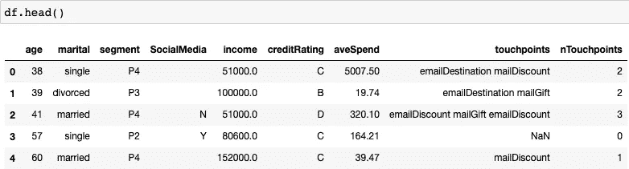

图一。客户数据

当我探索一个数据集时，我喜欢做笔记，这允许我保留一个清单，以便在项目的后期进一步清理/探索。从第一眼看，我们可以看到 SocialMedia 列中缺少值，而在 touch points 列下，我们看到一系列可能导致购买的接触点。

# 数据清理:每个数据科学项目中最重要的一步

检查缺失值和插补！

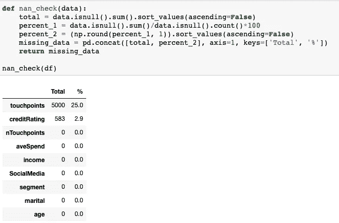

我们看到 25%的条目没有接触点，2.9%的条目没有信用评级。缺少接触点可能意味着客户无需通过任何在线推广链接就可以购买。信用评级的缺失可能会带来新的客户。

我还注意到 SocialMedia 列下缺少的值用空格表示。

处理每列的缺失值:
1。社交媒体—将“”改为“U”(表示未知的社交媒体状态)
2。信用评级—将 NaN 改为“新”(表示新客户)
3 .接触点—我假设接触点是按从左到右的顺序排列的，所以最后一个值是客户在购买前的最近接触点。因此，我将只取最后一个值作为标签，来预测应该为未来的客户分配哪个接触点

```
data = df[df['nTouchpoints']!=0].reset_index().drop('index', axis=1)
data['recent_touchpoint'] = data['touchpoints'].apply(lambda x: x.split()[-1])
data.recent_touchpoint.value_counts()
```

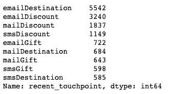

我们标签的接触点价值计数

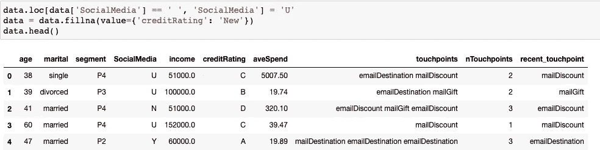

社会媒体和信用评级的估算值

# 数据可视化

我想探究细分变量与数据集中其他变量的关系。一些可能性可以是基于收入、平均支出、信用评级或组合的细分。我们必须检查任何变量之间的多重共线性。多重共线性降低了估计系数的精度，这削弱了我们的回归模型的统计能力。我将用图表和热图来探索这些关系。

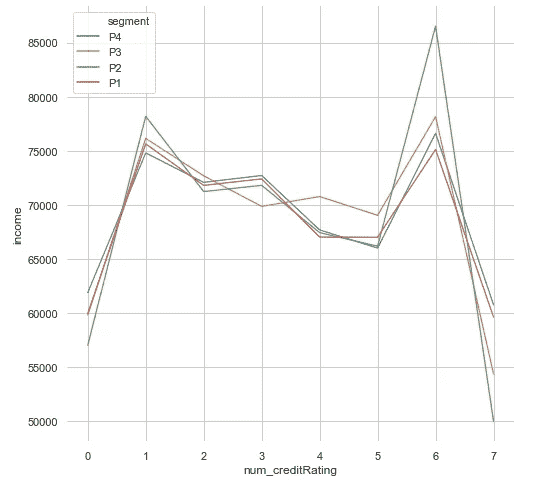

收入图

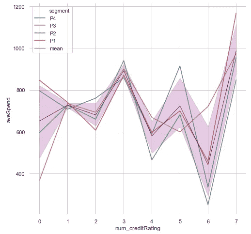

平均支出图

从 P1 到 P4 的每条线图中，我们无法观察到每个信用评级的平均支出的一般模式。紫色线显示了每个信用评级组的平均支出及其 95%的置信区间。比较两个图，似乎信用等级为 6 的高收入者比其他人花费少，信用等级为 7 的低收入者比其他人花费多。

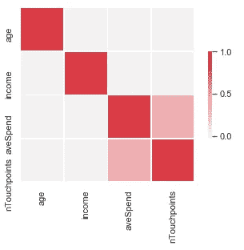

共线性图

我们看到接触点的数量与平均支出高度相关，但是相关性低于 0.5。由于多重共线性的程度并不严重，所以我将保持变量不变。

# 数据探索

当您构建模型时，偏态分布可能是一个棘手的问题，尤其是在有异常值的情况下。检查异常值的最好方法是绘制分布图！机器学习的一般规则是确保我们所有的数值变量都在大致相同的范围内，并且呈正态分布，因此我们必须进行标准化/规范化。

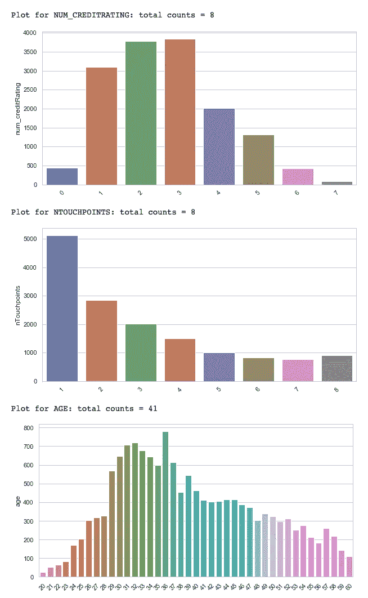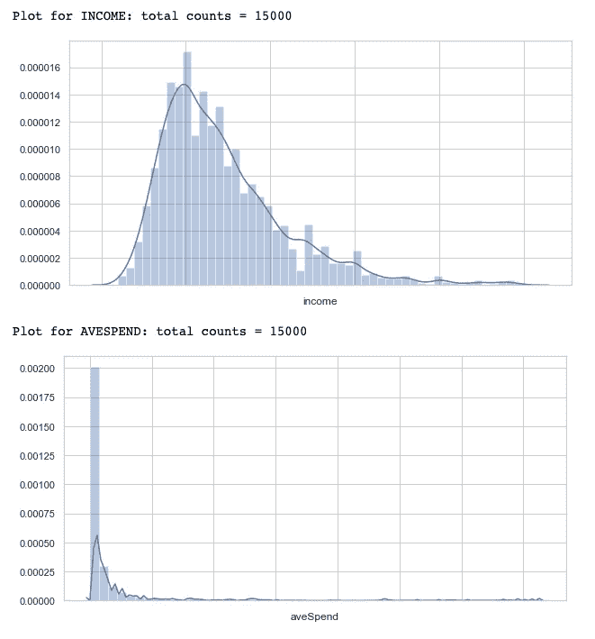

我做的一些观察:

1.年龄分布看起来呈正态分布，略微偏左
2。已婚>单身>离异>未知客户数量。
3。对于细分市场和社交媒体，每个类别中的客户数量大致相同。
4。不同信用等级的客户分布看起来很正常，只是稍微有点偏右。
5。大多数顾客只经过一个接触点
6。收入分配看起来很正常。
7。平均支出分布可以被认为是指数分布，但显然有异常值，我们必须处理。

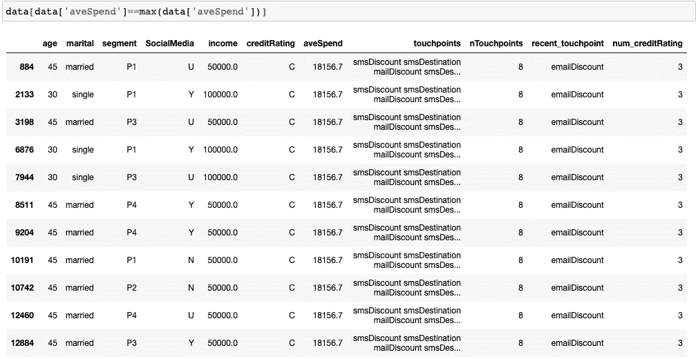

支出中的异常值

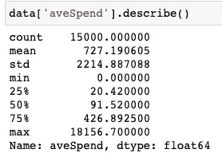

我删除了所有收入为 18156.7 美元的客户，因为我们的平均支出仅为 91.52 美元，远远低于最大值。将它们留在数据中只会扭曲我们的支出分布。移除异常值时，我们必须确保平均值/中值不会受到很大影响，并注意我们不会引入任何偏差。

请注意，所有 3 个变量的最大-最小范围互不相同。当我们做进一步的分析时，比如多元线性回归，归因收入会由于其更大的值而内在地影响结果。因此，重要的是将数据标准化和规范化，使所有变量都在同一范围内。

我使用一个稳健的定标器(QuantileTransformer):类似于归一化，但它使用四分位数范围，所以它对异常值是稳健的。

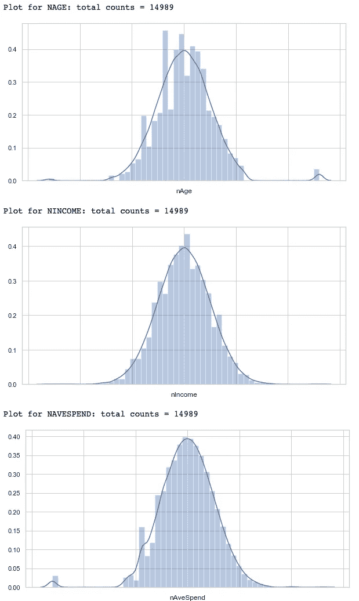

标准化数值变量

# 为模型构建准备数据

我们使用一次性编码将分类变量(婚姻、细分、社交媒体、信用评级)转换为二进制变量。我们可以使用来自 sklearn 的内置 OneHotEncoder 中的[,但是出于同样的目的，我选择编写自己的函数！](https://scikit-learn.org/stable/modules/generated/sklearn.preprocessing.OneHotEncoder.html)

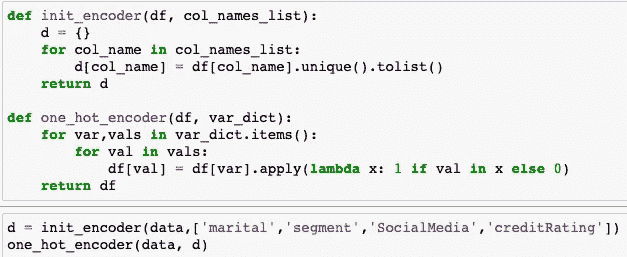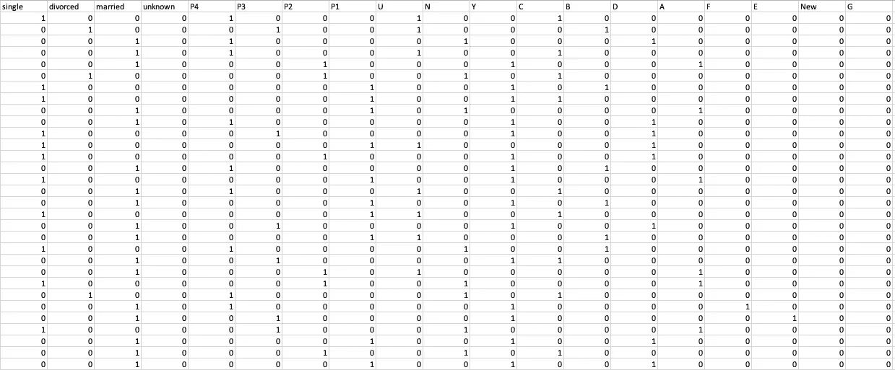

一个热编码分类变量

现在我们的数值变量遵循正态分布。我们将开始使用最近的接触点来标记我们的数据。让我们看看在我们的数据中有多少可能的标签。

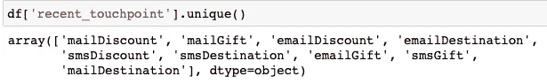

创建从标签到唯一整数的映射，反之亦然，以便稍后进行标签和预测

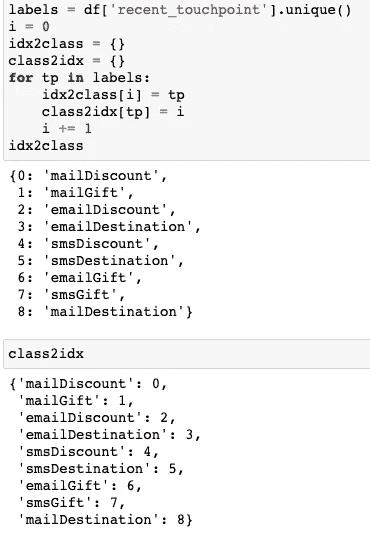

对于我们的模型数据，选择我们希望在模型中使用的列，我将使用分层抽样来检索它们。关于分层抽样的更多细节，我在之前的帖子中解释了这个过程——[Keras，告诉我我的书的类型。](/keras-tell-me-the-genre-of-my-book-a417d213e3a1)

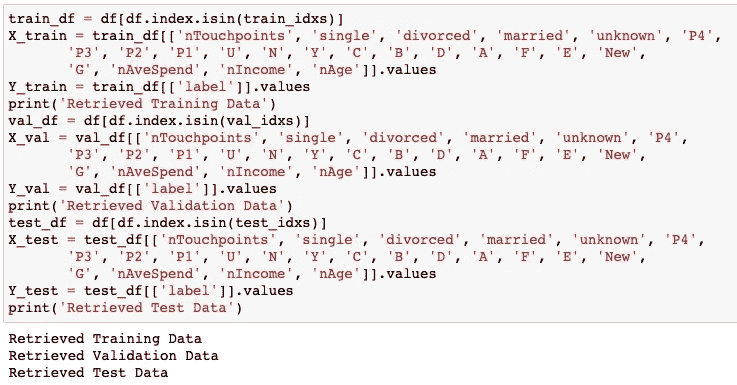

# 用 GridSearchCV 建模和调优

作为基线模型，我使用随机森林。**基线**是一种使用启发式、简单汇总统计、随机性或机器学习来为数据集创建预测的方法。你可以使用这些预测来衡量**基线的**性能(例如，准确性)——这个指标将成为你与任何其他机器学习算法进行比较的标准。在这种情况下，我使用多类逻辑损失，因为我们预测下一个接触点的概率，我想找到所有概率分布之间的平均差异。此外，我还使用了微型 F1 分数，因为我们的标签类别不平衡。

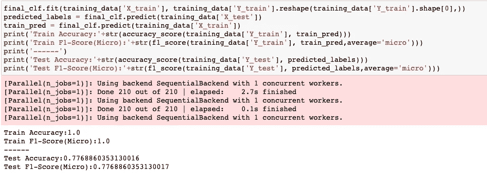

随机森林模型的结果

我选择随机森林分类器只是因为它运行速度快，并且我能够使用 GridSearchCV 高效地迭代到可能的最佳模型。在用 GridSearchCV 初始化和调整我的 RandomForestClassifier 模型之后，我得到了 1.0 的训练精度和 0.77688 的测试精度，这表明过度拟合。

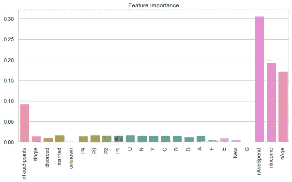

我们的随机森林分类器似乎更关注平均支出、收入和年龄。

# XGBoost

[XGBoost](https://xgboost.ai/) 是一种基于决策树的集成机器学习算法，使用了[梯度提升](https://en.wikipedia.org/wiki/Gradient_boosting)框架。在涉及非结构化数据(图像、文本等)的预测问题中。)人工神经网络往往优于所有其他算法或框架。然而，当涉及到中小型结构化/表格数据时，基于决策树的算法目前被认为是同类最佳的。

XGBoost 的实现为模型调优、计算环境和算法增强提供了几个高级特性。它能够执行三种主要形式的梯度增强(梯度增强(GB)、随机 GB 和正则化 GB)，并且足够健壮以支持微调和增加正则化参数。

这种集成方法试图基于先前的“较弱”分类器来创建强分类器。通过迭代地在彼此之上添加模型，前一个模型的误差被下一个预测器校正，直到训练数据被模型准确地预测或再现。长话短说，我们正在使用梯度下降更新模型！XGBoost 一直是赢得许多 Kaggle 比赛的秘密秘诀，所以现在你知道为什么这种方法在机器学习爱好者中如此受欢迎了。

对于我们最初的模型，这是我得到的结果。

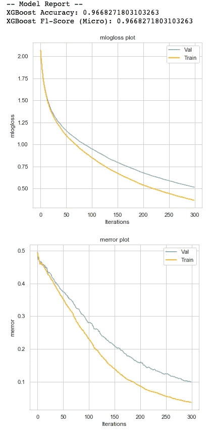

正如我们所看到的，XGBoost 在第一次模型迭代中已经超越了 Random Forest。让我们开始微调我们的模型，尽管我不会详细介绍如何调整我的模型。关于逐步调谐的更多信息可以在[这里](https://www.analyticsvidhya.com/blog/2016/03/complete-guide-parameter-tuning-xgboost-with-codes-python/)找到！

我调整的参数:

min_child_weight:一个节点可以表示的最小样本数，以便进一步拆分

max_depth:调整这个来避免我们的树长得太深而导致过度拟合

reg_alpha:规范化程度

# 最终模型

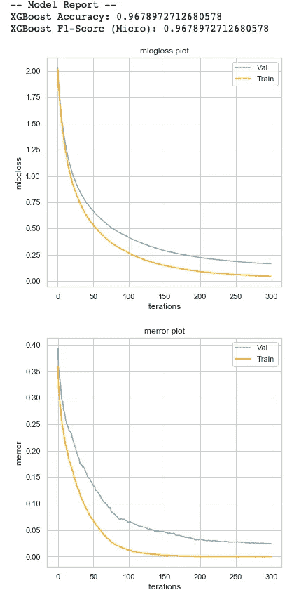

与我们的 XGBoost 模型的第一次迭代相比，我们设法在准确性和微观 F1 分数方面略有提高。我们实现了更低的多级物流损失和分类错误！

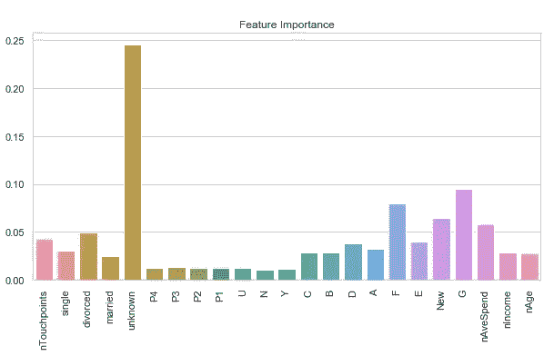

我们看到高特征重要性分数被分配给“未知”婚姻状态。这可能是因为只有 44 个客户的婚姻状况“未知”，因此为了减少偏差，我们的 XGBoost 模型为“未知”特征分配了更多的权重。

如果我有足够的计算能力，我会调整 gamma，subsample 和 colsample_bytree 以及学习率。由于时间有限，我只关注 max_depth 和 reg_alpha(应用正则化来减少过度拟合)。试一试，用参数玩一玩！

完整的代码实现可以在我的 Github [这里](https://github.com/ernestng11/touchpoint-prediction)找到！

感谢您阅读我的文章。如果我能得到关于如何改进我的数据科学项目的评论，我将不胜感激，我也一直希望与任何对机器学习感兴趣的人合作:)

干杯！