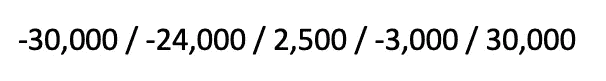
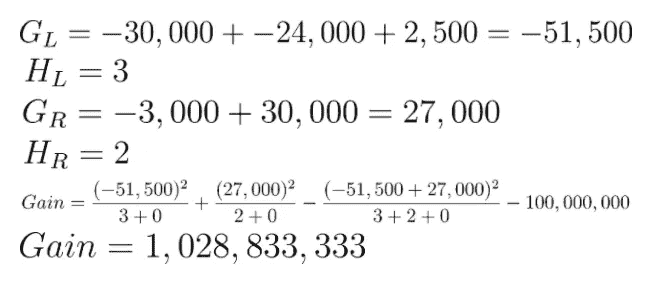
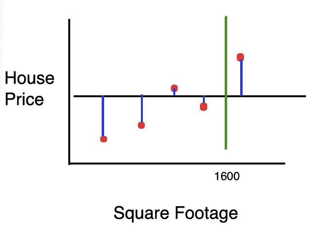
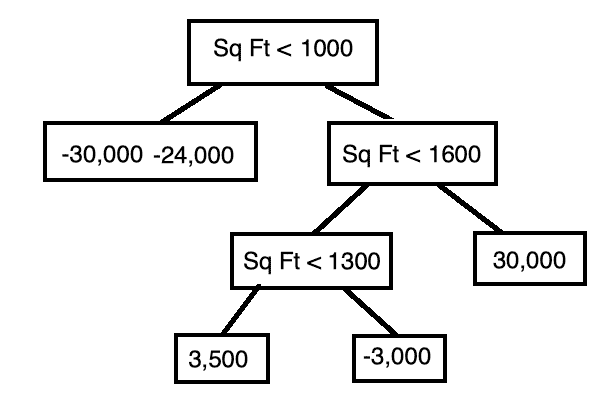
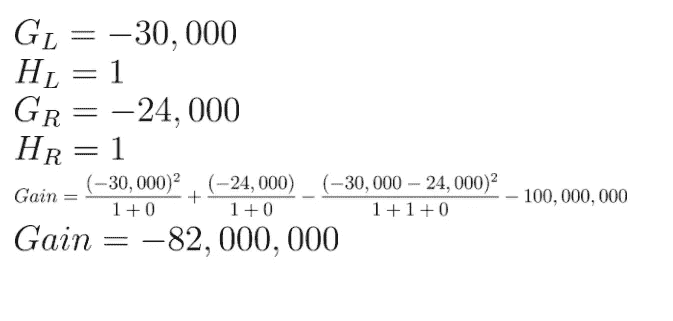

# XGBoost Python 示例

> 原文：<https://towardsdatascience.com/xgboost-python-example-42777d01001e?source=collection_archive---------4----------------------->


[杰拉尔特](https://pixabay.com/users/geralt-9301/)皮克斯贝

XGBoost 是 Extreme Gradient Boost 的缩写(我写过一篇文章提供了渐变提升的要点[这里](/machine-learning-part-18-boosting-algorithms-gradient-boosting-in-python-ef5ae6965be4))。与渐变增强不同，XGBoost 利用正则化参数来帮助防止过度拟合。

假设我们想要构建一个模型来预测给定平方英尺的房子的价格。


我们从一个任意的初始预测开始。在回归的情况下，这可以是平均值，在分类的情况下，这可以是 0.5。


对于每个样本，我们用下面的公式计算残差。

> *残差=实际值—预测值*

假设，应用公式后，我们最终得到以下残差，从左到右开始采样。



接下来，我们使用线性扫描来决定沿给定特征(平方英尺)的最佳分割。线性扫描意味着我们在第一对点(它们的平均值)之间选择一个阈值，然后在下一对点(它们的平均值)之间选择一个阈值，以此类推，直到我们探索了所有的可能性。

在我们的例子中，我们从选择阈值 500 开始。


对应的树是:


注意每片叶子中的值是怎样的残差。也就是自变量的预测值和实际值之差，而不是给定样本的房价。

为了比较分割，我们引入了*增益*的概念。增益是由分割带来的精度提高。增益计算如下。


在哪里


λ和γ都是超参数。Lambda 是一个正则化参数，可降低预测对单个观测值的敏感度，而 Gamma 是在树的叶节点上进行进一步划分所需的最小损失减少量。

比方说，我们任意地将λ和γ设置为如下。


我们可以继续计算初始分割的增益。


我们继续计算对应于剩余排列的增益。



然后，我们使用产生最大增益的阈值。在这种情况下，最佳阈值是**平方英尺< 1000** 。因此，我们以下面的树结束。


我们对每片叶子重复这个过程。也就是说，我们选择一个阈值来


当增益为负时，这意味着分割不会产生比我们让树保持原样的情况下更好的结果。

我们仍然需要检查在分割树叶时使用的不同阈值不会提高模型的准确性。


增益为正。因此，我们仍然受益于进一步拆分树。这样做，我们得到了下面的树。


我们检验了将样本面积在 1，000 平方英尺和 1，600 平方英尺之间的进行拆分是否有益。



增益为负。因此，我们让这棵树保持原样。


我们仍然需要检查是否应该分割左边的叶子(平方英尺< 1000)。



同样，增益为负。因此，最终的决策树是:


当提供样本时，决策树必须返回单个标量值。因此，我们使用下面的公式，该公式考虑了单个叶节点中的多个残差。


第一个预测是初始预测和树的预测之和乘以学习率。


假设学习率为 0.5，该模型做出以下预测。


新的残差是:


然后，我们使用这些残差构建另一个决策树，并重复这个过程，直到我们达到最大估计数(默认为 100)。一旦我们完成了模型的训练，XGBoost 模型作为一个整体所做的预测就是初始预测和每个决策树所做的预测之和乘以学习率。


# Python 代码

与其他机器学习模型不同，XGBoost 不包含在 Scikit-Learn 包中。因此，

XGBoost 库有很多依赖项，这使得安装它成为一场噩梦。你很幸运，我经历了那个过程，所以你不必经历。到目前为止，安装 XGBoost 最简单的方法是安装 Anaconda(如果您还没有安装)并运行以下命令。

```
conda install -c conda-forge xgboostconda install -c anaconda py-xgboost
```

一旦安装了 XGBoost，我们就可以继续导入所需的库。

```
import pandas as pd
import xgboost as xgb
from sklearn.datasets import load_boston
from sklearn.model_selection import train_test_split
from sklearn.metrics import mean_squared_error
```

就像上面的例子一样，我们将使用 XGBoost 模型来预测房价。我们使用 Scikit-Learn API 将波士顿房价数据集加载到笔记本中。

```
boston = load_boston()
X = pd.DataFrame(boston.data, columns=boston.feature_names)
y = pd.Series(boston.target)
```

我们使用 head 函数来检查数据。

```
X.head()
```


以下是不同特性及其缩写的列表。

*   按城镇分列的人均犯罪率
*   ZN 面积超过 25，000 平方英尺的住宅用地比例
*   每个城镇非零售商业英亩数的比例
*   CHAS Charles River 虚拟变量(= 1，如果区域边界为河流；否则为 0)
*   氮氧化物浓度(百万分之一)
*   RM 每个住宅的平均房间数
*   1940 年以前建造的自有住房的年龄比例
*   DIS 加权到五个波士顿就业中心的距离
*   放射状公路可达性指数
*   每 10，000 美元征收全价值财产税
*   按城镇分列的师生比例
*   B 1000(Bk — 0.63)，其中 Bk 是按城镇划分的黑人比例
*   LSTAT %较低的人口地位
*   以千美元为单位的 MEDV 自有住房中值

为了评估我们模型的性能，我们将数据分为训练集和测试集。

```
X_train, X_test, y_train, y_test = train_test_split(X, y)
```

接下来，我们初始化 XGBRegressor 类的一个实例。我们可以选择λ和γ的值，以及估计器的数量和最大树深度。

```
regressor = xgb.XGBRegressor(
    n_estimators=100,
    reg_lambda=1,
    gamma=0,
    max_depth=3
)
```

我们使我们的模型适合训练集。

```
regressor.fit(X_train, y_train)
```

在决定房价时，我们可以检查每个特征的相对重要性。

```
pd.DataFrame(regressor.feature_importances_.reshape(1, -1), columns=boston.feature_names)
```


正如我们所看到的，低阶层人口的比例是房价的最大预测因素。

最后，我们用我们的模型预测了波士顿的一所房子的价格。

```
y_pred = regressor.predict(X_test)
```

我们使用均方差来评估模型的性能。均方误差是预测值和实际值的平方之差的平均值。

```
mean_squared_error(y_test, y_pred)
```

