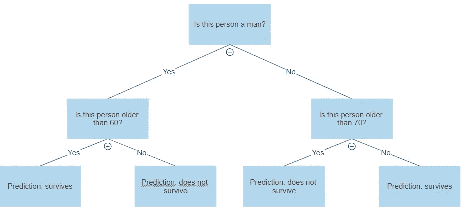
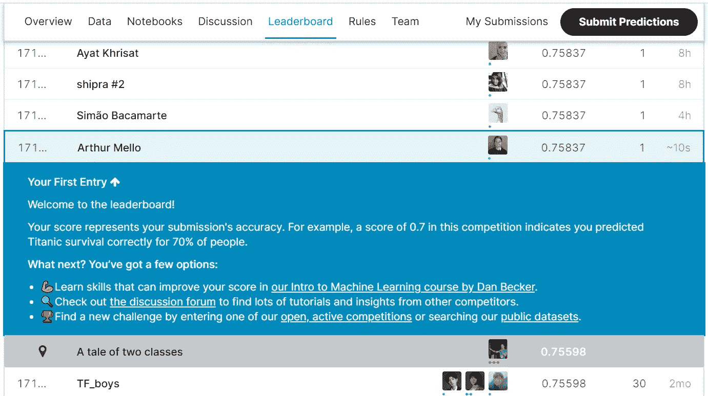

# XGBoost:理论与实践

> 原文：<https://towardsdatascience.com/xgboost-theory-and-practice-fb8912930ad6?source=collection_archive---------9----------------------->


Marc-Olivier Jodoin 在 [Unsplash](https://unsplash.com?utm_source=medium&utm_medium=referral) 上拍摄的照片

## 了解最流行的算法之一是如何工作的，以及如何使用它

# 介绍

XGBoost 代表 e**X**treme**G**radient**Boost**ing，它是**梯度提升树**算法的开源实现。由于其预测能力和易用性，它已经成为 Kaggle 竞赛中最受欢迎的机器学习技术之一。它是一种**监督学习**算法，可用于**回归**或**分类**任务。

不管它的未来主义名称如何，只要我们先过几个概念，它其实并没有那么难理解:**决策树**和**梯度提升**。如果你已经熟悉了这些，可以直接跳到“**XGBoost 如何工作**”。

# 决策树

决策树可以说是你能找到的最容易解释的 ML 算法，如果与正确的技术结合使用，可能会非常强大。

决策树有这个名字是因为它的视觉形状，看起来像一棵树，有一个根和许多节点和叶子。想象一下，你有一份泰坦尼克号幸存者的名单，上面有一些信息，比如他们的年龄和性别，还有一个二元变量告诉你谁在灾难中幸存，谁没有。您现在想要创建一个分类模型，根据这些数据来预测谁将幸存下来。一个非常简单的例子是这样的:



作者图片

正如您所看到的，决策树只是一系列简单的决策规则，这些规则组合在一起，产生了对所需变量的预测。

# 梯度推进

**Boosting** 是一种**集成方法**，这意味着它是一种将几个模型的预测组合成一个模型的方法。它是通过依次获取每个预测值并基于其前任的误差对其建模(对表现更好的预测值给予更大的权重)来实现的:

1.  使用原始数据拟合第一模型
2.  使用第一模型的残差拟合第二模型
3.  使用模型 1 和模型 2 的总和创建第三个模型

**梯度增强**是一种特定类型的增强，之所以这样称呼是因为它使用**梯度下降算法**来最小化损失函数。

# XGBoost 如何工作

既然您已经理解了**决策树**和**梯度提升**，那么理解 **XGBoost** 就变得容易了:它是一种梯度提升算法，使用决策树作为其“弱”预测器。除此之外，它的实现是专门为优化**性能**和**速度**而设计的。

从历史上看，XGBoost 对于**结构化**表格数据表现得相当好。如果您正在处理**非结构化**数据，如图像，**神经网络**通常是更好的选择。

# 超参数

实现 XGBoost 时要选择哪些最重要的超参数，如何调优？

## 助推器

`booster`是 boosting 算法，有三种选择:`gbtree`、`gblinear`或`dart`。默认选项是`gbtree`，这是我在本文中解释的版本。`dart`是一个类似的版本，它使用 dropout 技术来避免过度拟合，而`gblinear`使用广义线性回归来代替决策树。

## 寄存器 _alpha 和寄存器 _lambda

`reg_alpha`和`reg_lambda`分别是 L1 和 L2 的正规化术语。这些数字越大，模型就越保守(不容易过度拟合，但可能会遗漏相关信息)。两者的推荐值都在 0-1000 之间。

## 最大深度

`max_depth`设置决策树的最大深度。这个数字越大，模型就越不保守。如果设置为 0，那么树的深度没有限制。

## 子样品

`subsample`是训练预测器时使用的样本比率的大小。默认值为 1，表示没有采样，我们使用全部数据。例如，如果设置为 0.7，则 70%的观测值将被随机采样以用于每次提升迭代(每次迭代取一个新样本)。这有助于防止过度拟合。

## 数量估计者

`num_estimators`设置助推轮数，等于设置要使用的助推树数。这个数字越大，过度拟合的风险就越大(但是低数字也会导致低性能)。

# 如何使用 XGBoost

为了展示 XGBoost 在实践中是如何工作的，让我们做一个简单的练习，使用 Python 实际预测 Kaggle 比赛中的泰坦尼克号幸存者。

从 Kaggle 下载我们的数据后，我们将导入所有必要的库和我们的训练数据:

```
**IN:** import pandas as pd
from xgboost import XGBClassifier
from sklearn.model_selection import train_test_split
from sklearn.metrics import accuracy_scoredf = pd.read_csv("C:/Users/p005520/Downloads/titanic/train.csv")
```

请注意`from xgboost import XGBClassifier`。这仅仅是因为我们已经通过从终端运行`pip install xgboost`在我们的计算机上安装了 xgboost。`XGBClassifier`用在这里是因为这是一个分类问题。对于回归问题，用`XGBRegressor`代替。用于处理数据和计算性能指标的其他库。

```
**IN:**
dummies = pd.get_dummies(df['Sex'])
df = pd.concat([df, dummies], axis=1)X = df[[‘Age’,’female’,’male’]]
y = df[‘Survived’]seed = 42
test_size = 0.3
X_train, X_test, y_train, y_test = train_test_split(X, y, test_size=test_size, random_state=seed)
```

我们的数据中有许多变量，但这一次，我们将坚持上一个示例中的两个变量:“性别”和“年龄”。

这个程序块的前两行从“Sex”中创建虚拟变量。这需要将“性别”从*字符串*转换为*整数*，成为两个不同的变量:“男性”和“女性”，根据乘客的性别，这两个变量等于 1 或 0。

接下来的两行定义了我们的目标变量(“存活”)和我们将用于预测它的变量。最后 4 行用于分割我们的训练集和测试集:我们的训练集将用于创建我们的 XGBoost 模型，而测试集将用于测量它的性能。

```
**IN:** model = XGBClassifier(subsample = 0.7, max_depth = 4)
model.fit(X_train, y_train)
print(model)y_pred = model.predict(X_test)accuracy = accuracy_score(y_test, y_pred)
print(“Accuracy: %.2f%%” % (accuracy * 100.0))**OUT:** XGBClassifier(base_score=0.5, booster='gbtree', colsample_bylevel=1,
              colsample_bynode=1, colsample_bytree=1, gamma=0,
              learning_rate=0.1, max_delta_step=0, max_depth=4,
              min_child_weight=1, missing=None, n_estimators=100, n_jobs=1, nthread=None, objective='binary:logistic', random_state=0,
              reg_alpha=0, reg_lambda=1, scale_pos_weight=1, seed=None,silent=None, subsample=1, verbosity=1)Accuracy: 80.60%
```

这里是我们实际训练 XGBoost 的地方，在前两行。注意`subsample = 0.7`和`max_depth = 4`，这里我手动定义了一些超参数。如果您想设置不同于默认选项的新超参数，只需将它们添加到列表中。我们的模型在测试集中产生了 80.6%的准确率，现在让我们看看如何将它应用于新数据:

```
submission_input = pd.read_csv("C:/Users/p005520/Downloads/titanic/test.csv")dummies = pd.get_dummies(submission_input[‘Sex’])
submission_input = pd.concat([submission_input, dummies], axis=1)submission_X = submission_input[[‘Age’,’female’,’male’]]submission = model.predict(submission_X)
submission_df = pd.DataFrame({‘PassengerId’:submission_input[‘PassengerId’],
 ‘Survived’:submission})
submission_df.to_csv(‘submission.csv’, index = False)
```

在这个模块中，我们导入了 Kaggle 的提交文件，进行了与我们的训练集相同的虚拟处理，用`model.predict(submission_X)`应用了我们训练过的预测器，然后将其保存到 csv。它在 Kaggle 的排行榜上得分如何？



作者图片

正如你所看到的，我们离排行榜的顶端还很远，但我们仍然成功地预测了 76%的人的存活率，只使用了两个特征，没有特征工程和没有超参数调整，这将是我们工作的逻辑下一步。

我希望您现在理解了 XGBoost 是如何工作的，以及如何将它应用到真实数据中。尽管 XGBoost 具有固有的性能，但是**超参数调整**和**特征工程**可以使您的结果产生巨大的差异。

如果你想了解更多关于**特征工程**的知识来改进你的预测，你应该阅读这篇文章，它概述了你可以用来转换你的变量和创建新变量的主要技术:

[](/feature-engineering-3a380ad1aa36) [## 特征工程

### 了解数据科学工作流程中最重要的步骤

towardsdatascience.com](/feature-engineering-3a380ad1aa36) 

> *随时联系我* [*LinkedIn*](https://www.linkedin.com/in/melloarthur/) *如果你想进一步讨论，这将是一种荣幸(老实说)。*