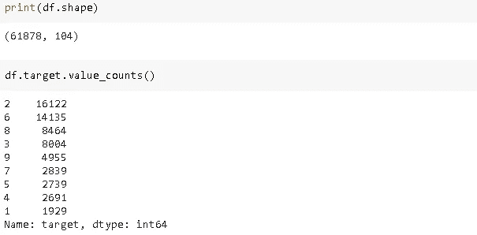
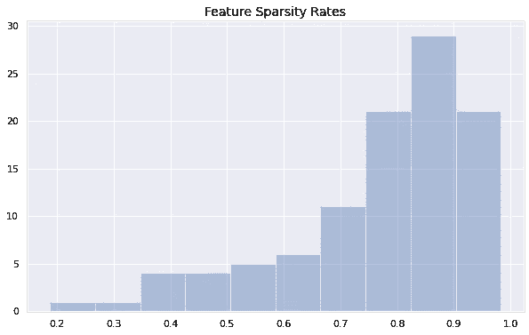
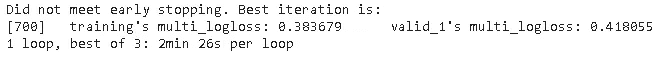
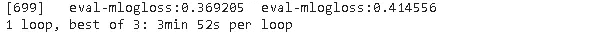

# 高维数据集上的 XGBoost 与 LightGBM

> 原文：<https://towardsdatascience.com/xgboost-vs-lightgbm-on-a-high-dimensional-dataset-bbd5b5174274?source=collection_archive---------25----------------------->

## 速度和性能的比较


乔希·卡拉布雷斯在 [Unsplash](https://unsplash.com/s/photos/speed?utm_source=unsplash&utm_medium=referral&utm_content=creditCopyText) 上的照片

我最近完成了一个多类分类问题，作为一个数据科学家职位的家庭作业。这是比较梯度推进决策树的两种最新实现 XGBoost 和 LightGBM 的好机会。

这两种算法都非常强大，在性能最好的机器学习模型中非常突出。

该数据集包含超过 6 万个观测值和 103 个数值特征。目标变量包含 9 个不同的类。



(图片由作者提供)

由于这篇文章的重点是 XGBoost 和 LightGBM 的比较，所以我将跳过探索性的数据分析和数据争论部分。我已经设法消除了 11 个特征和大约 2000 个异常值。

值得注意的是，数据争论过程中应用的所有技术都是在训练集和测试集分离后完成的。否则，我们将不得不处理数据泄露，这是机器学习中的一个严重问题。

特征空间是高度稀疏的(即特征大部分由零组成)。下面是显示特征稀疏率的直方图。



(图片由作者提供)

# **LightGBM**

由微软研究人员创建的 LightGBM 是梯度推进决策树(GBDT)的一种实现。在 LightGBM 之前，GBDT before 的现有实现会随着实例或特性数量的增加而变慢。LightGBM 旨在解决这个效率问题，尤其是对于大型数据集。

LightGBM 使用两种技术来解决大型数据集的效率问题:

*   梯度单侧采样
*   EFB(独家功能捆绑)

如果你想了解更多，我有一篇关于 LightGBM 如何使用这些技术的独立文章:

[](/understanding-the-lightgbm-772ca08aabfa) [## 了解光 GBM

### 是什么让它更快更高效

towardsdatascience.com](/understanding-the-lightgbm-772ca08aabfa) 

让我们回到我们的实现。LightGBM 要求数据采用特定的格式，因此我们使用 Dataset 函数。

```
import lightgbm as lgblgb_train = lgb.Dataset(X_train, y_train)
lgb_test = lgb.Dataset(X_test, y_test)
```

超参数在 LightGBM 和 XGBoost 的性能中起着关键作用。您可能需要花费大量时间来调优超参数。最终，你会创造出你自己的方法或策略来加速调整的过程。

有很多超参数。有些在准确性和速度方面更重要。其中一些主要用于防止过度拟合。

超参数可以作为字典传递给模型。这些超参数给了我最好的参数。

```
params = {
'boosting_type': 'gbdt',
'objective': 'multiclass',
'metric': 'multi_logloss',
'num_class':9,
'max_depth':9,
'num_leaves': 100,
'min_data_in_leaf':300,
'learning_rate': 0.03,
'feature_fraction': 0.7,
'bagging_fraction':0.8,
'bagging_freq':10,
'lambda_l1': 1,
'verbose': 0
}
```

没有严格的规则来定义最佳超参数值。这更像是一个受过教育的试错过程。如果你知道一个特定的超参数是做什么的，调优过程将比尝试随机值更有效。

**超参数**

*   Max_depth:单棵树的最大深度。
*   Num_leaves:它控制一棵树的叶子数量。LightGBM 使用逐叶的树生长算法，因此 num_leaves 是控制树复杂度的主要参数。
*   Min_data_in_leaf:它表示一片叶子上所需的最小样本数(即观察值),这对控制过拟合非常重要。
*   Feature_fraction:在每个节点随机选择的要素的比率。
*   Bagging_fraction 和 bagging_freq 也有助于避免过度拟合。

LightGBM 超参数的完整列表可以在[这里](https://lightgbm.readthedocs.io/en/latest/Parameters.html)找到。

我们现在可以训练模型了。下面的代码块使用定型集对模型进行定型，并在定型集和验证集上评估模型的性能。

```
%%timeitgbm = lgb.train(params, lgb_train, num_boost_round=700,
valid_sets=[lgb_train, lgb_test], early_stopping_rounds=10)
```



训练集和验证集的对数损失分别为 0.383 和 0.418。执行训练平均需要 2 分 26 秒。

您可以在这些模型上实现非常低的损耗，但这会导致过度拟合。更重要的是在训练和测试精度方面有一个平衡的模型。此外，任务的目标是实现 0.41 的对数损失。

这是一个很好的实践，摆弄超参数值，看看它们对精度和过度拟合的影响。

# **XGBoost**

[XGBoost](https://xgboost.readthedocs.io/en/latest/index.html) 是 GBDT 算法的一个实现。它的效率如此之高，以至于统治了 Kaggle 上的一些主要比赛。

对于 XGBoost，数据集也应该以特定的方式进行格式化。

```
dtrain = xgb.DMatrix(X_train, y_train)
dtest = xgb.DMatrix(X_test, y_test)
```

XGBoost 还有许多超参数，需要正确地进行调整，以便创建一个健壮而准确的模型。这里是我发现的超参数值，可以达到令人满意的结果，同时还可以最小化过度拟合。

```
import xgboost as xgbparams_xgb = {
'boosting_type': 'dart',
'objective':'multi:softmax',
'num_class':9,
'max_depth':7,
'min_child_weight':20,
'gamma':1,
'subsample':0.8,
'colsample_bytree':0.7,
'tree_method':'hist',
'eval_metric':'mlogloss',
'eta':0.04,
'alpha': 1,
'verbose': 2
}
```

**超参数**

*   Max_depth:一棵树的最大深度。
*   Min_child_weight:一个孩子所需的实例权重的最小总和。将它保持在较高的位置可以防止孩子过于具体，从而有助于避免过度适应。
*   Gamma:在树的叶节点上进行进一步划分所需的最小损失减少。同样，游戏越大，模型越不可能过度拟合。
*   子样本:在生长树之前随机选择的行的比率。子样也可以用来避免过度拟合。
*   Eta:学习率。保持较高的值会使模型快速学习，但同时也会增加过度拟合的机会。
*   α:L1 正则化项。

XGBoost 的整个超参数列表可以在[这里](https://xgboost.readthedocs.io/en/latest/parameter.html)找到。

我们现在可以训练我们的模型了。我们传递参数、训练集和要运行的回合数。您可以增加回合数并获得更好的精度，但总是有过度拟合的风险。

```
%%timeitbst = xgb.train(
params_xgb, dtrain , 700, 
evals=[(dtrain,'eval'),(dtest, 'eval')], 
verbose_eval=True
)
```



训练集和验证集的对数损失分别为 0.369 和 0.415。执行训练平均需要 3 分 52 秒。

# **结论**


LightGBM


XGBoost

损失非常接近，因此我们可以得出结论，就准确性而言，这些模型在具有所选超参数值的数据集上表现大致相同。

在速度方面，LightGBM 比 XGBoost 快 40%。

感谢您的阅读。如果您有任何反馈，请告诉我。