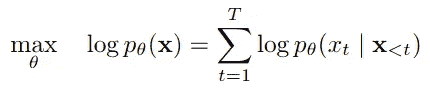
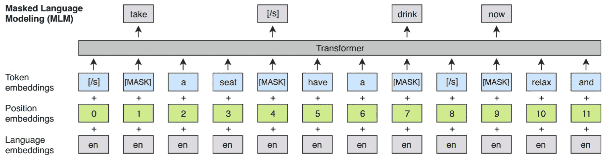
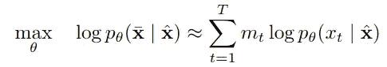
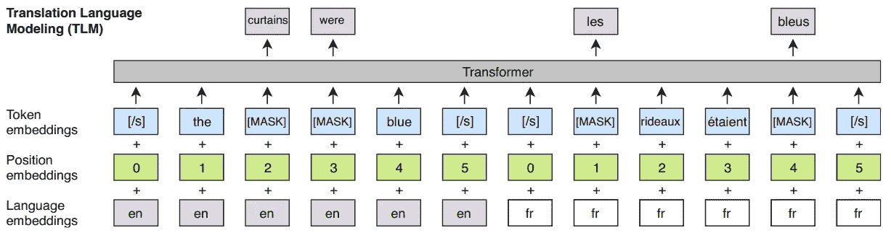

# XLM:跨语言语言模型

> 原文：<https://towardsdatascience.com/xlm-cross-lingual-language-model-33c1fd1adf82?source=collection_archive---------28----------------------->

## 了解基于变压器的自监督架构

莱昂纳多·大久保俊郎在 [Unsplash](https://unsplash.com?utm_source=medium&utm_medium=referral) 上的照片

像伯特这样的模特([德夫林等人。艾尔。](https://arxiv.org/abs/1810.04805))或 GPT ( [拉德福德等人。艾尔。在语言理解方面达到了最先进的水平。然而，这些模型仅针对一种语言进行预训练。最近，已经做出努力来减轻单语表示并建立通用的跨语言模型，该模型能够将任何句子编码到共享的嵌入空间中。](https://s3-us-west-2.amazonaws.com/openai-assets/research-covers/language-unsupervised/language_understanding_paper.pdf)

在这篇文章中，我们将讨论由艾提出的论文。作者提出了两种跨语言语言建模的方法:

1.  无人监管，依赖单语数据
2.  受监督，依赖并行数据。

# 跨语言语言模型(XLM)

在本节中，我们将讨论训练 XLM 的建议方法。

## 共享子词词汇

该模型对所有语言使用相同的共享词汇表。这有助于为所有语言的标记建立一个公共的嵌入空间。因此，很明显，具有相同文字(字母表)或相似单词的语言更好地映射到这个公共嵌入空间。

为了对语料库进行标记，使用了字节对编码(BPE)。

## 因果语言建模(CLM)

这是常规的语言建模目标，其中我们最大化一个标记 ***x_t*** 出现在给定序列中第' ***t*** '个位置的概率，给定该序列中的所有标记 ***x_ < t*** (在第' ***t*** 个标记之前的所有标记)。即

通过 [XLNet 论文](https://arxiv.org/abs/1906.08237)进行因果语言建模

OpenAI 的 GPT 和 GPT-2 就是为此目的而训练的。如果你对这个目标的细节感兴趣，可以参考我写的关于 [GPT](https://medium.com/dataseries/openai-gpt-generative-pre-training-for-language-understanding-bbbdb42b7ff4) 和 [GPT-2](https://medium.com/swlh/openai-gpt-2-language-models-are-multitask-learners-1c6d42d406ae) 的文章。

## 掩蔽语言建模(MLM)

MLM 经 [XLM 纸](https://arxiv.org/abs/1901.07291)

这是一种去噪自动编码目标，也称为完形填空任务。这里，我们最大化给定屏蔽记号 ***x_t*** 出现在给定序列中第‘***t***位置的概率，给定该序列中的所有记号， ***x_hat*** 。即

通过 [XLNet 论文](https://arxiv.org/abs/1906.08237)进行屏蔽语言建模

伯特和罗伯塔接受过这方面的训练。如果你对这个目标的细节感兴趣，你可以参考我写的关于伯特和罗伯塔的文章。

请注意，伯特和 XLM 的方法之间的唯一区别是，伯特使用成对的句子，而 XLM 使用任意数量的句子流，一旦长度为 256 就截断。

## 翻译语言建模(TLM)

TLM 经 [XLM 纸](https://arxiv.org/abs/1901.07291)

CLM 和 MLM 的任务在单语语料库上工作良好，然而，它们没有利用可用的平行翻译数据。因此，作者提出了一个翻译语言建模目标，其中我们从翻译数据中提取一系列平行句子，并从源句子和目标句子中随机屏蔽标记**。例如，在上图中，我们有来自英语和法语句子的屏蔽词。**序列中的所有单词都有助于预测给定的屏蔽单词**，从而在记号之间建立跨语言映射。**

## XLM

> 在这项工作中，我们考虑了跨语言语言模型预处理与 CLM，MLM，或 MLM 结合 TLM 使用。
> 
> — [XLM 纸业](https://arxiv.org/abs/1901.07291)

# XLM 预培训

在本节中，我们将讨论如何在下游任务中利用 XLM 预培训，例如:

1.  零镜头跨语言分类
2.  监督和非监督神经机器翻译
3.  低资源语言的语言模型
4.  无监督的跨语言单词嵌入

## 零镜头跨语言分类

就像在任何其他基于 Transformer 的单语模型中一样，XLM 也在 XNLI 数据集上进行了微调，以获得跨语言分类。

将分类图层添加到 XLM 的顶部，并在英语 NLI 训练数据集上对其进行训练。然后在 15 种 XNLI 语言上对该模型进行了测试。

由于**模型还没有被调整来对来自这些语言**的句子进行分类，所以它是一个零尝试的学习例子。

## 无人监管的 NMT

对于这项任务，作者建议**以跨语言语言建模为目标，预训练一个完整的编码器-解码器**架构。该模型在几个翻译基准上进行评估，包括 WMT 的 14 英-法，WMT 的 16 英-德和 WMT 的 16 英-罗。

## 监督 NMT

这里，**编码器和解码器加载了来自 XLM** 的预训练权重，然后在监督翻译数据集上进行微调。这实质上实现了多语言的语言翻译。

更多关于多语言的 NMT 的信息，请参考这篇博客。

## 低资源语言建模

这就是“具有相同脚本或相似单词的语言提供更好的映射”的原因。例如，维基百科上用尼泊尔语写的句子有 10 万个，用印地语写的句子大约多 6 倍。此外，这些语言有 80%的标记是相同的。

因此，跨语言语言模型将明显有益于尼泊尔语的语言模型，因为它是在相对更多的相似对应数据上训练的。

## 无监督的跨语言单词嵌入

最后，由于我们有一个共享的词汇表，XLM 模型的**查找表**(或嵌入矩阵)给了我们跨语言的单词嵌入。

# 结论

在本文中，我们讨论了跨语言语言模型不仅有利于在一般的下游任务中获得更好的结果，而且有利于通过对类似的高资源语言进行训练来提高低资源语言的模型质量，从而获得更多相关数据。

这里有一个链接指向最初的 XLM GitHub 库。

[这里有一个链接](https://huggingface.co/transformers/model_doc/xlm.html)链接到 huggingface 的 XLM 架构实现和预训练权重。

# 参考

 [## 跨语言语言模型预训练

### 最近的研究证明了生成性预训练对英语自然语言理解的有效性

arxiv.org](https://arxiv.org/abs/1901.07291)