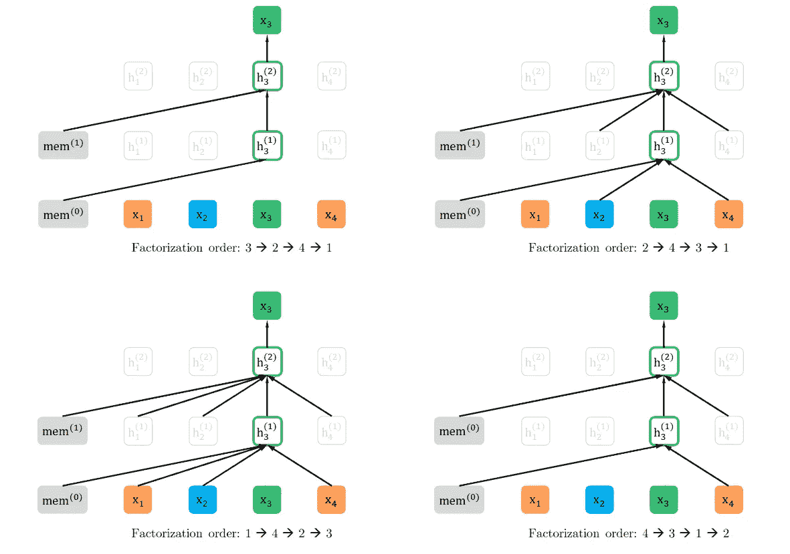
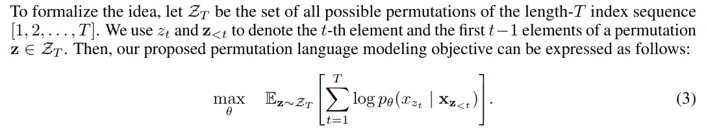
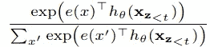
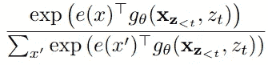
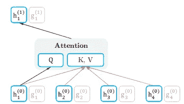
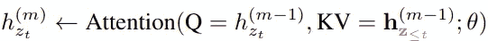
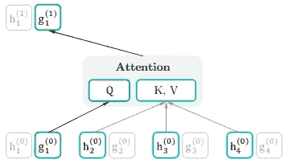
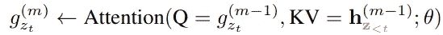

# XLNet:用于语言理解的自回归预训练

> 原文：<https://towardsdatascience.com/xlnet-autoregressive-pre-training-for-language-understanding-7ea4e0649710?source=collection_archive---------42----------------------->

## 了解基于变压器的自监督架构

蒂姆·莫斯霍尔德在 [Unsplash](https://unsplash.com?utm_source=medium&utm_medium=referral) 上的照片

像 BERT，OpenAI GPT 这样的艺术语言模型在最近的自然语言处理中已经成为明星。这些模型基于[转换器](https://arxiv.org/abs/1706.03762)架构，该架构将基于 RNN 和基于卷积的模型挤出了市场。

在本文中，我们将讨论 XLNET 模型，它是在最近的一篇论文中提出的: [XLNet:用于语言理解的广义自回归预训练](https://arxiv.org/abs/1906.08237)。该模型解决了 BERT 的某些缺点，并通过**在 20 项任务中超越 BERT**成功克服了这些缺点。

如果你有兴趣了解 BERT 或 Transformers 背后的概念，可以考虑阅读一下 [this (BERT)](https://medium.com/swlh/bert-pre-training-of-transformers-for-language-understanding-5214fba4a9af) 和 [this (Transformer)](/transformers-explained-65454c0f3fa7) 。

# 伯特怎么了？

由 [AllenNLP](https://demo.allennlp.org/masked-lm?text=The%20doctor%20ran%20to%20the%20emergency%20room%20to%20see%20%5BMASK%5D%20patient.) 进行的屏蔽 LM 演示

## 输入噪声

BERT 的一个主要问题本质上是它对屏蔽序列的预训练目标，即**去噪自动编码目标**。屏蔽序列非常有助于理解语言语料库中的趋势，然而，在微调时，序列不会被屏蔽。

> 然而，**BERT 在预训练期间使用的【MASK】等人工符号在微调时间**的真实数据中不存在，从而导致预训练-微调差异。
> 
> [— XLNet 纸](https://arxiv.org/abs/1906.08237)

## 独立性假设

BERT 最大化联合条件概率 ***p(x_t | x_hat)*** ，其中 ***x_t*** 为掩码项 ***x_hat*** 为记号序列。它读作，在给定序列 ***x_hat*** 中所有记号的情况下，屏蔽记号 ***x_t*** 出现在第‘***t***位置的概率。

这给出了独立性**假设的直觉，即每个被屏蔽的记号被单独重建**。我们将在后面的部分中清除这一点。

# XLNET

与 BERT 相反， **XLNet 是一个自回归模型**。这实质上消除了对输入去噪的依赖。

然而，自回归模型大多因其单向性而受到批评。因此，为了克服这一点，XLNet 提出了一个新的**置换语言建模**目标来克服这种单向性。

## 置换语言建模

如前所述，XLNet 提出了一种从两个世界(即自动编码和自回归)中吸取精华的机制。它没有自动编码目标中的输入去噪，并消除了传统自回归目标的单向性。

为了实现这一点，在对联合概率***p(x _ t | x _(I<t))***，**进行因式分解时，XLNet 不像在传统的自回归模型中那样使用固定的向前或向后因式分解顺序**，而是最大化一个序列的对数似然性 w.r.t **因式分解顺序**的所有可能排列。

> 具体来说，对于长度为 **T** 的序列 **x** ，有 **T！**不同的订单执行一个有效的自回归因子分解。直观地说，如果**模型参数在所有分解订单**中共享，那么**模型将学习从两侧**的所有位置收集信息。
> 
> [— XLNet 纸](https://arxiv.org/abs/1906.08237)

置换语言建模来自 [XLNet 论文](https://arxiv.org/abs/1906.08237)

为了更详细地说明这个目标，让我们举一个例子。考虑上图，一个序列 ***x*** 有 4 个令牌。为简单起见，我们只考虑***x3***的注意力计算。观察上面每个图下面的排列顺序。

*   而取顺序***3->2->4->1***， ***3*** 恰好是序列中的第一个令牌。因此，没有其他标记对其注意力计算有贡献。**因为它们在当前排列**中不先于 3。
*   按照***2->4->3->1***， ***3*** 的顺序，前面是*和 ***4*** ，因此它们有助于其注意力计算。*
*   *同理，对于**1->4->2->3和**4->3->1->2-**，对应的**x _(I<t)贡献给**x _ t .T41 的注意力计算*******

*更正式地说:*

**

*目标函数来自 [XLNet 论文](https://arxiv.org/abs/1906.08237)*

> ***注意**在训练时，实际获得序列的排列是不正确的，因为在下游任务的微调或推理过程中，序列不能被排列。因此，**变压器中的注意屏蔽被适当地操纵以获得正确的排列**；这也是有意义的，因为所提出的架构讨论的是因子分解顺序上的置换，而不是序列顺序。*

## *目标感知表征的双流自我注意*

**

*[XLNet 论文](https://arxiv.org/abs/1906.08237)关于目标感知表征的双流自我关注*

*常规转换器参数化可能不适用于置换语言模型。为了理解这一点，让我们考虑使用 ***softmax*** 的分布的标准公式，其由下式给出:*

**

*具有标准变压器参数化的置换 LM*

*这里的***h _θ(x _(z _(<t))***，是变压器的隐藏状态为***x _(<t)。*** 这个术语，绝不依赖于它所预测的位置，即***【z _(<***。这意味着，无论预测的位置是什么，这种分布都是相同的；从而导致无法了解有用的趋势。*

*因此，为了克服这一点，XLNet 论文提出了一个**重新参数化，用于下一个令牌分发，使其成为目标感知的:***

**

*具有重新参数化表示的置换 LM*

*使用修改的表示 ***g_θ*** ，其另外将目标位置 ***z_t*** 作为输入。因此，使用了两个隐藏状态，而不是一个:*

**

*内容流关注*

*   ***内容**表示，本质上与标准变压器隐藏状态相同。这种表示对**和**都进行了编码；上下文***x _(z _(<t))***以及原令牌 ***x_(z_t)。****

*数学上:*

**

*内容表示*

**

*查询流注意*

*   ***查询**表示，即只能访问上下文信息***【z _(<t))***和目标位置*【z _ t】。**

**数学上:**

****

**查询表示**

> ****注意**最初**内容流( *h_i* )本质上是对应的嵌入向量** ( ***e_x_i*** )，而**查询流( *g_i* )最初是可训练向量( *w* )** 。使用上面的表达式在每一层上更新它们。**

## **部分预测**

**抛开置换 LM 的所有优点不谈，我们必须承认它很贵。由于置换，这是一个具有挑战性的优化问题。**

**因此，为了解决这个问题，在给定的序列 z 中，只有一个**子序列 *z_( > c)* 被选择用于预测**，其中 ***c*** 被称为切割点。我们只考虑 ***z_( > c)*** ，因为它在该序列中具有最长的上下文。**

**此外，使用另一个超参数 ***K*** ，使得***K ~ | z |/(| z | c)***。并且我们**只选择 *1/K* 个令牌用于预测**。对于未选择的令牌，不计算它们的查询表示，这样可以节省速度和内存。**

**我们将这个部分预测与 BERT 的部分预测进行比较。BERT 使用部分预测，因为屏蔽所有记号没有任何意义。XLNet 做部分预测是因为优化难度大。比如:来个序列:**【深，学，是，伟大】**。假设 BERT 和 XLNet 都选择**预测令牌【深度，学习】**。又假设 **XLNet 将样本因式分解为【是，伟大，深度，学习】**。在这种情况下，**

**伯特最大化:**

*   **L(BERT) = log p(深度|很棒)+ log p(学习|很棒)**

**XLNet 最大化:**

*   **L(XLNet) = log p(深度|很棒)+ log p( **深度** |学习很棒)**

**这清楚地解释了 **XLNet 如何捕捉更多的依赖性，即深度和学习之间的依赖性**。毫无疑问，伯特学会了大部分的依赖性；但是 XLNet 了解更多。另外，这是上一节中提到的 BERT 中的**独立性假设**的一个例子。**

## **从《变形金刚 XL》中汲取灵感**

**最后，提到 [Transformer XL 模型](https://arxiv.org/abs/1901.02860)，XLNet 从这里借用了**关系编码**和**段递归机制**的概念，这使得 Transformer XL 能够在很长的序列上操作。**

> ****有趣的事实:Transformer XL 可以参与比 RNNs 长 80%和比 vanilla Transformer 长 450%的序列，并且在评估期间比 vanilla Transformers 快 1800 多倍。****

# **结论**

**我们已经介绍了另一个最新的模型 XLNet，并讨论了它背后的概念。**

**XLNet 的代码是作者开源的，你可以在这里找到它[。](https://github.com/zihangdai/xlnet)**

**你可以通过[拥抱面部变形金刚](https://huggingface.co/transformers/model_doc/xlnet.html)找到预先训练好的权重和一个易于使用的模型架构 API。**

****新:**我已经为 XLNet 写了一篇论文总结和评论。有兴趣的可以看看:[https://docs . Google . com/document/d/1 nepiw 67 oqw 1 hprikosub-n8hk 2 a 07-3 pnmtrvmqmkta/edit？usp =分享](https://docs.google.com/document/d/1nePIW67OqW1HPrIkoXUB-N8hK2A07-3pnmtRVMQMKTA/edit?usp=sharing)**

# **参考**

 **[## XLNet:用于语言理解的广义自回归预训练

### 有了双向上下文建模的能力，基于去噪自动编码的预训练如 BERT 实现了更好的性能

arxiv.org](https://arxiv.org/abs/1906.08237)**  **[## Transformer-XL:超越固定长度上下文的注意力语言模型

### 变形金刚有学习长期依赖性的潜力，但是受限于…

arxiv.org](https://arxiv.org/abs/1901.02860)** ** [## 伯特:语言理解变形金刚的前期训练

### 了解基于变压器的自监督架构

medium.com](https://medium.com/swlh/bert-pre-training-of-transformers-for-language-understanding-5214fba4a9af)  [## 变形金刚解释

### 对谷歌 Transformer 模型的详尽解释；从理论到实施

towardsdatascience.com](/transformers-explained-65454c0f3fa7)**