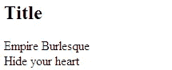
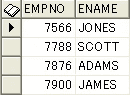
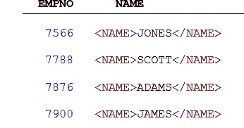
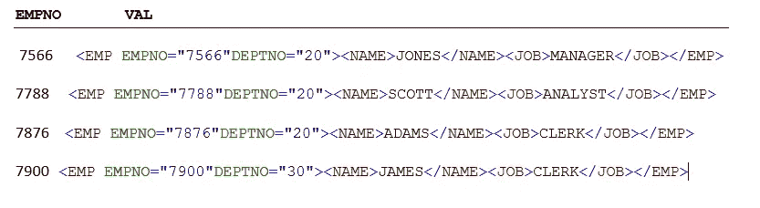
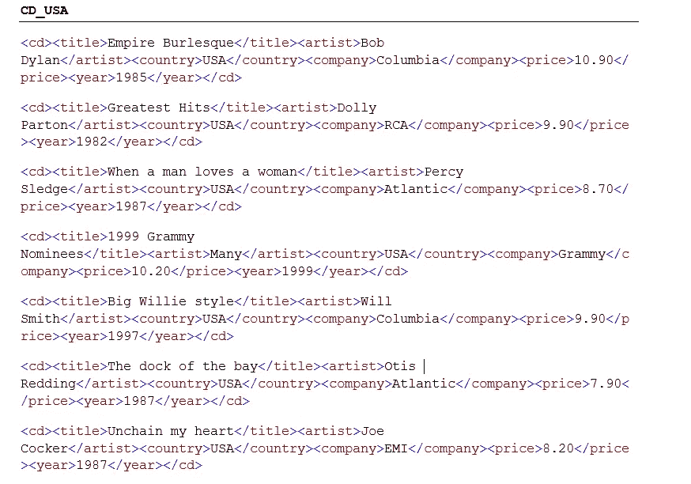
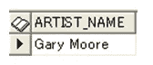
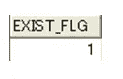

# Oracle 中的 XML 功能

> 原文：<https://towardsdatascience.com/xml-functionalities-in-oracle-4c4574942840?source=collection_archive---------24----------------------->

## *Oracle 数据库中 XML 的实现和支持概述*


由[沙哈达特拉赫曼](https://unsplash.com/@hishahadat?utm_source=medium&utm_medium=referral)在 [Unsplash](https://unsplash.com?utm_source=medium&utm_medium=referral) 上拍摄的照片

# XML:简介

总是有在不同来源之间交换数据的广泛需求，而不用担心接收者将如何使用它或它将如何显示。XML 为我们做了那件事。这是 W3C(万维网联盟)的一项倡议，允许信息以人类和机器容易理解的有意义的结构和规则进行编码。

XML 代表 e **X** 可扩展 **M** arkup **L** 语言。XML 不是 HTML 的替代品。

> HTML 的设计重点是如何“显示”数据，而 XML 的设计重点是如何“*存储*”和“*传输*”数据。

XML 本身不做任何事情。

让我们看一个样本 xml 文档:

```
**<message>
<to>Tom</to>
<from>Bill</from>
<body>Send me your phone number</body>
</message>**
```

上面的 XML 文档包含一条消息，其主体包含发送者和接收者信息。但是它本身并不做任何事情。它只是构造和储存信息。必须有人编写软件代码来接收、发送或显示它。

像 **<从>** 或者 **<到>** 这样的标签不是预定义的。它们是由这个 XML 文档的作者编写的。

## 从这个意义上说，XML 是“可扩展的”。这意味着它没有固定的元素集(不像 HTML)。

因此，简而言之，我们可以说 XML 是一种独立于软件和硬件的工具或方法来构造、存储和携带信息。

# XML 结构


[亚历克斯·霍利约克](https://unsplash.com/@stairhopper?utm_source=medium&utm_medium=referral)在 [Unsplash](https://unsplash.com?utm_source=medium&utm_medium=referral) 上拍摄的照片

XML 文档有一个从“根”元素开始的树形结构。一个例子如下:

```
<?xml version=”1.0"?>
<Employees>
<Empl id=”1">
<FirstName>Bill</FirstName>
<LastName>
Watterson
</LastName>
<Dept>
Finance
</Dept>
</Empl>
</Employees>
<Employees>
<Empl id=”1">
<FirstName>
Bill
</FirstName>
<LastName>
Watterson
</LastName>
<Dept>
Finance
</Dept>
</Empl>
</Employees>
```

第一行是 XML 声明。它定义了 XML 版本。下一行声明了这个 XML 文档的“根”元素。因此，“员工”是这里的根元素。像“雇员”、“名字”、“姓氏”和“部门”这样的其他元素是子元素。在 EMPL 元素中，有一个值为“1”的字段 id。它被称为该元素的属性。属性提供了关于元素的附加信息。属性值总是用引号括起来(单引号或双引号)。语法正确的 XML 文档称为“格式良好的”XML。

一个**文档类型定义(DTD)** 定义了一个 XML 文档的合法构件。它定义了一个包含合法元素和属性列表的文档结构。DTD 文档示例如下:

```
**<?xml version=”1.0"?> 
<!DOCTYPE message [ 
 <!ELEMENT message (to,from,body)>
 <!ELEMENT to (#PCDATA)> 
 <!ELEMENT from (#PCDATA)> 
 <!ELEMENT body (#PCDATA)>
 ]>**
```

上面的 DTD 是这样解释的:

上面的 DTD 是这样解释的:

**！DOCTYPE** note 定义了这个文档的根元素是 message。
！元素 note 定义了 note 元素包含四个元素:“to、from、body”。
**！元素** to 将 to 元素定义为“#PCDATA”类型。
！元素 from 将 from 元素定义为“#PCDATA”类型。
！元素 body 将 body 元素定义为“#PCDATA”类型。

description (#PCDATA)指定已解析的字符数据。解析的数据是 XML 元素的开始标记和结束标记之间的文本。解析的字符数据是没有子元素的文本。

**XML 模式定义(XSD)** 文档是基于 XML 的 DTD 的替代方案。

“有效的”XML 文档是“格式良好的”XML 文档，它也符合 DTD 或 XSD 的规则。

# 可扩展样式表语言（Extensible Stylesheet Language 的缩写）


乔尔·那仁在 Unsplash 上的照片

如前所述，HTML 标签是预定义的。在 HTML 中定义了一个表格，浏览器已经知道如何显示它。然而，在 XML 中

可以表示任何东西。XML 专注于结构化和存储数据。因此，我们需要一种机制来定义这些数据应该如何在浏览器、手机等中显示。XSL(可扩展风格语言)是完成这一任务的语言。它定义了解释 XML 文档元素的规则。

让我们以一个 XML 文档“CDCatalog.xml”为例，其定义如下:

```
**<?xml version=”1.0" encoding=”ISO-8859–1"?>
<?xml-stylesheet type=”text/xsl” href=”DisplayCD.xsl”?>
<catalog>
 <cd>
 <title>Empire Burlesque</title>
 <artist>Bob Dylan</artist>
 <country>USA</country>
 <company>Columbia</company>
 <price>10.90</price>
 <year>1985</year>
 </cd>
 <cd>
 <title>Hide your heart</title>
 <artist>Bonnie Tyler</artist>
 <country>UK</country>
 <company>CBS Records</company>
 <price>9.90</price>
 <year>1988</year>
 </cd>
</catalog>**
```

在第二行中，它引用了一个 XSL 文档 DisplayCD.xsl。该文档可以定义如下:

```
**<?xml version=”1.0" encoding=”ISO-8859–1"?>
<xsl:stylesheet version=”1.0" xmlns:xsl=”**[**http://www.w3.org/1999/XSL/Transform**](http://www.w3.org/1999/XSL/Transform)**">
<xsl:template match=”/”>
 <html>
 <body>
 <h2>Title</h2>
<xsl:for-each select=”catalog/cd”>
 <xsl:value-of select=”title”/> <br/>
</xsl:for-each>
 </body>
 </html>
</xsl:template>
</xsl:stylesheet>**
```

让我们一行一行地理解 DisplayCD.xsl。

第一行，定义了使用的 XML 版本和编码。

下一行声明了要使用的 XSL 版本和名称空间。xmlns:XSL = " http://www . w3 . org/1999/XSL/Transform "指向官方的 W3C XSLT 名称空间。

元素定义了一个模板。属性将模板与 XML 源文档的根相关联。

元素内部的内容定义了一些要写入输出的 HTML。

元素的 xsl:value-of > 可以用来提取 XML 元素的值。上例中的**选择**属性包含一个 XPath 表达式。XPath 表达式的工作方式类似于导航文件系统；正斜杠(/)选择子目录。XSL**<XSL:for-each>**元素可用于选择指定节点集的每个 XML 元素。

当 CDCatalog.xml 在 web 浏览器中打开时，它将显示如下数据，如 DisplayCD.xsl 中所定义:



# XMLType

Oracle 使用一种新的数据类型，XML 类型，来帮助处理数据库中的 XML 数据。若要以 XML 格式查看现有表的数据，可以编写如下查询:

```
**select XMLTYPE(cursor(select * from dept)) XML_Data from dual**
```

输出如下所示:

```
**XML_Data
==============**<?xml version=”1.0"?>
<ROWSET>
 <ROW>
 <DEPTID>10</DEPTID>
 <DEPTNAME>ACCOUNTING</DEPTNAME>
 <LOC>NEW YORK</LOC>
 </ROW>
 <ROW>
 <DEPTID>20</DEPTID>
 <DEPTNAME>RESEARCH</DEPTNAME>
 <LOC>DALLAS</LOC>
 </ROW>
 <ROW>
 <DEPTID>30</DEPTID>
 <DEPTNAME>SALES</DEPTNAME>
 <LOC>CHICAGO</LOC>
 </ROW>
 <ROW>
 <DEPTID>40</DEPTID>
 <DEPTNAME>OPERATIONS</DEPTNAME>
 <LOC>BOSTON</LOC>
 </ROW>
</ROWSET>
```

XMLType 可以接受引用游标作为参数

要将 XML 文件的内容插入 Oracle 表，请执行以下步骤:

1.  创建 xmltype 类型的表，例如创建 XMLTYPE 的表目录
2.  创建一个包含要加载的 XML 文件的 Oracle 目录。(一个 **Oracle 目录**是指向[数据库服务器](http://www.orafaq.com/wiki/Oracle_database)机器上的[操作系统](http://www.orafaq.com/wiki/Operating_system) [目录](http://www.orafaq.com/wiki/Directory)的数据库对象，用于读写[文件](http://www.orafaq.com/wiki/File)。)例如:

```
**CREATE OR REPLACE DIRECTORY MYXMLDIR AS ‘D:\Gaurav\Trainings\Files’;**
```

3.执行 insert 语句，如下所示:

```
**INSERT INTO catalog VALUES(XMLType(bfilename(‘MYXMLDIR’,’CDCatalog.xml’),nls_charset_id(‘AL32UTF8’)));**
```

传递给`nls_charset_id`的值表示要读取的文件的编码是 UTF-8。

4.可以使用对象值选择该值，例如

```
**select OBJECT_VALUE from catalog**
```

# XMLELEMENT

XMLELEMENT 是一个返回 XML 类型的函数。它接受两个参数:第一个参数是标记的名称，第二个参数是值，可以是字符串、XMLTYPE、数字或日期。

```
**select empno, ename from emp where ename like ‘F%’;**
```

这将返回姓名中包含字母“S”的雇员的编号和姓名，如下所示:



使用 XMLELEMENT，我们可以添加带有用户定义的标记名和值的 xmltype 作为雇员名，例如

```
 select empno, xmlelement(name,ename) name
from
emp
where ename like ‘%S%’;
```

它生成一个 XMLType，以标记名和雇员名作为值:



XMLELEMENT 可以嵌套，并且可以包含属性:

```
select empno, xmlelement(
                         emp,
                         xmlattributes (empno, deptno), 
                         xmlelement(name, ename),
                         xmlelement(job,job)
                         emp
                         )
                 from
                 emp
                 where ename like '%S%'
```



# 用 SQL 函数查询 XML 数据

**提取和提取值:**

EXTRACT 函数接受两个参数:一个 XMLTYPE 元素和一个 XPATH 字符串，并返回一个 XMLTYPE 实例，例如

为了选择 country =“USA”数据，将在“catalog”表上使用以下查询。

```
select extract(OBJECT_VALUE,’/catalog/cd[country =”USA”]’) cd_usa
from
catalog
```



**EXTRACTVALUE** 用于提取一个节点下的特定值。例如，如果我们必须在 title=“仍然有忧郁”的地方找到艺术家的名字，查询将被写成如下:

```
select extractvalue(OBJECT_VALUE,’/catalog/cd[title =”Still got the blues”]//artist/text()’) artist_name
from
catalog
```

输出:



**存在节点:**

EXISTSNODE 检查 XPATH 表达式的存在性，例如，如果我们想知道标题“仍然有忧郁”是否存在于目录中，我们可以编写如下查询:

```
select existsnode(OBJECT_VALUE,’/catalog/cd[title =”Still got the blues”]’) exist_flg
from
catalog
```



输出 1 表示它存在，而 0 表示它不存在。

**XMLAGG:**

XMLAGG 用于在单个 XML 文档中聚合多行。例如，要汇总每个部门的员工，查询可以写成:

```
select
xmlelement(
emp,
xmlagg(
xmlelement(dept,
 xmlagg(
 xmlelement(name,ename) order by ename
 )
 )
 ) 
 ) 
 from emp
group by empno
```

**更新 XML:**

UPDATEXML 搜索 XPATH 表达式并更新它。例如

```
UPDATE catalog SET object_value =
 UPDATEXML(object_value,
 ‘/catalog/cd/title/text()’,’changed’)
```

这将把表格目录中的所有标题更新为“已更改”。

# 结论:

本文旨在让读者对 XML 和相关技术有一个基本的了解，并了解 Oracle 数据库是如何处理 XML 数据的。有关 Oracle XML 功能的更多详细信息，请参考以下链接:

[http://docs . Oracle . com/CD/e 11882 _ 01/app dev . 112/e 23094/TOC . htm](http://docs.oracle.com/cd/E11882_01/appdev.112/e23094/toc.htm)