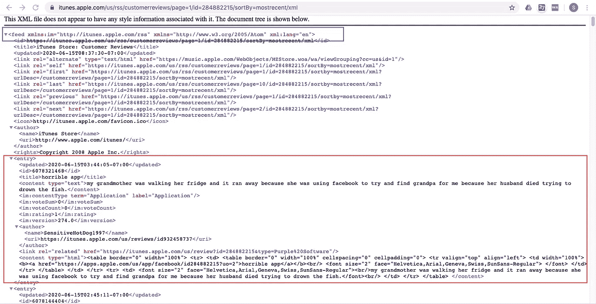
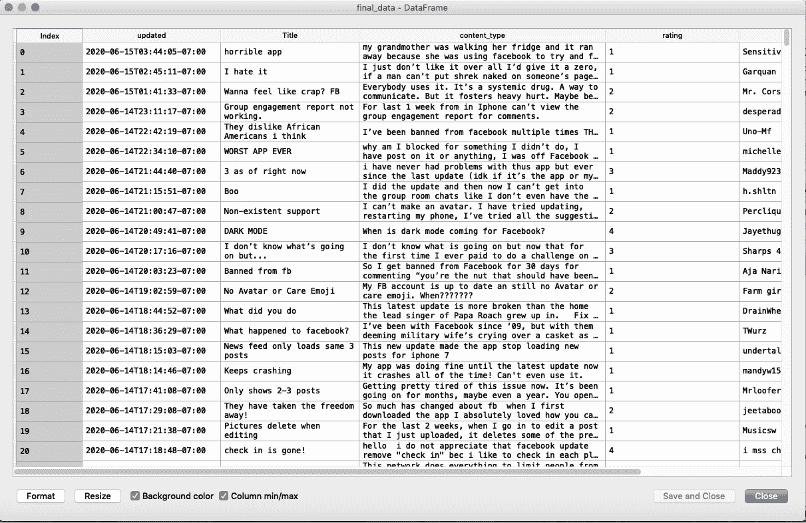

# XML 抓取做得很好！

> 原文：<https://towardsdatascience.com/xml-scraping-done-right-6ac66eef9efc?source=collection_archive---------14----------------------->

## 使用 Python 一步步抓取任何“XML”文件


弗兰基·查马基在 [Unsplash](https://unsplash.com?utm_source=medium&utm_medium=referral) 上的照片

ata 是新的石油——但它绝对不便宜。我们有来自四面八方的数据；web、应用程序、社交媒体等，数据科学家必须能够挖掘其中的一些内容。在接下来的博客中，我们将学习如何使用 Python 库' **BeautifulSoup** '快速从网站中挖掘/收集数据(为了好玩)

行动（或活动、袭击）计划

# 目录

1.  介绍使用案例
2.  什么是 BeautifulSoup？
3.  BS4 行动——理解并提取数据
4.  最后评论

# 介绍使用案例

任何在客户体验或酒店行业工作过的人都明白客户满意度的重要性。NPS 或净推介值被视为客户体验的基准。虽然 NPS 是一项专门设计的调查，但还有其他方法来了解客户情绪。其中之一是 Appstore 上的**客户反馈和评级**(当然，前提是你的应用在那里可用)。

所以我们要做的是—

→随机选择一个应用程序(例如:脸书)

→访问 iTune 评论

→提取不同用户给出的评级、评论、日期等

→以干净的“csv/xlsx”格式导出它们。

# 什么是 BeautifulSoup？

美汤*(又名 BS4)* 是一个解析 HTML 和 XML 文档的 Python 包。它为解析过的页面创建了一个解析树，可以用来从 HTML 中提取数据，这对 web 抓取很有用。它适用于 Python 2.7 和 Python 3

# BS4 行动——理解并提取数据

iTunes 使得从苹果应用商店获得应用评论变得非常容易。脸书的应用程序 id 是`28488215`，我们只需要在下面的 URL 中添加相同的 id

```
[https://itunes.apple.com/us/rss/customerreviews/page=1/id=284882215/sortBy=mostrecent/xml](https://itunes.apple.com/us/rss/customerreviews/page=1/id=284882215/sortBy=mostrecent/xml)
```

单击上面的 URL，将会出现一个如下所示的页面:



> XML 文档被形成为元素树。一个 XML 树从一个**根**元素开始，从**根**分支到子元素。术语父、子和兄弟用于描述元素之间的关系。

在上图中我们可以看到`<feed>` 是*的父*也就是多子。其中一个孩子是`<entry>` ，它又有许多孩子。在某种程度上——`<feed>`是爷爷，`<entry>`是儿子，其他人是孙子。

## 我们需要提取什么？

现在，让我们假设我们想从每个评论中提取以下内容:

1.  审查日期
2.  审查标题
3.  内容
4.  评级
5.  审查人姓名

我们想写 10 页。

## Python 代码

代码非常简单

→首先使用`request`从 URL 导入数据

→使用`BeautifulSoup`将其转换为 BS4 对象

→Extra:可以使用`soup.findall()`查找数据中的所有文本

→找到子/标签`entry`并将其保存为对象。(这是第一次审核，包含所有与审核相关的信息)

→搜索其子节点`updated` `title` `content` `im:rating` `name`以提取所有需要的信息并保存在列表中

→通过使用`find_next_sibling()`找到子/标签`entry`的同级(这将引导您进入下一个审查)

→继续循环，直到找不到更多评论。继续将数据追加到数据帧中。

→ Extra:在上面的代码中，我添加了另一个循环来提取前 10 个评论页面中的所有上述信息。

> 仅此而已。很整洁，对吧！

**结果**

我们应该得到一个你看起来像这样的数据帧:



***瞧*** —您已经成功地从 iTunes 中提取了信息。现在，你可以在它们的基础上开发你的*漂亮的* NLP 模型，并了解你的客户对你的看法。

要浏览我的其他数据科学/机器学习博客，请访问:

[](https://medium.com/@shirishgupta) [## 谢里什·古普塔培养基

### 阅读希利什·古普塔在媒介上的作品。我是学术界的经济学家，专业的数据科学家和旅行者…

medium.com](https://medium.com/@shirishgupta) 

暂时结束了。有什么想法来改善这一点或希望我尝试任何新的想法？请在评论中给出你的建议。再见。