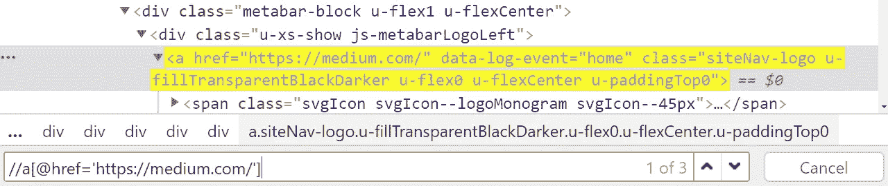

# Python 的 XPath

> 原文：<https://towardsdatascience.com/xpath-for-python-89f4423415e0?source=collection_archive---------0----------------------->

## [入门](https://towardsdatascience.com/tagged/getting-started)

## 学习网页抓取的规则


照片由[大卫·帕施克](https://unsplash.com/@davidpaschke?utm_source=medium&utm_medium=referral)在 [Unsplash](https://unsplash.com?utm_source=medium&utm_medium=referral) 上拍摄

ML 路径语言(XPath)在 web 抓取和自动化领域是一个非常不受重视的工具。想象一下 RegEx，但是对于网页来说——那就是 XPath。

网页的每个元素都是由文档对象模型(DOM)组织的。DOM 是一个类似树的结构，其中每个元素代表一个节点，有到父节点和子节点的路径。

XPath 为我们提供了一种快速遍历这棵树的语言。而且，像 RegEx 一样，我们可以向节点选择添加逻辑，使我们的查询更强大。

在本文中，我们将涵盖:

```
**> XPath Essentials
**  - Testing Our Queries
  - The Root
  - Paths in XPath**> Navigating the Tree**
  - Node Indexing
  - Extracting XPaths from the Browser**> XPath Logic****> Example with Python**
```

# XPath 基础

## 测试我们的查询

首先，在我们做任何事情之前，我们需要理解如何测试我们的 XPath 字符串。幸运的是，我们可以在网络浏览器中这样做。

在整篇文章中，我将使用 Chrome，但在所有现代浏览器中，这个过程都非常相似。


点击 Chrome >更多工具>开发者工具中的选项下拉菜单。

在我们的网页上，我们打开开发者工具——在 Windows 上点击 **Fn+12** ,或者从浏览器选项菜单中打开(请参阅上面的 Chrome)。


我们可以使用开发人员工具中的搜索栏来检查 XPath 字符串是否有效。

接下来，我们单击 **ctrl+F** 在元素窗口中打开搜索栏。在这里，我们可以通过字符串、选择器或 XPath 进行搜索。

这个方法是快速测试 XPath 查询的最简单的方法。

如果我们的查询匹配某些内容，那么该元素将被突出显示为黄色。当我们的查询匹配多个元素时，我们可以使用搜索栏右侧的箭头在它们之间循环！

## 根

让我们从查询的最开始开始。以`//div`为例，`//`是什么意思？

每个 XPath 查询都从 XML 树的根——最顶层的元素开始。对于 HTML 文档，这是`<html>`标签。

现在，如果我们写`html//div`，我们就说“寻找任何属于`div`的`html`的后代节点”。


页面元素的树形表示。

结果是，我们的查询将同时找到`**html**/**div**`和`**html**/body/div/div/article/div/**div**`。这是因为在这两种情况下，我们看到的是`html`的后代`div`。

因为我们的 XPath 查询总是从根(`html`)开始，所以我们不需要编写`html//div`。相反，我们写`//div`。

# 导航树

## 路径表达式

我们刚刚使用的例子叫做路径表达式。有几个这样的例子，它们非常有用:

*   `//` —匹配任何后代节点
*   `/` —仅匹配子节点(直接跟随另一个节点的节点):


为了匹配 **span** 元素，我们需要在使用单个 **/** 时包含所有子节点。

*   `.` —匹配当前活动节点(稍后将详细介绍)
*   `..` —匹配当前活动节点的父节点
*   `@` —选择当前节点的一个属性(例如`href`):



我们可以使用属性选择器 **@** 按属性进行搜索。

有了这些路径表达式的组合，我们可以轻松地遍历 XML 树。

例如，回到我们的示例 HTML 部分——我们可以通过找到带有属性`class="u-textScreenReader"`的`span`标签来选择`a`标签，并沿着树向上遍历到它的父节点，如下所示:


**..语法允许我们在 XML 树中向上移动。**

## 节点顺序

我们 DOM 中的每个节点都有编号。如果我们有一个包含五个`li`条目的列表`ul`，我们可以通过从 1 到 5 的索引来访问每一个条目:

```
<ul>
    <li>London</li>
    <li>Miami</li>
    <li>New Dehli</li>
</li>
```

如果我们查询`//ul/li[1]`，我们将返回`<li>London</li>`——注意，值是**而不是**零索引的。XPath 索引从`1`开始。

## 从浏览器复制 XPath

Chrome(可能是大多数现代浏览器)中一个非常方便的特性是直接从**元素**窗口获取节点的 XPath。


右键点击一个元素，点击**复制>复制 XPath** 。

为此，我们右键单击需要 XPath 的元素，然后单击 Copy > Copy XPath 并粘贴该元素的 XPath。我们的`span`元素返回:

```
//*[[@id](http://twitter.com/id)="_obv.shell._surface_1600536527994"]/div/div[1]/div[2] /div[1]/div[1]/a/span[1]
```

或者，我们可以复制完整的 XPath，它提供了从根到元素的完整路径。对于我们的`span`元素，这看起来像:

```
/html/body/div[1]/div[2]/div/div[1]/div[2]/div[1]/div[1]/a/span[1]
```

# 高级逻辑

现在，你是否想把下面的方法称为“先进”是值得商榷的。

然而，我证明了这一点，因为通过单独使用前面的路径表达式，我们可以非常容易地遍历 DOM。在许多情况下，我们不再需要任何东西。但时不时地，这些“先进”的方法会非常有用。

## 功能

有许多 XPath 函数我们不会在这里讨论，但是一些最常见的是:

*   `contains` —在字符串`B`中搜索字符串`A`，其中`contains(B, A)`:


使用 **contains** 函数的例子，我们也可以使用 **contains(text()，‘Home’)**并得到相同的结果。图片作者。

*   `not` —我们用它来否定部分查询，比如我们想要所有不包含类`svgIcon-use`的`span`元素:


我们使用**而不是**来选择没有类**‘u-textScreenReader’**的 span 节点**。**

*   `boolean` —与`not`相等且相反，如果我们希望所有的`span`元素都包含一个`svg`子节点:


我们使用**布尔**来选择带有类**‘u-textScreenReader’**的跨度节点**。**

*   `starts-with` —类似于`contains`，但不包含字符串`A`，字符串`B`必须以字符串`A`开头。
*   我相信你能解决这个问题

这些函数只是 XPath 表面的一小部分。一些我们还没有涉及到的项目(我已经添加了关于它们的文章的链接):

*   [更多 XPath 轴](https://www.w3schools.com/xml/xpath_axes.asp)
*   [XPath 运算符](https://www.w3schools.com/xml/xpath_operators.asp)
*   [选择未知节点](https://www.w3schools.com/xml/xpath_syntax.asp)
*   [XPath 函数的完整列表](https://developer.mozilla.org/en-US/docs/Web/XPath/Functions)

# 硒中的 XPath

Selenium 是熟悉 Python 中 XPath 的最佳方式(它也适用于许多其他语言)。如果你不熟悉它，我写了这篇文章介绍框架的设置和基础——它非常容易使用！

一旦有了 Selenium 设置，我们就可以使用`find_elements_by_xpath`方法选择满足 XPath 查询的网页的所有元素。


我们将在 [webscraper.io](https://webscraper.io/) 上尝试一下。在那里，我们可以看到每一项都包含在一个带有`class="thumbnail"`的`div`元素中。这里，我们重点介绍了 Acer Aspire 产品。

所以，回到 Selenium 和 XPath。首先，我们需要初始化我们的 web 驱动程序，并导航到 Web Scraper 培训网站:

```
from selenium import webdriver
driver = webdriver.Chrome('chromedriver.exe')
driver.get('[https://webscraper.io/test-sites/e-commerce/scroll](https://webscraper.io/test-sites/e-commerce/scroll)')
```

现在，我们需要选择类为`thumbnail`的所有`div`元素:


我们可以很容易地通过选择任何带有 **//div** 的 div 来选择这些，并且只过滤那些具有带有 **[@class='thumbnail']** 的缩略图类的 div。

```
shop_elems = driver.find_elements_by_xpath(
    "**//div[@class='thumbnail']"**
)
```

## Selenium 网站元素

如果我们打印出`shop_elems`的值，我们将返回一个 **WebElement** 对象的列表:


Selenium 将返回我们选择作为 WebElement 对象的每个元素。

太好了，我们有了我们的商店容器 WebElements —现在做什么？嗯，我们可以将这些对象视为单独的 XML 树。

我们使用 WebElement `get_element`方法结合`By.XPATH`来实现这一点，这是一个新的导入:

```
from selenium.webdriver.common.by import Byshop_elems[0].get_element(By.XPATH, *<XPath Query Here>*)
```

这里，我们将`div[@class="thumbnail"]`的第一个实例设置为活动的，我们可以使用`.`在 XPath 查询中选择当前活动的节点。

我们可以使用这个新方法遍历页面上的每个条目容器，并迭代地提取每个条目的细节！

## 使用活动节点的 XPaths

让我们尝试在`shop_elems`中提取每个 web 元素的项目名称。


项目名称位于 **a** 子代 a 标签的**标题**或**文本**字段中。

回到浏览器，我们可以在 descendant `<a>`标签中找到项目名称。由于没有其他的后代`<a>`标签，我们可以只使用`//a`来选择这个元素。这给了我们`//div[@class='thumbnail']//**a**`。

在我们的代码中，`shop_elems`中包含的 WebElements 将`div[@class='thumbnail']`设置为活动节点，我们用`.`选择它:

```
shop_elems[0].find_element(By.XPATH, "**.//a**")
```

要获得商品名称，我们只需访问对象的`text`值。我们可以将它集成到一个 for 循环中，从我们的 WebScraper.io 电子商务页面中提取每个商品名称:

仅此而已；我们用 XPath 和 Selenium 提取了电子商务首页上的商品名称。我们可以结合更多的 XPath 查询来提取更多的信息，比如价格、评级、评论数量等。

# 结束了

这就是对 XPath 和 Selenium 的介绍。我们涵盖了:

*   DOM、节点和分支
*   测试 XPath 查询— **Fn+12** ， **Ctrl+F**
*   导航树
*   从浏览器中提取 XPaths
*   一些更高级的 XPath 逻辑

正如我以前说过的，这只是触及了 XPath 的表面，我肯定会推荐您从事自己的小型 web 抓取/自动化项目并学习更多！

我希望你喜欢这篇文章。如果您有任何想法或问题，请通过 [Twitter](https://twitter.com/jamescalam) 或在下面的评论中告诉我！如果你想要更多这样的内容，我也会在 YouTube 上发布。

感谢阅读！

**除非另有说明，所有图片均为作者所有。*