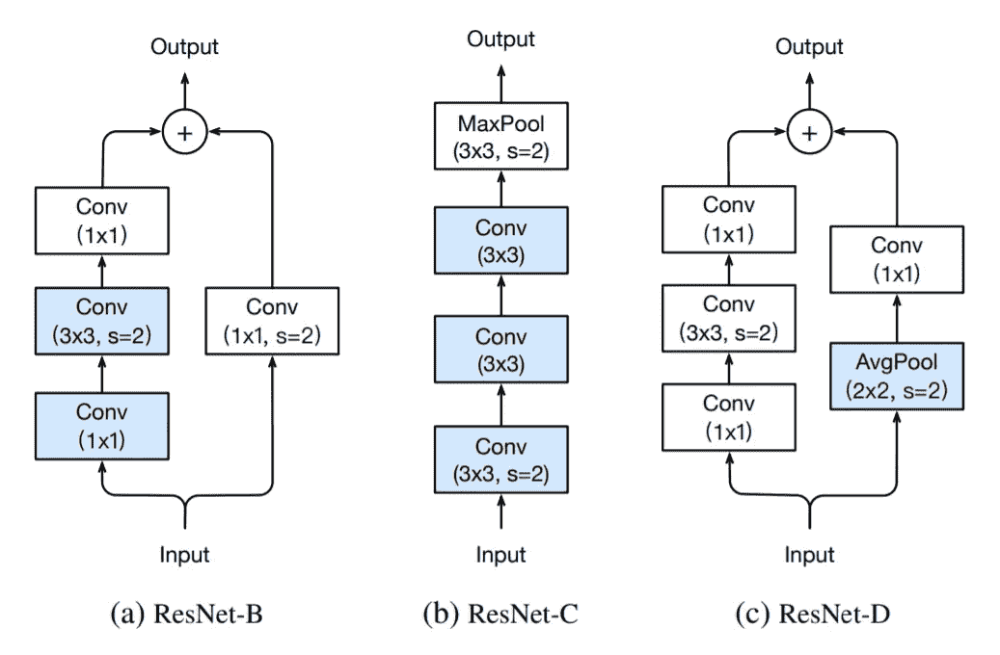

# Pytorch 中从头开始的 xResNet

> 原文：<https://towardsdatascience.com/xresnet-from-scratch-in-pytorch-e64e309af722?source=collection_archive---------31----------------------->

## 从你的 ResNet 架构中挤出一点额外的东西。

丹尼尔·库切列夫在 [Unsplash](https://unsplash.com/s/photos/vision?utm_source=unsplash&utm_medium=referral&utm_content=creditCopyText) 上拍摄的照片

ResNet 架构由[何等人于 2016 年](http://openaccess.thecvf.com/content_cvpr_2016/html/He_Deep_Residual_Learning_CVPR_2016_paper.html)提出，已被证明是计算机视觉领域最成功的神经网络架构之一。大约三年后，由亚马逊网络服务公司的佟鹤领导的团队建议对模型的结构进行一些调整，这对模型的准确性有不可忽视的影响。

在这个故事中，我们从零开始实现 ResNet 架构，考虑了“*卷积神经网络图像分类锦囊”*出版物*中介绍的调整。根据杰瑞米·霍华德的建议，最终的模型被称为 xResNet，我们可以把它看作是 ResNet 的变种或者是架构的下一个版本。*

## 属性

代码大部分取自 [fast.ai 课程](https://www.fast.ai/)和 [fast.ai 库](https://github.com/fastai/fastai2/blob/master/fastai2/vision/models/xresnet.py)。然而，我试图简化它，并以一种支持叙述的方式组织它。

> [学习率](https://mailchi.mp/d2d2d4a109b5/learning-rate-newsletter)是为那些对 AI 和 MLOps 的世界感到好奇的人准备的时事通讯。你会在每周五收到我关于最新人工智能新闻和文章的更新和想法。在这里订阅！

# ResNet 架构

为了更好地理解 xResNet 中引入的调整背后的原因，我们简要讨论一下原始的 ResNet 架构。该模型的总体视图如下图所示。

原始 ResNet 架构

首先，我们有**输入杆**。该模块由一个`7x7`卷积层组成，具有 64 个输出通道，步长为`2`。接下来是`3x3`最大池层，步长也是`2`。我们知道卷积后图像的输出大小由下面的公式给出。

在这个公式中，`o`是图像的输出大小(`o x o`)，`n`是输入大小(`n x n`)，`p`是应用的填充，`f`是滤波器或内核大小，`s`是步幅。因此，输入词干将图像的宽度和高度减少了`4`倍，`2`来自卷积，`2`来自最大池。它还将其通道大小增加到 64。

随后，从*阶段 2 开始，*每个模块从一个**下采样块**开始，随后是两个**剩余块**。下采样块被分成两条路径:A 和 b。路径 A 具有三个卷积；两个`1x1`和中间的一个`3x3`。第一个卷积的步幅为`2`，将图像大小减半，最后一个卷积的输出通道是前两个卷积的四倍。路径 B 的作用是使输入图像的形状与路径 A 的输出相匹配，这样我们就可以将两个结果相加。因此，它只有一个步幅为`2`的`1x1`卷积和与路径 a 的最后一个卷积相同数量的通道

残差块类似于下采样块，但不是抛出一个步幅`2`卷积，而是在每个阶段的第一层，始终保持步幅等于`1`。改变每个阶段中的剩余块的数量，可以得到不同的 ResNet 模型，例如 ResNet-50 或 ResNet-152。

# xResNet 调整

在 ResNet 架构中有三种不同的调整来获得 xResNet 模型； **ResNet-B** 、 **ResNet-C** 和 **ResNet-D** 。

ResNet-B 首先出现在 ResNet 的 Torch 实现中，它改变了下采样块的路径 A。它只是将步幅`2`移动到第二个卷积，并保持第一层的步幅`1`。**很容易看出，如果我们在第一个卷积中有步幅** `**2**` **，也就是一个** `**1x1**` **卷积，我们会丢失四分之三的输入特征图。**将其移动到第二层可以缓解这个问题，并且不会改变路径 a 的输出形状。

在 Inception-v2 中提出的 ResNet-C 去除了网络输入干中的`7x7`卷积，并用三个连续的`3x3`卷积来代替。第一个的跨距为 2，最后一个有一个`64`通道输出，后跟一个跨距为`2`的`3x3`最大池层。**最终的形状是相同的，但是** `**3x3**` **卷积现在比** `**7x7**` **卷积要有效得多，因为** `**7x7**` **卷积比** `**3x3**`卷积贵 5.4 倍。

ResNet-D 是新建议，是 ResNet-B 的逻辑结果。**在下采样块的路径 B 中，我们还有步幅** `**2**` **的** `**1x1**` **卷积。我们仍然把四分之三的有用信息扔出窗外。**因此，作者用步幅`2`的`2x2`平均汇集层和其后的`1x1`卷积层替换了该卷积。下图总结了这三个调整。

xResNet 调整架构

# 履行

在本文的最后一部分，我们用 Pytorch 实现了 xResNet 架构。首先，让我们导入 torch 库并定义`conv`辅助函数，它返回一个 2D 卷积层。

现在，为了完成卷积块，我们应该添加初始化方法、批量标准化和激活函数——如果需要的话。我们使用上面定义的`conv`函数来创建一个完整的块。

我们看到，我们希望将批处理规范化层的权重初始化为`1`或`0`。这是我们稍后将回头讨论的内容。接下来，我们定义 xResNet 块。

在 xResNet 块中，我们有两条路径。我们称路径 A 为*卷积路径*，路径 B 为*身份路径*。卷积路径分为两种不同的情况；对于 xResNet-34 和更低版本，我们只得到两个`3x3`卷积层，而不是每个阶段有三个卷积。

此外，在任何 xResNet 架构中，我们都不会对每个块的最终卷积层使用激活函数，并将批量归一化权重初始化为`0`。**完成第二个是为了允许我们的网络容易地学习有效地消除整个块的身份函数。这样，我们就可以设计更深层次的网络架构，在这种架构中，激活可以在模型中更深入地进行，而不用担心爆炸或消失的梯度。**

在路径 B(身份路径)中，如果有下采样模块，我们使用步长的平均池`2`和`1x1`卷积，否则我们只让信号流过。最后，对于激活函数，我们使用默认的 ReLU 激活。

将所有这些放在一起，我们创建了 xResNet 体系结构，用 stem 输入和一些辅助方法来初始化模型。

我们现在准备定义模型的不同变体，xResNet-18、34、50、101 和 152。

# 结论

在这个故事中，我们简要介绍了 ResNet 架构，这是计算机视觉中最有影响力的模型之一。然后，我们进一步解释了一些技巧，这些技巧通过提高其准确性使架构更加强大。最后，我们使用 PyTorch 用代码实现了调整后的 xResNet 架构。

在后面的章节中，我们将会看到如何使用这个模型来解决一个有和没有迁移学习的相关问题。

> **我叫 Dimitris Poulopoulos，是希腊比雷埃夫斯大学***[**BigDataStack**](https://bigdatastack.eu/)***的机器学习研究员和博士(c)。我曾为欧洲委员会、欧盟统计局、国际货币基金组织、欧洲中央银行、经合组织和宜家等主要客户设计和实施人工智能和软件解决方案。如果你有兴趣阅读更多关于机器学习、深度学习和数据科学的帖子，请在 twitter 上关注我的*** *[**中**](https://medium.com/@dpoulopoulos) **、**[**LinkedIn**](https://www.linkedin.com/in/dpoulopoulos/)**或**[**@ james2pl**](https://twitter.com/james2pl)**。****