# XRL:可解释的强化学习

> 原文：<https://towardsdatascience.com/xrl-explainable-reinforcement-learning-4cd065cdec9a?source=collection_archive---------24----------------------->

## 有前途的 XRL 方法的详细概述

可解释人工智能的挑战。**资料来源:** Gunning，D. (2017)。可解释的人工智能(xai)。*国防高级研究计划局(DARPA)，nd Web* ， *2* ，2。

随着人工智能技术的大规模部署以及自主执行，在人工智能中灌输可解释的属性变得势在必行；这将导致用户信任人工智能技术。如果用户能够信任该技术，他/她就会放心地使用该技术，并且为了使该技术可信，它需要是透明的。如果一个模型能够提供关于其预测和决策的合理性，那么人工智能中的这种透明性就可以实现。可解释性在强化学习领域更为重要，在这一领域中，代理可以在没有任何人工干预的情况下自行学习。

这篇文章的目的是让读者了解不同的研究小组目前所追求的 XRL 技术。关于 XRL，需要考虑的一件重要事情是，该领域的大部分工作都应该牢记等式中人的一面。因此，为了促进 XRL(和 XAI)的发展，应该采取跨学科的方法来关注没有特定领域专业知识并且正在利用人工智能技术的人类用户的需求。关于这篇文章，假设读者对强化学习理论有中等水平的了解，并对可解释的人工智能有基本的理解。

接下来，让我们首先对 XRL 技术进行分类。与 XAI 方法类似，根据从 XRL 技术中提取信息的范围和时间，XRL 技术可以分为以下几类。

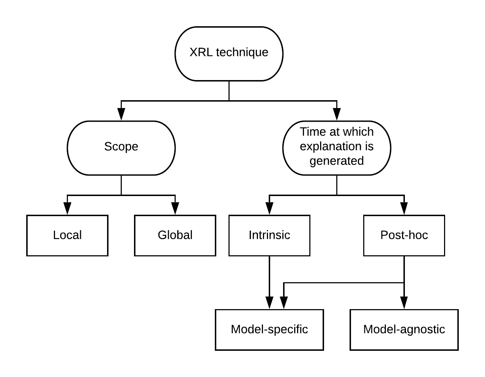

图一。XRL 技术的分类

以下是由研究团队开发的一些潜在的 XRL 方法，显示了有希望的线索。

# 多任务强化学习中的(局部的、内在的)分层的和可解释的技能获取

*多任务强化学习中的分层和可解释技能获取*在【1】中描述了通过两层分层结构在策略设计中引入模块化来扩展多任务强化学习。该框架从根本上基于这样一个事实，即一个复杂的任务需要不同的技能，并且由几个较简单的子任务组成。[1]训练他们的模型在《我的世界》执行对象操作任务，即在《我的世界》中找到、获得、放置或堆叠某种类型的黑色。该模型利用“*优势行动者-批评家”* (A2C)使用非策略学习进行策略优化。该模型具有分层结构，因为每个顶层策略都可以分解为底层操作。在《我的世界》的例子中，堆叠鹅卵石块的任务代表一个复杂的任务，然后代理将其分解为*寻找鹅卵石块*、*获得鹅卵石块*和*放置鹅卵石块的动作。*框架的可解释性来自于每个任务(例如*堆叠鹅卵石块*)都由人类指令描述，并且经过训练的代理只能通过这些人类描述来访问学到的技能，使得代理的策略和决策是人类可解释的。

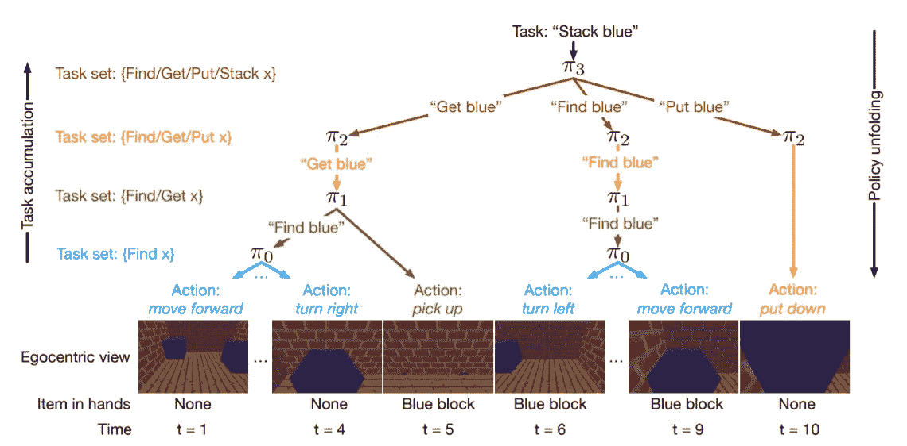

图二。给定任务的多级分层策略示例—堆叠两个蓝色块。每个箭头代表某个策略生成的一个步骤，箭头的颜色表示源策略。请注意，在每一步，策略要么为较低级别的策略发出指令，要么直接采取行动。**来源:【1】中的图 1**

此外，该框架集成了*随机时态语法* (STG) 方法来对任务的时态关系和优先级进行建模(例如，在*将*一个鹅卵石块堆叠在另一个鹅卵石块之上之前；你必须先*找到*一块鹅卵石，*把*捡起来，然后*找到另一块*鹅卵石，*把*手上的那块放上去。因此，该框架的关键思想是将复杂的任务分解成更简单的子任务。此后，如果这些更简单的子任务可以使用代理已经学习的策略或已经获得的技能来解决，则没有学习发生；否则，需要学习新的技能来完成新的动作。这个框架可以用下图来表示。

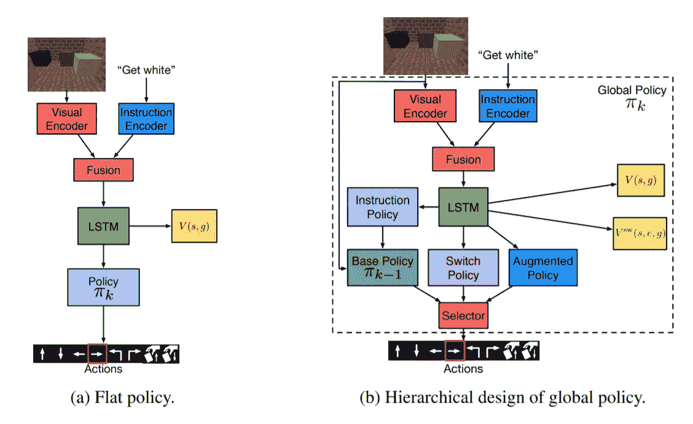

图三。请注意，这里的指令***Get white****是由人类给出的，这使得该策略易于理解。* ***来源:图 2 中【1】***

## 假设

设 ***G*** 为任务集，其中每个任务 ***g*** 代表人的指令(例如上图中的‘Get white’)。在[1]中， ***g*** = ⟨ *技能*，*指令* ⟩双字元组用于描述 Minecraft 中的对象操纵任务。由于它是一个多任务框架，不同任务的目标奖励不同。因此 ***R(s，g)*** 用于描述特定任务的奖励函数，其中***s***=状态*。*最初，代理人是受过码头政策训练的πₒ，负责码头基本任务*。任务集随着人类指导者不断给出指令而连续增加，使得*gₒ***gₗ***⊂…⊂***gₖ、*** 导致如图 2 所示的策略学习。还要注意，在阶段 *k* 和 ***h=k-1*** ，我们将****gₕ****定义为针对*的基本任务集，并将πₕ定义为πₖ.的基本策略对于策略的学习和代理的增强，需要来自人类的以任务形式的弱监督。因此，在多任务强化学习中，需要来自人类的任务强化来获得分层的和可解释的技能。*****

## ***分层策略(注意这里 h=k-1)***

***如在[1]中详述的，分层策略背后的主要思想是当前任务集***【gₖ】***可以被分割成几个子任务，这些子任务可以出现在基本任务集***【gₕ】***中，并且可以使用基本策略πₕ.来解决结果，不是映射当前状态和人工指令来执行如图 3(a)的扁平策略结构中所描述的动作，分层策略设计通过重用基本策略来执行被表征为当前阶段中的子任务的基本任务来利用。处于阶段 *k、* πₖ的全局策略由四个子策略组成:“用于执行先前学习的任务的*基本策略*、管理全局策略和基本策略之间的通信的*指令策略*、允许全局策略直接执行动作的*增强平面策略*以及决定全局策略将主要依赖于基本策略还是增强平面策略的*切换策略*”— [1].*指令策略*负责映射当前状态 ***s*** 和***g***∈***gₖ***到***g***∈***gₕ***，因此其主要功能是向基地策略πₕ传达关于哪个基地任务 ***的信息如前所述 ***g*** 由两个有条件地相互独立的东西(技能和来自指令短语的项目)组成，因此******

*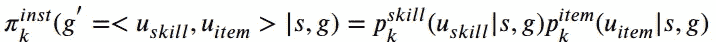*

*当执行某个任务无法实现基本策略时，*增广扁平化策略*进入动作映射状态 *s* 和任务 *g* 到动作 *a、*以便在*中学习新技能解决新任务。上述框架中的*切换策略*在选择何时实施*基本策略*和何时实施*扩展扁平策略时扮演中介者的角色。**切换策略*输出一个二进制变量 *e* ，这样当 *e=0，*全局策略 πₖ遵循*基本策略*，当 *e=1，* πₖ遵循*增强平坦策略。***

**因此，在每一步，模型首先从*切换策略*中采样二进制变量***【eₜ】***，并从*指令策略*中采样新指令***【gˡ】***，以便我们的模型可以从**基本策略中采样动作。*下图总结了每个阶段的流程。***

**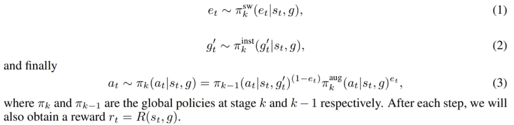**

**每一步的分级策略步骤。**来源:[1]****

## **随机时态语法**

***随机时态语法*用于确定不同任务中的时态关系。例如，要堆叠一个对象，我们首先需要找到、拾取并放置该对象。STG 作为修改分层策略中提到的*开关*和*指令*策略的先验，即采样 ***eₜ*** 和 ***gˡ*** 。在[1]中，STG 在任务*的每一步 k > 0 处由下式定义:1)转移概率，***

***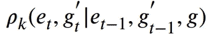***

***和 2)的分布***

***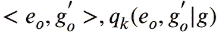***

***因此，将 STG 合并到分层策略中，我们得到如下改进的*开关*和*指令*策略:***

**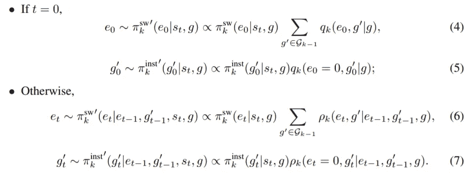**

**通过将 STG 纳入分层策略，改进了交换机和指令策略。**来源:[1]****

**所得到的框架展示了更高的学习效率，能够在新环境中很好地概括，并且本质上是可解释的，因为它需要弱的人类监督来给予代理指令以便学习新技能。**

# **通过因果透镜的(局部的，事后的)可解释的强化学习**

**认知科学提出，为了理解或解释一种现象，人类建立*因果模型*来编码我们周围发生的事件的因果映射。在建立因果模型时，我们不断地问这个问题:*为什么是*或者*为什么不是*。继续这个逻辑，*通过在【2】中详述的因果透镜*可解释的强化学习试图建立一个*结构因果模型*，用于通过感兴趣的变量生成对无模型强化学习代理的行为的因果解释。为了产生解释，对这个结构因果模型进行反事实分析。*通过因果透镜的可解释强化学习*还调查用户通过解释获得的*理解*、用户对*解释的满意度*以及通过解释在用户中诱发的对无模型强化学习代理的*信任*。在*通过因果透镜的可解释强化学习*中，为基于 RL 代理的*马尔可夫决策过程* (MDP)结合了*动作影响模型*，扩展了*结构因果模型* (SCMs)，增加了动作。首先，让我们了解一下 SCMs。**

## **结构因果模型**

**SCMs 的结构因果模型在 [Halpern 和 Pearl 2005](https://academic.oup.com/bjps/article-abstract/56/4/843/1451716) 中介绍。SCMs 使用外生/外部和内生/内部随机变量描绘世界；这些变量中的一些可能具有因果关系，这些关系使用一组*结构方程*来表示。形式上，为了描绘 SCMs，我们必须首先定义一个*签名* ***S*** ，它是一个元组 ***(U，V，R)*** ，其中*是外生变量的集合，*是内生变量的集合， ***R*** 表示指定范围的函数****

****形式定义:**一个*结构因果模型*是一个元组 ***M=(S，F)*** 其中 ***F*** 表示结构方程组，一个对应一个 ***X∈ V*** 这样**

**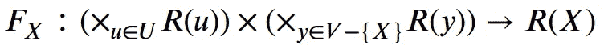**

**根据***【U∪V***中的其他变量给出 ***X*** 的值。换句话说，*给出了模型中其他变量的 ***X*** 的值。另外，*上下文* **𝔲** 被定义为每个外生变量 ***u∈ U*** 的唯一值的向量。一个*情境*是一个模型-语境对 ***(M，**)***。根据结构方程给模型的变量赋值导致*实例化。*事件 *φ* 的*实际原因*由内生变量及其值表示。如果内生变量不同，则事件 *φ* 不会发生，因此在事件 *φ的实际原因中嵌入了一些反事实背景。****

## **行动影响模型**

***行动影响模型*背后的主要意图是便于从行动如何影响环境来解释代理人的行为。因此，我们将 SCMs 的想法扩展到*行动影响模型*，将行动纳入因果关系。**

****形式定义:**一个*动作影响模型*是一个元组 ***(Sₐ，F)*** 其中 ***Sₐ*** 是用一组动作*扩展 SCM 签名的签名即*动作影响模型中的 ***Sₐ*** 然而在这里 ***F*** 对于每个 ***X∈ V*** 有多个值，这取决于𝕒应用的*唯一*动作集。 于是， ***F_{X，******}***刻画了作用*【𝕒】*时对 x 的因果作用。一组*奖励变量****xᵣ⊆v***被分配给 sink 节点。******

*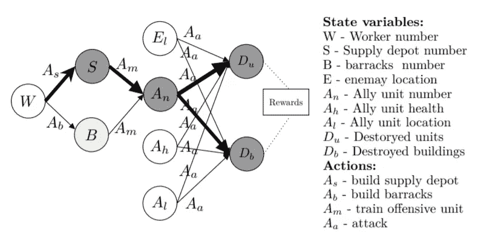*

*图 4。一个星际争霸 2 特工的行动影响图。**资料来源:图 1[2]。**注意，这里我们已经考虑了状态变量的有限集合以及动作的有限集合。取决于独特的输入动作(表示为边)，对于每个状态变量(表示为节点)存在一组结构方程。例如，当应用动作 **Aₘ** 时，状态变量 **Aₙ** 受到状态变量 **S** 和 **B** 的影响，因此结构方程 **F_{Aₙ，Aₘ} (S，B)** 捕捉因果关系。*

## *从行动影响模型中生成解释*

**解释*包括*解释和*要解释的事件和*解释和*证明事件发生的原因。解释生成需要以下步骤:1)定义*动作影响模型*；2)在强化学习中学习*结构方程*；最后，3)为*外植体生成*外植体*。通过因果透镜的可解释强化学习*主要集中于对形式为‘为什么行动 ***A*** *的问题提供解释？*’或*为什么不动作***？*’。同样，它将强化学习背景下的*解释*分为两种类型:1) *完全解释*；和 2) *最低限度的完整解释*。现在让我们正式定义它们。**

****’*为什么？*问题****

****完整解释:**一个*完整解释*可以在*实际实例化* ***M_{V←S}*** 作为一个元组***【xᵣ=xᵣ、Xₕ=xₕ、xᵢ=xᵢ】***下给出一个动作𝕒，其中*是通过移动得到的奖励变量组成的向量 ***Xₕ*** 是由出现在动作𝕒的头节点的变量组成的向量； ***Xᵢ*** 是动作影响图中从头到尾节点的中间变量组成的向量；而 ***、xᵣ、*** 代表通过****m _ { v←s }***实际实例化给出的关联变量的值。****

**因此，根据上述定义的完整解释提供了从行为𝕒到将与行为𝕒.相关联的任何未来报酬变量的完整因果链例如，动作 ***、Aₛ*** 的因果链在图 4 中显示为黑色。在这种情况下，完整的解释元组将是***(【s = s】，【Aₙ=aₙ】，【Dᵤ=dᵤ，d _ { b } = d _ { b })***。深度优先搜索算法可用于从动作的头节点到所有汇聚节点遍历动作影响图。**

****最小完整解释:**对于较大的图，中间节点的数量越多，可能会导致混乱。在这种情况下，*最小完整解释*可能会派上用场。最小完整解释定义为元组 ***(Xᵣ=xᵣ、Xₕ=xₕ、xₚ=xₚ)***其中 ***Xᵣ=xᵣ*** 和 ***Xₕ=xₕ*** 类似于前面的定义，*代表变量的向量，这些变量是*的直接前身。选择直接前辈是因为他们描述了奖励的直接原因。请注意，在*中要考虑的中间节点的数量最小完整解释*取决于应用以及用户的知识。****

*****‘为什么不？’问题*****

**通过比较事件发生的因果链和*解释和*(反事实行动)，可以产生反事实解释。首先，让我们定义*反事实实例化*，在此情况下，我们分配最佳状态变量值，使得*反事实动作*将被选择。**

****反事实实例化:**关于*反事实行动* 𝕓的*反事实实例化可以从模型 ***M_{Z←S_{z}}*** 中给出，其中 ***Z*** 利用*结构方程*实例化行动𝕓的所有前趋变量以及落入𝕓因果链的后继变量。***

***极小完全对比解释:**对于一个动作𝕒在实际实例化****m _ { v←s }***下给出极小完全解释 ***Y=y*** 对于一个动作𝕓在反事实实例化 ***M_{Z←S_{z}}*** 下给出极小完全解释，我们 Xᵣ=xᵣ) 其中 ***Xˡ*** 和 ***Yˡ*** 是满足条件***(xˡ=xˡ)∩(yˡ=yˡ)≦*∅**的变量的最大集合 ***X*** 和 ***Y*** 。 此后我们对比 ***xˡ*** 和 ***yˡ*** ( *差异条件*)。注意，这里的 ***Xᵣ*** 对应于𝕒.行动的奖励节点**

**因此，*最小完成对比解释*用于提取行动𝕒的实际因果链和行动𝕓.的反事实因果链之间的差异**

## **例子**

**检查图 4 所示的星际争霸 2 代理的*动作影响图*。利用这个图表，我们将尝试回答这个问题:
**’*为什么要建造补给站(Aₛ)？* '** 和 **' *为什么不建兵营(A_{b})？*’**。**

**设*m*=【w = 12，S = 3，B = 2，Aₙ = 22，Dᵤ = 10，D_{b} = 7】为实际实例化，mˡ=【w = 12，S = 1，B = 2，Aₙ = 22，Dᵤ = 10，D_{b} = 7】为反事实实例化。实现*差分条件*，我们得到最小完全对比解释为
([S = 3]，[S = 1]，[Dᵤ = 10，D_{b} = 7])。通过比较[S=3]和[S=1]，可以从 NLP 模板中得到一个解释:*因为目标是增加被摧毁的单位(Dᵤ)和被摧毁的建筑(D_{b})，所以建造补给站(Aₛ)来增加补给数量是有意义的。*注意，变量的值是通过*学习结构因果方程在实例化过程中获得的。***

## **学习结构因果模型**

**给定描述变量之间因果关系的有向无环图，在强化学习代理的训练期间，结构方程可以被学习为多元回归模型。通过将***【eₜ=(sₜ，aₜ，rₜ，s_{t+1})*** 保存在一个数据集***【dₜ={e₁，…，eₜ}*** 中的每个时间步，可以实现经验回放。然后，利用回归学习器𝕃.更新结构方程 ***F_{X，A}*** 的子集注意，我们只更新与指定动作相关的变量的结构方程。例如，参考图 4，对于任何具有动作*的经验帧，只有等式 ***F_{S，Aₛ}(W)*** 将被更新。注意，任何回归学习器都可以用作学习模型𝕃，例如 MLP 回归器。***

**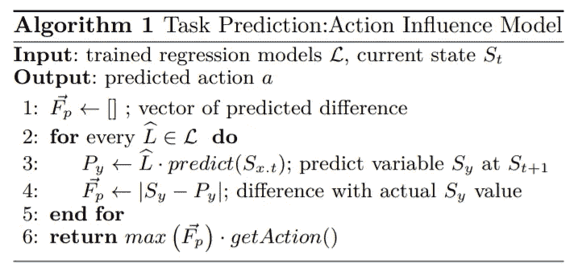**

**图五。学习结构方程的算法。**来源:[2]****

**如需查看更多主题，如该技术的*计算和人类评估*及其结果，请参考【2】。**

# **(局部的，事后的)对可解释的强化学习代理的远端解释**

**[扩展到*通过因果透镜的可解释强化学习***

**尽管使用*动作影响模型*生成的解释击败了标准的*状态-动作模型* , *结构方程*在计算任务预测准确性方面表现不佳。因此，用结构方程来模拟变量之间的因果关系，在[4] 中详细描述的对可解释的强化学习代理的*的远端解释建议使用来自决策树的决策节点来生成利用因果链的解释。***

## **生成因果解释的决策树**

**用于生成*远端解释*的模型由决策树中的一个决策节点组成，该决策树描绘了代理的完整策略，并与前面部分的动作影响模型中的因果链相链接。假设𝕋代表一个决策树模型。然后在训练强化学习代理的同时，我们通过将每个阶段的***【eₜ=(sₜ，aₜ)****存储成一个数据集***【dₜ= {e₁,…,eₜ}***来实现经验回放。此后，我们从 ***D*** 中统一抽取小批量样本，以 ***sₜ*** 作为输入，以 ***aₜ*** 作为输出，来训练𝕋。对其节点数量没有限制的决策树将导致混乱和压倒性的解释，因此在[4]中，通过将叶子的数量设置为等于代理域中可能的动作的数量来限制决策树𝕋的增长。在[4]中，评估表明，与没有约束的情况相比，约束决策树𝕋几乎不影响计算任务预测精度。为了存储状态为*的决策树𝕋的决策节点，模型从根节点开始遍历决策树，直到到达叶节点，在此期间，模型存储其路径中的模式。例如，从图 6 中， ***、Aₙ*** 和 ***B*** 是动作 ***、Aₛ*** 的决策节点。注意，决策节点代表代理状态空间的特征变量。****

**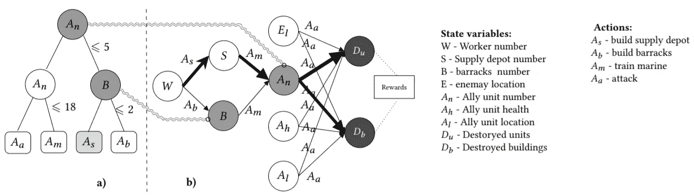**

**图六。从与行动影响模型的因果链(右)相链接的决策树(左)中生成远端解释。**资料来源:图 3。****

**现在，我们将从决策树中为 ***定义*最小完全解释*‘为什么？’*提问**提问。**

***极小完全解释:**给定一组决策节点***【xₘ=xₘ】***对于来自决策树𝕋的动作𝕒，一个*极小完全解释*对于一个*为什么*的问题可以定义为一个元组***【xᵣ=xᵣ，xₙ=xₙ】***其中 ***Xᵣ*** 是奖励变量的集合；而 ***Xₙ*** 是条件为***【xₙ=(xₘ=xₘ)∩(xₐ=xₐ】***的极大变量的集合；这里的 ***Xₐ*** 代表了𝕒.行动因果链中的一组中间变量注意，这里的 ***xₘ、*** 和 ***xₐ*** 描绘的是实际实例化 ***M_{V←S}*** 下变量的值。*

*考虑星际争霸 2 的代理，这是对问题 ***“为什么是 Aₛ?'”的最简单完整的解释*** 可由元组***(【aₙ=aₙ】，【Dᵤ=dᵤ，d _ { b } = d _ { b })***；如这里的*和 ***D_{b}*** 代表奖励变量 ***Aₙ*** 是因果链 ***(S→Aₙ→[Dᵤ，d _ { b })***的交点，如图 6(b)中的粗体字所示**

****最小完全对比解释:**一个*最小完全对比解释*对于一个*为什么不*的问题可以由一个元组 ***(Xᵣ=xᵣ，X_{con}=x_{con})*** 给出其中 ***Xᵣ*** 类似于前面的定义 ***X_{con}*** 是满足条件
***的最大变量集这里 ***X_{b}*** 表示反事实行动𝔹因果链中的一组中间节点， ***X_{c}*** 表示*反事实决策节点*。注意，值*和 ***x_{c}*** 是使用*实际实例化* ***M_{V←S}*** 和*反事实实例化****m _ { z←s _ { z } }***进行对比的。利用下面的算法生成反事实决策节点 ***X_{c}*** 。******

*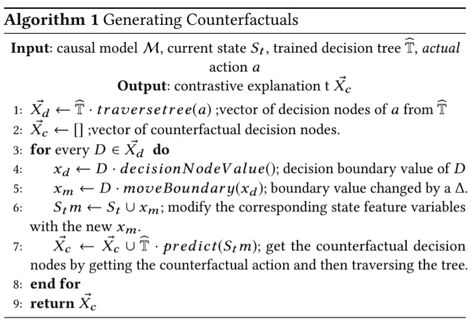*

*图 7。生成反事实的算法。**来源:[4]***

*现在作为一个例子回顾星际争霸 2 的代理任务，考虑问题***‘为什么不建造兵营 A _ { b }？’*** 。对比解释生成如下。最初，从决策节点*和 ***B*** 中提取决策边界值，即对于***【aₙ】***≤5，对于***【b***>2。此后，从最接近叶节点的决策节点开始，少量改变该值δ= 0.01，从而在代理的当前状态中生成新的特征值。这里变量 ***B*** 的特征值将变为 1.99。在这种新状态下，从决策树中预测反事实动作为 ***A_{b}*** ，并通过遍历该树来提取反事实决策节点。随后，我们得到 ***X_{con}=B*** ，因为 b 是反事实行动 ***A_{b} (B→Aₙ→[Dᵤ，d _ { b })***和 ***X_{c}*** (本迭代中为 ***B*** )因果链中节点的交点。现在我们对比实际值(3 来自因果模型 ***M*** 和决策树𝕋的训练)和 ***B*** 的反事实值(1.99)，并添加奖励变量，以使用 NLP 生成对比解释。**

## **学习机会链**

***某些动作激活其他动作的执行*。在强化学习领域，我们将*远端动作*定义为最依赖于代理执行的*当前*动作。例如，在星际争霸 2 中，动作训练陆战队员*不能在建造兵营 ***A_{b}*** 之前进行。现在要生成*远端解释*，首先需要预测*远端动作*。[4]利用多对一递归神经网络(RNN)作为预测模型𝕃，在给定先前状态和代理采取的动作的情况下近似远端动作。𝕃的输出是远端动作及其累积回报。参考[4]第 4.4 节关于𝕃.的架构、训练和训练数据的信息在训练了远端动作预测模型𝕃之后，我们现在可以为*‘为什么？’定义*最小完整远端解释**和*‘为什么不？’*提问。***

***极小完全远端解释:**给定一个*极小完全对比解释*，当前动作𝕒和一个远端动作预测模型𝕃，一个*极小完全远端解释*可以用一个元组 ***(Xᵣ=xᵣ，X_{con}=x_{con}，aₐ)*** 来定义其中*和 ***X_{con}*** 被定义为较早的和**这里的 ***A*** 表示智能体的动作集合，而 ***Aₒ*** 表示当前动作𝕒.的因果链中的动作集合****

## **例子**

**考虑问题*‘为什么要训练陆战队员* ***Aₘ*** *而不是建造兵营****a _ { b }****？’。*经过分析，我们得到 ***Aₙ*** 为反事实节点，实际值为 10，反事实值为 5。同样，使用*(攻击)作为预测的远端动作，可以使用 NLP 生成远端解释。***

*****因果解释**(通过因果透镜使用*可解释强化学习生成‘最小完全对比解释*)***

**“因为做动作训练陆战 ***Aₘ*** 更可取，以拥有更多盟友单位 ***Aₙ*** 为目标是拥有更多被摧毁单位*dᵤ***d _ { b }***。”— [4]第 4.4 节***

****远端解释**(使用*可解释强化学习代理的远端解释“为什么不”问题的最小完整远端解释*生成)**

**“因为同盟军的单位数量***【aₙ】***小于最优数量 18，所以更可取的做法是把行动列车做陆战****改为*** 启用*这次行动的目标是有更多被摧毁的单位*和被摧毁的建筑【T100— [4]第 4.4 节*****

***如需查看更多主题，如该技术的*计算和人类评估*及其结果，请参考【4】。***

# **参考**

1.  **舒，t，熊，c，Socher，r .:多任务强化学习中的层次性和可解释技能习得(2017)**
2.  **透过因果透镜解释强化学习。 *arXiv 预印本 arXiv:1905.10958* (2019)。**
3.  **原因和解释:结构模型方法。第一部分:原因，*英国科学哲学杂志*，第 56 卷，第 4 期，2005 年 12 月，第 843–887 页，【https://doi.org/10.1093/bjps/axi147】T4**
4.  **对可解释的强化学习代理的远端解释。arXiv 预印本 arXiv:2001.10284 (2020)。**