# 用户参与度的突然下降

> 原文：<https://towardsdatascience.com/yammer-investigating-a-sudden-drop-in-user-engagement-7c9c4093c038?source=collection_archive---------11----------------------->

## 使用产品分析、数据可视化和数据科学方法来调查 Yammer 用户参与度的下降

[自由股票](https://unsplash.com/@freestocks?utm_source=medium&utm_medium=referral)在 [Unsplash](https://unsplash.com?utm_source=medium&utm_medium=referral) 上的照片

*免责声明:我不为 Yammer 工作，这是一个公开的数据案例研究，我用叙述的形式写它是为了让这个案例研究更吸引人。*

这是周一的早晨……你端着一杯咖啡坐在桌前——眼睛几乎没有睁开。突然，产品主管拍了拍你的肩膀，把他的笔记本电脑摔在你的桌子上。

***“我们的周参与度怎么会在一个月内下降 21%？!"***

**Sighhhhhhh**

你掰着手指头，放下你的咖啡——“让我看看”。

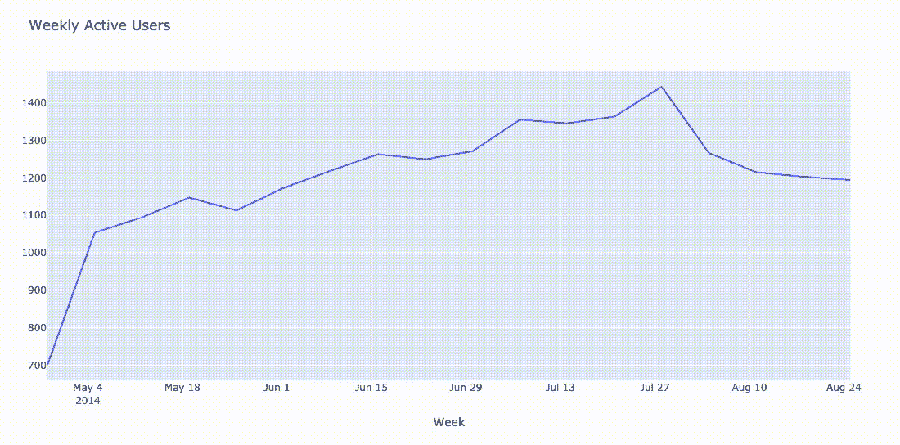

嗯……乍一看，从 7 月 28 日开始，我们的每周参与水平一直在稳步下降。在 Yammer，我们将“参与”定义为与产品进行“服务器调用”(也就是用户点击了什么)的任何交互。

一般来说，大多数公司将用户参与度视为其产品整体增长和健康的主要 KPI(关键绩效指标)之一。

对于那些没有听说过我们的人来说， [Yammer](https://www.microsoft.com/en-ca/microsoft-365/yammer/yammer-overview) 是一个面向企业的社交网络(类似于脸书的 Workplace)。员工可以发送消息、搜索内部网、共享文档和发布更新。

## 诊断问题

在花太多时间诊断 KPI 变化的根本原因之前，我首先检查一下这个心理清单，以确保根本原因不是由非产品因素引起的，如广告、bug、错误等。

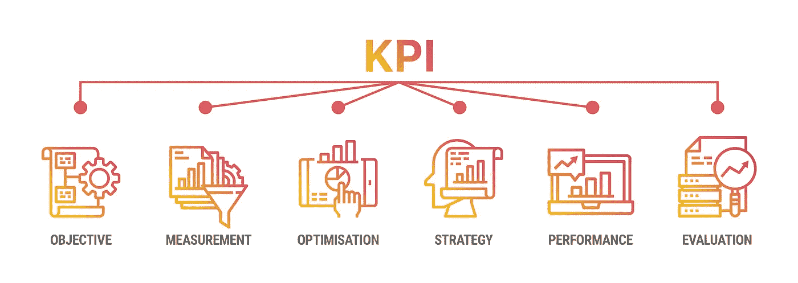

图片作者:Richard Yang

**时间**:时间是一个很好的考虑因素，因为不规则趋势在绘制时更容易发现。以下是最常见的与时间相关的数据问题:

*   这种参与度的下降是突然的还是逐渐的？⟶:如果是突然的，那么请与工程团队一起检查是否进行了任何部署，如果是渐进的，那么可能与用户行为的变化有关。
*   这是一次性事件还是经常发生的问题？⟶:一次性问题可能是由技术问题或营销活动引起的，而重复性问题可能是由行为变化引起的。
*   我们会在一天中的特定时间或一周中的特定日子看到下降更明显吗？局限于特定时间或日期的⟶下降可能表明存在技术问题，例如通常在周末发生的数据刷新失败。

**地区**:考虑地区参与度很重要，因为公司在测试新产品或地区互联网审查/法律限制使用时，可能会在特定地区推出功能。要问的一些问题是:

*   我们看到的参与度下降是局限于某个特定地区，还是分布在全球各地？由于消费者行为的文化差异，某些功能在特定地区可能表现得更好或更差。
*   随着参与度的下降，该地区的互联网审查法律最近有什么变化吗？

**其他功能/产品**:在同一个空间内保持其他产品/功能的常规标签对于识别公司层面的潜在变化非常有用。要问的一些问题是:

*   其他功能或产品的参与度是否也出现了类似的下降？⟶:如果这种下降在其他产品和功能中普遍存在，那么这个问题将会是一个更大的问题，需要多个团队参与调查。
*   生态系统中的其他类似功能或产品的参与度是否成比例增加？⟶用户可能会转向使用不同的产品或功能来满足他们的用例，导致 Yammer 的分食。

**平台**:根据用户使用 Yammer 的平台，UX 显示和 ENG 发布流程有所不同，如果问题是技术性的且仅限于某个特定平台，您可以缩小范围。一些常见的问题是:

*   我们是否看到跨特定平台(即移动、桌面、平板)还是跨所有平台？
*   衰落是 android 还是 iOS 或者其他操作系统特有的？

**行业/竞争对手**:跟踪 Yammer 在行业中的表现并了解总体趋势对于市场空间意识非常有用。竞争对手的信息可能很难获得，但我们仍然可以利用新闻文章、谷歌趋势搜索和第三方数据来获得高层次的见解。

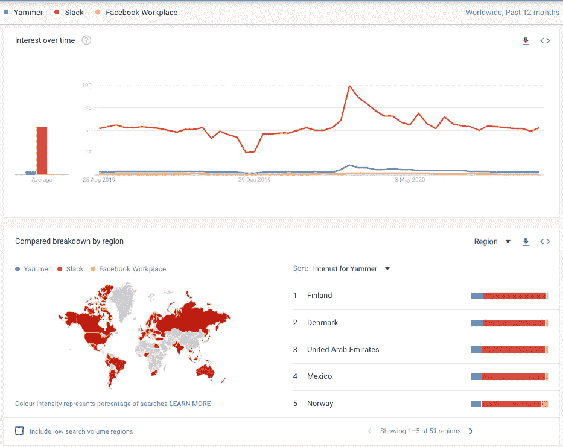

谷歌趋势搜索 Yammer 与顶级竞争对手的比较

**损坏的特征/跟踪代码**:也有可能某些特征或跟踪代码损坏，从而影响事件的记录方式。用户在与应用程序交互时触发的事件的映射层次结构对于确定用户离开的位置非常重要。

**僵尸工具和搜索爬虫引擎**:大多数主要网站都有来自僵尸工具的高活跃度，但是很难确定由僵尸工具触发的事件。高流量网站也由搜索引擎优化引导，搜索引擎索引的变化会导致流量的显著变化。

**重大事件**:一次性事件也有可能导致人员涌入或参与度大幅下降，如假期、成功的活动和负面新闻。

## 数据的约束

在这个案例研究中，我们唯一可以操作的数据集是:时间、地区、平台和事件跟踪。如果您想查看用于分析的源数据和代码，请查看下面的嵌入式笔记本链接:

 [## nbviewer 笔记本

### 看看这个 Jupyter 笔记本！

nbviewer.jupyter.org](https://nbviewer.jupyter.org/github/JodiZhang/Yammer-Case-Study/blob/392955b5c34d4611179c7ec0396b5131287c197c/Drop%20in%20User%20Engagement/Yammer%20Case%20Study%20-%20Drop%20in%20User%20Engagement.ipynb) 

*注意所有的 [Plotly](https://plotly.com/python/) 图表都是交互的，可以点击拖拽放大图表或者点击图例中的类别进行过滤。

## 假设

**潜在原因 1**

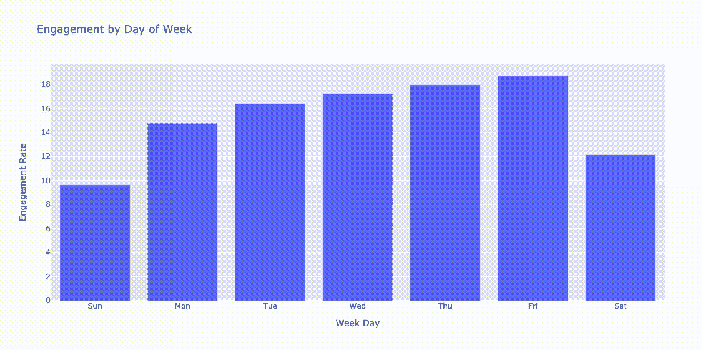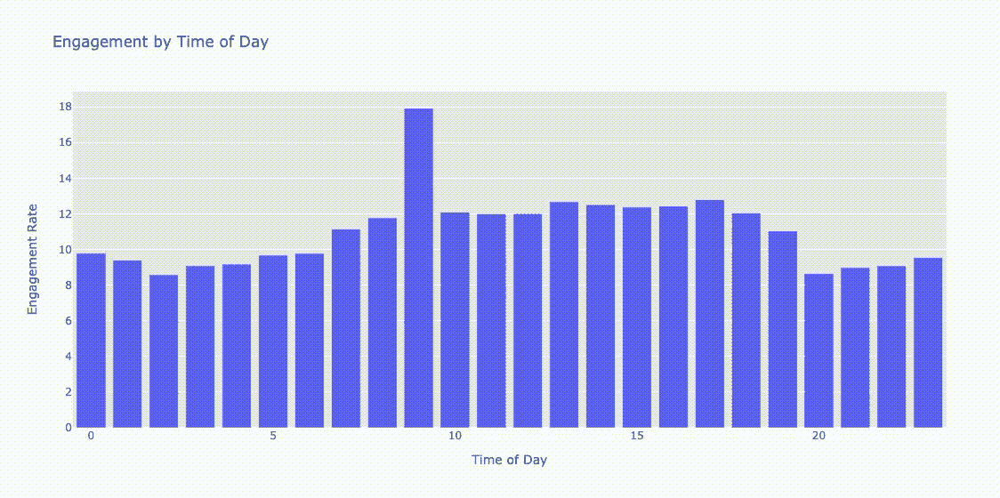

*   根据上面的图表，周六和周日的参与率最低[这是有道理的，因为 Yammer 主要用于工作。](https://keyhole.co/blog/how-do-i-calculate-engagement-rate/#:~:text=Engagement%20rate%20is%20calculated%20as,independent%20of%20your%20follower%20count.)
*   当按一天中的时间(基于 24 小时制)检查参与度时，看起来上午 9 点是用户与 Yammer 交互最频繁的时候，而一天中的其他时间并不突出。
*   由于参与度的下降是在几个月的时间内逐渐发生的，并且不局限于某一天或某一时间，因此我们可以假设原因不太可能是一次性服务器/技术中断或数据更新失败。

**潜在原因 2**

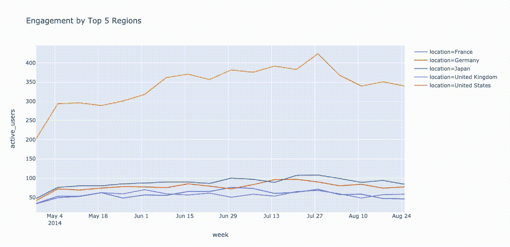

*   因为 Yammer 被多个地区使用，所以最好根据用户数量来分析前 5 个地区。
*   从上图中可以看出，美国的活跃用户下降幅度最大，而其他地区的下降幅度较小。
*   如果有任何新的发布或者产品升级只局限于某个州，与其他团队一起快速检查将是非常有用的。

**潜在原因 3**

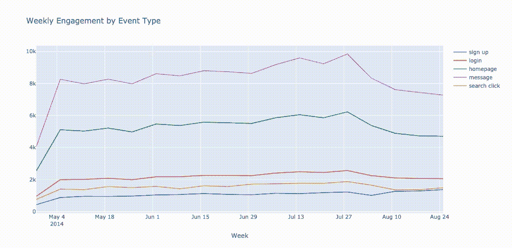

*   Yammer 中的事件(动作)分为以下几类:登录事件、消息事件、搜索事件和注册漏斗事件。
*   从上图中可以清楚地看到，用户能够在注册漏斗中导航，但其他活动的参与度有所下降。

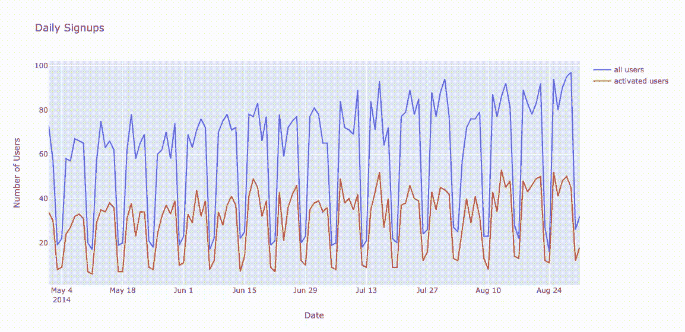

*   增长率或激活率是所有公司密切跟踪的指标，因为这意味着 Yammer 为新客户提供了预期的价值。
*   根据上面的图表，增长率保持正常，因为它继续在工作日保持高水平，在周末保持低水平。
*   在没有注册(增长)问题的情况下，参与度的下降可以被认为是来自老用户/现有用户。

**潜在原因 4** *:由于缺乏老用户的支持，参与度下降*

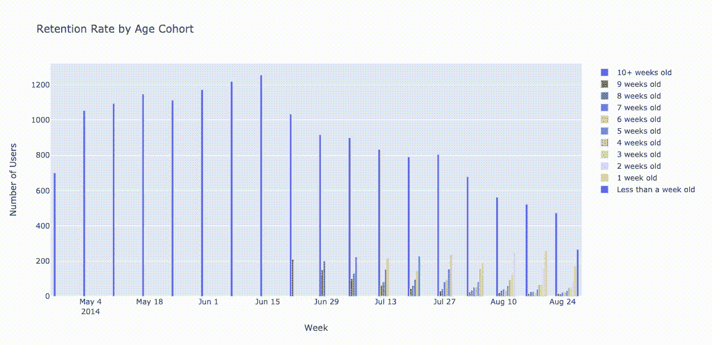

*   做一个[群组分析](https://clevertap.com/blog/cohort-analysis/#:~:text=Cohort%20analysis%20is%20a%20subset,into%20related%20groups%20for%20analysis.)是追踪任何用户群的最常见的方法之一。从长远来看，它有助于为用户描绘一幅关于 Yammer 产品有效性的更好的画面。
*   按年龄对用户进行细分后，很明显，那些在 5 月 1 日前 10 周以上注册的用户，参与度会随着时间的推移而下降。单独观察每一组，随着时间的推移，他们的参与度也会下降。
*   由于该问题与成熟用户有关，因此该问题不太可能与营销流量或机器人和搜索爬虫的一次性高峰有关，后者可能会导致不可持续的参与闪电战。
*   该产品有一个“[粘性](https://www.pendo.io/pendo-blog/use-stickiness-ratio-measure-product-health/)的问题，因为随着时间的推移，我们的用户似乎越来越不喜欢我们的产品。

**潜在原因 5** *:由于我们的每周摘要电子邮件未能达到预期目的而导致参与度下降。*

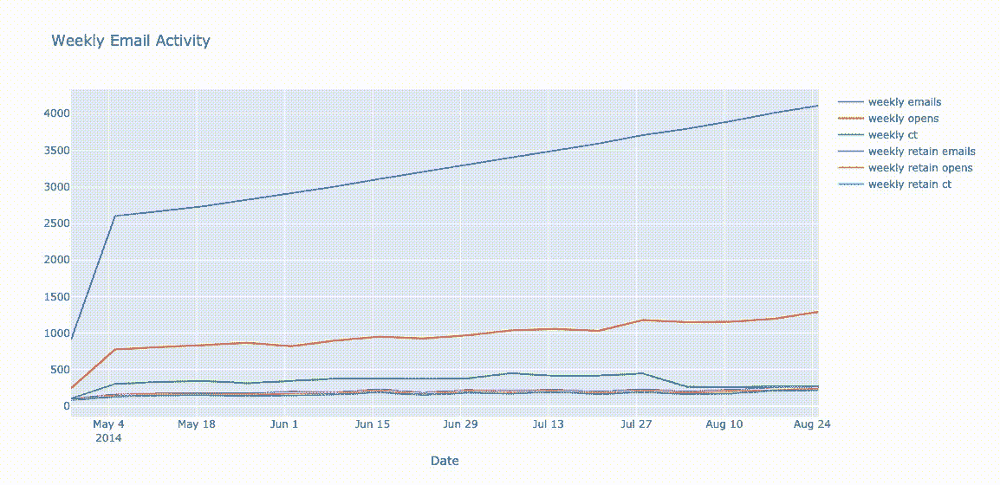

*   为了吸引和重新吸引用户，Yammer 每周都会发送摘要邮件和重新吸引邮件。
*   根据上面的图表，每周发送的电子邮件数量和每周打开的电子邮件数量一直在增加，但每周点击率大幅下降，而每周重新参与度指标正常。

*   即使打开率在增加，点击率的降低也可能意味着每周摘要电子邮件内容与用户不够相关，或者预期的用户动作不够明确。如果 CTR 为 0，则表明按钮或功能损坏。

**潜在原因 6**

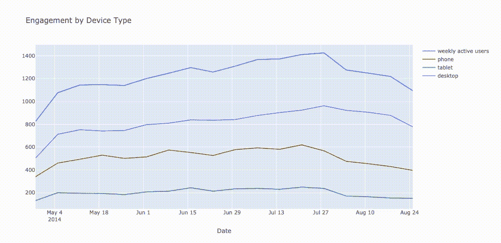

*   如上图所示，使用手机的用户的参与度下降更为明显
*   这可能是由于 Yammer 的移动应用程序最近的变化或发布

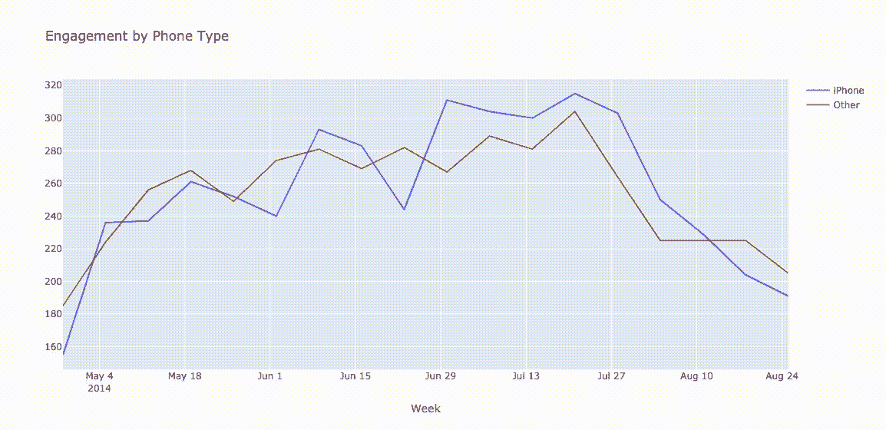

*   为了更好地理解，在不同的操作系统之间比较相同的指标是有用的，因为每个操作系统的应用程序都有不同的代码版本
*   看起来不管什么操作系统，通过手机访问 Yammer 的用户越来越少参与
*   这种情况让我认为，随着时间的推移，留住 Yammer 手机用户存在问题，这可能是由于 UX 的设计问题或功能失调导致的不满。

## 结论

从我们的分析中，我们可以推断，长期访问 Yammer 的移动用户会因为可用性问题或不相关的内容而逐渐脱离。尽管电子邮件打开率相对较高，但我们从每周摘要中观察到的点击率要低得多。这可能意味着我们的电子邮件内容存在问题，例如相关性或质量。

鉴于用户参与度下降的多种不同假设，我会与其他学科，如工程、设计、营销和产品，讨论验证策略。验证策略包括 AB 测试、功能回滚和区域划分。

## 学习使用的技术

*   自从我用 SQL 开始我的数据之旅以来，我用 SQL 做连接和聚合要比 Pandas 舒服得多。我决定使用 [SQLite](https://www.sqlite.org/index.html) 进行所有更复杂的数据操作，并发现大部分功能和语法与 MySQL 相同。在我的用例中，主要的区别在于[的日期和时间函数](https://www.sqlite.org/lang_datefunc.html)。如果 SQL 语法是您首选的语言，我建议个人使用 SQLite 来查询数据框。
*   我使用 Plotly 的 Python 图形库来实现所有的可视化和交互式图表/图形。我喜欢交互式组件:悬停、单击和拖动以放大元素和 Plotly 图表的简单布局。与 Matplotlib、Seaborn 和 Bokeh 相比，这是我更喜欢的可视化库。我发现很难在网上找到关于如何绘制某些图形的案例具体示例，所以我不确定我是否以最有效的方式绘制了折线图和条形图——希望听到一些关于所写代码的反馈。
*   Plotly 的交互图表也不能在 GitHub 中渲染。如果你想保留你的图表来分享你的 Jupyter 笔记本/实验室中的分析，我推荐使用 [nbviewer](https://nbviewer.jupyter.org/) 来渲染你发布的笔记本。

> 你可以在这里找到原案:[https://mode.com/sql-tutorial/a-drop-in-user-engagement/](https://mode.com/sql-tutorial/a-drop-in-user-engagement/)