# 使用 OpenCV，TensorFlow，MNIST，在 Python 中检测 Yatzy 评分表

> 原文：<https://towardsdatascience.com/yatzy-score-sheet-detection-in-python-using-opencv-tensorflow-mnist-97ce685d80e0?source=collection_archive---------11----------------------->

## 完整的实现与代码部分的图像处理和 CNN 模型训练

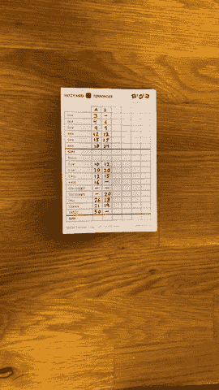

[Yatzy 评分表](https://apps.apple.com/se/app/yatzy-score-sheets/id1462576084) iOS 应用程序

自从几年前我开始玩 yatzy(真的，有点上瘾)以来，我一直希望我们有机会玩 Yatzy 而不需要物理分数表。我发现了一些应用程序，但没有一个真正好用或有趣的。在发布了一个简单的 yatzy 分数跟踪应用程序后，我的工程头脑开始发挥扫描 yatzy 分数表的想法。我意识到，对于部署的计算机视觉任务来说，这可能是一个合理范围内的好任务。它还将包括[机器学习](https://en.wikipedia.org/wiki/Machine_learning)，在那里你必须考虑更多的事情，而不仅仅是在 [**测试**](https://en.wikipedia.org/wiki/Training,_validation,_and_test_sets#Test_dataset) 集上获得最佳准确度。您必须部署您的模型，让您的生产数据符合模型等等。在这篇文章中，我将介绍这个项目的各个步骤，包括**从 RGB 图像中识别 yatzy 评分表，并对手写输入的数字进行分类**。代码是使用 OpenCV 和 TensorFlow 用 Python 写的。

# **第 1 部分:识别 Yatzy 表**

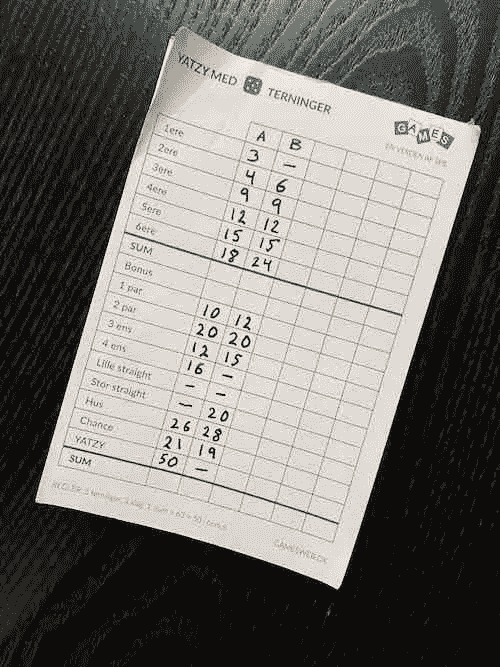

这种分类/检测任务的一种(强力)方法是将我们所有的[轮廓](https://docs.opencv.org/3.4/d4/d73/tutorial_py_contours_begin.html)传递给 [TensorFlow](https://www.tensorflow.org/) CNN 模型进行预测，并训练它能够从手写数字中分离噪声。然而，这将意味着我们可能不得不将大量的噪声传递给我们的模型进行预处理和预测。对于我们的模型来说，这不是一个微不足道的任务，因为我们不知道这些数字相对于图像应该有多大。我们也不知道这些轮廓属于什么样的细胞(点)？这就是为什么我们开始识别 yatzy 表，并“减去”网格，以确保我们只(希望)发送数字到分类器。为了识别任意工作表，我们需要定义定义任意工作表的规则。我对常规工作表使用的规则是:

*   19 行数。
*   网格中的每个任意单元格具有相似的尺寸，即不同单元格的**高度**和**宽度**相同。

识别**网格**的步骤:

1.  将 RGB 图像转换为单通道二值图像。

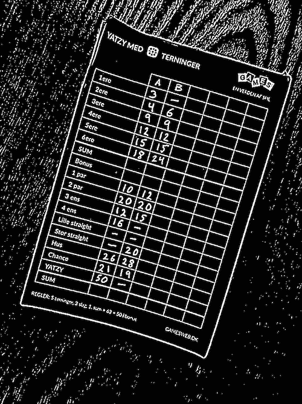

RGB 到二进制图像

步骤 1 的代码

2.识别最大的[轮廓](https://docs.opencv.org/3.4/d4/d73/tutorial_py_contours_begin.html)(具有相似强度的连接点)

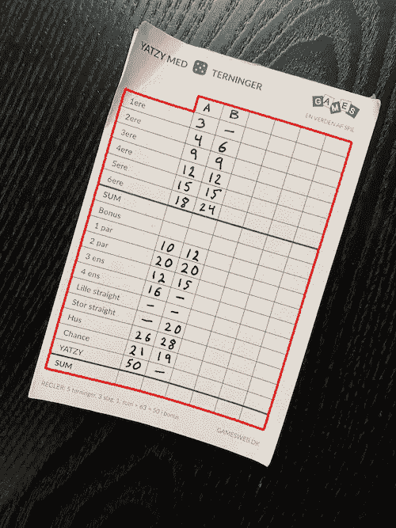

最大轮廓。第二步

3.根据[可以用一个矩形](https://docs.opencv.org/3.4/d3/dc0/group__imgproc__shape.html#ga3d476a3417130ae5154aea421ca7ead9)表示的最小面积对图像轮廓进行旋转。

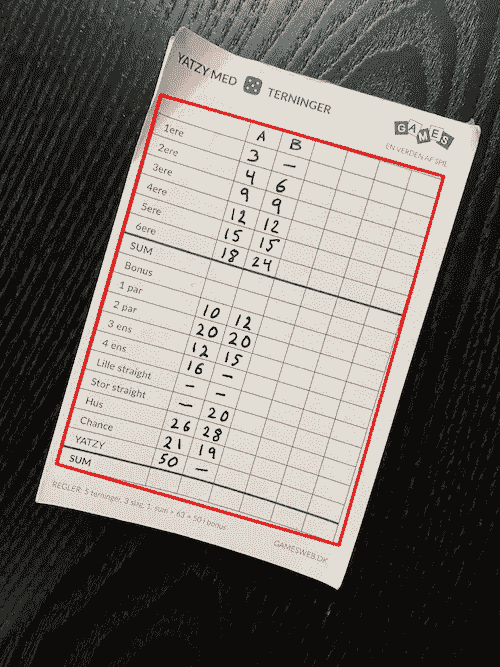

在步骤 3 中旋转之前，最大轮廓的最小旋转矩形区域

步骤 2 和 3 的代码

步骤 2 和 3 的代码

4.对二进制图像执行[形态学](http://homepages.inf.ed.ac.uk/rbf/HIPR2/morops.htm)操作，以便在新的二进制图像上绘制垂直和水平线条，表示 yatzy 网格。有关绘制的线条，请参见下图。

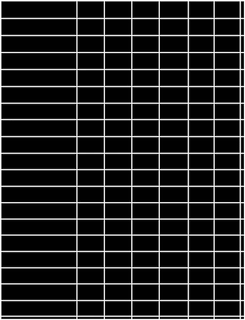

步骤 4 之后，绘制了垂直水平线的二进制图像

步骤 4 的代码，识别 yatzy 网格

步骤 4 的代码

5.识别 yatzy 网格中的每个 Yatzy 单元格，并按照最左上角的位置对它们进行列排序 **(x，y)** 。我们通过在步骤 4 的二进制图像上使用 **findContours** 来实现，该图像只包含水平/垂直线条。

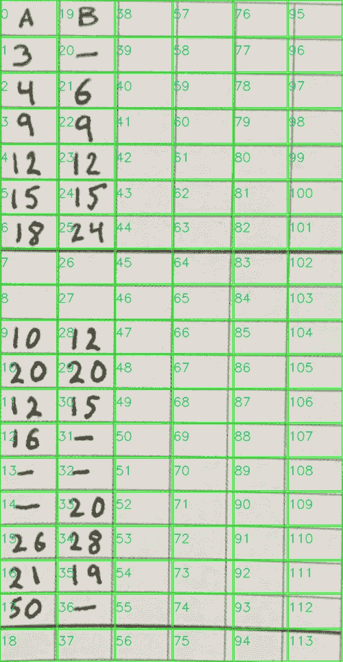

参见调用上述代码的完整 **generate_yatzy_sheet** 函数。

调用步骤 1–5 的函数

以上要点的完整源代码可从 [**这里**](https://github.com/oankarberg/yatzy-score-sheet-detection) 获得

# **第二部分。手写数字训练**

[MNIST](http://yann.lecun.com/exdb/mnist/) 是一个包含 70 000 张 28x28 图像和手写数字的数据集。35，000 个来自高中生，35，000 个来自人口普查局员工，分成 60，000 个用于训练图像，10，000 个用于测试各自的组。

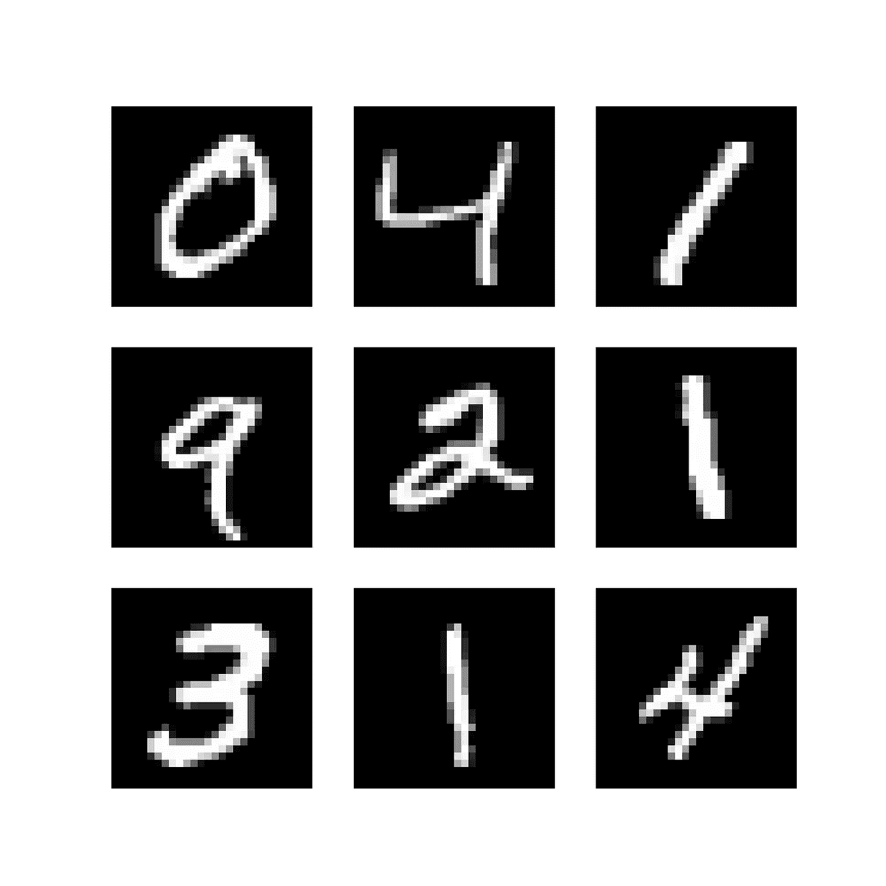

来自 MNIST 数据集的样本图像

MNIST 图像的尺寸为 28×28 像素，是黑白的，带有一些灰度，这是标准化算法(高斯等)使用的[反走样](https://i.stack.imgur.com/pA7uy.png)技术的结果。手写数字包含在一个 20×20 的边界框中，具有保留的纵横比。然后，通过在每个侧面图像上引入 4 个像素的填充，将 20x20 的盒子转换为 28x28 的容器。然后，通过计算质心并将其平移到这个 CoM 点，该数字在 28×28 像素的图像中居中。质心实际上是 x 轴和 y 轴上的白色像素平均值。(我们稍后将模仿这些步骤进行产量预测)

对于训练，我们使用 CNN 架构。如果你不熟悉 CNN，我推荐你在这里阅读更多相关内容。

```
INPUT -> CONV3-32 -> RELU -> CONV3-32 -> RELU -> CONV3-32 -> RELU -> POOL -> DROPOUT -> FC -> RELU -> DROPOUT -> SOFTMAX
```

下面的代码用于为模型定型。请注意我们是如何去除高斯反走样并将图像转换为二进制图像的。我们这样做是因为我们不知道在 MNIST 使用的精确算法来创建反锯齿效果。否则，我们的生产数据将与培训设置不匹配。我们可以执行一个新的高斯反走样效果后，我们把它变成二进制，但是在测试后，我没有注意到高斯过滤器的任何性能改善。

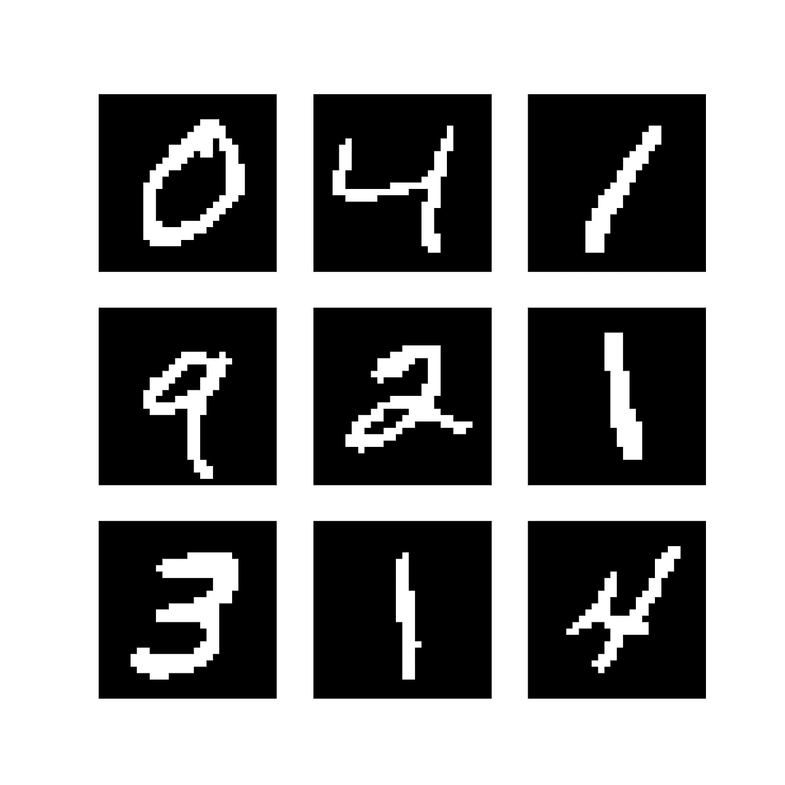

转换成二进制图像后的来自 MNIST 的样本图像

训练我们的卷积神经网络的全部代码。

训练卷积神经网络

最后，我们打印 train/val 损失和 train/val 精度，以衡量我们的模型在不同时期的表现。看起来没问题，合理的验证指标很好地遵循了培训。

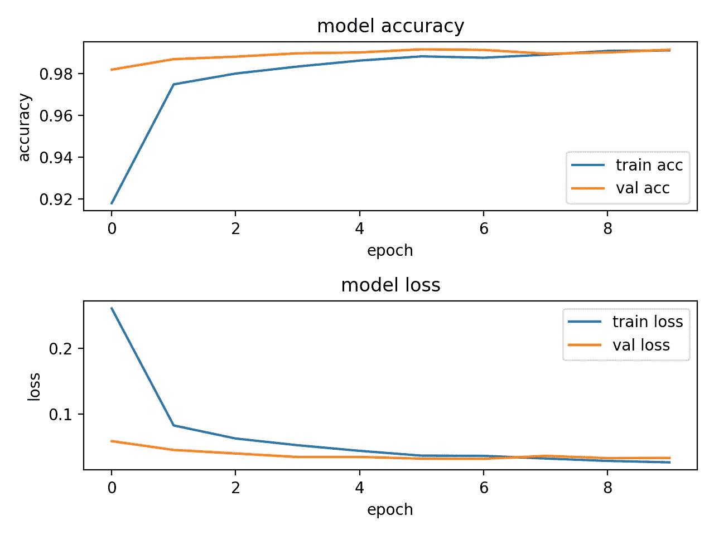

CNN 模型的度量

# 把它放在一起

现在，当我们拥有数组格式的 yatzy 网格和 CNN 模型时，我们可以开始用 yatzy 单元绘制数字轮廓位置，并通过感兴趣区域(ROI)进行预测。

1.  阅读张量流模型
2.  从 RGB 图像生成任意图片
3.  使用生成的 Yatzy 表(没有任何网格)来查找数字的轮廓
4.  将 ROI 预处理为张量流模型的正确格式。(轮班等)

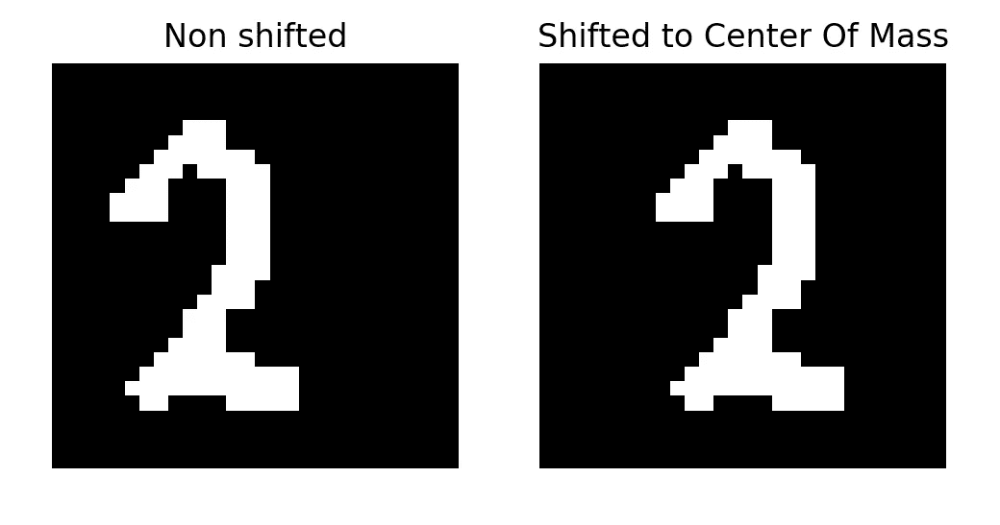

5.通过 ROI 进行预测

最终结果包含附加到每个轮廓的相应分类数字。(注意我们的模型如何(直观地)将 A 和 B 解释为 4 和 8)

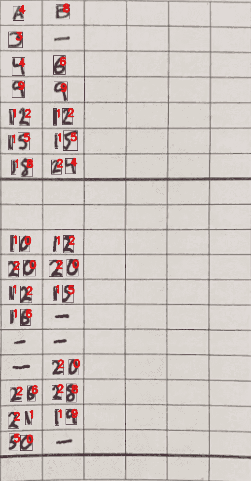

带分类数字的任意网格

这都是为了这个 python 实现。在 [Yatzy 评分表](https://apps.apple.com/se/app/yatzy-score-sheets/id1462576084)中运行的代码被移植到 Objective C++并进行优化(例如，跳过一些重复的操作，以便在整个 python 程序中保持不同的图像版本)。因为我们知道这些数字属于哪个 yatzy 单元格，所以我们可以使用它在应用程序屏幕“预览工作表”中显示工作表，并选择保存工作表。请注意，有些单元格的背景颜色为红色，这表明我们的 CNN 模型对预测的数字是正确的有多大把握(在 0-1.0 之间)。然后，用户能够手动验证和更新那些具有错误预测的数字。

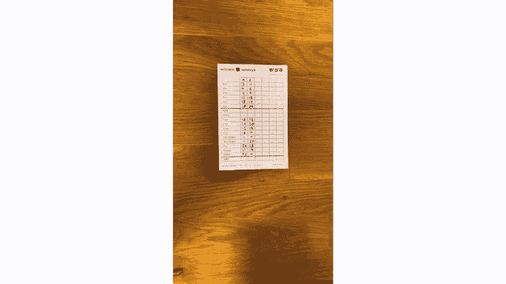

这篇文章的完整源代码可以在[的 Github repo](https://github.com/oankarberg/yatzy-score-sheet-detection) 中找到