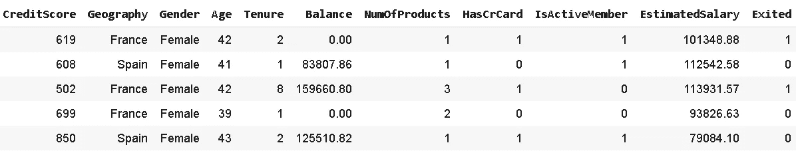
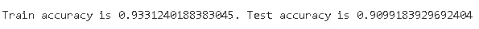
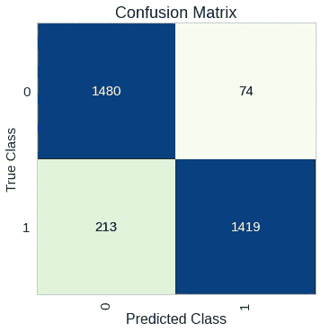
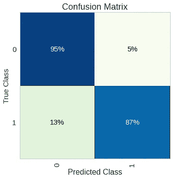
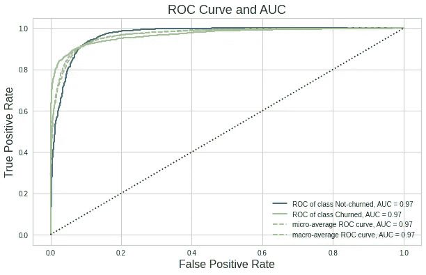
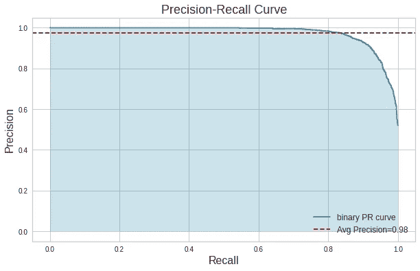

# Yellowbrick —通过可视化分析您的机器学习模型

> 原文：<https://towardsdatascience.com/yellowbrick-analyze-your-machine-learning-model-with-visualizations-f2c65ab2e229?source=collection_archive---------43----------------------->

## 用于机器学习可视化的 Python 库


Joshua Hoehne 在 [Unsplash](https://unsplash.com/s/photos/brick?utm_source=unsplash&utm_medium=referral&utm_content=creditCopyText) 上拍摄的照片

[Yellowbrick](https://www.scikit-yb.org/en/latest/index.html) 是一个 Python 机器学习可视化库。它本质上是建立在 Scikit-learn 和 Matplotlib 之上的。Yellowbrick 提供了信息丰富的可视化，以更好地评估机器学习模型。这也有助于模型选择的过程。

这个帖子更多的是 Yellowbrick 的实际应用。我们将快速构建一个基本的分类模型，然后使用 Yellowbrick 工具来评估我们的模型。我们可以把它分成两部分:

1.  创建机器学习模型
2.  黄砖时间！

# **创建机器学习模型**

任务是预测银行客户的流失。流失预测是机器学习领域的一个常见用例。如果你不熟悉这个术语，churn 的意思是“离开公司”。对于一个企业来说，了解客户可能流失的原因和时间是非常重要的。

我们将使用的数据集可从 Kaggle 上的[这里](https://www.kaggle.com/sonalidasgupta95/churn-prediction-of-bank-customers)获得。这篇文章的重点是评估分类器性能的可视化。因此，实际的模型构建部分将会快速而简洁。

让我们从导入依赖项开始。

```
import numpy as np
import pandas as pdimport matplotlib.pyplot as plt
%matplotlib inlineimport yellowbrick
```

我们将数据集读入熊猫数据帧，并删除多余的特征。

```
df_churn = pd.read_csv("/content/Churn_Modelling.csv")df_churn.drop(['RowNumber', 'CustomerId', 'Surname'], axis=1, inplace=True)df_churn.head()
```



“退出”栏表示客户流失。

流失数据集通常是不平衡的。类别 0(非流失)的数量明显多于类别 1(流失)的数量。这种不平衡会对模型的性能产生负面影响。因此，最好消除这种不平衡。

有不同的方法来使用它作为解决方案。我们可以进行过采样(增加少数类的观测值)或欠采样(减少多数类的观测值)。

最常见的一种是 **SMOTE** (合成少数过采样技术)。SMOTE 算法创建与现有样本相似的新样本。它采用两个或更多相似的观察值，并通过一次改变一个属性来创建一个综合观察值。

在使用 SMOTE 算法之前，我们需要将类别转换成数值。

```
gender = {'Female':0, 'Male':1}
country = {'France':0, 'Germany':1, 'Spain':2}df_churn['Gender'].replace(gender, inplace=True)
df_churn['Geography'].replace(country, inplace=True)
```

我们来确认一下阶级不平衡:

```
df_churn['Exited'].value_counts()
0    7963 
1    2037 
Name: Exited, dtype: int64
```

正类(流失)的数量大约比负类(非流失)的数量高 4 倍。

```
X = df_churn.drop('Exited', axis=1)
y = df_churn['Exited']from imblearn.over_sampling import SMOTE
sm = SMOTE(random_state=42)
X_resampled, y_resampled = sm.fit_resample(X, y)print(pd.Series(y_resampled).value_counts())
1    7963 
0    7963 
dtype: int64
```

现在正反类数量相等。训练模型之前的最后一步是将数据集分成训练和测试子集。

```
from sklearn.model_selection import train_test_splitX_train, X_test, y_train, y_test = train_test_split(X_resampled, y_resampled, test_size=0.2)
```

是时候创建一个模型并训练它了。我将使用随机森林算法。

```
from sklearn.ensemble import RandomForestClassifierrf = RandomForestClassifier(max_depth=11, n_estimators=260)
rf.fit(X_train, y_train)from sklearn.metrics import accuracy_score
y_pred = rf.predict(X_train)
y_test_pred = rf.predict(X_test)
train_acc = accuracy_score(y_pred, y_train)
test_acc = accuracy_score(y_test_pred, y_test)print(f'Train accuracy is {train_acc}. Test accuracy is {test_acc}')
```



# **黄砖时间！**

在分类任务中，尤其是在存在类别不平衡的情况下，准确度不是评估度量的最优选择。例如，预测正面类别(客户流失=1)比预测负面类别更重要，因为我们想确定客户是否会流失。我们可以承受对负类的错误预测

一种分别检查正负类预测的方法是**混淆矩阵。**

```
from yellowbrick.classifier import ConfusionMatrixplt.figure()
plt.title("Confusion Matrix", fontsize=18)
plt.xlabel("Predicted Class", fontsize=16)
plt.ylabel("True Class", fontsize=15)cm = ConfusionMatrix(rf, classes=[0,1], size=(400,400),
fontsize=15, cmap='GnBu')cm.fit(X_train, y_train)
cm.score(X_test, y_test)
```



在正类中，我们有 1419 个正确的预测和 213 个错误的预测。我们也可以通过将**百分比**参数设置为真来显示百分比，而不是数字。



该模型在负类上表现更好，这不是我们想要的。实现这一点的一个方法是告诉模型“正类(1)比负类(0)更重要”。使用我们的随机森林分类器，可以通过 **class_weight** 参数来实现。

评估分类模型性能的另一个工具是 ROC(接收机工作特性)曲线和 AOC(曲线下面积)。

**ROC 曲线**通过组合所有阈值的混淆矩阵总结了性能。 **AUC** 将 ROC 曲线转化为二元分类器性能的数字表示。AUC 是 ROC 曲线下的面积，取 0 到 1 之间的值。AUC 表示一个模型在区分正类和负类方面有多成功。

```
from yellowbrick.classifier import ROCAUCplt.figure(figsize=(10,6))
plt.title("ROC Curve and AUC", fontsize=18)
plt.xlabel("False Positive Rate", fontsize=16)
plt.ylabel("True Positive Rate", fontsize=16)visualizer = ROCAUC(rf, classes=["Not-churned", "Churned"])
visualizer.fit(X_train, y_train)
visualizer.score(X_test, y_test)plt.legend()
```



ROC 曲线概述了不同阈值下的模型性能。AUC 是介于(0，0)和(1，1)之间的 ROC 曲线下的面积，可以使用积分来计算。AUC 基本上汇总了模型在所有阈值的表现。AUC 的最佳可能值是 1，这表示一个完美的分类器。如果所有的预测都是错误的，则 AUC 为零。

当涉及到不平衡数据集时，**精度**或**召回**通常是评价指标的选择。

精度的焦点是**正面预测**。它表明有多少积极的预测是正确的。

召回的重点是**实际正课**。它表示模型能够正确预测的阳性类别的数量。

> **注意**:我们不能试图同时最大化精确度和召回率，因为它们之间有一个平衡。提高精度会降低召回率，反之亦然。我们可以根据任务来最大化精确度或回忆。

Yellowbrick 还提供了精度-召回曲线，显示了精度和召回之间的权衡。

```
from yellowbrick.classifier import PrecisionRecallCurveplt.figure(figsize=(10,6))
plt.title("Precision-Recall Curve", fontsize=18)
plt.xlabel("Recall", fontsize=16)
plt.ylabel("Precision", fontsize=16)viz = PrecisionRecallCurve(rf)
viz.fit(X_train, y_train)
viz.score(X_test, y_test)
plt.legend(loc='lower right', fontsize=12)
```



在某个时间点之后，提高召回率会导致准确率显著下降。

Yellowbrick 还提供了以下可视化功能，这些功能在评估分类模型时非常有用:

*   分类报告
*   类别预测误差
*   辨别阈值(仅用于二元分类)

在评估模型的过程中使用信息可视化将为您提供许多见解。它将引导你以一种有效的方式改进你的模型。

不要只看数字，试着用不同的方法来评估，从而改进你的模型。

感谢您的阅读。如果您有任何反馈，请告诉我。