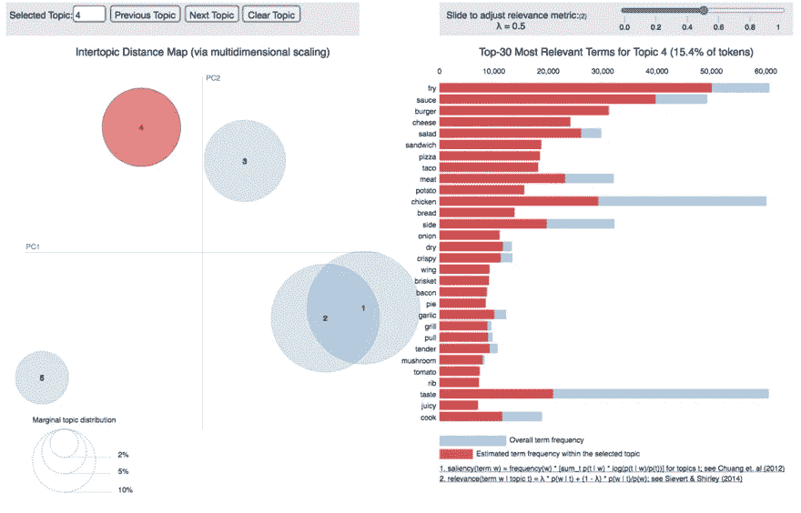

# Yelp 餐厅推荐系统——数据科学顶点项目

> 原文：<https://towardsdatascience.com/yelp-restaurant-recommendation-system-capstone-project-264fe7a7dea1?source=collection_archive---------9----------------------->

## **深入了解我参加数据科学训练营并为我的顶点项目构建餐厅推荐系统的经历。**


由[卢克·切瑟](https://unsplash.com/@lukechesser?utm_source=unsplash&utm_medium=referral&utm_content=creditCopyText)在 [Unsplash](https://unsplash.com/s/photos/data-science?utm_source=unsplash&utm_medium=referral&utm_content=creditCopyText) 上拍摄的照片

# 个人反思:

> 在过去的 3 个月里，我有机会在新加坡完成了大会的数据科学沉浸式训练营。编码训练营的性质意味着这是一次具有陡峭学习曲线的**激烈体验**，涵盖机器学习主题，如特征工程、决策树、自然语言处理和深度学习神经网络，所有这些都在短短的 **12 周内**！尽管如此，这次经历还是丰富了我的人生，因为它给了我日复一日用 Python 编程的机会，完成了编程任务，也为我的作品集做了个人数据科学项目。凭借在这次训练营中获得的技能，我现在真的有信心以全职职业身份进入**数据科学**领域。

回顾过去的几个月，这个训练营让我对**端到端数据科学流程**有了深刻的理解，并熟悉了数据分析和数据建模所需的编程语言和工具。在训练营即将结束时，每个学生都有机会参与一个**个人顶点项目**，展示我们在 12 周内学到的所有数据科学概念和技术。在这篇文章中，我将解释我的顶点项目以及我着手构建数据科学模型的端到端流程。

# 美食餐厅推荐系统


[食客集体](https://unsplash.com/@eaterscollective?utm_source=unsplash&utm_medium=referral&utm_content=creditCopyText)在 [Unsplash](https://unsplash.com/?utm_source=unsplash&utm_medium=referral&utm_content=creditCopyText) 上的照片

对于我的顶点项目，我想建造一些对人们日常生活有意义的东西。这最终导致我建立了一个**推荐系统模型**，它可以根据其他人对餐馆的评论向人们推荐他们位置附近的餐馆，利用情感分析，这可能会改善你在 Deliveroo、GrabFood 和 FoodPanda 等常见食品交付应用程序上看到的推荐建议。


作者图片

出于这个数据科学项目的目的，我在其上构建模型的数据集来自 Yelp 数据集，该数据集已经公开用于个人、教育和学术目的。由于这个数据集的巨大规模，我决定将我的工作集中在多伦多市的餐馆评论数据上，因为与这个数据集中的其他 9 个城市相比，它有最多的评论。这给我留下了从 2015 年**到 2019 年**总共**5471 家餐厅**、**44485 名用户**和**253050 条餐厅评论**的数据。

# **解释性数据分析**


作者图片

使用 Python 中的 Plotly 包，我能够创建多伦多市餐馆的地理可视化。大多数餐馆生意都集中在多伦多市中心，这是主要的中央商业区。

在各种餐馆类别中，排名前五的类别是:夜生活、酒吧、咖啡&茶、快餐和早餐&早午餐。


作者图片

对于每条餐厅评论，每个用户都给出了 1-5 分的评分，表示他们光顾餐厅的总体体验。评论评分的分布向左倾斜，平均而言，给出较高评分的用户比给出较低评分的用户多。


负面(左)和正面(右)评论的文字云，图片由作者提供

# 自然语言处理

利用每个 Yelp 用户留下的**文本评论**，我能够通过整合他们文本评论的情感分析为每个用户创建新的评分。**情绪分析**是确定用户的态度或情绪(无论是积极还是消极或者中立)的过程。

**Textblob 的极性得分**能够给我一个分数，表明一个陈述在从-1(负)到 1(正)的范围内有多积极或消极。此外，我还使用了 **VADER(效价感知词典和情感推理机)**，这是一个基于词典和规则的情感分析工具，专门针对社交媒体中表达的情感。 **VADER 的**综合得分也显示了一个陈述的积极或消极程度，范围从-1(非常消极)到 1(非常积极)。

通过合并这些量化的情感分数，我能够为每个用户创建一个范围在[0，6]内的**超级分数**，更好地反映他们访问餐馆的整体体验，并使用该分数作为我的推荐模型的基础。


计算用户超级分数的公式，按作者排序的图像

# **话题造型**

为了进一步理解我的评论数据中的文本，我使用了**潜在狄利克雷分配(LDA)，主题建模的一个例子**，将文档中的文本分类到特定的主题。LDA 建立每文档主题模型和每主题单词模型，建模为**狄利克雷分布**。



共 5 个主题的主题建模(LDA ),图片由作者提供


作者图片

在执行 LDA 之后，我能够创建几个主导主题，这些主题可以让我对人们在 Yelp 评论中谈论的主题类型产生有趣的见解。具体来说，来自我的 LDA 情节的主题 3、4 和 5 创建了将评论与特定食物烹饪相关联的主题**(西方、甜点、亚洲)**。将不同的评论分配给不同的主导主题将允许我建立一个**基于内容的推荐模型**，根据相似的偏好向用户推荐餐馆。

# **基于位置的推荐系统**


作者图片

为了解决最初的**用户冷启动问题**，我决定使用一个简单的解决方案，通过**位置邻近数据向新用户推荐餐馆。知道一个人在决定寻找新餐馆时的地理位置，我们可以使用基于位置的推荐系统**来推荐他/她附近的餐馆。通过为用户提供方便的初始推荐，我们可以吸引他/她开始使用我们的应用程序，然后根据他/她的初始偏好推荐其他餐厅。

根据地理位置对餐馆进行分组的一种方法是使用 K-Means 聚类算法。 **K-Means 算法**预测用户所在的聚类，并从中抽取出前 10 家餐厅推荐给他。


多伦多的餐馆根据地理位置的远近分成 10 类，图片由作者提供

> ***案例分析***


例如，我们有一个新用户，他刚刚参观了皇家安大略博物馆。他想吃顿饭，但不确定他家附近有什么好餐馆。通过将他的经度和纬度坐标输入到我们的模型中，我们可以向他推荐他所在位置附近的 10 家高评级餐厅，并让他有兴趣作为用户使用我们的推荐应用程序。


作者图片

# 协作和基于内容的过滤


约翰·施诺布里奇在 [Unsplash](https://unsplash.com/s/photos/collaborate?utm_source=unsplash&utm_medium=referral&utm_content=creditCopyText) 上的照片

一旦我们让新用户开始使用我们的应用程序，我们可以通过以下 4 个步骤来改进我们的模型推荐:**接受反馈，重新训练模型，对预测评级进行排序，返回最高的预测推荐。**

对于我的**协同过滤推荐模型**，它的工作原理是搜索一大群人，找到与特定用户口味相似的一小群用户。它查看他们喜欢的餐馆，并将它们组合起来，创建一个推荐餐馆的排名列表。我创建物品-物品矩阵的 3 个主要步骤包括:

1.  **超级评分数据透视表，用于创建用户-项目矩阵**

```
*# Creating the Matrix by using the Pivot Table Function* toronto_restaurant_rating = toronto_data.pivot_table(index = 'user_id', columns = 'name', values = 'super_score')toronto_restaurant_rating.head()
```


作者图片

**2。截断奇异值分解**

谈到矩阵分解技术，**截断奇异值分解(SVD)** 是一种常用的方法，可将矩阵 M 分解为三个矩阵 U、σ和 v。与常规 SVD 不同，截断 SVD 可产生一种分解，其中可针对多个截断指定列数。例如，给定一个(n x n)矩阵，截断 SVD 生成指定列数的矩阵，而 SVD 输出 n 列矩阵。**截断 SVD 可以处理稀疏矩阵**以生成特征矩阵，而主成分分析将对整个矩阵进行操作以输出协方差矩阵。

```
*# Converting the reconstructed matrix back to a Pandas dataframe*

cf_preds_df = pd.DataFrame(all_user_predicted_ratings, columns = toronto_restaurant_rating.columns, index=user_ids).transpose()

cf_preds_df
```


作者图片

**3。基于余弦相似度创建基于项目的矩阵**

```
*# Creating Item-Item Matrix based on Cosine Similarity*

item_item_matrix = cosine_similarity(cf_preds_df)item_item_matrix= pd.DataFrame(item_item_matrix, columns=cf_preds_df.index, index = cf_preds_df.index)item_item_matrix
```


作者图片

对于这个推荐模型，所有用户必须输入的是他们以前喜欢访问的一个**餐馆名称**到模型中，它将根据与该特定餐馆的最高余弦相似性得分生成 10 个最推荐餐馆的列表。

```
*# Top 10 Recommended Restaurants that people should visit if they had previously visited Pai Northern Thai Kitchen*

restaurant_recommendations = cf_recommender('Pai Northern Thai Kitchen')restaurant_recommendations = pd.DataFrame(data = restaurant_recommendations)restaurant_recommendations
```


作者图片

对于我的**基于内容的推荐模型**，它的工作原理是根据相似的餐馆类别和主导话题关键词向用户推荐餐馆，从而推荐符合用户偏好的餐馆。我创建物品-物品矩阵的 3 个主要步骤包括:

1.  **为每家餐厅创造一袋单词**

```
*# Creating Bag of Words*

toronto_final['bag_of_words'] = ''
columns = toronto_final.columns
**for** index, row **in** toronto_final.iterrows():
    words = ''
    **for** col **in** columns:
            words = words + ' '.join(row[col])+ ' '
    row['bag_of_words'] = words

toronto_final.drop(columns = [col **for** col **in** toronto_final.columns **if** col!= 'bag_of_words'], inplace = **True**)

toronto_final.head()
```


作者图片

**2。计数矢量器**

> CountVectorizer 将文本文档的集合转换为令牌计数的向量。此外，它支持在生成矢量表示之前对文本数据进行预处理。

```
*# instantiating and generating the count matrix*
count = CountVectorizer()
count_matrix = count.fit_transform(toronto_final['bag_of_words'])

*# creating a Series for the restaurant names so they are associated to an ordered numerical*
*# list I will use later to match the indexes*
indices = pd.Series(toronto_final.index)
indices[:5]
```


作者图片

**3。创建余弦相似矩阵**

```
*# generating the cosine similarity matrix*cosine_sim = cosine_similarity(count_matrix, count_matrix)cosine_sim
```


作者图片

同样，对于这种推荐模型，用户只需输入他们以前喜欢去的**餐馆名称**到模型中，它将基于相似的分类和主导主题关键字生成 10 个最推荐餐馆的列表。

```
*# Top 10 Recommended Restaurants that people should visit if they had previously visited Pai Northern Thai Kitchen*content_based_recommendations('Pai Northern Thai Kitchen')
```


作者图片

# 对新加坡 F&B 部门的申请


照片由 [Ethan Hu](https://unsplash.com/@ethanhjy?utm_source=unsplash&utm_medium=referral&utm_content=creditCopyText) 在 [Unsplash](https://unsplash.com/s/photos/singapore-hawker?utm_source=unsplash&utm_medium=referral&utm_content=creditCopyText) 上拍摄

在今年早些时候的断路器时期，由于缺乏顾客和订单，许多不太知名的餐馆都在这段时间里苦苦挣扎。

随着新加坡在 2020 年底缓慢进入第三阶段，更多的人将会以 5-8 人为一组，经常去镇上的餐馆。

因此，我的推荐模型可以为他们提供一个**替代食物推荐系统**，它可以推荐其他顾客评价很高的鲜为人知的当地餐馆。

为了帮助这样的餐馆，我未来需要的是当地餐馆企业和评论数据来训练我的推荐模型。

然而，我的模型也有一些限制。随着未来时间的推移，我可以探索其他方面来改进我的模型。其中包括:

1.  在情感分析和主题建模中使用二元语法和三元语法。
2.  结合**深度学习&神经网络架构**进行协同过滤。
3.  将**图论**应用于基于位置的系统，以优化旅行和交付路线。

# 最后的话


[Denys Nevozhai](https://unsplash.com/@dnevozhai?utm_source=unsplash&utm_medium=referral&utm_content=creditCopyText) 在 [Unsplash](https://unsplash.com/?utm_source=unsplash&utm_medium=referral&utm_content=creditCopyText) 上拍摄的照片

如果你已经走了这么远，我想真诚地感谢你花时间阅读我的文章。随着我进入商业和技术领域，我希望探索更多数据科学的趋势主题，这些主题可以用于改善人们的日常生活。

如果您想了解更多关于我未来的帖子，请在我继续我的数据科学之旅时在 Medium 上关注我！