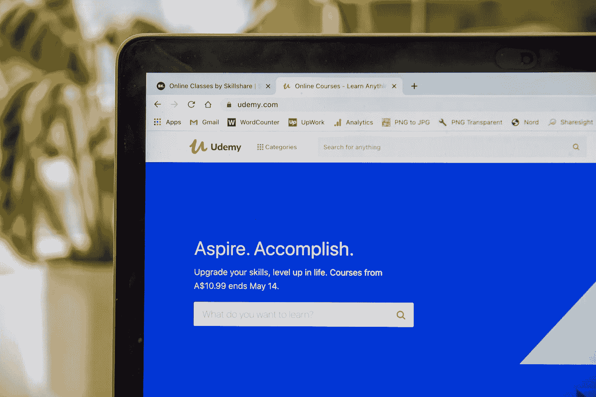

# 是的，你可以在网上成为一名数据科学家。以下是方法。

> 原文：<https://towardsdatascience.com/yes-you-can-become-a-data-scientist-online-heres-how-dc73c7faae0f?source=collection_archive---------12----------------------->

## 在线学习的专业数据科学家指导您在家开始数据科学生涯

维多利亚·希斯在[Unsplash](https://unsplash.com/?utm_source=unsplash&utm_medium=referral&utm_content=creditCopyText)【1】上拍摄的照片。

# 目录

1.  介绍
2.  在线课程
3.  在线学位
4.  业余的
5.  摘要
6.  参考

# 介绍

几篇文章强调了通过在线课程或学位的方式在数据科学领域取得成功是多么困难和牵强。既然你正在读这篇文章，也许你对自学和在线学习的成功也有一些信念。虽然数据科学似乎是一个新兴的领域，但它已经存在了很长时间，比大多数人意识到的要长。想想谷歌搜索引擎——它利用自然语言处理(NLP)，这是数据科学的一个方面。

数据科学可以分为在数据分析、机器学习、人工智能、数据工程、软件工程、统计学和 AB 测试领域学习和工作的人。这些领域中的大多数(如果不是全部的话)都以某种方式涉及到了数据科学。学习数据科学最重要的部分是学习如何解决问题。传统统计学和现代数据科学的主要区别是自动化。假设 2000 年你在 Excel 或 SAS 中进行回归分析，现在有什么不同？现在，在学习数据科学时，有优先考虑的编程语言。Python 可能是自动化传统统计的最重要的工具。为了配合 Python，有几个库或包使数据科学变得更容易和更有效——sk learn、numpy 和 pandas。这些被证明在 20 世纪 90 年代从研究人员和科学家那里得到了相似或精确的原理，但现在被加速到几乎即时的结果、推论和预测。在全球疫情期间，办公室和面对面的机构都停摆了，现在是在线学习的最佳时机，这是前所未有的。

以下是如何成为一名成功的在线数据科学家的几个例子——来自一名在线学习的专业数据科学家。

# 在线课程

刘易斯·基冈——Skillscouter.com 在[Unsplash](https://unsplash.com/s/photos/online-course?utm_source=unsplash&utm_medium=referral&utm_content=creditCopyText)【2】上的照片。

Coursera【3】——一个提供广泛课程和专业以及证书的在线平台。这个项目是由约翰霍普金斯大学开办的。你将学到很多技能，包括:

*   GitHub、机器学习、R 编程、回归分析、数据科学、Rstudio、数据分析、调试、数据操作、正则表达式(REGEX)、数据清理和聚类分析。

该计划显示，约 43%的人开始了新的职业生涯，19%的人在完成课程后获得了加薪或晋升。建议在 11 个月左右的时间内，成功完成这项训练，大约需要 7 个小时/周。因为它是在线的，所以它在 10 个专业化方面非常灵活，包括:

*   数据科学家的工具箱、R 编程、获取和清理数据、探索性数据分析、Reprfodcle 研究、统计推断、回归模型、实用机器学习、开发数据产品和数据科学顶点。

Coursera 的程序是免费的——用于阅读和查看课程内容；*然而*，如果你想要完成工作的证书，那么你必须付费(也有经济资助)。完成这个专业，得到学习教授的批准，并得到 LinkedIn 等公司的认可，Coursera 是开始你的数据科学职业生涯的一个很好的方式。

[**Udemy**](https://www.udemy.com/topic/data-science/)【4】。Coursera 主要专注于一个中心项目，而 Udemy 则提供各种各样的数据科学课程。从机器学习到 Python，这些课程都很便宜，而且可以更加专业化。Udemy 的好处包括:

*   *无尽的视频*
*   *文章*
*   *可下载资源*
*   *终身访问*
*   *手机和电视接入*
*   *结业证书*

近 300 万名学生已经从 Udemy 学习，无论是从零开始，还是增强或转换他们的职业生涯到完全专注于数据科学。

[**梅蒂斯**](https://www.thisismetis.com/?gclid=CjwKCAjw5Ij2BRBdEiwA0Frc9RCHI1yD2pKt7nX46NH4jPT6AOVwIVVQqssSCduk-pwC0sgtpQyephoC7_sQAvD_BwE)【5】。本次培训完全专注于 Kaplan 的数据科学，Kaplan 是一家声誉卓著的机构。Metis 强调是校友，对这个平台赞不绝口。从已建立的公司和创业公司，他们证明了他们的学生确实找到了成功。他们在脸书、Airbnb、IMB、Spotify、苹果和 BuzzFeed 等公司工作。为了使用他们的在线平台，而不是面对面的训练营，他们有一个名为“在线直播”的项目。

该计划的优势:

*   *从著名的数据科学指导中学习*
*   *实时指令*
*   *与其他同学互动协作*

Metis 是一个混合选项，提供在线学习；不需要参加校园学习的在线训练营。

# 在线学位

照片由 [Honey Yanibel Minaya Cruz](https://unsplash.com/@honeyyanibel?utm_source=unsplash&utm_medium=referral&utm_content=creditCopyText) 在[Unsplash](https://unsplash.com/s/photos/online-graduation?utm_source=unsplash&utm_medium=referral&utm_content=creditCopyText)【6】上拍摄。

更昂贵的选择是传统上从大学获得学位——但在现代意义上，是在线获得。这可能是一种风险更大的小型课程选择，因为你很可能会花费数千美元，但在劳动力中更专业。大学不计其数，大多是为了硕士。

最全面的列表可以在[这里](https://www.mastersindatascience.org/schools/data-science-degrees-online/)【7】找到。该网站包括:顶级学校、在线项目、相关学位、职业、在线课程、资源、训练营和大约 2U。一定要研究你的选择，因为这项投资会更贵，但从长远来看对你帮助最大。

> 我的故事:我参加了[南方卫理公会大学](https://datascience.smu.edu/)(SMU)【8】在线学习，获得了数据科学硕士学位。我非常喜欢这个节目。通过网上学习，我可以在晚上继续我现在的工作和研究。这些课程都是实时的，你可以在一个晚上把它们堆在一起，也可以把它们分散到一周。我能够与来自世界各地不同背景的同学合作；项目的多样性非常突出。与我的现场本科学习相比，我能够更有效地应用我在网上学到的大部分知识。我在 Indeed 开始了我的正式分析职业生涯，然后搬到了 HomeAway (Vrbo)，现在在 ScaleFactor 担任数据科学家。我从网上学习中获得了大部分经验。大多数学生从零开始学习数据科学，有些人在这个项目中不知道编码。在网上大学课程结束时，我的大多数朋友的职业生涯都发生了积极的变化。例如，学生从会计或技术支持职位转向专门的数据科学家，而我从分析化学转向数据科学。

# 业余的

*社区*。在线学习空间有一个大得惊人的社区。因为社交媒体在不断发展和增加，已经出现了几种形式的课外学习方式。现在有很多数据科学会议是在线的，而不是面对面的。有些被录制下来，也可以在网上观看。有了 Zoom 和其他会议平台，成为更大社区的一部分变得前所未有的容易和容易。

一些其他的学习方法是 Skillshare 和 YouTube。Skillshare 比传统的在线课程更加个性化，YouTube 上有数千个数据科学家的视频，他们热衷于教授各种技能，无论是用 Python 还是 R 编程，还是用 Airflow 和 GitHub 等工具弥合数据科学和生产机器学习之间的差距。

# 摘要

越来越多的职业开始于在线学习，数据科学也不例外。随着在家工作也变得越来越受欢迎，在线认证或经验越来越受到重视，有了新的获得在线学习成功的途径。我几乎所有的数据科学知识都是在网上学到的，无论是来自 SMU，一些 YouTube 视频，甚至是来自《走向数据科学》的教程。

读完我的文章后，我希望你会发现自己也有动力在家开始或加强你的数据科学事业。

# 参考

[1]由[维多利亚·希斯](https://unsplash.com/@vheath?utm_source=unsplash&utm_medium=referral&utm_content=creditCopyText)在 [Unsplash](https://unsplash.com/?utm_source=unsplash&utm_medium=referral&utm_content=creditCopyText) 上拍摄的照片，(2018)

[2]刘易斯·基冈-Skillscouter.com 在 [Unsplash](https://unsplash.com/s/photos/online-course?utm_source=unsplash&utm_medium=referral&utm_content=creditCopyText) 上拍摄的照片(2020)

[3] [Coursera](https://www.coursera.org/specializations/jhu-data-science) ，(2020)

[4] [Udemy](https://www.udemy.com/topic/data-science/) ，(2020)

[5] [梅蒂斯](https://www.thisismetis.com/?gclid=CjwKCAjw5Ij2BRBdEiwA0Frc9RCHI1yD2pKt7nX46NH4jPT6AOVwIVVQqssSCduk-pwC0sgtpQyephoC7_sQAvD_BwE)，(2020)

[6]Honey Yanibel Minaya Cruz 在 [Unsplash](https://unsplash.com/s/photos/online-graduation?utm_source=unsplash&utm_medium=referral&utm_content=creditCopyText) 上拍摄的照片，(2018)

[7] 2U 公司， [mastersindatascience](https://www.mastersindatascience.org/schools/data-science-degrees-online/) ，(2020)

[8][SMU](https://datascience.smu.edu/)(2020 年)