# 另一个是端到端时间序列项目教程

> 原文：<https://towardsdatascience.com/yet-another-an-end-to-end-time-series-project-tutorial-37390bcea38e?source=collection_archive---------13----------------------->


来源:unsplash.com

> 时间序列分析是经典数据科学领域最常见同时也是最需要的任务之一。你可以在任何地方观察到这种类型的数据:股票和金融交易、物联网产生的数据、线上和线下零售销售，甚至是医疗记录，如心率、EKG、脑电图和核磁共振成像。

在这篇文章中，我用一些例子详细描述了从零开始执行一个时序项目的一般方法。首先，来自数据科学领域的新手分析师和项目经理可能会认为这些内容很有用，但是如果你是一个有点顽固的分析师，我相信你也会很高兴看到一些有趣的想法。

整个项目的代码**在**GitHub**资源库上**可用

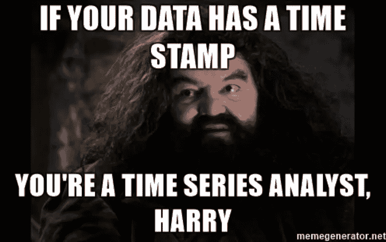

来源: [memegenerator](http://memegenerator.net)

时间序列预测是分析师或数据科学家在面对这类数据时试图解决的最常见问题。此外，发展中的物联网领域产生了异常检测任务，然而，在本文中，我们将详细介绍为未来预测而创建的序列模型。

## 在使用时间序列下的现代机器学习模型之前，考虑它们的一些基本概念非常重要:

*   机器学习模型没有时间意识
*   用于 ML 模型的观测值是独立的并且是均匀分布的
*   信息存储在历史数据中，指示未来时间序列行为的信号
*   基于树的算法不能预测趋势，也就是说，它们不能外推

注意，你不会在这里发现任何经典统计学和计量经济学模型的提及。这里只描述机器学习算法。当使用了足够的机器学习模型数据时，你在计量经济学模型的超参数选择上花费的时间是不合理的，这是有原因的。

## **时序项目的总体时间表**

根据我的经验，序列分析项目已经通过类似的经典机器学习项目场景实现了。但是，在探索性数据分析和特征生成部分存在重要差异。

下面，我列举了时间序列分析项目中的一般阶段及其描述。

**问题定义或目标设定** —项目的第一阶段是进一步执行的基础。在这一阶段，项目经理、数据科学团队或分析师会见代表内部部门或外部客户的业务负责人。在本次会议中，遵循以下清单非常重要:

*   描述在项目过程中应该解决什么样的业务问题，以及它存在的原因
*   定义可用数据和文档的整个范围，其中描述了数据生成的来源和方法
*   定义预测范围的持续时间及其离散性(每小时、每天、每周等)
*   与业务负责人和来自数据科学团队的人员一起，为模型质量的未来估计及其目标值定义一个关键指标，这些分析师将尝试达到该指标。

**探索性数据分析**(EDA)——这是所有数据科学项目的一个共同阶段，分析师面对一个新的数据集，并试图对其进行调查。此外，他们还试图评估其特征，如缺失值、数据中平稳值或趋势值分布的存在性等。

**数据预处理和特征生成**——任何机器学习项目的基本阶段，在这里你必须特别有创造力。在这个阶段，数据科学家生成预测器，这些预测器将成为未来模型的基础。模型的准确性和泛化能力也取决于这些特征。此外，我们不应该跳过模型预测的标准化或规范化步骤。粗略地说，整套功能可分为 3 大类:

*   **shift**—这种技术在时间序列模型中经常使用。主要的一点是，历史数据点包括关于未来时间点行为的信息。
*   **数学与统计特点** —关键思想与上一个相同，但这里我们要计算历史数据点之间的差异、标准差、最大值、最小值等统计量。
*   **领域知识** —传统上，它是最有用和最有价值的信息，但是提取起来非常复杂。可能存在只有领域专家才熟悉的外部附加数据或特殊统计数据。例如，如果您处理零售交易数据，关于营销活动的信息可能对您的模型非常重要。

**培训** —这是一个简单明了的过程。但是，在模型训练期间，您应该始终考虑交叉验证。当您处理时间序列数据时，请确保选择相关类型的交叉验证。最后，不要忘记在这个阶段结束时查看模型准确性。

**验证** —为您的模型提供从未见过的新信息，并评估它们的价值。这是对你的模型的碰撞测试。如果您观察到训练和测试的准确性之间的显著差异，很可能它们是过度拟合的，或者在测试数据中遇到了全新的信息。

**基线**——当您完成第一次训练——测试迭代时，您会得到一个基线。之后，您的目标是通过调整超参数跳过基线精度。

**选择**——通常你没有足够的时间为你的整套模型设置超参数，所以在第一次训练测试迭代后，你可能会选择最好的一个，然后努力提高它的质量。

**整形** —一个基本的项目阶段，在这个阶段，你在调整你的模型的超参数下工作，目的是提高它的预测质量。顺便说一下，创建管道是获得模型超参数的最佳估计值的有效方法。

**上线** —因此，在这一步中，我们有了一个足够准确的模型，它适用于企业主。这意味着是时候将我们的模型投入生产环境了。在这一步之前，你的模型可能只能在你的 Jupyter 笔记本上运行，但用户无法使用。为了最大限度地从你的工作中获取价值，你应该把模型放在一个有界面的环境中。这可能是任何人的软件的一部分，或者您也可以使用 Flask/Django，甚至集成到商业智能应用程序中，如 Tableau、QlikSense 或 Power BI。

请允许我忽略某些细节，跳过项目的第一步，尽管这是项目成功的关键因素，并专注于其他方面。

在进一步的解释中，我使用了 Kaggle [数据集](https://www.kaggle.com/milanzdravkovic/pharma-sales-data)，该数据集由 2014 年至 2019 年期间收集的 60 万笔交易数据组成，显示了销售日期和时间、药品品牌名称和销售数量，从个体药店的销售点系统导出。从数据集中选择的一组药物被分为以下解剖治疗化学(ATC)分类系统类别。

## **探索性数据分析(EDA)**

初步数据分析是任何数据科学项目的重要组成部分。使用时间序列有 3 种主要的数据浏览类型:

*   通过完整性和一致性检查数据质量-
*   视觉分析
*   统计分析

**数据质量和结构**

```
df.info()
```

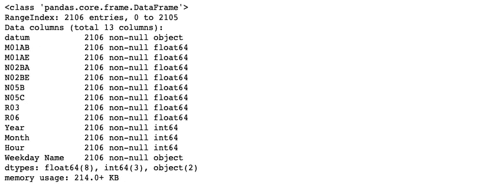

因此，从 Kaggle 得到的数据包含两种类型的变量:float64、int64 和没有 NaN/missing 值。很有可能你永远也不会在现实世界中遇到如此清晰的数据。

```
df.head()
```

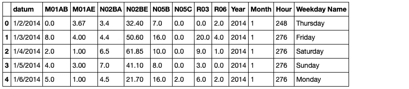

*   M01AB —抗炎和抗风湿产品、非类固醇、醋酸衍生物和相关物质
*   M01AE —抗炎和抗风湿产品、非类固醇、丙酸衍生物
*   N02BA——其他止痛药和退烧药、水杨酸及其衍生物
*   N02BE——其他止痛剂和退烧药、吡唑啉酮和苯胺
*   N05B —精神药物、抗焦虑药
*   N05C —精神药物、安眠药和镇静剂
*   R03 —治疗阻塞性气道疾病的药物
*   R06 —全身使用的抗组胺药

```
df.describe()
```

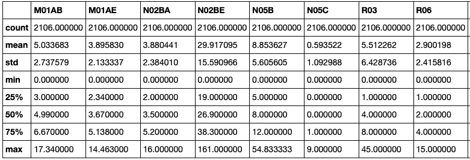

您可以看到中值和平均值(50%)非常接近，这意味着没有很多异常值。否则，存在，以查看 75%平铺和最大值之间的范围。
让我们算一算我们有多少离群值，它们在哪里。

**视觉分析**

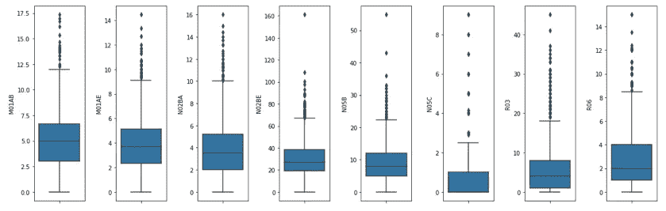

看那个！所有这些都包括异常值。
按照统计学术语，离群值被定义为那些超出 3 IQR 的值。

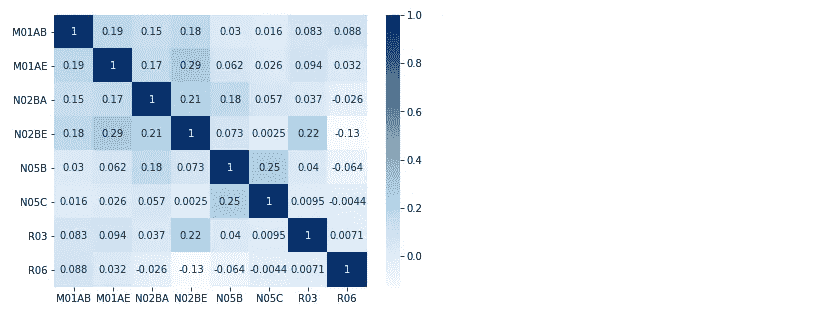

作为探索性数据分析的一部分，有时查看关联矩阵对未来的模型调整或进一步的数据探索非常有用。
上图中，深色代表正相关，浅色代表负相关。例如，如果您想使用线性回归，您必须考虑删除相关变量以提高预测准确性。
在我们的例子中，我们可以看到相关类别(N05B、N05C 和 N02BA、N02BE)之间的弱相关性，以及 M01AE、N02BA 代码之间的有趣关联。进一步分析的目标可能是确定其中的原因。

**统计分析**

在这部分研究中，我们希望估计几个重要的统计参数:

> **趋势** —有序时间序列中单向的长期运动。
> 
> **季节性** —是一系列具有特定重复间隔的事件，例如每月或每年。在大多数情况下，我们试图检测季节性，以消除季节性成分，并提取有关的额外信息，目的是提高模型的性能。注意，不要把季节性和周期性混淆。

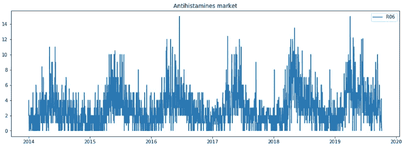

很容易看出抗组胺药和止痛剂产品的销售有明显的季节性。另外，乍一看，数据看起来很稳定。
让我们通过应用 Dickey-Fuller 检验来确定一个时间序列是否平稳

> **平稳性** —指时间序列的统计特性不随时间变化。完成对该属性的研究是很重要的，因为如果将来的统计属性不会有很大的不同，那么将来的值可以很容易地预测。迪基-富勒检验或学生的 t 检验可用于观察平稳性。然而，请记住趋势和季节性显然会使数据不稳定，但对于周期来说就不清楚了。统计时间序列算法对此至关重要，如果数据不符合平稳性，就会失败。机器学习方法也受益于数据中更清晰的信号。

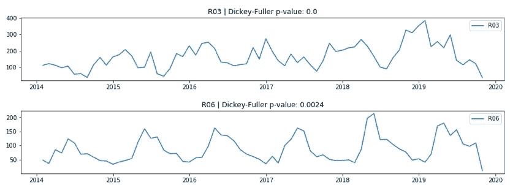

你可以看到我们已经将数据频率从每天一次改为每月一次
，这使得数据更具可读性，我们可以看到除了一个市场之外的所有市场都具有季节性
，同时，你可以看到 2015 年心理市场的销售数量如何增加，然后急剧下降
除季节性之外的呼吸道疾病市场的销售包括改善趋势
顺便说一下，你可能已经注意到迪基-富勒测试的 p 值图表的标题:

*   当 p 值> 0，且数据不稳定时。
*   否则，p 值= 0，零假设被拒绝，该过程被认为是平稳的。

> **自相关** —表示一段时间内原始时间序列和滞后时间序列之间的相似程度。这是执行回归分析的一个重要部分，因为回归模型假设数据没有自相关，否则不应该期望模型的高质量。

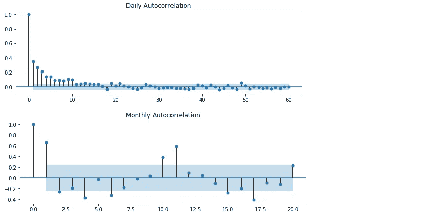

来演示。plot_pacf 函数起作用我们取的数据带有季节性。
如果自相关值接近 0，则意味着滞后观测值之间不相关。同时，值接近 1 或-1 的偏相关表明时间序列的滞后观测值之间存在很强的正相关或负相关。
蓝色阴影区域表示置信区间的边界。如果偏相关值超出了这个置信区间区域，那么可以假设观察到的偏相关值在统计上是显著的。

请注意，每日数值与最近的观察值高度相关，否则在月图上，您可以注意到与去年同月的显著相关性。

## **数据预处理和特征生成**

一旦我们完成了探索性数据分析并检测到数据缺陷，就有时间为下一步构建数据集。

有 3 种[广泛分布的](https://context.reverso.net/%D0%BF%D0%B5%D1%80%D0%B5%D0%B2%D0%BE%D0%B4/%D0%B0%D0%BD%D0%B3%D0%BB%D0%B8%D0%B9%D1%81%D0%BA%D0%B8%D0%B9-%D1%80%D1%83%D1%81%D1%81%D0%BA%D0%B8%D0%B9/widely+distributed)方法可以更清晰地处理数据，以便进一步预测:

*   应用 box-cox 变换稳定色散
*   微分，或者换句话说，移动到相邻观测值的成对差异
*   季节差异

***提示***

*   *如果数据集包含负观测值，则 box-cox 变换不可用，但是您可以为整个数据集添加正常数值并应用变换。*
*   *在大多数情况下，box-cox 变换不会强烈影响预测的质量，反而会影响预测的范围。*
*   *差异化有助于走出季节性和趋势性。除此之外，它还可以多次使用。*
*   *两种区分方法可以一起使用，但是如果时间序列具有明显的季节性，最好从季节性区分开始*

在我们实现了整个数据集的平稳性之后，是时候进入要素生成部分了。在那里，我们将创建预测器，作为模型的基础。

举例来说，我使用了多个滞后值、分类特征、时间周期和线性回归。实际上，现在试着比我更有创造力，根据你的领域知识生成有价值的特性，显著提高预测的准确性。

在特征生成的最后阶段，不要错过在管道中添加数据标准化的步骤。

## **培训**

在迷人的探索性分析和严格的预处理之后，我们准备开始训练模型。

正如我上面提到的，当有足够的观测数据可用，并且您能够使用机器学习算法时，设置 ARMA、ARIMA、SARIMA 等统计模型的参数是不值得的。

因此，让我们同时训练几个模型，并通过 MAE 查看它们的质量，并在图表上强调错误线的部分，这些将展示模型失败的地方。

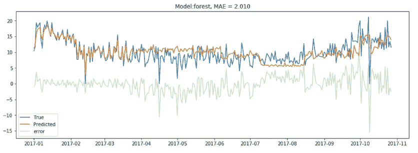

让我来说一说我们如何监控预测的偏差。有许多指标允许跟踪回归模型的性能，但是最流行的是:

> **MSE** (均方差)——关注预测模型的多方向误差，但同时对异常值敏感，且由于缺乏与原始误差直接可比的可能性，解释复杂。

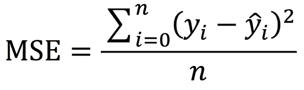

> **RMSE** (均方根误差)—为了提高解释能力，我们能够采用平方根，并将完成值称为均方根误差，但它仍然对不良预测点敏感。在捕捉到一些不好的点之后，即使一个好的性能回归模型也会显示出很高的误差值。

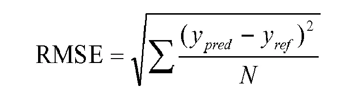

> **MAE** (平均绝对误差)——由于计算偏差的绝对值，我们能够最小化预测中坏点的影响。

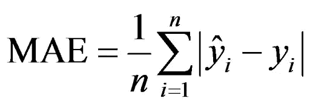

> **MAPE** (平均绝对百分比误差) **—** 是相对性能指标之一，允许跨不同数据集比较模型的有效性，即使具有不同的观察范围。该指标的主要限制是，当数据集包含任何真实实例的零值时，不能使用它。

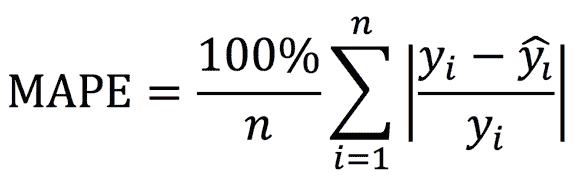

> **R 平方**(决定系数) **—** 显示模型对真实点的解释程度。定义域的取值范围为 0 到 1，越接近 1，实际观察值就越接近模型线。请注意，系数的缺点是当模型中加入额外的变量时，它的值会增长，即使这些变量并不显著。因此，R 平方不能用于比较变量数量不同的模型。

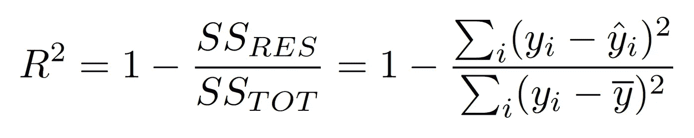

## **测试**

在迭代的最后一步，我们想要比较预测值和我们的模型在项目的先前阶段从未见过的真实实例。遵循模型失败时的精确度和位置。如果您检测到在训练和测试数据集上计算的所选性能指标的级别之间存在显著差异，这将意味着您的模型过度拟合。要修复它，您应该自定义模型参数。

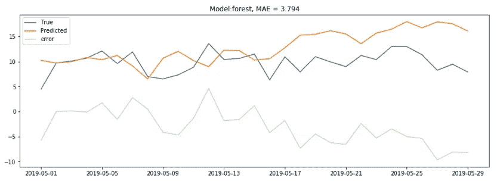

## **结论**

本文描述了用机器学习算法建立预测模型的一般方法，并给出了第一次迭代的例子。然而，为了达到高质量的预测并为业务用户提取最大价值，在您的进一步迭代中，我建议将重点放在调整模型超参数、开发管道并将其置于生产环境中。