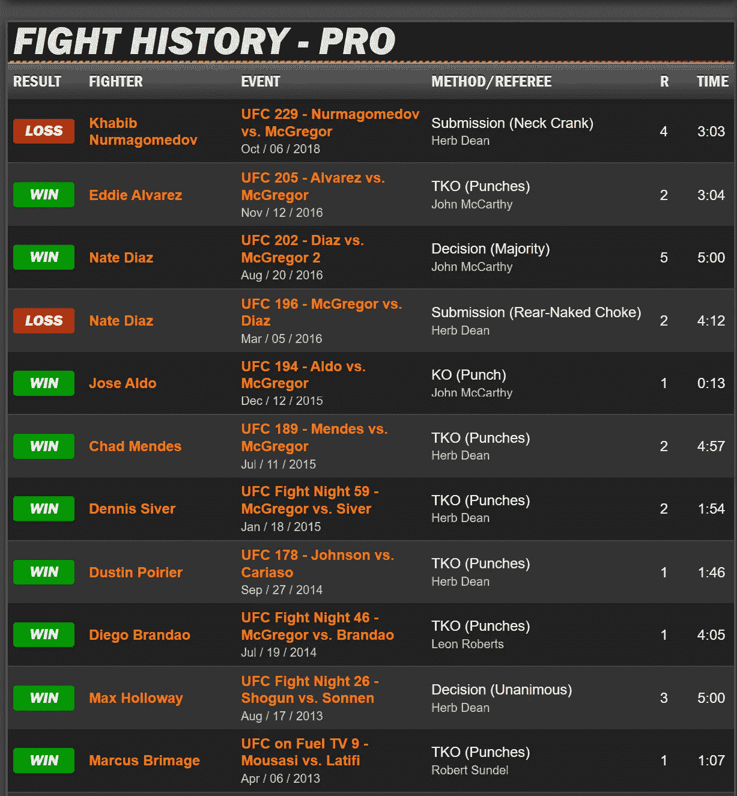
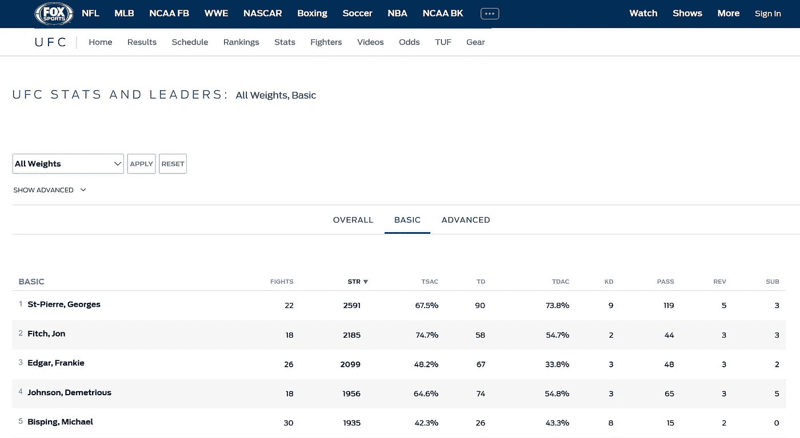
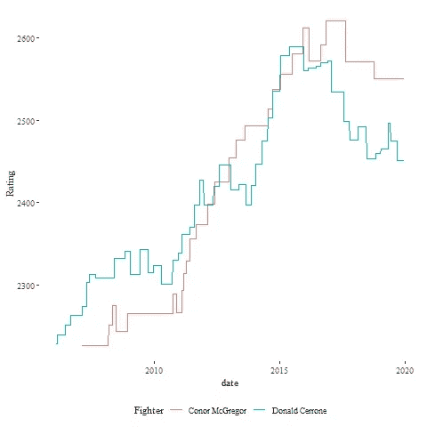
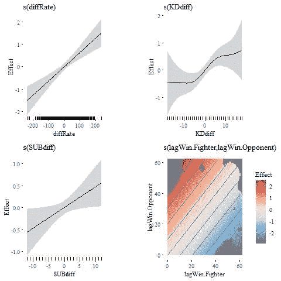

# 又一个“臭名昭著”的预测

> 原文：<https://towardsdatascience.com/yet-another-notorious-prediction-a5b9d18cc710?source=collection_archive---------35----------------------->

在 [Unsplash](https://unsplash.com/s/photos/boxing?utm_source=unsplash&utm_medium=referral&utm_content=creditCopyText) 上[attendee](https://unsplash.com/@attentieattentie?utm_source=unsplash&utm_medium=referral&utm_content=creditCopyText)拍照

## 预测一场战斗有多难？

作为一个普通的 MMA 粉丝，我的社交媒体上充斥着关于即将到来的康纳“臭名昭著”麦格雷戈对唐纳德“牛仔”塞罗恩比赛的帖子和文章链接。在 Lianne 和 Justin 在《走向数据科学》的[文章](/spoiler-alert-conor-mcgregor-vs-cowboy-who-will-win-7c3eee6389b0)中看到这个话题，我仍然感到惊讶。读了那篇文章后，我开始思考如何为这场比赛建立一个更好的预测。

## 数据

使用 www.fightprior.com 上共享的代码[，我搜集了麦格雷戈、塞罗纳和他们来自 Sherdog.com](http://www.fightprior.com/2016/04/29/scrapingMMA/)[的对手的 MMA 比赛历史，得到了 15000 场比赛的结果。](http://sherdog.com)

来自 sherdog.com

即使是一个普通的粉丝也知道“风格决定战斗”Sherdog 的数据显示了战斗是如何决定的，但几乎没有关于战士们如何赢得和输掉比赛的信息。我们能做什么来表现风格？进入[福克斯体育 UFC 统计](https://www.foxsports.com/ufc/stats?weightclass=11&category=BASIC)页面。

来自 foxsports.com

逆转(REV)、提交(SUB)、击倒(TD)和击打(STR)的次数是量化拳手风格的一种方式。但是这个数据有两个问题:这个表只有 139 名战士在收集的比赛历史中的数据，并且只有当前的生命统计数据。

例如，Sherdog 报告康纳的第一场比赛是由 TKO 通过罢工战胜加里莫里斯(2008 年 3 月)。但是在这场比赛中，康纳(大概)在他的职业生涯中没有任何表现。为了正确估计总打击模型对获胜概率的影响，我们希望第一场比赛的这些统计为零，然后对于 McGregor 的第二场比赛，我们希望包括第一场比赛的打击。相反，我们只有截至 2020 年 1 月的终身总罢工。

使用寿命总计来构建模型会在旧匹配的记录中产生来自未来的泄漏。后果是严重的:模型的成功预测可能被夸大了，并且这些统计数据之间的真实关系(如果有的话)成功的机会没有显示在数据中。

所以，在现实生活中，这些数据并不适合使用。但是对于一个没有错误负面影响的预测来说，看看它的表现可能会很有趣。

## 模型

Lianne 和 Justin 的[文章](/spoiler-alert-conor-mcgregor-vs-cowboy-who-will-win-7c3eee6389b0)报道了一个改进的 Elo 评级过程，并估计 McGregor 获胜的概率为 82%。我们的首要任务是用更小的数据集来验证这个结果。

PlayerRatings 包包含多个 Elo 评级变化。要捕捉评级随时间的完整演变，需要一个循环，如下所示:

结果与 Lianne 和 Justin 的工作方向一致，显示 McGregor 的评级在 2013 年超过 Cerrone。最终的评分是麦格雷戈 2550 分，赛罗内 2451 分，这意味着麦格雷戈获胜的概率是 64%。

这个预测有多好？我们可以从整个历史中获取赛前评级，并查看他们正确预测比赛结果的频率。下面的代码生成适当的评级列，并合并到 Fox Sports 的职业统计数据中，以创建最终的分析表。

这建立了大约 55%的正确预测的基线性能。对于增强模型，我们将通过 mgcv 包使用一个逻辑[游戏](https://en.wikipedia.org/wiki/Generalized_additive_model)。R 代码很简单:

gratia 包的 draw()函数从 GAM 生成平滑的 ggplot2 图表。

gratia::draw()显示了 GAM 估计的响应

有趣的是，收视率的差异(diffRate)给出了一个线性关系。。。据推测，逻辑链接负责这个驱动程序的非线性。敲除的差异(KDdiff)显示了与方向适当的结果的非常复杂的关系。每个拳击手获胜的双变量平滑显示，如果每个拳击手以相似的获胜次数进入拳击场，对战斗的结果几乎没有影响。

在训练样本上，该模型正确预测匹配的概率为 62%。并且在保持上做得更好，准确率为 63%，比单独的 Elo 评级提高了 15%。

这有点令人失望，甚至在承认它可能比现实更好之前，因为每个战士都使用了一生的统计数据。

## 最终预测

完成所有这些后，我们可以收集代表 McGregor-Cerrone 比赛的数据，并了解到玩家仍然喜欢“臭名昭著”(McGregor 获胜的概率为 62%)。这是两个模型在不同的数据上使用不同的方法显示麦格雷戈可能会赢。寻找第三个预测，让我们考虑一下公布的投注赔率。

照片由[希瑟·吉尔](https://unsplash.com/@heathergill?utm_source=unsplash&utm_medium=referral&utm_content=creditCopyText)在 [Unsplash](https://unsplash.com/s/photos/gambling?utm_source=unsplash&utm_medium=referral&utm_content=creditCopyText) 上拍摄

麦格雷戈目前的下注线(截至 2020 年 1 月 13 日)是-325。将其转换为赔率，然后转换为概率，这相当于预测麦格雷戈的胜率约为 75%。

我很惊讶这些赔率对‘臭名昭著’如此有利。由于麦格雷戈已经离开拳击台很长一段时间(自 2018 年 10 月以来)，Cerrone 很活跃(尽管经历了两连败)，而且比赛重量更重(Cerrone 是两者中较大的一个)，我认为“牛仔”有很大的机会获胜。考虑到游戏数据的问题和 Elo 评分显示的表现不足，我觉得这两个模型都不可信。我相信赌注已经被麦格雷戈在媒体上的过度表现动摇了。

我要选 Cerrone。