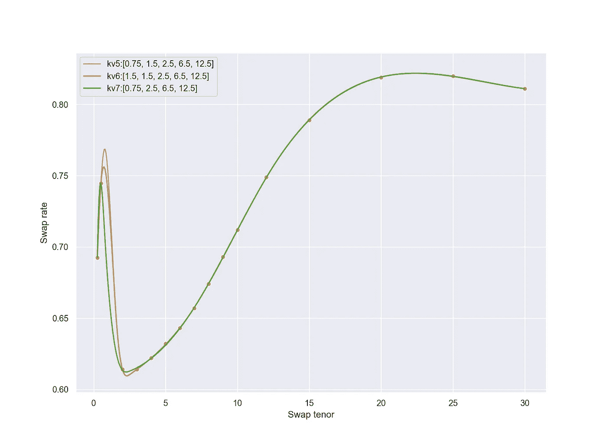

# 用 Python 构建收益率曲线

> 原文：<https://towardsdatascience.com/yield-curve-building-in-python-8d7974a6e7e3?source=collection_archive---------7----------------------->

## 利用互换利率和 B 样条函数构建英镑互换期限结构


图片来自 [Pixabay](https://pixabay.com/?utm_source=link-attribution&utm_medium=referral&utm_campaign=image&utm_content=69522)

# 收益率曲线的三个主要驱动因素

1.  未来利率变化的市场预期
2.  风险溢价
3.  凸度偏差

从概念上讲，很容易将利率期限结构分解成这三个部分。

在现实中，司机在时间上是动态的，永远无法直接观察到。这使得现实世界的曲线形状更难解释，甚至可以让最好的生产模型变得陈旧。

任何有用分析的前提是知道曲线在哪里。

在流动性市场中，构建合适的曲线只需要很少的参数。通过在从经销商处的双向价格中可观察到的持续更新的价格之间进行插值，来处理繁重的工作。

在流动性差的市场，价格流干涸了。可观察到的市场价格变得稀缺，规模缩小，买卖盘扩大。这些低确定性时期可以成就或摧毁交易商、基金经理和交易算法。在这种情况下，拥有一个好的收益率曲线模型的潜在好处尤其大。

离开一会儿。推理统计学和数据挖掘(包括机器学习)的基础思想是，可以从样本数据中得出潜在过程的有意义的结论。一个被忽视但重要的子问题是在给定小样本的情况下提取推断。

将这个统计子问题与有利可图的金融建模任务相结合，这篇文章给出了以下结果:

## 1)使用 Python
对英镑(GBP)互换利率期限结构进行简单的 B 样条构造 2)过度拟合和领域主导的参数选择
3)不同市场条件下的压力测试

# 数据和方法

2020 年 1 月 30 日，英格兰银行货币政策委员会投票(7-2)维持英国利率不变。就在第二天，英国终止了欧盟成员资格。


ICE 交换率数据集

远离正常的市场环境，这使得英镑利率成为一个有趣的分析资产类别。注意，收益率曲线反转在曲线的前面。

给定 2020 年 1 月 30 日采样的英镑掉期利率数据(通过 ICE fixing)，目标是构建完整的掉期利率期限结构。也就是说，为 3 个月到 30 年之间的任何期限构建一个互换利率。

ICE 的掉期利率数据通常从 1 年期开始，但是由于 1 年期掉期缺乏流动性，因此没有公布。因此，我增加了 3 个月和 6 个月的伦敦银行同业拆放利率，丰富了数据集。单位为百分比。

由于我使用了 Libor 和复合利率(来自互换)，在这一点上零利率应该是自举的。然而，我们的目标是探索 B 样条回归，所以我选择不规范约定。它产生了一组更有趣的拟合点。

澄清一下，我没有预测利率。使用经济/社会/其他跨市场指标预测利率是另一回事。我们的目标是构建一幅市场描绘曲线的图画，而不是曲线*应该*在哪里(跳过有效市场假说)。


截至 2020 年 1 月 30 日的英国互换利率(来源:ICE)

来源: [Ice 掉期利率](https://www.theice.com/marketdata/reports/180)， [Libor 利率](https://www.global-rates.com/interest-rates/libor/british-pound-sterling/gbp-libor-interest-rate-3-months.aspx)

# 英镑互换期限结构的 b 样条构造

一个**阶 M** 的样条函数是输入变量中的一个**次 M-1** 的分段多项式。多项式块相遇的输入空间的值被称为**节点**。纽结以**非递减顺序**排序，当不同时，多项式段的第一个 **M-2 导数**在每个纽结上**连续**。

任何样条函数都可以表示为同一分区上相同次数的**基样条(B 样条)**的唯一线性组合。我使用最小二乘法进行回归，以使模型符合扩充输入空间上的交换率数据集。以下是 B 样条曲线设置:

```
#B-spline Settings
M = 4
knots = [7.25,15.5,22.75]
```

没有太多的设置。

## **订单**

4 阶样条函数对应于 3 次幂的多项式。4 阶样条俗称**三次样条**。三次样条是最低阶的样条，其纽结不连续性对于人眼是不可见的。光滑函数可以用局部多项式的更高次幂来实现，但是很少有理由超越三次样条。

## **绳结**

我选择了三次样条与**开放统一**节点。这是一个结序列，其中内部结在输入域上等距分布，并在计算样条的域的边界处填充了额外的 M 个重复结。

这是第一个曲线构造的结果。


基于截至 2020 年 1 月 30 日的英国互换利率数据构建 b 样条曲线

# b 样条 Python 代码

SciPy python 库提供了有用的函数来实现和评估一组样条函数。不过我自己实现了**德布尔**的除法差分算法。

遵照其他 ML 模型对象的结构，我构建了一个*。fit()* 函数对从*返回的矩阵描述的样条使用最小二乘回归。build_spline_mat()* 。

最后一步是*。predict()* 函数，在给定原始输入空间中的 *x* 值的情况下，填充插值，交换高音。

# 到目前为止…

鉴于英国利率数据，全球形势似乎得到了相对较好的描述。然而，曲线短端速率的可变性导致了该样条设置的一些局部问题。

虽然安装简单，但这离完工还很远。我现在介绍一个好的*模型必须符合的关键标准，以及在不同市场条件下稳定性的潜在扩展。*

# **什么构成了好的曲线？**

判断施工方法质量的标准很短。

> 1)我能否将输入市场利率复制为构建曲线的输出？
> 
> 2)曲线的稳定性如何？

第一次尝试没有成功。

曲线构建从一组观察到的市场价格开始，并且必须将这些价格恢复为输出。在其他回归实例中，这将是一个主要的过度拟合问题。但是根据定义，过度拟合假设数据表现出随机误差，这与有效市场假说相反——在给定当前信息的情况下，价格总是公平的。不管怎样，这种情况需要一个描述性模型，而不是预测性模型。

在这种情况下，样条线是一个完美的选择。它们允许输入之间的灵活插值。这种灵活性由样条线的**顺序、**域节点向量**和**平滑**控制。**

**平滑**是一种正则化技术，与任何其他技术一样，它牺牲训练精度以支持系数的较低方差。这里，正则化反对我们的目标，所以我没有实现任何平滑。

回想一下，三次 b 样条的阶数是 4。我没有改变。这让我有了结的选择。

# 结选择

由于节点向量被填充，节点选择减少到拾取内部节点。一些研究论文深入研究最优节点选择，但这在很大程度上是领域不可知的。对于这个分析，我想通过领域知识来激发内部结的选择。

掉期交易通常被曲线各部分的驱动因素所分割。这种分割可能如下所示:

> *0y-2y*
> 
> *2y-6y*
> 
> *6y-12y*
> 
> *12y+*

我使用了相关的结序列[2.5，6.5，12.5]， *kv3* ，作为下面一组结向量的一部分。

```
# interior knot vectors
kv1 = [7.25, 15.5, 22.75]
kv2 = [3.5, 7.5, 13.5]
kv3 = [2.5, 6.5, 12.5]
```

注意， *kv2* 分割域以确保每个区间内输入的均匀分布。


具有 3 个可选节点序列的 b 样条构造

如你所见——也好不到哪里去。我扔掉了结向量 *kv1-kv3* 。由于拟合的困难在于曲线的短端，我想也许纽结序列应该通过增加利率波动的已知区域的自由度来确定。我在这个区域添加了更多的结，并制作了序列 *k4 — k6* 。


3 种不同的打结顺序

然而，随着更多的迭代，我得到了一个额外的序列 *k7* (只有 4 个内部结)，我放弃了 *k4* 。



捕捉到转折点的 3 个结序列

所有三个模型都满足第一个标准。这种差异出现在收益率曲线反转前端的转折点。

在这个阶段很难说哪种特定的结构是最好的。在 600 万到 2000 万年期之间没有任何价格的情况下，选择变成了宏观经济观点的函数。尤其是对英国央行(BoE)基本利率在整个 2020 年的预期。基本利率目前为 0.75%。kv7 是唯一一条不考虑任何加息因素的曲线。我选了 *kv7* 。回想一下，这些数据点是在 1 月份的英国央行会议之前*公布的。*

这是一个简化的模型，没有使用短期英镑期货。实际上，交易所交易产品与场外交易(OTC)产品一起使用，正是为了弥补这种类型的不确定性。

关于标准 2。

# **‘曲线稳定性’是什么意思？**


鉴于曲线的长、中和短端具有相关但根本不同的波动来源，输入空间的局部变化应仅转化为构建曲线的局部变化。

使用纽结序列 *k7* ，我提出了代表不同市场情景的四种扰动情景。我对扰动变化的局部差异不感兴趣，而是对曲线未变化部分的差异感兴趣。

应用于输入速率的 4 组凸起如表中所示。


希望 GIF 原谅我无耻的 PyCharm 截图。

## **场景 0**

好消息是曲线的形状保持不变。

有趣的是，在输入的*均匀* +1 个基点(bp)移动后，看到构建曲线的*非均匀*平移。这表明结之间的曲率发生了变化，因此高阶多项式的系数发生了变化，而不仅仅是常数项发生了变化。

这确实有风险管理的含义，但也是最简单的论点——如果 *7y* 和 *8y* 互换利率下跌了 1bp，为什么 *7.5y* 点的变动不应该是 1bp？

不应该。但是，每一种模式都是一种取舍。在这里，它是针对高阶差异的曲线的重要部分的行为。

## **场景 1**

前期利率上涨。曲线的 2y+部分没有移动。前途无量。

## **场景二**

这是一个转移视线的场景。如果曲线输入错误，曲线会如何反应？在这里，10 年期利率比基准利率低了 5 个基点。

我对结果有两种想法。

1)我很高兴看到错误没有完全破坏曲线。

2)它对输入错误几乎太有弹性了。如果不仔细检查输入，我根本不知道有错误。我想这取决于你的风格。*好斗 vs 偏执* —你的选择。

## **场景 3**

多头抛售。曲线的短端没有移动。10y-15y 区域中的一些小曲率调整。总而言之，扎实。

# **裁决和延期**

一开始是一个关于 B 样条的小项目，后来发展到更深入地研究结的选择，作为市场驱动因素的一个功能，并在不同的市场条件下对曲线稳定性进行压力测试。

我发现了一种 B 样条表示，当传递一组输入和输入空间的域启发分区时，会返回一种结构，这种结构足够灵活，既能冲击市场价格，又能在本地适应输入市场价格的波动。

不幸的是，结的选择过程是低效的。几乎没有时间来迭代纽结序列。我很有兴趣看到一个固定的结序列在一整天的市场运动中的准确性。第二个扩展将是探索最佳结的选择。我还想探索作为买卖价差代理的标准误差带，并在这样做时比较 MLE 和 Bootstrapped 方法。

我的代码在 GitHub 上，欢迎你尝试这些想法。

事实是，这只是构建收益率曲线的众多方法之一。我在下面留了一个阅读部分，介绍替代方法和扩展。

## **我的故事**

虽然我的学术背景是数学和统计学，但我的就业背景是交易利率期权。19 年 10 月，我离开了交易行业，去探索创业和数据科学的交集。我对推荐系统、健身数据、金融市场、人类记忆和自动化感兴趣。

如果你们有共同的兴趣或者只是想取得联系，请在下面或者在 [*LinkedIn*](https://www.linkedin.com/in/neil-chandarana-369b3957/) 上给我留言。在过去的 9 个月里，我还写了一系列关于统计数据主题的文章[中的](/svd-where-model-tuning-goes-wrong-61c269402919)[！](/4-ways-to-supercharge-your-recommendation-system-aeac34678ce9)

# 进一步阅读

1.  [机器学习中的 B 样条，Andre S. Douzette](https://www.duo.uio.no/bitstream/handle/10852/61162/thesisDouzette.pdf?sequence=1&isAllowed=y)
2.  [构建收益率曲线的方法，Hagan，West](http://web.math.ku.dk/~rolf/HaganWest.pdf)
3.  [课程笔记，卡内基梅隆大学高级数据分析](https://www.stat.cmu.edu/~cshalizi/402/lectures/11-splines/lecture-11.pdf)
4.  [在 Factset 建立互换曲线，戴维斯，刘](https://www.factset.com/hubfs/Resources%20Section/White%20Papers/swapcurvebuilding.pdf)
5.  [如何选择绳结，MathWorks](https://www.mathworks.com/help/curvefit/examples/how-to-choose-knots.html)