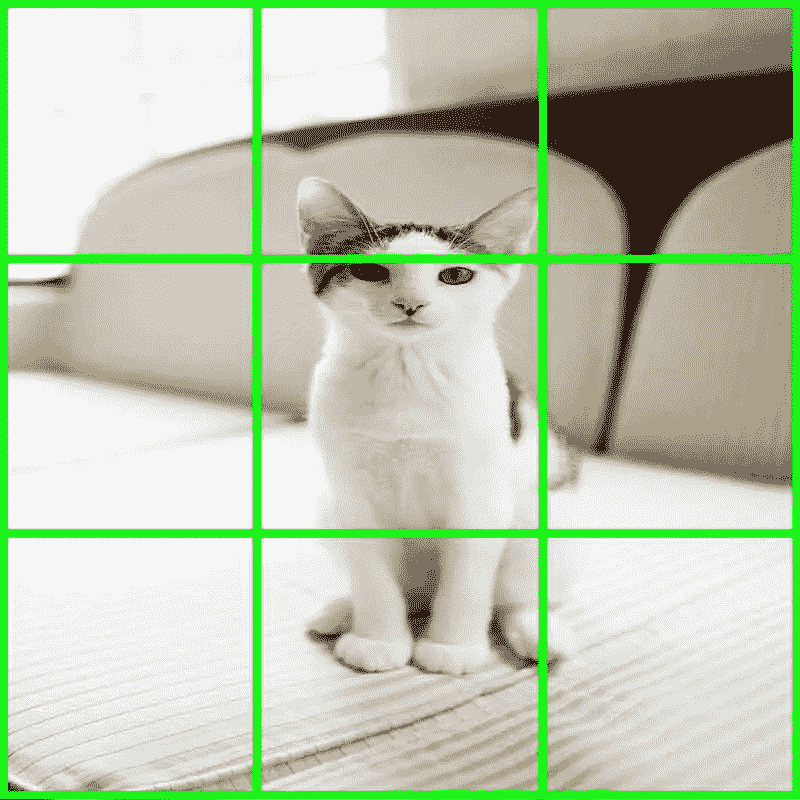
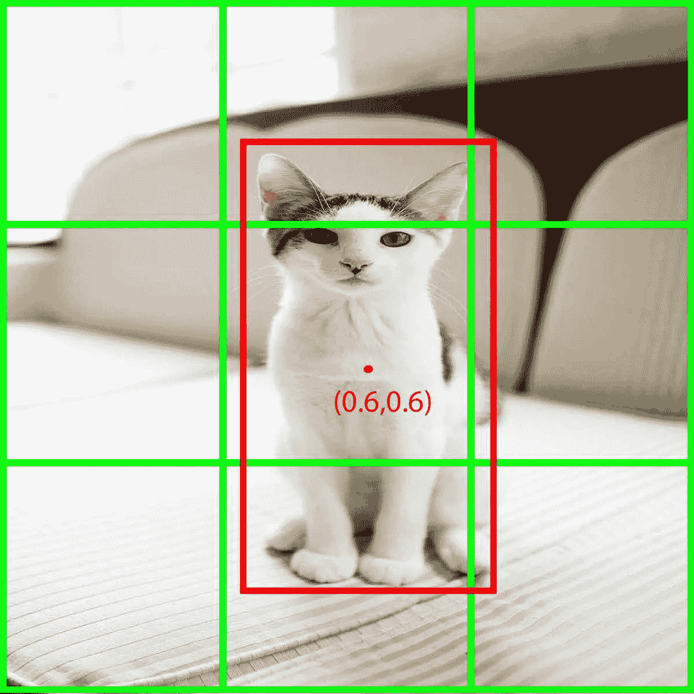
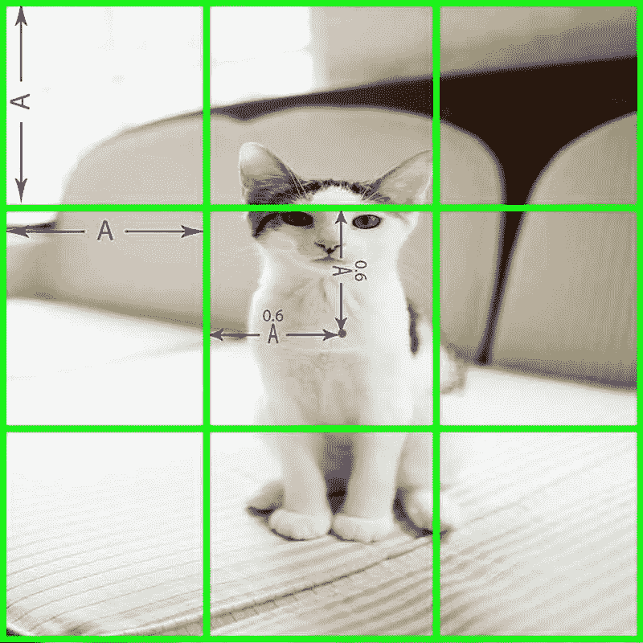
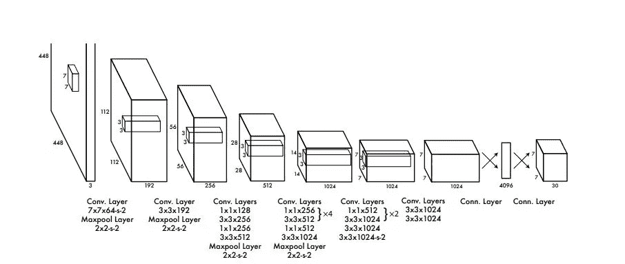
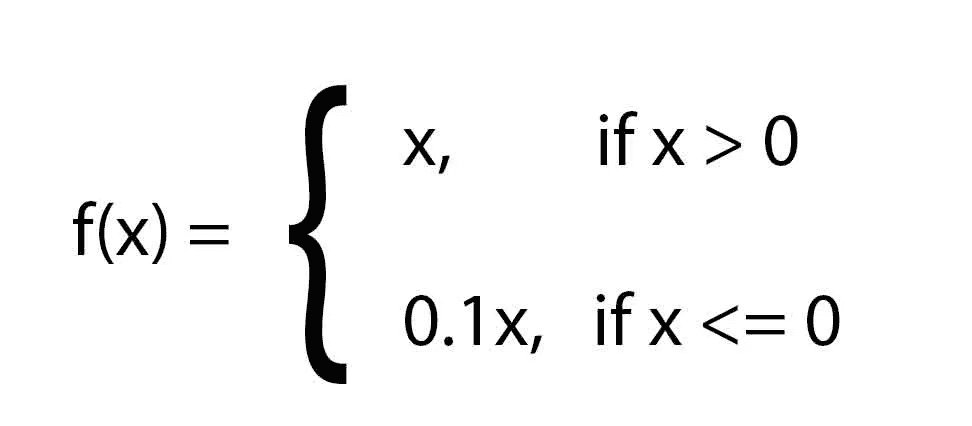
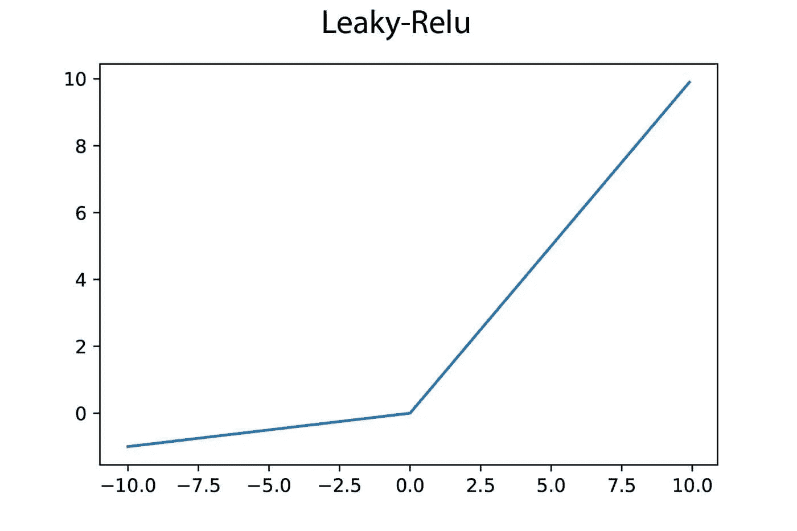
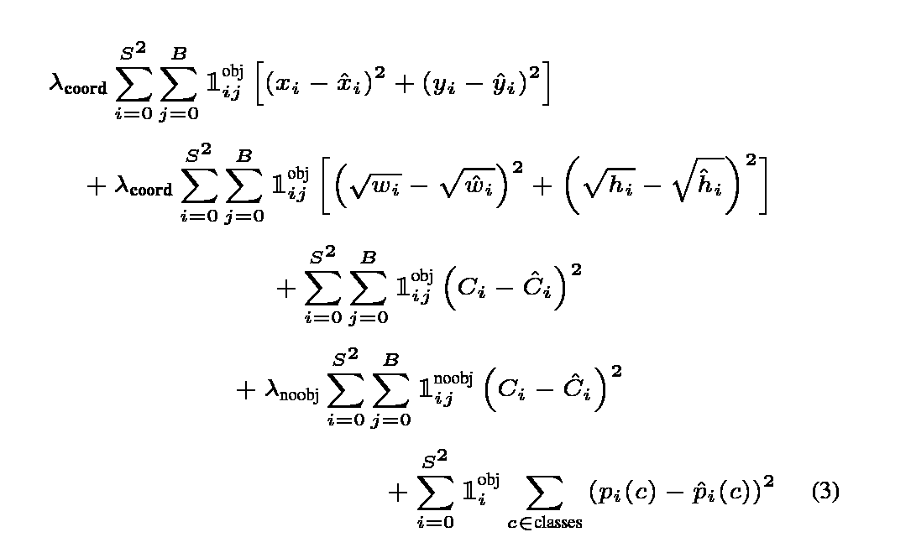
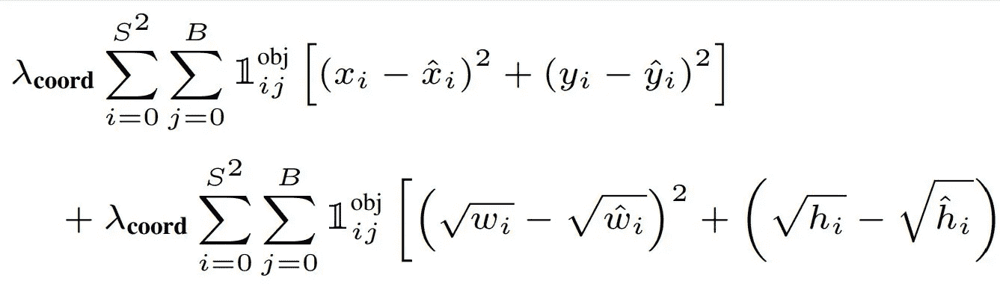
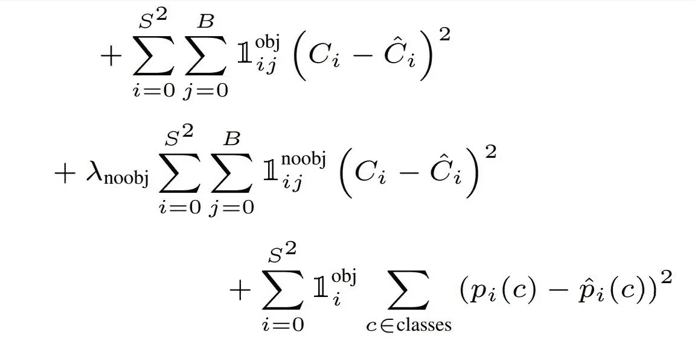

# YOLO 使简单:解读《你只看一次》一文

> 原文：<https://towardsdatascience.com/yolo-made-simple-interpreting-the-you-only-look-once-paper-55f72886ab73?source=collection_archive---------18----------------------->

## 浏览论文中的实质细节和经常被忽视的事实，并简单解释。

YOLO:你只看一次——来源来源:[卡内尔斯在 pixabay](https://pixabay.com/photos/yolo-sparklers-new-year-1758212/)

与最先进的 R-CNN 模型不同，“YOLO:统一的实时对象检测”或“YOLOv1”提供了一种端到端的对象检测和分类解决方案。这意味着我们可以训练单个模型直接从输入图像进行检测和分类，并且是完全可微分的。对象检测的传统方法的例子是在图像的不同部分上以不同的比例运行分类器。整洁，对不对？！你所需要的只是一个分类器。

听起来很简单，在一张图像上运行数百次分类器来定位对象是非常低效的。但 YOLOv1 处理得很巧妙。它通过图像的单次向前传递进行检测和分类，并实时运行。因此得名“你只看一次”。我们将详细研究论文中描述的所有内容。

# 介绍

作者将 YOLO 的工作比作人类的感知。我们，人类，看一眼一个场景，立刻就能对现在的情况，在哪里，谁在做什么有个大概的了解，还有更多。人类的视觉皮层很神奇吧？YOLOv1 通过将对象检测和分类问题视为回归，一次性预测图像中存在哪些对象以及它们的位置。简单地说，你给 YOLO 模型一个图像，它通过一堆层，最终输出将是类预测和边界框坐标。在这里，作者简明扼要地将 YOLO 的工作定义为

> 直接从图像像素到包围盒坐标和类别概率。

# YOLO 的物体探测方法

YOLO 通过使用一个优雅的过程来处理物体检测，将图像分成一个由 ***S* x *S*** 细胞组成的网格。而 YOLO 将输入限制为正方形图像。

*S×S 网格*

如果对象的中心落在特定的单元内，则每个单元产生对象的类别和边界预测。这种方法是强大的，因为它使 YOLO 能够检测图像中的多个对象，并同时对它们进行分类。然而，将图像划分成更多的单元将产生更细粒度的预测。网格中的每个单元负责预测边界框参数、对象存在的置信度和类别概率。最终的边界框预测由框中心的 x 和 y 坐标、sqrt(宽度)、sqrt(高度)和对象概率得分组成。

*注意:YOLOv1 预测边界框相对于图像的宽度和高度的平方根。原因在* ***损失功能*** *一节下面解释。*

如果有 20 个类( ***C*** =20)，则单元格的输出为【x，y， **√** w， **√** h，对象概率， ***C1，C2，C3，…。，C20*** 。上述概率是条件类概率。为了澄清，它是给定对象存在于单元中，对象属于特定类的概率。当然，单元格网格中的每个单元格都预测类似的项目列表。

但是还有一件事。在 YOLOv1 中，每个单元格预测的不是一个而是 ***B*** 边界框。而这些包围盒每一个都有[x，y， **√** w， **√** h，物体概率]。然而，YOLO 只对每个像元预测一次类别概率，而不考虑边界框的数量。因此，每个单元的输出现在有更多的项目。举例说明，如果 ***B*** =2、 ***C*** =20，则输出增长为[x1，y1， **√** w1， **√** h1，obj。prob1，x2，y2， **√** w2， **√** h2，obj。C1，C2，…，C20 。

对于在具有 20 个类别的 PASCAL VOC 上的检测，它预测 7×7 的单元网格，每个单元具有 2 个边界框。考虑到所有单元格的预测，输出形状将是一个立方体，其尺寸为( *7 x 7 x 30* )。由于 ***C*** =20，两个边界框贡献了 10 项，并且类别概率有 20 项。这加起来就是三十，这就解释了第三次元中的“***”30***”。

# 解读 YOLO 的产量预测

边界框中心的 x 和 y 坐标相对于该网格单元的左上角，而不是相对于图像的左上角。每个单元格预测相对于其位置的坐标，这些坐标作为单元格位置的偏移量。

照片由 [Charis Gegelman](https://unsplash.com/@wildfernstudio?utm_source=unsplash&utm_medium=referral&utm_content=creditCopyText) 在 [Unsplash](https://unsplash.com/images/animals/cat?utm_source=unsplash&utm_medium=referral&utm_content=creditCopyText) 上拍摄

如果我们将图像分成 *3 x 3* 个网格单元，如上图所示，对象的中心落在中心网格单元内。而如果我们再假设每个网格单元的宽度和高度都是 ***A、*** 的话，那么对象中心的坐标就是( ***0.6A、0.6A*** )相对于单元的左上角。模型预测的坐标值在 **0** 和 **1** 之间，是 ***A.*** 的一个分数，因此，坐标( ***0.6，0.6*** )表示 ***A 的****长度向右的*60%**这些坐标可以相对于整个图像进行转换，因为我们知道哪个单元预测了盒子及其相对坐标。********

**

*对象中心相对于图像的坐标*

*对于上面的例子，盒子相对于图像的中心是 ***(A+0.6*A，A+0.6*A)。*** 原 ***A*** 加到 ***0.6*A*** 是单元格左上角到图像左上角的距离。因此，总和给出了盒子中心相对于整个图像的坐标。但是边界框的高度和宽度是相对于整个图像预测的。对于上面的“猫”的例子，边界框的高度几乎是图像高度的三分之二。并且该框的宽度是图像宽度的三分之一。*

*因此，YOLO 将宽度和高度预测为图像的宽度(***【W***)和高度(*)分别为***1/3***和*2/3*。因此宽度和高度预测意味着 **√( *0.33*W)，* √( *0.66*H)。*** 最后，一个物体的概率也表示为一个介于 ***0*** 和 ***1*** 之间的数。该对象概率乘以预测框与地面真实值的交集(IoU)以给出 ***置信度得分*** 。IoU 是一个分数，它表明预测框与实际框重叠的程度。其值也在分别表示无重叠和完全重叠的 ***0*** 和 ***1*** 之间。**

**置信度得分 **1** 表示 100%置信度，**0T5，0%置信度。该值越高，单元格越确信有对象存在。这个置信度得分乘以条件类概率，以产生给定类存在的概率得分。****

**最终预测的包围盒参数应该是( ***0.6，0.6，* √ *0.33，* √ *0.66，1*** )表示(x，y，width，height，obj。prob)。**

# **网络架构**

****

**YOLOv1 架构来源:[https://arxiv.org/pdf/1506.02640.pdf](https://arxiv.org/pdf/1506.02640.pdf)本文作者拥有这张图片。我只是用它来说明他们的工作！**

**自 YOLOv1 于 2015 年问世以来，它遵循了典型的卷积架构，但创新了预测输出的方式。它有 24 个卷积层，4 个最大池层和两个全连接层，一个有***4096 个*** 神经元，另一个有***1470 个*** 神经元。该模型接收尺寸为 ***448 x 448*** 的输入彩色图像，用于对象检测。正如我们之前看到的，YOLOv1 预测了来自其最终完全连接层的 ***长方体*** 输出。那是用***1470 个*** 神经元将最后一个全连接层的输出重塑成一个(***7×7×30***)长方体为帕斯卡 VOC。显式地，我们可以看到最后一层有***1470 个*** 神经元，因为它需要被重塑为***7 x 7 x 30 = 1470。*****

**特征提取器由不同滤波器大小的卷积层构建，其中一些卷积层之后是后续的最大池层，用于空间缩减。平常的东西！在 YOLO 模型中，只有第一个卷积层有 *7 x 7* 滤镜。其他的都有 *3 x 3* 滤镜*。*网络不仅仅使用交替 *3* x *3* 卷积和最大池层数，而是使用 *1* x *1* 卷积。**

**作者提到他们的架构受到了引入了 Inception 模块的 GoogLeNet 的启发。**

> **我们的网络架构受 GoogLeNet 图像分类模型的启发**

**但与 GoogLeNet 不同，YOLOv1 不使用 inception 块。相反，在应用大量的*3×3*过滤器之后，它使用*1×1*卷积来减少特征图的通道深度。 *1 x 1* 滤镜有一个非常小的感受域(只有一个像素)，但它们主要用于减少 *3 x 3* 卷积层之后各层的计算负载。此外，它们有助于在不改变感受野的情况下引入非线性。**

**不太明白？我们将详细研究为什么它是有益的。**

## **1 x 1 卷积**

***1×1*卷积的概念是在闵等人的论文**网络中的网络**中介绍的，这里看一下论文[的](https://arxiv.org/abs/1312.4400)**

***注意:以下示例解释了带有卷积层的小模型的 1 x 1 卷积。不要把这个示例模型与 YOLO 的建筑混淆***

**例如，考虑大小为 ***(100，100，3)*** 的输入图像被馈送到具有零填充的 128 个滤波器的*3×3*卷积层。我们零填充以产生与输入***【100，100】***相同空间维度的输出特征图。为了简单起见，我们忽略**批次**维度。每个滤波器与输入图像卷积后产生一个 ***(100，100，1)*** 输出特征图。由于我们有 128 个这样的滤波器，滤波器输出附加到信道维度以产生形状为 ***(100，100，128)*** 的输出。这一层的权重大小应该是 ***(3，3，3，128)*** 也就是(filter_x_size，filter_y_size，input_channels，filter _ number)。**

**目前为止还好(只是正常卷积！).**

**现在，如果我们再次将这个输出馈送到下一个具有 128 个滤波器的*3×3*卷积层，它的权重将必须是 ***(3，3，128，128)。*****

**你现在明白了吗？第一层只有 3456 个参数(3x3x3x128 = 3,456)。但是，由于第二层对 128 个通道的输入进行操作，因此它有多达 147，456 个参数(3x3x128x128=147，456)！现在想想后续层会有多少参数？为了减少这种爆炸效应，在将第一卷积层的 ***(100，100，128)*** 输出馈送到下一层之前，应用 *1 x 1* 卷积。**

**对 ***(100，100，128)*** 应用 32 个*1×1*滤波器，将通道深度减少到 ***(100，100，32)。*** 现在，下一个 *3 x 3* 卷积层的参数将是 ***(3，3，32，128)*** 。参数的数量从 147456 个减少到 36864 个 ***(3x3x32x128)*** 。除此之外， *1 x 1* 卷积层有 128x32=4096 个参数。现在总共只有 40，960 个参数，少了 3.6 倍！**

**YOLOv1 模型在两个完全连接的层之间使用了一个压差，以防止过度拟合。但它没有使用任何其他技术，如[批量标准化](https://hackerstreak.com/batch-normalization-how-it-really-works/)可以加速训练。**

**既然我们已经看到了什么是 *1 x 1* 卷积，让我们继续讨论网络的其他内容。**

# **培养**

**我们在开始时看到，网络有 24 个卷积层、4 个最大池层和 2 个光纤通道层。**

**跳到这里来学习**

**[如何建立一个简单的卷积神经网络，在 kaggle 数据集上训练并达到 99.9%的准确率！](https://hackerstreak.com/kaggle-cactus-detection/)**

**作者在 ImageNet 数据集上以 *224 x 224 的输入分辨率预训练了前二十个卷积层。它*的分辨率只有 YOLOv1 的检测输入的一半，即 *448 x 448。*这显然是因为 ImageNet 图像的大小为 *224 x 224。***

> **我们在 ImageNet 分类任务中以一半的分辨率(224 × 224 输入图像)预训练卷积层，然后将分辨率提高一倍用于检测——yolo v1 作者**

**由于只有前 20 个卷积层用于迁移学习，它可以对任何分辨率的输入图像进行操作。**

**预训练有助于卷积滤波器从 ImageNet 数据集学习模式。由于它包含了属于一千多个类别的大量图像，卷积层可以学习许多有用的特征。预训练和迁移学习为 YOLO 检测提供了很好的性能提升。**

> **对于预训练，我们使用图中的前 20 个卷积层，随后是一个平均池层和一个全连接层——yolov 1 作者**

**在 ImageNet 上进行预训练后，移除平均池和完全连接的预测层。它们被四个 *3 x 3* 卷积层和两个全连接层取代。**

***注意:仅对于使用 S=7，B=2 的 PASCAL VOC 数据集，输出尺寸为 7 x 7 x 30。如果任何一个参数* ***S*** *(网格单元数 S x S)，* ***B*** *或数据集中的类数发生变化，这个输出形状也会发生变化。***

**这些级联卷积和最大池层将特征图的空间维度从 *448 x 448* 减少到所需的 *7 x 7* 大小*。***

**除了最终完全连接的层之外，网络中的所有层都使用“Leaky-Relu”激活功能。并且最后一层具有线性激活。**

****

**Leaky-Relu 的数学表达式**

**Leaky-relu 的图形与整流线性单元(relu)略有不同。看一看！**

****

**Leaky-Relu 激活函数图**

**需要注意的一件重要事情是最终层的输出。正如我们之前提到的，它有一个 ***线性激活*** ，它的输出被整形形成一个***7×7×30***张量。最后，YOLOv1 模型在 PASCAL VOC 数据集上训练了 135 个时期。作者采用的一些训练技巧如下。**

> **在整个训练过程中，我们使用的批量大小为 64，动量为 0.9，衰减为 0.0005。对于第一个时期，我们将学习率从 103 慢慢提高到 102。我们继续用 102 训练 75 个周期，然后 10^−3 训练 30 个周期，最后 10^−4 训练 30 个周期。**

# **损失函数**

**YOLO 的损失函数可能看起来吓人，但它非常简单。使用的损失称为 ***平方和损失*** ，用于 YOLOv1 中的所有任务。作者引用说，优化平方和比对数似然更容易。但是他们也提到它有一些缺点。**

**平方和误差同等地衡量定位误差和分类误差。而且，由于图像中的许多网格单元不包含任何对象，平方和误差试图使这些单元的置信度得分为零。这意味着他们的损失将主导梯度，它不会让模型收敛。为了解决这个问题，作者引入了参数 ***λcoord*** 和 ***λnoobj。*****

**这两个参数对损失函数中的不同项进行加权，以保持无对象像元造成的损失较低。并且也更加权衡坐标损失。**

****

**YOLOv1 的损失函数来源:[https://arxiv.org/pdf/1506.02640.pdf](https://arxiv.org/pdf/1506.02640.pdf)再次声明，作者拥有这张图片。我只是用它来说明他们的工作！**

**让我们把它分解一下，了解损失中的每一项是什么意思。**

# **定位误差**

****

**定位误差**

**第一项计算预测坐标和地面真实坐标之间的平方和损失。对所有单元格中的所有边界框都这样做。得到的和乘以 ***λcoord。*** 作者用值 5 为 ***λcoord。******" 1 obj I，j***"*项表示在第 **i** 行和第 **j** 列单元格中存在一个对象。***

***第二项计算预测高度和宽度的平方和损失。该模型预测宽度和高度的平方根，而不是直接预测它们的值。这样做是为了缓解作者提到的某个问题。***

> ***平方和误差同样对大盒子和小盒子中的误差进行加权。我们的误差度量应该反映大盒子中的小偏差不如小盒子中的小偏差重要。为了部分解决这个问题，我们预测边界框宽度和高度的平方根，而不是直接预测宽度和高度***

***假设有两个地面实况箱，高度分别为 10.2 和 2.2。在这个例子中，我们不考虑盒子的宽度。假设模型预测的身高是 10.1 和 2.1。现在根据损失项，较大的盒子误差为( **√** 10.1- **√** 10.2)，较大的盒子误差为( **√** 2.1- **√** 2.2)。你可以看到损失值分别是 10^-4 的 2.4 倍和 10^-3 的 1.16 倍。如您所见，预测高度和宽度的平方根在较小的框中更重视小误差。***

# ***分类误差***

******

***分类误差***

***其中的第一项计算每个像元中每个边界框的预测置信度得分和基本事实之间的误差平方和。这个误差项对应于物体所在单元的误差。因此使用了术语***“1 obj I，j*** ”。***

**类似地，第二项计算不包含任何对象的像元的平方和误差。术语“ ***1 noobj i，j*** ”表示第**I****列和第 **j** 行单元格中没有对象。这个总和由 ***λnoobj*** 项加权，以使这个损失更小。作者将 ***λnoobj*** 赋值为 0.5。****

****最后一项计算类别概率的相同损失。它对每个像元中的所有类进行迭代，并计算损失平方和。这个损失项还有***“1 obj I，j*** ”。这意味着没有任何对象的单元不会造成分类损失。****

# ****结束了****

****我希望这篇文章能让你深入了解 YOLO 的工作。如果你发现任何错误，请在评论中报告。勘误表，如果有的话，确实是无意的。****

# ****参考****

1.  ****你只看一次:统一的，实时的物体检测:【https://arxiv.org/abs/1506.02640 ****
2.  ****网络中的网络[https://arxiv.org/abs/1312.4400](https://arxiv.org/abs/1312.4400)****

*****最初发表于*[*https://hackerstreak.com*](https://hackerstreak.com/)****