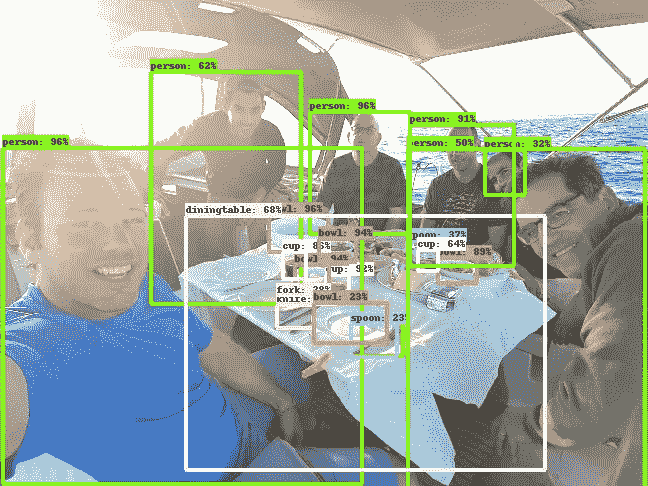
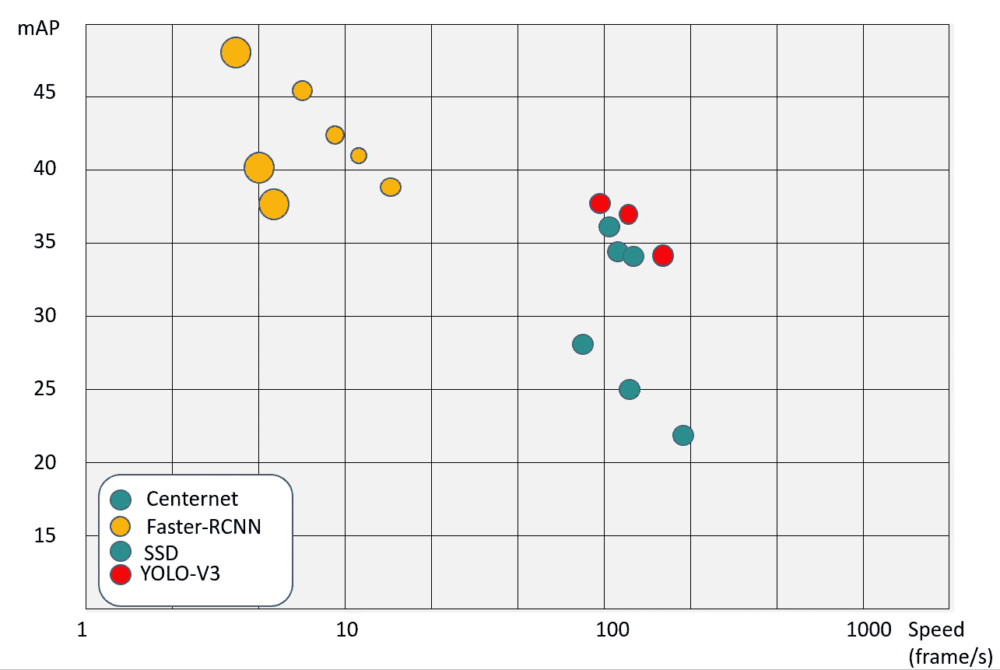
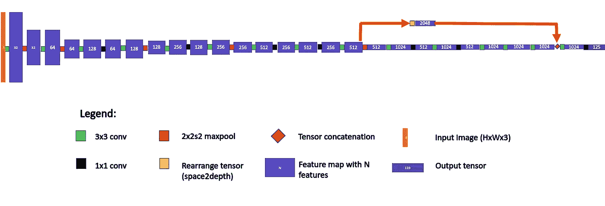
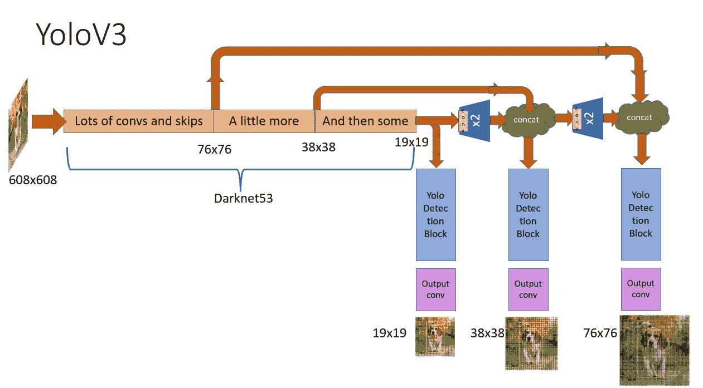
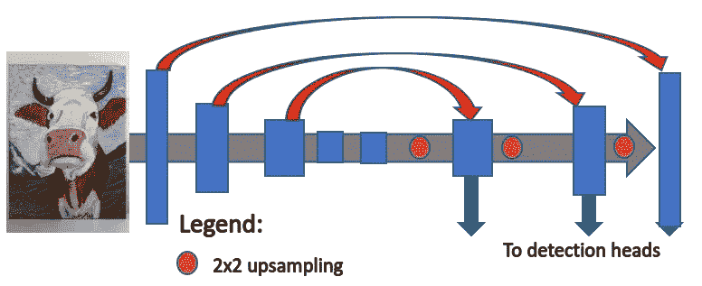
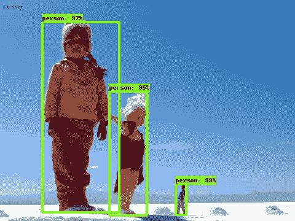
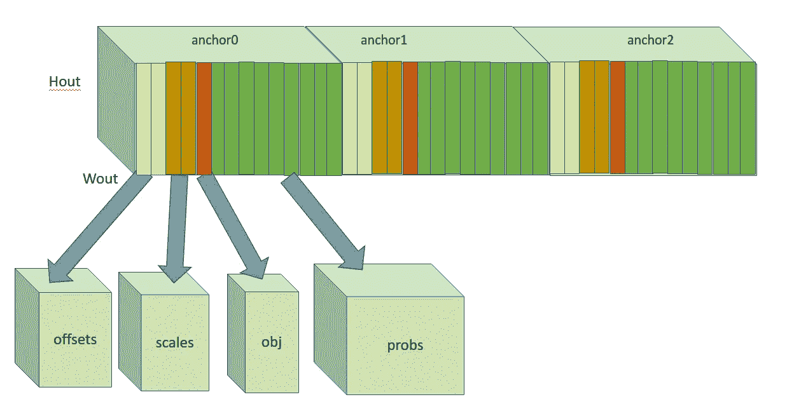
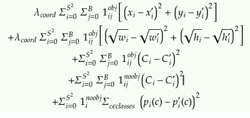
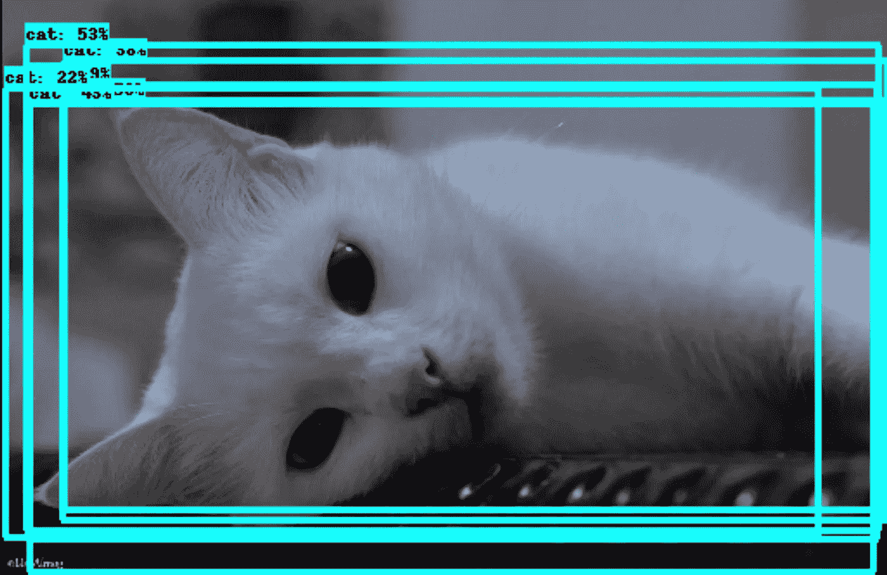
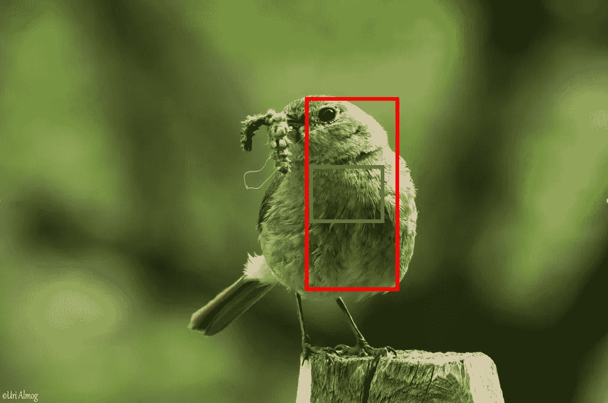

# YOLO V3 解释道

> 原文：<https://towardsdatascience.com/yolo-v3-explained-ff5b850390f?source=collection_archive---------3----------------------->

Yolo-V3 检测。图片来源: [Uri Almog Instagram](https://www.instagram.com/urialmog/)

在本帖中，我们将讨论 YOLO 探测网络及其版本 1、2，尤其是版本 3。

2016 年 **Redmon，Divvala，Girschick 和法尔哈迪**以一篇题为: [***你只看一次:统一的、实时的物体检测***](https://arxiv.org/abs/1506.02640) 的论文对物体检测进行了革命。在论文中，他们介绍了一种新的对象检测方法——将特征提取和对象定位统一到单个整体块中。此外，本地化和分类负责人也进行了整合。他们的单级架构，命名为 ***YOLO*** (你只看一次)导致了非常快的推理时间。在 Titan X GPU 上，448x448 像素图像的帧速率为 45 fps(每幅图像 0.022 秒)，同时实现了最先进的 ***mAP*** (平均精度)。更小且稍不精确的网络版本达到了 150 fps。这种新方法，加上基于轻量级谷歌 ***MobileNet*** 主干的其他检测器，使边缘设备上的检测网络和其他 CV 任务的愿景(双关语)更加接近现实。原来的 YOLO 项目可以在这里找到[。](https://github.com/pjreddie/darknet)

顺便说一下，Redmon 似乎是一个非常丰富多彩的家伙。他的 YOLO 项目网站可以在这里找到。

检查我在上一篇文章中展示的 GluonCV 模型动物园图，可以看到经过 GluonCV 训练的不同版本的 **YOLO-V3** (红点)达到了极好的精确度，仅次于慢得多的 fast-RCNN。

检测器性能图表。代表性架构。图表数据取自 [GluonCV](https://gluon-cv.mxnet.io/model_zoo/detection.html) 模型动物园。图表创建者:Uri Almog

YOLO 背后的想法是这样的:没有需要彼此同步的分类/检测模块，也没有像以前的 2 阶段检测器那样的重复区域提议循环(见我在 [**上的帖子，早期的物体检测器**](https://medium.com/@urialmog/object-detection-with-deep-learning-rcnn-anchors-non-maximum-suppression-ce5a83c7c62b?source=friends_link&sk=f364d88880502c32e2f5147a6d6ed982) ，如 RCNN)。它基本上是一路向下的卷积(偶尔有 maxpool 层)。一个单一的整体网络需要处理特征提取、盒子回归和分类，而不是裁剪出一个物体的高概率区域，并将它们提供给一个找到盒子的网络。以前的模型有两个输出图层-一个用于类概率分布，一个用于盒预测，而这里的单个输出图层包含不同要素的所有内容。

# 约洛-V1 建筑

约罗-V1 是第一次出现一级探测器的概念。该架构采用了*(***BN***)和***leaky ReLU activations***，这在当时是比较新的。我不打算详细介绍 V1，因为它已经相当过时，并且缺少一些后来引入的强大功能。*

# *约洛-V2 建筑*

**

*约罗-V2 包含 22 个卷积和 5 个最大池运算。要素地图高度代表空间分辨率。125 个特征的输出用于具有 20 个类和 5 个锚点的 VOC PASCAL 数据集。来源:尤里·阿尔莫格*

*在约洛-V2 版本中，作者们除了其他改动之外，还删除了末尾的全连接层。这使得该架构真正独立于分辨率(即网络参数可以适合任何输入分辨率)。这并不一定意味着网络在任何分辨率下都能表现良好。在训练期间采用了分辨率增强程序。雷德蒙创造了多种版本的约罗-V2，包括更小、更快(和更不精确)的版本，像 ***蒂尼-约罗-V2*** 等。*

*Tiny-Yolo-V2 的架构非常简单，因为它没有像它的兄弟姐妹那样奇怪的旁路和重新排列操作。微型版本只是一个漂亮的、长长的卷积和最大池链。*

*描述这些架构的配置文件可以在 darknet github 的 [cfg 部分找到。](https://github.com/pjreddie/darknet/blob/master/cfg/)*

# *YOLO-V3 架构*

*受 ***ResNet*** 和 ***FPN*** (特征金字塔网络)架构的启发， ***YOLO-V3 特征提取器*** ，称为 ***Darknet-53*** (它有 52 个卷积)包含跳过连接(像 ResNet)和 3 个预测头(像 FPN)——每个都以不同的空间压缩处理图像。*

**

*YOLO-V3 架构。来源:尤里·阿尔莫格*

*像它的前身一样，Yolo-V3 在各种输入分辨率下都有良好的性能。在 ***GluonCV 的 model zoo*** 中，你可以找到几个检查点:每一个都有不同的输入分辨率，但事实上存储在这些检查点中的网络参数是相同的。在 COCO-2017 验证集上使用输入分辨率 608x608 进行测试，Yolo-V3 的 mAP 得分为 37(平均平均精度)。这个分数与 GluonCV 的训练版***Faster-RCNN-*ResNet 50**(一种以 ResNet-50 为主干的 Faster-RCNN 架构)相同，但快了 17 倍。在模型动物园中，速度足以与 Yolo-V3 (Mobilenet-SSD 架构)竞争唯一检测器的 mAP 得分为 30 及以下。*

***特色金字塔网(FPN):在两个婚礼上跳舞***

*特征金字塔(Feature-Pyramid)是由 ***FAIR*** (脸书人工智能研究所)在 2017 年开发的一种拓扑结构，其中特征地图在空间维度上逐渐减小(这是通常的情况)，但后来特征地图再次扩展，并与之前具有相应大小的特征地图连接在一起。重复该过程，并且将每个连接的特征图馈送到单独的检测头。*

**

*特征金字塔网络。来源:尤里·阿尔莫格*

*参考上面的 YOLO-V3 图示，FPN 拓扑允许 YOLO-V3 学习不同大小的对象:与其他检测块相比，19x19 检测块具有更宽的上下文和更差的分辨率，因此它专门用于检测大对象，而 76x76 检测块专门用于检测小对象。每个探测头都有一套独立的锚定标尺。*

**

*Yolo-V3 探测不同大小的物体。来源:[尤里·阿尔莫格摄影](https://www.facebook.com/uri.almog.photography/)*

*与 ***SSD*** (单次检测器)架构不同，在该架构中，38×38 和 76×76 块将仅接收来自特征提取器中间的高分辨率、部分处理的激活(图中顶部的两个箭头)，在 FPN 架构中，这些特征在特征提取器的末端与低分辨率、完全处理的特征连接在一起。*

*这使得网络能够在两个婚礼上跳舞，正如他们在意第绪语中所说的那样，并利用高度处理但窄上下文特征和部分处理但宽上下文特征来进行预测。*

*YOLO-V3 的输出方案与 V2 相同，并且不同于旧的 V1。*

***YOLO-V2/V3 输出方案——单层击穿:***

**

*YOLO V2 和 YOLO V3 输出层。Wout 和 Hout 是输出要素地图的空间维度。对于每个锚点，特征按描述的顺序排列。来源:尤里·阿尔莫格*

*输出图层的要素地图中的每个像元都预测了 Yolo-V3 的 3 个盒子和 YOLO-V2 的 5 个盒子-每个锚点一个盒子。每个箱式预测包括:*

1.  ***框中心偏移的 2 个值(在 x 和 y 方向，相对于单元格中心)，***
2.  ***2 值框尺寸刻度(在 x 和 y 方向，相对于锚点尺寸)，***
3.  ***1 个客观分数值(0 到 1 之间)，***
4.  ***类分数的类数值(介于 0 和 1 之间)。***

*(准确的说，盒子大小值是‘残差值’。在后处理中，它们用于通过以下方式计算盒子宽度*

*box_width = anchor_width * exp(剩余值 _of_box_width))*

*上面的 YOLO-V2 图解是为 20 类 VOC PASCAL 数据集设计的，有 5 个锚点。125 个要素的输出排列如下:每个空间像元有 125 个版本。要素 0 是对象性分数，要素 1–2 是盒子的 x 和 y 比例，要素 3–4 是盒子中心的 x 和 y 偏移(相对于像元坐标本身)，而要素 5–24 是 20 类分数。所有这些——为了第一个主播。特征 25-49 重复相同的特征分配-这一次使用第二个锚，以此类推。注意，锚尺寸不直接在特征中表示，但是那些特征中的比例值传递到后处理，并且被分配有用于盒解码的相应锚比例。*

****对象性*** 是一个新概念，值得在几个段落中进行讨论。现在让我们把它想象成网络的**置信度**，即**某个**对象存在于给定的盒子中，并且假设盒子中存在一个对象，则类得分是 ***条件概率*** (即假设 x 类的概率在这个盒子中存在一个对象)。因此，每个类别的总置信度得分是**客观性**和**类别得分**的乘积。*

*然后，网络的输出经过 NMS 和一个置信度阈值，给出最终的预测，正如我在关于 [**探测器基础**](https://medium.com/@urialmog/object-detection-with-deep-learning-rcnn-anchors-non-maximum-suppression-ce5a83c7c62b?source=friends_link&sk=f364d88880502c32e2f5147a6d6ed982) 的帖子中所解释的。*

***为什么 YOLO 比以前的架构表现更好？***

*如果说我在研究 YOLO 和它的小版本时学到了什么的话，那就是外表可能会骗人:YOLO 的拓扑结构如此小而简单，它能有多复杂呢？好吧。使它能够具有如此简单的结构，或者更准确地说是紧凑的损失函数是非常复杂的。正是失去赋予了这些特征意义。因此，一个精心制作的损失函数可以将大量信息打包到一个小的要素地图中。*

*在下一节，我们将讨论 YOLO 损失函数的最重要的特征。*

# *YOLO 培训和流失机制*

*这一部分是基于我对 ***Darknet*** 框架(Redmon 开发的框架)的训练流所做的研究，当时我正在进行该框架的独立 TensorFlow 实现。*

# *输入分辨率增强*

*作为一个 ***全卷积网络***——不像以前的检测器那样包含用于分类任务的全连接层——它可以处理任何大小的输入图像。但是，由于不同的输入分辨率会产生不同的网络参数，因此使用 ***分辨率增强来训练网络:*** 作者使用了 384x384 和 672x672 像素之间的 10 个输入分辨率步长，每隔几个训练批次随机交替，使网络能够推广其对不同分辨率的预测。*

# *损失系数—分而治之*

*损失函数对不同的盒子进行不同的处理。*

*正如我在[上一篇文章](https://medium.com/@urialmog/object-detection-with-deep-learning-rcnn-anchors-non-maximum-suppression-ce5a83c7c62b?source=friends_link&sk=f364d88880502c32e2f5147a6d6ed982)中解释的那样，网络输出层**中的每个空间单元预测多个盒子**(在 YOLO-V3 中有 3 个，在以前的版本中有 5 个)——所有的盒子都以那个单元为中心，通过一种叫做 ***的机制锚定*** 。*

*每个盒预测的 YOLO 损失由以下项组成:*

1.  ***坐标丢失** —由于盒子预测没有完全覆盖对象，*
2.  ***对象丢失** —由于错误的盒对象 IoU 预测，*
3.  ***分类损失** —由于对正确类别的预测为‘1’而对该框中的对象的所有其他类别的预测为‘0’的偏差。*
4.  *这是一个特殊的损失，我们将在下面两节详细阐述。*

**

*YOLO-V1 损失函数。λ是损耗系数。前 3 行是“最佳盒子”(在每个空间单元中最佳捕获 GT 对象的盒子)造成的损失，而第 4 行是由于没有捕获对象的盒子造成的损失。在 YOLO V2 和 V3 中，直接的宽度和高度预测以及平方根被替换为剩余比例预测，以使损失参数与相对比例误差而不是绝对比例误差成比例。*

*一个盒子预测的质量是通过它的 ***IoU*** (交集/并集)与它试图预测的对象(更准确地说，是与它的基础真值盒子)来衡量的。IoU 值的范围从 0(框完全错过对象)到 1.0(完美匹配)。*

*对于每个空间像元，对于位于该像元中心的每个框预测，损失函数会找到对象位于该像元中心的具有最佳 IoU 的框。这种区分 ***最佳盒子*** 和所有其他盒子的机制是 YOLO 损失的核心。*

****最佳框*** 和它们本身导致**坐标损失**(由于与对象不完全匹配)和**分类损失**(由于分类错误)。这推动了与那些盒子相关联的网络参数，以改进盒子的规模和位置，以及分类。这些盒子还会导致信心丧失——我们将立即对此进行解释。所有其他盒子只招致**信任损失**。*

# *失去目标——知道自己的价值*

*每一个框预测都与一个称为“**客观**的预测相关联。它出现在像 RCNN 这样的以前的检测器中的地方，即区域提议包含对象的置信度，因为它乘以 lass 分数以给出绝对的类置信度。然而，与预期相反——该预测实际上是一个 **IoU 预测**——即网络 ***认为*** 盒子覆盖物体的程度。**目标损失**项教导网络预测**正确的 IoU** ，而**坐标损失**教导网络预测**更好的盒子**(最终将 IoU 推向 1.0)。所有的盒预测都会造成对象损失，但只有每个空间像元中的最佳拟合盒也会造成坐标和分类损失。*

*为什么我们需要客观损失？*

*在推理中，我们通常有多个盒子，每个盒子有不同的覆盖范围。我们希望后处理算法选择以最精确的方式覆盖对象的盒子。我们还想选择对对象给出正确类别预测的盒子。算法怎么知道选哪个盒子？*

*首先，对象性告诉我们覆盖率有多好——所以对象性非常小的盒子(<0.005) are discarded and don’t even make it to the NMS block (see explanation in [我之前的帖子](https://medium.com/@urialmog/object-detection-with-deep-learning-rcnn-anchors-non-maximum-suppression-ce5a83c7c62b?source=friends_link&sk=f364d88880502c32e2f5147a6d6ed982))。这有助于消除大约 90%的盒子，它们只是架构的工件，而不是真正的检测(当然，这取决于任务和数据。如果您的任务是检测装满瓶盖的盒子中的瓶盖，那么您可以预期有大量的实际检测)。*

**

*抑制 NMS 时的多框检测结果。客观性分数告诉 NMS 哪些盒子要保留，哪些要丢弃。来源:[乌里阿尔莫摄影](https://www.facebook.com/uri.almog.photography/)。*

*第二，NMS 是为每个类分别做的，所以类的分数是由盒子的对象性来衡量的，以便进行有意义的比较。如果我们有两个高度重叠的框，第一个框的对象性为 0.9，人员概率为 0.8(加权分数为 0.72)，第二个框的对象性为 0.5，人员概率为 0.3(加权分数为 0.15)，则第一个框将持续存在，第二个框将在 NMS 中消失，因为第一个框的对象性使其更值得信任。*

***为什么“最佳包厢”在培训期间会受到不同的对待？***

*我没有看到 Redmon 对这个问题的任何解释，但我的直觉是这样的:想想一位教授，她有以下策略:在第一次作业中，她寻找表现好的学生，并努力检查和评分他们的作业，以便他们能在该科目中表现出色。为了集中注意力，她懒得批改成绩不太好的学生的作业。相反，她给他们一个机会，让他们在下一次作业中在另一个科目上表现出色。*

*只推最好的盒子来提高覆盖率和档次的原因是专注。我们希望培训能够很好地融合。网络有丰富的参数，所有参数都有大量的工作要做，所以不要急于一次优化所有参数。试图推动所有盒子的参数来捕捉相同的对象——奖励所有盒子近似捕捉相同的对象——可能会导致损失景观中非常长且嘈杂的轨迹，或者更糟的是——陷入次优最小值(因为它们可能无法很好地学习检测具有不同特征的对象，但会陷入局部最小值，而无法学习不同的行为)。最好是**利用**一些盒子的相对成功，只推动它们在这种类型的对象中成功，同时让与不太成功的对象相对应的参数**探索**其他选项(以一种将很快解释的方式)。*

*另一方面，我们希望所有的盒子都经历对象性损失——为什么？我们希望所有的盒子——包括坏盒子——能够学会辨别它们是好是坏，即使他们在一生中(或至少在训练中)没有学到任何东西——因为 NMS 依赖于它(即使如此——YOLO 给‘最好的盒子’比其他盒子更高的物体损失系数)。*

# *收缩损失——利用与探索*

*我称之为 ***锚收缩*** 的一个有趣机制在论文中没有明确提到，但我在代码中发现了它。每一个盒预测都会导致与其原始锚形状和位置的偏差成比例的小损失。在第一个训练时期，这种作用微弱但稳定地持续，之后损失系数预定消失。*

*虽然这个损失项是非零的，但它产生一个弱力，使每个盒预测收缩回其锚形式。*

**

*收缩损失:在训练期间，将两个盒子与以它们的单元为中心的物体(鸟)进行比较。红盒子具有最好的 IoU，并且将贡献坐标损失和分类损失，这将推动它更好地覆盖鸟并预测其类别。蓝色盒子将被推回到它的锚形，这可能使它处于更好的位置来捕捉毛虫。来源:[乌里阿尔莫格摄影](https://www.facebook.com/uri.almog.photography)。*

*这个巧妙的机制具有以下效果:没有成功捕获对象的盒子(那些不包括在上面提到的“最佳盒子”组中的盒子)被推回到它们的原始锚形状。由于锚被设计为捕捉数据集中的对象的最佳先验，所以该动作增加了与那些盒子相关联的权重在未来尝试中生成更多成功盒子的机会。同时，成功的盒子(“最佳盒子”组)也经历了这种损失！但是坐标和分类损失要大得多(它们的系数更大),并且它们支配着与那些框相关联的参数的移动方向*

*在几个时期之后，假设网络已经学会相当好地预测盒子，并且锚收缩停止允许网络参数在实际基础上微调。*

*我以前的帖子:*

*[***什么是神经网络？***](https://medium.com/@urialmog/what-is-a-neural-network-dac400d5307d?source=friends_link&sk=764555affffd1bbb5f73e6f87d36ed58)*

*[***【数学与人工智能】实际问题***](https://medium.com/@urialmog/practical-problems-math-and-ai-c934a95bde28?source=friends_link&sk=bc78b0acc4786b7a251fd4986b01a16b)*

*[***感知器***](https://medium.com/@urialmog/practical-problems-math-and-ai-c934a95bde28?source=friends_link&sk=bc78b0acc4786b7a251fd4986b01a16b)*

*[***训练神经网络简单解释***](https://medium.com/@urialmog/practical-problems-math-and-ai-c934a95bde28?source=friends_link&sk=bc78b0acc4786b7a251fd4986b01a16b)*

*[***深度学习的物体检测— RCNN、锚点、非最大抑制***](https://medium.com/swlh/object-detection-with-deep-learning-rcnn-anchors-non-maximum-suppression-ce5a83c7c62b?source=friends_link&sk=f364d88880502c32e2f5147a6d6ed982)*