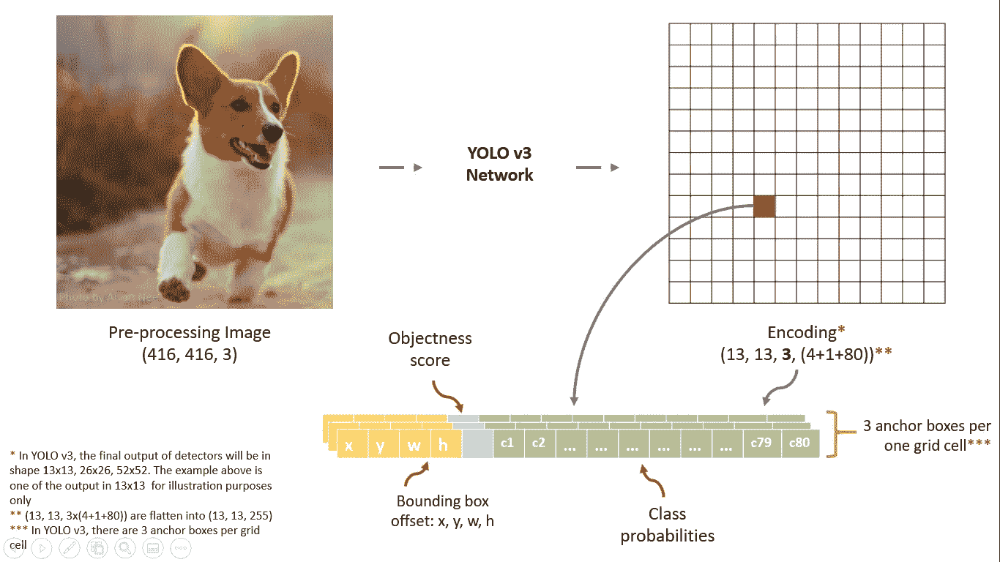
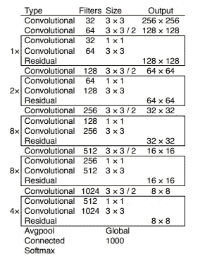
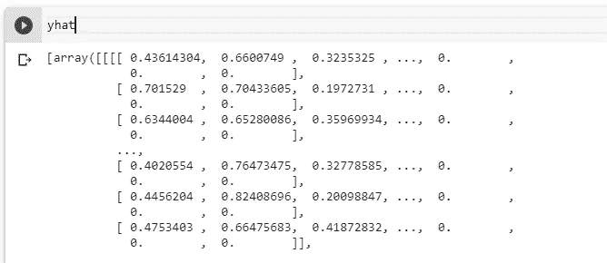
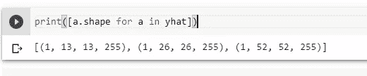
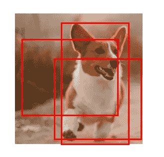
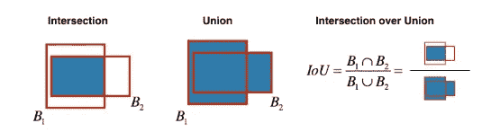
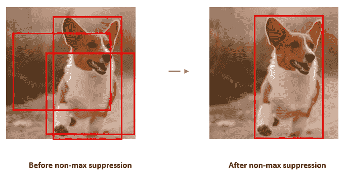
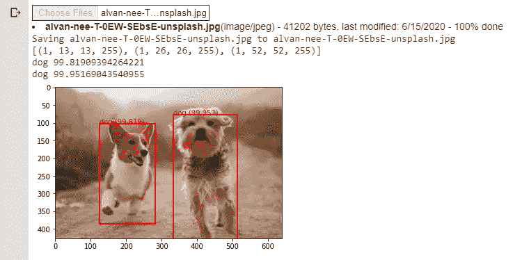

# 使用 Keras 进行 YOLO v3 目标检测

> 原文：<https://towardsdatascience.com/yolo-v3-object-detection-with-keras-461d2cfccef6?source=collection_archive---------12----------------------->

图片由作者说明

## 用 Keras 实现简单解释 YOLO v3

视频由 YOLO 作者，
约瑟夫·雷德蒙

**关于 YOLO v3 算法**

“你只看一次”(YOLO)是一种对象检测算法，以其高准确性而闻名，同时由于其速度检测，它也能够实时运行。与之前的算法不同，第三个版本通过简单地改变模型的大小，在不需要重新训练的情况下，促进了速度和准确性之间的有效折衷。

在我们开始用 YOLO v3 实现对象检测之前，我们需要下载[预训练模型权重](https://pjreddie.com/media/files/yolov3.weights)。下载这个可能需要一段时间，所以你可以在等待的时候准备你的咖啡。YOLO v3 是用 c 语言的开源神经网络 DarkNet framework 编写的，这让我一开始就感到很害怕。

但值得庆幸的是，这段代码受到了 experiencor 的 keras-yolo3 projec 的强烈启发，它使用 keras 执行 YOLO v3 模型。在整个实现过程中，我将在 Google Colab 上运行它。此外，我们将使用这些可爱的狗图像进行对象检测。

照片由 [Alvan Nee](https://unsplash.com/@alvannee?utm_source=medium&utm_medium=referral) 在 [Unsplash](https://unsplash.com?utm_source=medium&utm_medium=referral) 上拍摄

所以让我们把手弄脏吧！！

**第一步:**

跳到第一步，下面是必要的库和依赖项。

**第二步:**

接下来，`**WeightReader**` 类用于解析“yolov3。权重”文件并将模型权重加载到内存中。

**第三步:**

YOLO v3 使用了新的网络来执行特征提取，不可否认，与 YOLO v2 相比，它的规模更大。这个网络被称为 Darknet-53，因为整个网络由 53 个具有快捷连接的卷积层组成 [(Redmon &法尔哈迪，2018)](https://pjreddie.com/media/files/papers/YOLOv3.pdf) 。

YOLO v3 网络有 53 个卷积层[(雷德蒙&法尔哈迪，2018)](https://pjreddie.com/media/files/papers/YOLOv3.pdf)

因此，下面的代码由几个组件组成，它们是:

*   `**_conv_block**`用于构建卷积层的函数
*   `**make_yolov3_model**`用于创建卷积层并将其堆叠在一起作为一个整体的功能。

**第四步:**

接下来，下面的代码解释如下:

*   定义 YOLO v3 模型
*   加载您之前下载的预训练重量
*   使用 Keras `save`函数并指定文件名保存模型

**第四步:**

该步骤包括将预测输出解码成边界框

YOLO v3 预测的输出是难以解释的数组列表的形式。因为 YOLO v3 是多尺度检测，所以它被解码成(13，13，225)、(26，26，225)和(52，52，225)形状的三个不同尺度

解码前的 YOLOv3 预测输出片段

*   `**decode_netout**`函数用于将预测输出解码成方框

简而言之，这就是`**decode_netout**`函数的工作方式，如下图所示:

图片由作者说明

**第五步:**

缩放和拉伸解码后的框以适合原始图像形状

**第六步:**网络输出解码后，不会直接对物体显示平滑预测。解码后的盒子产生了几个重叠的盒子。从下图可以看出，模型已经检测到图像中有三只狗。然而，它仅仅是一个物体上重叠的盒子，在这个例子中是可爱的柯基。

因此，发生非最大抑制(NMS)来滤除以便获得正确的框

*   `**bbox_iou**`函数用于通过获取两个盒子的`**_interval_overlap**`来计算 IOU(交集/并集)

图片来自 DeepLearning.ai 课程

*   `**do_nms**` 功能用于执行 NMS

一般来说，NMS 是这样表演的:

1.  选择得分最高的方框。
2.  计算此框与其他框的区间重叠，省略重叠明显的框(iou >= `iou_threshold`)。
3.  重复步骤 1 并重复，直到没有比当前选择的盒子分数更低的盒子。

这将忽略与所选框有大量重叠的所有框。只剩下“正确”框。

*   `**get_boxes**`函数用于获取通过 NMS 滤波器选择的盒子
*   `**draw_boxes**`函数用于使用`matplotlib.patches.Rectangle`类给输入图像绘制一个矩形框

**第七步:**

我们即将结束 YOLO v3 的实施。在这一步，我们必须声明几个配置，它们是:

*   `**anchors**` **:** 根据对 COCO 数据集中对象大小的分析精心选择。
*   `**class_threshold**`:检测对象的概率阈值
*   `**labels**`:COCO 数据集中的类标签

**第七步:**

最后，YOLO 模型准备进行预测，下面的代码允许用户输入图像来检测对象。

输出:

## 结论

总之，YOLOv3 是一个强大的对象检测模型，以快速检测和准确预测而闻名。在本文结束时，我真的希望这篇文章能让你更好地理解 YOLO 算法的工作原理，并在 Keras 中实现它。完整的代码可以在 [GitHub](https://github.com/christienatashiaarchie/YOLOv3-Object-Detection/tree/master) 上找到。

此外，在我的整个旅程中，我想对 [Huynh Ngoc Anh](https://github.com/experiencor) 和 [Jason Brownlee](https://machinelearningmastery.com/about/) 大声疾呼，深入了解 YOLOv3 的工作原理并将其应用到 Keras 中。另外，你可以在这里找到 YOLOv3 论文。

## 参考

 [## 深入了解 YOLO v3:初学者指南

### 针对初学者的 TensorFlow 2 中 YOLO v3 的详细回顾和实践。

towardsdatascience.com](/dive-really-deep-into-yolo-v3-a-beginners-guide-9e3d2666280e)  [## experiencor/Keras-yolo3

### 要安装依赖项，请运行 pip install -r requirements.txt，为了让 GPU 工作，请确保您已经安装了…

github.com](https://github.com/experiencor/keras-yolo3)  [## 如何在 Keras 中使用 YOLOv3 执行对象检测-机器学习掌握

### 目标检测是计算机视觉中的一项任务，涉及识别一个或多个目标的存在、位置和类型

machinelearningmastery.com](https://machinelearningmastery.com/how-to-perform-object-detection-with-yolov3-in-keras/)