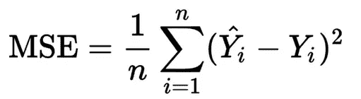

# YOLO v4:物体检测的最佳速度和精确度

> 原文：<https://towardsdatascience.com/yolo-v4-optimal-speed-accuracy-for-object-detection-79896ed47b50?source=collection_archive---------1----------------------->

## 实时目标探测模型综述

YOLO v3 演示，摘自[视频](https://www.youtube.com/watch?v=MPU2HistivI)

你只看一次( [YOLO](https://pjreddie.com/darknet/yolo/) )是一系列快速准确的一级物体探测器。最近， [YOLO v4](https://arxiv.org/abs/2004.10934) 论文发布，显示了与其他物体探测器相比非常好的结果。

***更新 1*** *:增加了一个* [*colab 演示*](#0260)

# 目录

1.  [**简介**](#6199)
2.  [**物体探测器的一般架构**](#ed40)
3.  [**袋赠品&袋特价**](#f096)
4.  [**YOLO v4 设计**](#56ff)
5.  [**汇总 BoF 和 BoS 使用的**](#a112)
6.  [**附加改进**](#03c8)
7.  [**Colab 演示**](#0260)
8.  [**最后一句话**](#9e04)

# 介绍

大多数现代精确模型需要许多 GPU 来进行大规模小批量的训练，而用一个 GPU 来进行训练会使训练变得非常缓慢和不切实际。YOLO v4 通过制作一个对象检测器来解决这个问题，该对象检测器可以在单个 GPU 上以较小的小批量进行训练。这使得用单个 1080 Ti 或 2080 Ti GPU 训练超快速和精确的物体检测器成为可能。

YOLO v4 在 MS COCO 数据集上以实时速度获得了最先进的结果，在 Tesla V100 上以 65 FPS 运行的 AP 为 43.5 %。相当有趣的结果！为了实现这些结果，他们结合了一些特征，如加权剩余连接(WRC)、跨阶段部分连接(CSP)、交叉小批量归一化(CmBN)、自我对抗训练(SAT)和 Mish 激活、镶嵌数据增强、DropBlock 正则化和 CIoU 损失。这些被称为通用特征，因为它们应该独立于计算机视觉任务、数据集和模型工作良好。我们将在后面讨论这些特性。

分别提高约洛夫 3 的 AP 和 FPS 10%和 12%[[5](#6ac9)]

*注意:落在浅蓝色区域的模型被认为是实时物体探测器(+30 FPS)*

我们可以看到，EfficientDet D4-D3 比 YOLO v4 模型实现了更好的 AP，但它们以< 30 FPS on a V100 GPU. On the other hand, YOLO is able to run at a much higher speed (> 60 FPS 的速度运行，具有非常好的准确性。

# 物体检测器的一般结构

虽然 YOLO 是一级检测器，但也有像 R-CNN、快速 R-CNN 和更快 R-CNN 这样的两级检测器，它们准确但速度慢。我们将把重点放在前者上。让我们来看看现代一级物体探测器的主要组成部分。

摘自 YOLO v4 论文，[来源](https://arxiv.org/abs/2004.10934)

## 毅力

使用 [ResNet](https://arxiv.org/abs/1512.03385) 、 [DenseNet](https://arxiv.org/abs/1608.06993) 、 [VGG](https://arxiv.org/abs/1409.1556) 等模型作为特征提取器。它们在 ImageNet 等图像分类数据集上进行了预训练，然后在检测数据集上进行了微调。事实证明，随着网络变得更深(更多层)，这些网络产生具有更高语义的不同级别的特征，对于物体检测网络的后面部分是有用的。

## 脖子

这些额外的层位于脊椎和头部之间。它们用于提取脊柱不同阶段的不同特征图。颈部可以是例如 FPN[ [1](#6ac9) ]、帕内特[ [2](#6ac9) ]、双 FPN[ [3](#6ac9) ]等。例如，YOLOv3 使用 FPN 从主干中提取不同尺度的特征。

金字塔网络(FPN)有什么特点？

> 使用自上而下的路径和横向连接增强标准卷积网络，以便网络从单分辨率输入图像中高效构建丰富的多尺度特征金字塔[ [4](#6ac9) ]

用于目标检测的特征金字塔网络[ [1](#6ac9)

每个横向连接将从自下而上路径到自上而下路径的特征图合并，产生不同的金字塔等级。在合并特征地图之前，先前的金字塔等级在 FPN[ [1](#6ac9) ]中被上采样 2 倍，因此它们具有相同的空间大小。然后将分类/回归网络(头部)应用于金字塔的每一层，以便帮助检测不同大小的对象。

这种特征金字塔网络的思想可以应用于不同的主干模型，作为一个例子，最初的 FPN[ [1](#6ac9) ]论文使用了 ResNets。还有很多以不同方式整合 FPN 的模块，比如 SFAM [ [7](#6ac9) 、ASFF [ [9](#6ac9) 、比 FPN[ [3](#6ac9) 。

四种类型的要素金字塔。SFAM[ [7](#6ac9) ]模块是(d)

图像 *(a)* 显示了如何在单触发检测器架构(SSD)中从主干提取特征。上图还显示了其他三种不同类型的金字塔网络，但它们背后的理念是相同的，因为它们有助于:

> 缓解由对象实例之间的比例变化引起的问题[ [3](#6ac9) ]。

ASFF[ [9](#6ac9) ]和比 FPN[ [3](#6ac9) ]也是有趣的 FPN 类型，并显示出有趣的结果，但我们在这里将跳过它们。

## 头

这是一个负责实际执行包围盒检测部分(分类和回归)的网络。单个输出可能看起来像(取决于实现):4 个描述预测边界框的值( *x，y，h，w* )和 *k* 类的概率+ 1(额外一个用于背景)。对象检测器*基于锚的*，如 YOLO，将头部网络应用于每个锚盒。其他流行的基于*锚的*一级探测器有:单炮探测器 [6](#6ac9) 和 retina net[4](#6ac9)。

**下图结合了上述三个模块。**

原始图像来自 RetinaNet[ [4](#6ac9) ]纸张

# **一袋赠品** **&一袋特价商品**

YOLO v4 论文的作者[ [5](#6ac9) ]区分了两类用于提高物体检测器精度的方法。他们分析了两个类别中的不同方法，以实现具有良好准确性的快速运算速度的神经网络。这两个类别是:

## **一袋赠品** (BoF):

> 在不增加推理代价的情况下，使目标检测器获得更高精度的方法。这些方法只是改变了培训策略或者只是增加了培训成本。[ [5](#6ac9)

BoF 的一个例子是**数据扩充**，增加了模型的泛化能力。要做到这一点，我们可以做照片度量失真，如:改变亮度，饱和度，对比度和噪声，或者我们可以做图像的几何失真，如旋转，裁剪等。这些技术是 BoF 的一个明显的例子，它们有助于检测机的准确性！

几何扭曲的例子，[来源](https://developers.google.com/machine-learning/practica/image-classification/preventing-overfitting)

*注意:对于物体检测任务，边界框也应该应用相同的变换*

还有其他一些增强图像的有趣技术，比如**剪切** [ [8](#6ac9) ]，它在训练过程中随机屏蔽输入的方形区域。这表明改进了 CNN 的鲁棒性和性能。同样，**随机擦除** [ [10](#6ac9) ]选择图像中的矩形区域，用随机值擦除其像素。

对象检测的随机擦除示例，[来源](https://arxiv.org/pdf/1708.04896.pdf)

免费赠品的其他背面是用于避免过拟合的正则化技术，如: **DropOut** 、 **DropConnect** 和 **DropBlock** 、 [13](#6ac9) 。这最后一个实际上在 CNN 中显示了非常好的结果，并且在 YOLO v4 主干中使用。

来自 DropBlock paper[ [13](#6ac9)

随机删除激活(b)不利于删除语义信息，因为附近的激活包含密切相关的信息。相反，通过丢弃连续区域，它可以移除某些语义信息(例如，头或脚)并强制剩余单元学习用于分类输入图像的其他特征。

回归网络的成本函数也适用于该类别。传统的做法是应用均方误差对坐标进行回归。

如论文中所述，这将这些点视为独立变量，但不考虑对象本身的完整性。为了改善这一点，已经提出了 IoU[ [12](#6ac9) ]损失，其考虑了预测边界框(BBox)和地面真实边界框的面积。这个想法被 **GIoU loss** [ [11](#6ac9) 进一步改进，除了覆盖区域之外还包括了一个物体的形状和方位。另一方面，还引入了 **CIoU loss** ，它考虑了重叠面积、中心点之间的距离和纵横比。YOLO v4 使用 CIoU 损失作为边界框的损失，主要是因为与提到的其他方法相比，它导致更快的收敛和更好的性能。

*注意:可能引起混淆的一件事是，尽管许多模型使用 MSE 来计算 BBox 回归损失，但它们使用 IoU 作为度量，而不是如上所述的损失函数。*

下图比较了具有不同 IoU 损耗的同一型号:

损失比较，[来源](https://arxiv.org/abs/1911.08287)

我们可以注意到 CIoU 比 GIoU 表现得更好。这些检测来自更快的 R-CNN (Ren 等人，2015 年)，其在相同的 MS COCO 数据集上训练，具有 GIoU 和 CIoU 损失。

## **特价包** (BoS) **:**

> 那些插件模块和后处理方法，只是少量增加了推理成本，却能显著提高物体检测的准确性[ [5](#6ac9) ]

如论文中所述，这类模块/方法通常涉及:引入注意机制(*挤压-激发*和*空间* *注意模块*)，扩大模型感受野，增强特征整合能力等。

用于改善感受野的常见模块有 [SPP](https://arxiv.org/abs/1406.4729) 、 [ASPP](https://arxiv.org/abs/1606.00915) 和 [RFB](https://eccv2018.org/openaccess/content_ECCV_2018/papers/Songtao_Liu_Receptive_Field_Block_ECCV_2018_paper.pdf) (YOLO v4 使用 **SPP** )。

此外，细胞神经网络的注意模块主要分为通道注意，如挤压和激发(SE)[ [15](#6ac9) ]，和空间注意，如空间注意模块(SAM)[ [16](#6ac9) 。后者有时更受青睐的一个原因是，se 在 GPU 上增加了 10%的推理速度，这是不可取的。事实上，YOLO v4 考虑了 SAM[16]模块，但并不完全像最初在这篇[论文](https://arxiv.org/abs/1807.06521)中发表的那样。请注意以下几点:

原始空间注意模块[16]

给定特征映射 F’，最初的实现沿着通道轴执行平均池和最大池操作，然后将它们连接起来。然后应用卷积层(以 sigmoid 为激活函数)生成注意图( **Ms** )，应用于原**F’**。

YOLO v4 修改的空间注意模块，来源[5]

另一方面，YOLO v4 修改的 **SAM** 不应用最大池和平均池，而是**F’**通过一个 conv。层(使用 sigmoid 激活),然后乘以原始特征图(F’)。

我们之前讨论过的 SFAM[ [7](#6ac9) ]、ASFF[ [9](#6ac9) ]和比 FPN[ [3](#6ac9) ]等特征金字塔也属于这一类 BoS，激活功能也是如此。自从 ReLU 问世以来，它的变种很多，像 LReLU，PReLU，ReLU6。像 ReLU6 和 hard-Swish 这样的激活是专门为用于在嵌入式设备上进行推理的量子化网络设计的，就像在谷歌[珊瑚边缘 TPU](https://www.coral.ai/) 中一样。

另一方面，YOLO v4 在主干中使用了大量的 **Mish** [ [14](#6ac9) ]激活函数。看一看图表:

米什公式

来源[ [14](#6ac9) ]

这个激活函数显示了非常有希望的结果。例如，与带有 Swish 和 ReLU 的相同网络相比，使用带有 Mish(在 CIFAR-100 数据集上)的挤压激励网络[ [15](#6ac9) ]导致 Top-1 测试精度分别增加**0.494%**和 **1.671%** 。[ [14](#6ac9) ]

你可以检查这个 [desmos](https://www.desmos.com/calculator/rhx5tl8ygi) ，它包含了一些其他的激活功能。

# YOLO v4 设计

到目前为止，我们已经讨论了用于提高模型精度的方法和对象检测器的不同部分(脊柱、颈部、头部)。现在让我们谈谈在新 YOLO 使用什么。

*   **主干**:使用 **CSPDarknet53** 作为 GPU 版本的特征提取器模型。对于 VPU(视觉处理单元)，他们考虑使用 efficient net-lite—mix net—ghost net 或 MobileNetV3。我们现在将重点放在 GPU 版本上。

下表显示了 GPU 版本的不同主干

来源[ [5](#6ac9)

某些主干更适合于分类而不是检测。例如，CSPDarknet53 在检测对象方面比 CSPResNext50 更好，CSPResNext50 在图像分类方面比 CSPDarknet53 更好。如论文中所述，用于对象检测的主干模型需要**更大的输入网络尺寸**，以更好地检测小对象，并需要**更多的层**，以获得更高的感受域。

*   **瓶颈**:他们使用空间金字塔池(SPP)和路径聚合网络(PAN)。后者与最初的 PAN 不同，而是一个修改版本，用一个 concat 代替了加法。插图显示了这一点:

来源[ [5](#6ac9) ]

最初在 PAN 纸中，在将 N4 的尺寸减小到与 P5 具有相同的空间尺寸之后，他们**将这个新的减小尺寸的 N4 与 P5 相加**。这种情况在𝑃𝑖+1 和𝑁𝑖的各个层面上重复出现，从而产生了𝑁𝑖+1.在 YOLO v4 中不是用每个𝑃𝑖+1 加上𝑁𝑖，而是用**串联**它们(如上图所示)*。*

路径聚合网络(PAN)源[ [2](#6ac9)

查看 **SPP** 模块，它基本上在 19*19*512 的特征图上执行最大池化，具有不同的内核大小 *s k =* { 5，9，13}和“相同的”填充(以保持相同的空间大小)。四个相应的特征地图然后被连接以形成 19*19*2048 的体积。这增加了颈部感受野，从而提高了模型的准确性，而推理时间的增加可以忽略不计。

在 yolov4.cfg 中观察到的 SPP

如果你想**可视化**yolo 中使用的不同图层，如上图所示，我推荐使用这个[工具](https://github.com/lutzroeder/netron)(网络/桌面版本都可以)，然后用它打开 [yolov4.cfg](https://github.com/AlexeyAB/darknet/blob/master/cfg/yolov4.cfg) 。

*   **头**:和 YOLO v3 用的一样。

YOLO 头适用于不同的规模

这些探头应用于网络的不同规模，用于检测不同大小的物体。因为(80 个*类* + 1 个*对象* + 4 个*坐标* ) * 3 个*锚，所以通道数为 255。*

# 使用的 BoF 和 BoS 汇总

YOLO v4 的主干网和检测器中使用的 BoF 和 BoS 的不同模块/方法可以总结如下:

# 其他改进

该论文的作者介绍了一种新的数据增强方法，称为“马赛克”。基本上，这将训练数据集的 4 幅图像组合在一幅图像中。通过现在这样做:

> 批量标准化从每层上的 4 个不同图像计算激活统计[ [5](#6ac9)

因此，它大大减少了选择一个大的小批量训练的需要。检查下图，显示新的增强方法。

来自[ [5](#6ac9) ]的镶嵌数据增强

示例:用于车牌检测的马赛克增强

他们也使用自我对抗训练 (SAT)，分两个前进后退阶段进行。在第一阶段，神经网络改变原始图像而不是网络权重。通过这种方式，神经网络对自身进行对抗性攻击，改变原始图像以制造图像上没有所需对象的假象。在第二阶段，训练神经网络以正常方式检测该修改图像上的对象。[ [5](#6ac9)

# Colab 演示

我做了一个 Colab 来测试 YOLO v4 &你自己视频的小版本。这使用了在可可小姐身上训练的模型。你可以看一看[这里](https://colab.research.google.com/drive/1PuI9bYeM8O1OA82pI12oGopRJJrLWfs9?usp=sharing)

# 结论

这篇文章中提到了许多有趣的想法，可以更详细地解释，但我希望主要概念是清楚的。

更多细节可在[文件](https://arxiv.org/abs/2004.10934)中找到。如果你想在自己的数据集上训练它，可以查看一下[官方回购](https://github.com/AlexeyAB/darknet)。

YOLO v4 在实时对象检测方面取得了最先进的结果(43.5% AP)，并且能够在 V100 GPU 上以 65 FPS 的速度运行。如果你想要更低的精度，但更高的 FPS，请在官方回购处查看新的 Yolo v4 微型版本。

## 参考

[1] [用于目标检测的特征金字塔网络](https://arxiv.org/abs/1612.03144)

[2] [路径聚合网络实例分割](https://arxiv.org/abs/1803.01534)

[3] [EfficientDet:可扩展且高效的对象检测](https://arxiv.org/abs/1911.09070)

[4] [密集物体检测的焦点损失](https://arxiv.org/abs/1708.02002)

[5] [YOLOv4:物体检测的最佳速度和精度](https://arxiv.org/abs/2004.10934)

[6] [单发多盒探测器(SSD)](https://arxiv.org/abs/1512.02325)

【7】[基于多级特征金字塔网络的单镜头目标检测器](https://arxiv.org/abs/1811.04533)

[8] [改进了带有断流器的卷积神经网络的正则化](https://arxiv.org/abs/1708.04552)

[9] [学习空间融合用于单次拍摄对象检测](https://arxiv.org/abs/1911.09516)

[10] [随机擦除数据增强](https://arxiv.org/abs/1708.04896)

[11] [并集上的广义交集:包围盒回归的度量和损失](https://arxiv.org/pdf/1902.09630v2.pdf)

[12] [UnitBox:一个先进的物体探测网络](https://arxiv.org/abs/1608.01471)

【13】[drop block:卷积网络的正则化方法](https://arxiv.org/abs/1810.12890)

[14] [Mish:一个自正则化的非单调神经激活函数](https://arxiv.org/abs/1908.08681)

[15] [压缩和激励网络](https://arxiv.org/abs/1709.01507)

[16] [CBAM:卷积块注意模块](https://arxiv.org/abs/1807.06521)