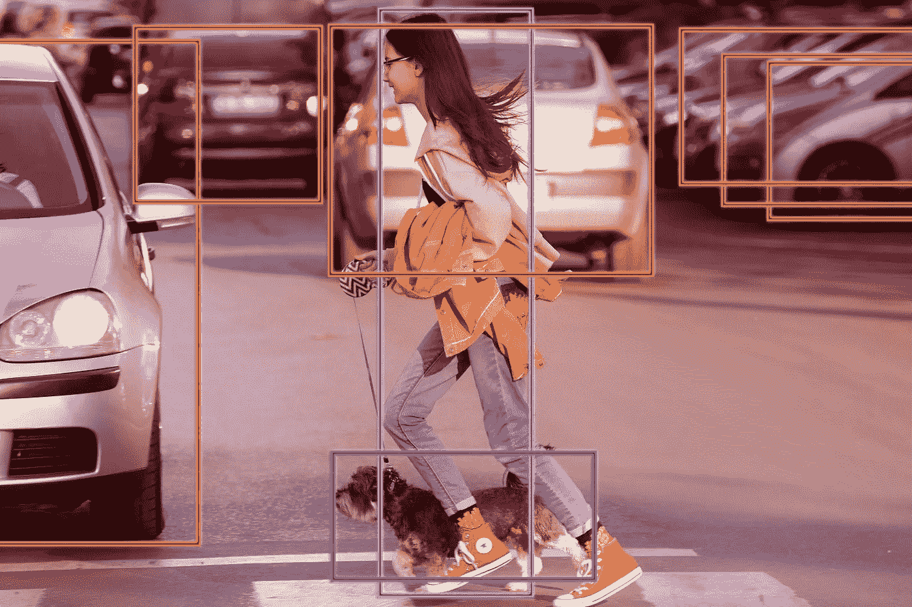
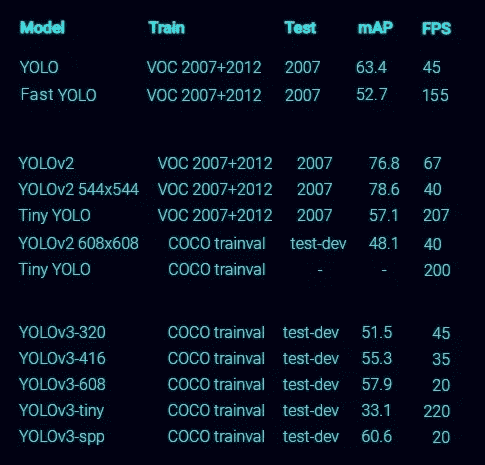
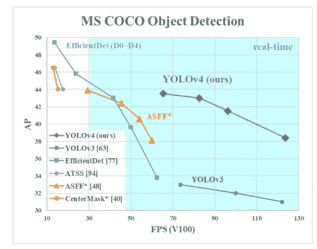
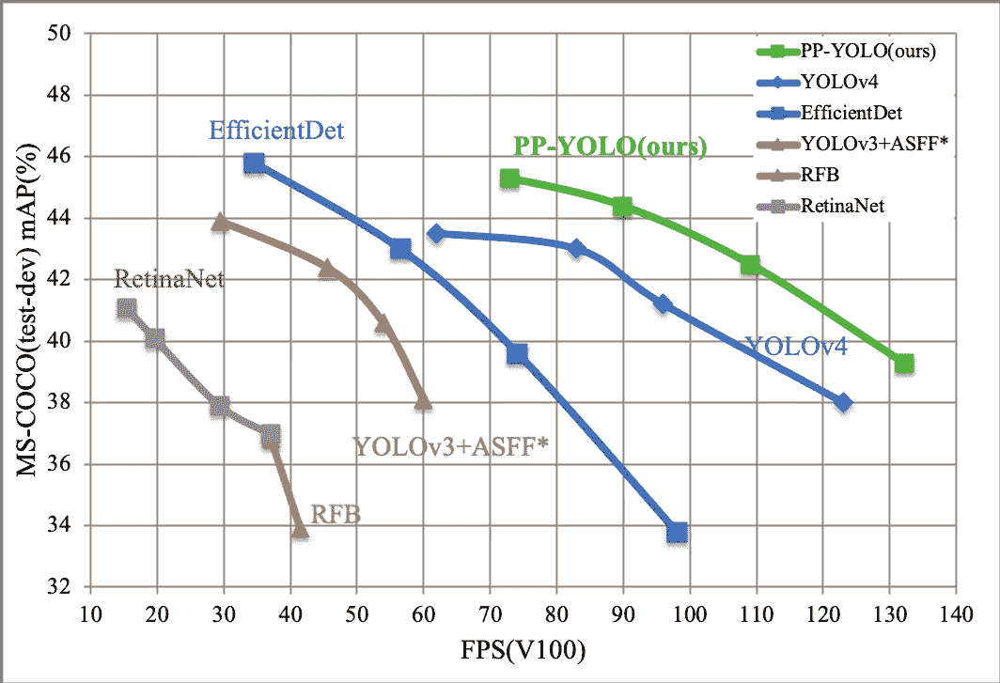

# YOLO v4 还是 YOLO v5 还是 PP-YOLO？

> 原文：<https://towardsdatascience.com/yolo-v4-or-yolo-v5-or-pp-yolo-dad8e40f7109?source=collection_archive---------0----------------------->

## 2020 年 YOLO 会发布哪些新电影？它们有什么不同？我应该使用哪一个？

对象检测是一项计算机视觉任务，涉及预测一个或多个对象的存在，以及它们的类别和边界框。YOLO(你只看一次)是一个先进的对象检测器，可以实时执行对象检测具有良好的准确性。

YOLO 物体检测(*图片作者*

前三个 YOLO 版本分别于 2016 年、2017 年和 2018 年发布。然而，在 2020 年，在仅仅几个月的时间内，YOLO 的三个主要版本已经发布，命名为 YOLO v4，YOLO v5 和 PP-YOLO。YOLO v5 的发布甚至在机器学习界引起了争议。

此外，这在那些将要开始他们的机器学习项目的人的头脑中造成了一个困境。在本文中，我们将讨论这些新的 YOLO 版本的原因，同时强调它们的原创性、原创性、性能和主要改进，帮助人们为他们的项目选择最合适的版本。

# YOLO 是如何进化的

YOLO 于 2016 年首次推出，由于其能够以更高的精度实时检测物体，因此是物体检测研究的里程碑。

它是由华盛顿大学毕业生[约瑟夫·雷德蒙](https://pjreddie.com)提出的。描述 YOLO 的论文在 2016 年计算机视觉和模式识别大会(CVPR)上获得了 **OpenCV 人民选择奖**。

## 约瑟夫·雷德蒙的 YOLO 版本

1.  版本 1
    [' *你只看一次:统一、实时的物体检测* '](https://arxiv.org/abs/1506.02640) (2016)
2.  版本 2
    [' *YOLO9000:更好更快更强* '](https://arxiv.org/abs/1612.08242) (2017)
3.  版本 3
    [' *YOLOv3:增量改进* '](https://arxiv.org/abs/1804.02767) (2018)

YOLO v2 可以以 40–90 FPS 的速度处理图像，而 YOLO v3 允许我们在速度和准确性之间轻松权衡，只需改变模型大小，无需任何重新培训。

在 VOC 2007 和 COCO 数据集上 YOLO 的表现(来源:[pjreddie.com](https://pjreddie.com)

## 主要的 YOLO 实施

Redmon 的 YOLO 主要实现基于 [**Darknet**](https://github.com/pjreddie/darknet) ，这是一个用 C 和 CUDA 编写的开源神经网络框架。暗网设置网络的底层架构，并用作训练 YOLO 的框架。这个实现是由 Redmon 自己介绍的，它速度快，易于安装，支持 CPU 和 GPU 计算。

后来，Ultralytics LLC 的 Glenn Jocher 为 YOLO v3 推出了一个 [**PyTorch 翻译**](https://github.com/ultralytics/yolov3) 。

# v3 之后没有 YOLO 更新？

YOLO 很快就在计算机视觉界出名了，因为它的速度非常快，精确度也很高。然而，在 2020 年 2 月，YOLO **的创造者 Joseph Redmon 宣布他已经停止了计算机视觉**的研究！他还表示，这是由于对其工作的潜在负面影响的一些担忧。

来自 Redmon 的公告(来源:[twitter.com](https://twitter.com/pjreddie/status/1230524770350817280))

这导致了一些热门的社区讨论，并提出了一个重要的问题:将来会有任何 YOLO 更新吗？

# YOLO v4

雷德蒙的退出并不是 YOLO 的终结。重温计算机视觉社区中的许多人，第四代 YOLO 已于 2020 年 4 月发布。Alexey Bochkovskiy 等人在一篇名为' [*YOLOv4:物体检测的最佳速度和精度*](https://arxiv.org/abs/2004.10934) *'* 的论文中介绍了这一点。

此外，Redmon 的工作由 Alexey 在[主](https://github.com/pjreddie/darknet)库的[分支](https://github.com/AlexeyAB/darknet)中继续。YOLO v4 被认为是用于物体检测的最快和最准确的实时模型。

## YOLO v4 的主要改进

YOLO v4 受到了最先进的 BoF(一袋免费赠品)和几个 BoS(一袋特价商品)的影响。BoF 提高了检测器的准确性，而不增加推理时间。它们只会增加培训成本。另一方面，BoS 增加了少量的推理成本，但是它们显著地提高了目标检测的准确性。

## YOLO v4 性能

YOLO v4 也基于 Darknet，并在 COCO 数据集上获得了 43.5%的 AP 值，在 Tesla V100 上获得了 65 FPS 的实时速度，在速度和准确性方面击败了最快和最准确的检测器。

与 YOLO v3 相比，AP 和 FPS 分别增加了 10%和 12%。

YOLO v4 的速度和准确性(来源: [YOLO v4 论文](https://arxiv.org/abs/2004.10934)

## Redmon 对 YOLO 作者身份的回应

2020 年 4 月 24 日，Redmon 的原始 github 帐户的自述文件更新了一个链接，指向 Alexey 的分叉知识库和 YOLO v4 论文。Redmon 也在推特上写道:

Redmon 对 YOLO 作者身份的回应(来源:【twitter.com】T2)

# YOLO v5

在 YOLO v4 发布后，仅仅两个月的时间内，YOLO 的另一个版本——YOLO V5 也发布了！作者是 Glenn Jocher，他已经因为创建了流行的 YOLO v3 的 PyTorch 实现而在社区中闻名。

2020 年 6 月 9 日，Jocher 声明他的 YOLO v5 实现是公开发布的，并推荐在新项目中使用。然而，在最初发布这个新版本时，他并没有发表一篇论文。

## YOLO v5 的主要改进

YOLO v5 不同于所有其他以前的版本，因为这是 PyTorch 实现，而不是从原始 Darknet 派生出来的。与 YOLO v4 相同，YOLO v5 有一个 CSP 主干和 PA-NET 颈部。主要改进包括镶嵌数据增强和自动学习边界框锚。

## 机器学习社区的争议

YOLO v5 的发布备受关注，在机器学习社区平台引起了热烈讨论。这主要是由于 Roboflow 团队发表的一篇关于 YOLO v5 的文章中的几个事实。

这篇题为“YOLOv5 在这里”的文章于 2020 年 6 月 10 日发表在 Roboflow 博客上，陈述了几个重要的事实。以下是约瑟夫·尼尔森和雅各布·索拉维茨在[的博客文章](https://blog.roboflow.ai/yolov5-is-here/)中的一些引言。

> “运行特斯拉 P100，我们看到每幅图像的推理时间高达 0.007 秒，这意味着每秒 140 帧(FPS)！相比之下，YOLO v4 在转换到同一个 Ultralytics PyTorch 库后实现了 50 FPS。”
> 
> “YOLO v5 很小。具体来说，YOLO v5 的权重文件是 27 兆字节。我们的 YOLO v4(使用 Darknet 架构)的权重文件是 244 兆字节。YOLO v5 比 YOLO v4 小了近 90%。”

所以，据说 YOLO 的 v5 比 YOLO 的 v4 速度更快，重量更轻，而精度却和 YOLO 的 v4 基准相当。但是社区提出的主要问题是:这些基准是准确的和可重复的吗？

## 反应

《YOLO》v4 的作者阿列克谢对所有这些比较的方式并不满意。他回答了 github 中提出的几个[问题](https://github.com/pjreddie/darknet/issues/2198)，提到了那些比较的问题，特别是批量大小。

Roboflow 和 YOLO v5 的开发者也对黑客新闻社区的问题做出了积极回应，并于 6 月 14 日在 Roboflow 博客上发表了一篇[文章](https://blog.roboflow.com/yolov4-versus-yolov5/)，描述了他们如何比较这两个版本。

# PP-YOLO

PP-YOLO 已于 2020 年 7 月通过向龙等人题为 [PP-YOLO:对象检测器](https://arxiv.org/abs/2007.12099)的有效和高效实现的论文引入，它基于 PaddlePaddle(并行分布式深度学习)，这是一个开源的深度学习平台，最初由[百度科学家](http://research.baidu.com/Blog/index-view?id=126)开发。

## PP-YOLO 是一种新颖的模式吗？

PP-YOLO 基于 YOLO v3 模型。该论文明确指出，PP-YOLO 的目标是实现一种具有相对平衡的有效性和效率的对象检测器，可以直接应用于实际应用场景，而不是提出一种新的检测模型。

值得注意的变化包括将 YOLO v3 的 Darknet53 主干替换为 ResNet 主干，并将训练批量从 64 增加到 192(在 8 个 GPU 上为 24 的小批量)。

## 聚丙烯-YOLO 性能

根据该论文，PP-YOLO 可以实现 45.2% COCO 数据集的地图，这超过了 YOLO v4 的 43.5%。在批量为 1 的 V100 上测试时，PP-YOLO 可以达到 72.9 FPS 的推理速度，也高于 YOLO v4 的 65 FPS。

PP-YOLO 的作者推测 tensorRT 在 ResNet 模型上比 Darknet 更好的优化是这种性能改善背后的主要原因。

PP-YOLO 的速度和准确性(来源: [PP-YOLO 回购](https://github.com/PaddlePaddle/PaddleDetection/))

# 最后的话

在本文中，我们讨论了 YOLO 发展的重要里程碑以及 2020 年许多新 YOLO 版本背后的故事，同时强调了这些最新 YOLO 版本的主要改进和性能。总之，YOLO v4 是这种先进的物体检测器的最新的基于暗网的实现。它还有一篇阿列克谢·博奇科夫斯基(Alexey Bochkovskiy)发表的基准论文。另一方面，YOLO v5 是 Ultralytics 的新 PyTorch 实施方案，当以较大批量进行测试时，据说它比大多数检测器具有更高的干扰速度。然而，在撰写本文时，还没有针对 YOLO v5 发表的同行评审论文。PP-YOLO 是另一个基于深度学习框架 PaddlePaddle 的新 YOLO 升级版，它改进了 YOLO v3 模型，以在有效性和效率之间获得更好的平衡。我们讨论的事实，比如每个版本的架构、改进和性能，将有助于为特定项目选择最合适的 YOLO 版本。继续学习！

# 参考

[1]约瑟夫·雷德蒙的[官网](https://pjreddie.com/)。

[2]发表论文 [YOLO v1](https://arxiv.org/abs/1506.02640) ， [YOLO v2](https://arxiv.org/abs/1612.08242) ， [YOLO v3](https://arxiv.org/abs/1804.02767) ， [YOLO v4](https://arxiv.org/abs/2004.10934) ， [PP-YOLO](https://arxiv.org/abs/2007.12099) 。

[3]Redmon 的[原版 YOLO](https://github.com/pjreddie/darknet) 、Alexey 的 [YOLO v4](https://github.com/AlexeyAB/darknet) 、Jocher 的 [YOLO v5](https://github.com/ultralytics/yolov5) 和向龙的 [PP-YOLO](https://github.com/PaddlePaddle/PaddleDetection) 的 Github 库。

[4]“[约洛夫 5 在这里](https://blog.roboflow.ai/yolov5-is-here/)”和“[回应关于约洛夫 5](https://blog.roboflow.ai/yolov4-versus-yolov5/) 的争议”约瑟夫·尼尔森和雅各布·索拉维茨在 [Roboflow 博客](https://blog.roboflow.com/)上的博文。

[5] " [YOLO 回来了！第 4 版拥有更高的速度和准确性](https://syncedreview.com/2020/04/27/yolo-is-back-version-4-boasts-improved-speed-and-accuracy/)”syncedreview.com 上发表的黑卡蒂的文章