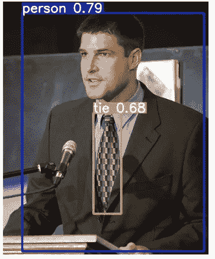
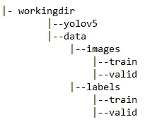
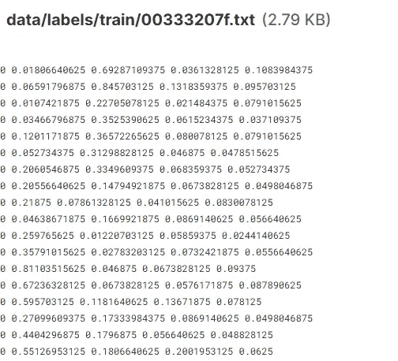

# Yolo v5 物体检测教程

> 原文：<https://towardsdatascience.com/yolo-v5-object-detection-tutorial-2e607b9013ef?source=collection_archive---------2----------------------->

## 如何建立和训练一个 Yolo v5 物体检测模型？

Yolo v5 物体检测教程。斯蒂芬·科斯马在 [Unsplash](https://unsplash.com/s/photos/artificial-intelligence?utm_source=unsplash&utm_medium=referral&utm_content=creditCopyText) 上拍摄的照片

物体检测是人工智能中的一项任务，重点是检测图像中的物体。Yolo V5 是目前最好的物体检测模型之一。这种深度神经网络的伟大之处在于，它非常容易在您自己的定制数据集上重新训练网络。

在本文中，我将介绍如何训练 Yolo V5 对象检测模型。我将把重点放在如何快速轻松地开始上，而不是调优模型的超参数。

使用预训练的 Yolo V5 模型的对象检测示例。[原文来源](https://commons.wikimedia.org/wiki/File:Astronaut_candidate_Jeremy_Hansen_speaks_to_a_crowd_at_Johnson_Space_Center.jpg.)。[知识共享](https://en.wikipedia.org/wiki/en:Creative_Commons) [归属-共享 4.0 国际](https://creativecommons.org/licenses/by-sa/4.0/deed.en)。

[**你可以跟着满满的笔记本过来。**](https://jooskorstanje.com/yolov5-training-a-custom-object-detection-model.html)

# 如何训练一个定制的 Yolo V5 车型？

要训练自定义 Yolo V5 模型，请遵循以下步骤:

1.  设置您的环境
2.  设置数据和目录
3.  设置配置 YAML 文件
4.  训练模型以学习如何检测物体
5.  使用您的定制 Yolo V5 模型来检测测试数据上的对象

# 1.如何设置您的环境来训练 Yolo V5 对象检测模型？

要训练一个 Yolo V5 模型，需要从网上下载一些东西。

在笔记本电脑中，最简单的方法是直接从笔记本电脑中使用终端命令下载并设置您的环境，如下所示:

*   从 GitHub 克隆 yolo V5 存储库

这将在您的机器上创建一个名为' *yolov5* '的文件夹。该文件夹将包含您进一步需要的所有内容，包括模型的预训练权重和特定的目录结构。

*   安装 pytorch 和其他必需的包

Yolo V5 运行在 Torch 上，有时安装起来可能会很复杂。如果你在这里挣扎，你可以移动到 Kaggle 或 Colab 笔记本:这些通常对这个安装很好。

# 2.如何设置用于训练 Yolo V5 对象检测模型的数据和目录？

Yolo V5 需要一套非常特殊的数据文件夹才能工作。

# Yolo V5 目录结构

您需要在与您的 *yolov5* 文件夹相同的层次上创建一个名为 *data 的文件夹。在这个*数据*文件夹中你需要创建一个图像文件夹和一个标签文件夹。在每一个文件夹中，您都为训练数据和验证数据创建了一个文件夹。*

用于训练 Yolo V5 模型的目录树

如果文件没有放在正确的目录中，您以后可能会遇到错误。

# **Yolo V5 数据格式**

## **图像**

图像必须直接放在图像文件夹中。*数据/图像/训练*文件夹中的训练图像和*数据/图像/有效*文件夹中的验证图像。图像的名称必须是带有. jpg(或其他格式)的唯一名称。

## 标签

标签必须在*数据/标签/序列/* 或*数据/标签/有效中。*标签文件的名称必须与图像名称相同，但带有“.”。txt“而不是”。jpg”。

边界框必须作为每行一个边界框列出，该行上有:

*   边界框中对象的类别号(如果只有一个类别，则始终为 0)
*   以宽度表示的边界框的标准化中心像素
*   以高度表示的边界框的标准化中心像素
*   边框的标准化宽度
*   边框的标准化高度

标准化是通过将像素数除以图像的总像素数来完成的。因此，在大小为(100，100)的图片上，宽度为 30×40 的像素(10，20)上的边界框将被标准化为(0.1，0.2，0.3，0.4)。

标签文件的行数是一幅图像中边界框的数量。标签文件的数量就是图像的数量。

一个名为“00333207”的训练图像的标签的提取。

# 3.如何配置用于训练 Yolo V5 对象检测模型的 YAML 文件？

要开始训练一个 Yolo V5 模型，你需要两个 YAML 文件。

第一个 YAML 规定:

*   你的训练数据在哪里，
*   你的验证数据在哪里，
*   您想要检测的类别(对象类型)的数量，
*   以及与这些类别相对应的名称。

这个 YAML 看起来像这样:

第二个 YAML 是指定整个模型，但是对于开始，我建议只改变第一行，" *nc 【T21 ")，以得到正确的类数。*

您可以将这些 YAML 文件放在任何您想要的地方，因为您稍后将引用完整的路径。

# 4.如何训练自己定制的 YoloV5 模型？

训练是使用 train.py 终端命令完成的，您可以从笔记本中执行该命令。

您可以指定多个超参数，例如批次大小、时期数和图像大小。然后，指定我们刚刚在上面创建的两个 yaml 文件的位置。您还需要指定一个名称，这对以后查找结果很重要。

运行这一行将在 yolov5 中创建一个子文件夹，其中包含这个训练模型的权重，您可以在第 5 步中重用它。

这些文件夹将始终创建在同一个目录中:*yolov 5/runs/exp0 _ your name/…*

当您重新运行“train”命令时，Exp0 将增加到 exp1 等。

# 5.如何使用您定制的 Yolo V5 模型对新数据进行对象检测？

现在是最后一个阶段，你需要检测看不见的照片上的物体。这是使用终端命令 detect.py 完成的，它将生成一个包含输出的新文件夹。您可以生成带有边框的图片，也可以生成带有边框位置的文本文件。

这是按如下方式完成的:

然后你可以在文件夹 *yolov5/inference/output/中找到你的输出。*会有带注释的图片和。带有预测边界框的 txt 文件。

*我希望这篇教程有用，感谢阅读！*