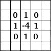
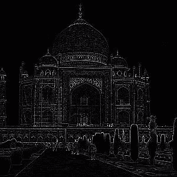
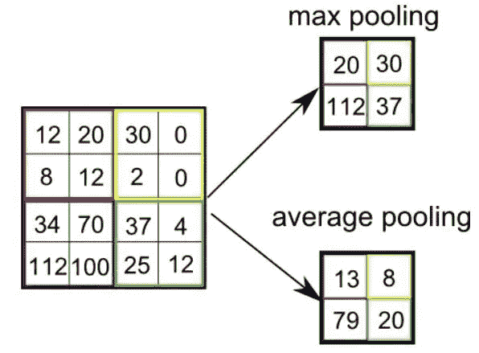
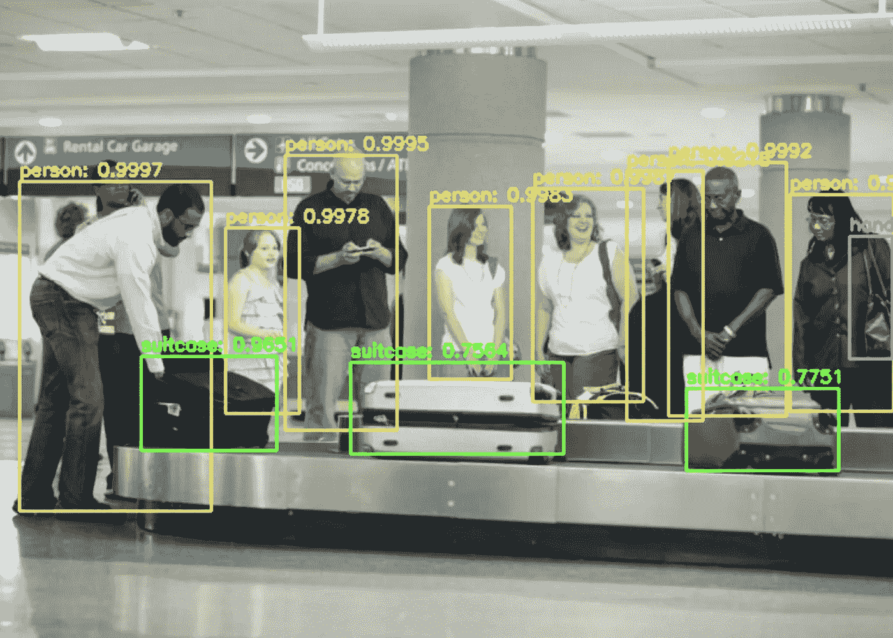

# YOLO:你只看一次|物体探测

> 原文：<https://towardsdatascience.com/yolo-you-only-look-once-f05c054a06b4?source=collection_archive---------16----------------------->

## 人工智能

## 深度学习卷积神经网络(CNN)

照片由[克莱门特·H](https://unsplash.com/@clemhlrdt?utm_source=medium&utm_medium=referral)在 [Unsplash](https://unsplash.com?utm_source=medium&utm_medium=referral) 上拍摄

“嘿，我们的朋友在跳崖，要来吗？人只能活一次！”

“不，我只要看一眼就知道我没在做。”

你可能已经习惯了这句话**【YOLO:你只能活一次】**。但是，这实际上不是本文的主题。我说的是**《YOLO:你只看一次》**。

这是一个非常聪明的算法，它非常擅长检测给定图像或视频中的对象。事实上，它只需要看一次。

# 它是如何工作的？

## 神经网络

神经网络为 YOLO 提供动力，它们是一种特殊类型的计算机算法。因为它们是模仿我们的大脑而命名的，所以它们被设计用来检测模式(就像我们的大脑一样！).

YOLO 本身是一个卷积神经网络(CNN)，这是一种神经网络，非常擅长检测图像中的模式(以及扩展对象等)。

## 神经网络层

神经网络是由层组成的，CNN 大多是由卷积层组成的(因此得名)。这就像在图像上滑动滤镜，每一层都越来越复杂。这是一个形象化的例子:

图片来自[斯坦福](http://deeplearning.stanford.edu/wiki/index.php/Feature_extraction_using_convolution)(不再在那里举办)

这里的过滤器是我们用来相乘的数字。基本上，我们查看图像的一部分，应用滤波器，并对结果求和以获得卷积特征。如果我们认为图像是灰度的，那么每个数字就是像素的亮度。

早期的图层可能会滑过旨在寻找边缘、拐角和形状的过滤器，但后期的图层可能会检测更复杂的特征，如肢体、面部和整个对象。这是一个边缘检测卷积网络。

照片来自[丹尼·布里兹](https://www.kdnuggets.com/author/denny-britz)在 [KDNuggets](https://www.kdnuggets.com/)

以及输入和输出图像:

照片来自[丹尼·布里兹](https://www.kdnuggets.com/author/denny-britz)在 [KDNuggets](https://www.kdnuggets.com/)

照片来自[丹尼·布里兹](https://www.kdnuggets.com/author/denny-britz)在 [KDNuggets](https://www.kdnuggets.com/)

## 池层

池化要简单得多，也类似于卷积。池化不是检测要素，而是通过减小网络的空间大小来减轻网络的负载。

图片来自[王新惠](https://www.linkedin.com/in/xinhui-wang-2b094348/)

基本上，它减少了卷积层的输入大小，通常有两种方法:

***Max Pooling***
Max Pooling 是第一种，在图像的每个单元格中取最大的数字。

***平均池化*** 第二种类型的池化，其中你对图像的每个单元格中的所有数字进行平均。

## 激活层

激活层是神经网络的关键。在每一步，我们必须定义输出，它将是下一步的输入(或者是最后的实际输出)。

图片来自 [GumGum](https://gumgum.com/)

YOLO 使用 ReLU(整流线性单位)。ReLU 激活用于每个卷积步骤，而不是池化步骤，因为它们只是为了减轻负载。基本上，ReLU 通过修改输出来工作，所以任何小于 0 的都变成零，其他的都是原始输出(基本上不改变任何东西)

图上关系的可视化。“x”是 ReLU 的输入，而“y”是 ReLU 的输出。([来源:费尔南多·德·梅尔·帕尔多](https://fernandodemeerpardo.com/))

整个 YOLO 网络看起来像这样。

别急，这个你不需要完全理解！(来源: [MDPI](https://www.mdpi.com/1424-8220/19/17/3702) )

这就是 YOLO 成为 CNN 的原因。CNN 非常擅长图像分类(弄清楚一个物体是什么)，但这只是问题的一半。

## 算出物体在哪里呢？

虽然我们已经介绍了如何对物体进行分类，但是我们还希望能够知道这些物体在图像中的位置。

YOLO 首先将一幅给定的图像或一帧视频分成 N 个方块。然后，每个网格单元检测其中的对象，并预测多个边界框以及这些框的置信度得分(边界框只是预测对象的位置并在其周围放置一个框)。

之后，它会根据训练数据，获得足够高的置信度分数，从而可能是一个对象，并预测该对象是什么。这意味着只有在给定一个对象数据集后，才能检测到带有 YOLO 的对象。

视觉表现。(边界框越粗，越精确。)(来源: [Pj Reddy](https://pjreddie.com/darknet/yolo/) )

这允许你检测物体，并预测它们是什么！

# 我的实现

我决定创建一个 YOLO 的实现，它可以预测机场场景中的不同物体！

我发现了 YOLO 可可数据集，这是一个预制的数据集，适用于检测一般物体，如行李箱、人、汽车、滑板等。这让我轻松多了。

在对所有东西进行编程之后，在 YOLO 学习了数据集之后，YOLO 能够制作这张图片。

我的图像

# 用例

YOLO 也有一些使用案例，在这些案例中，YOLO 真的非常有用！以下是一些例子:

## 回收利用

YOLO 可以用于回收工厂，帮助控制机器人和垃圾分类。既然 YOLO 如此擅长探测物体，我们可以训练它在回收设施中对废物进行分类

## 自动驾驶汽车

YOLO 在自动驾驶汽车中特别有用，事实上今天已经用于检测汽车、人和交通灯了！它允许完全自主控制！

## 嫌疑人检测

这有点牵强，但 YOLO 可以通过找出潜在的嫌疑人来协助警方调查。这对于低质量的录音等非常有帮助！

图片来自我

所以，这就是 YOLO 物体探测！它可能是同类算法中最好和最高效的，它有很多机会。这只是一个表面的解释，我希望我已经教了你足够的东西，让你能够用你的好奇心推动你走得更远！

*如果你喜欢阅读这篇文章，或者有任何建议或问题，请留言告诉我。您可以在* [*LinkedIn、*](https://www.linkedin.com/in/ronit-taleti-7558b4193/) *或我的* [*网站*](http://ronittaleti.ca/) *上找到我，了解我的最新工作和更新，或者直接联系我的* [*邮箱*](mailto:ronittaleti05@gmail.com) *！*