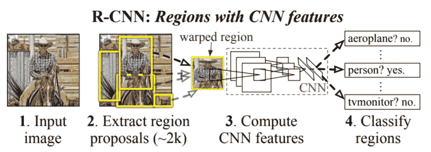
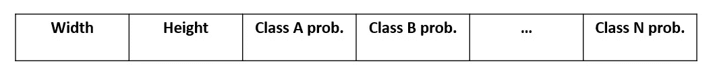
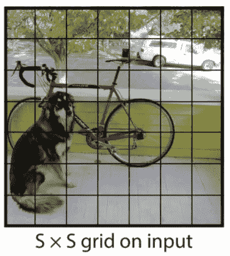
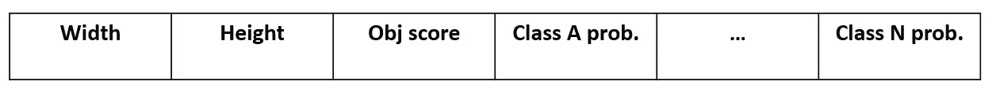
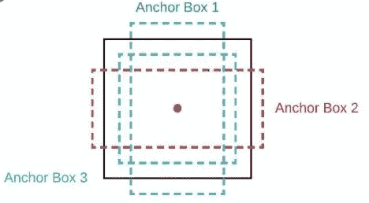
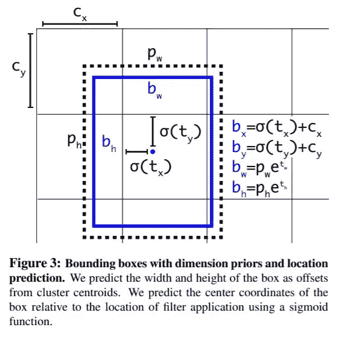
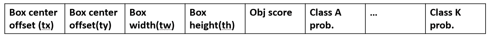
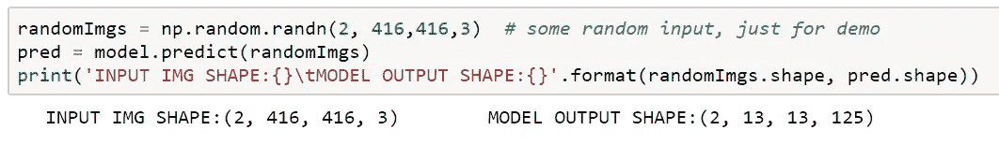
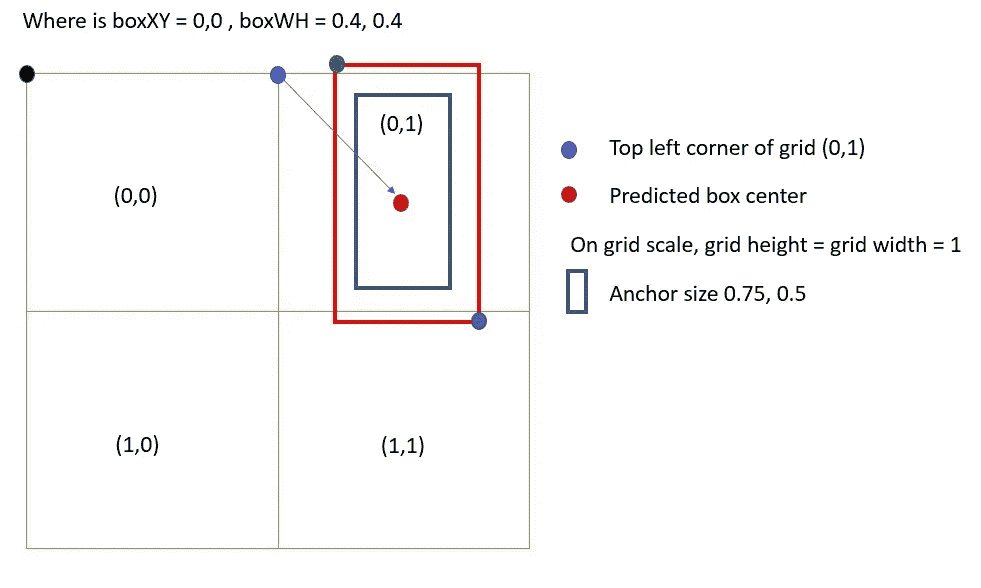
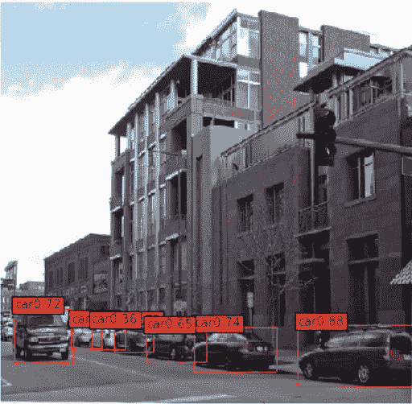

# Yolo 2 解释道

> 原文：<https://towardsdatascience.com/yolo2-walkthrough-with-examples-e40452ca265f?source=collection_archive---------2----------------------->

## 实现和可视化

Yolo 是该领域最成功的目标检测算法之一，以其闪电般的速度和相当高的精度而闻名。与需要多次特征提取的逐区域检测对象的其他区域提议框架相比，输入图像在 Yolo 中被处理一次。在本教程中，我们将一窥 Yolo2 的代码。



[RCNN 网络](https://arxiv.org/pdf/1311.2524.pdf)

对于那些想一步一步运行代码而不是看评论的人，可以看看我在 GitHub 上的补充回购！repo 有几个教程涵盖了 Yolo 的所有方面，还有一个现成的库供您使用！

[](https://github.com/zzxvictor/YOLO_Explained) [## zzx victor/YOLO _ 解释

### Yolo 是一个完全卷积的模型，与许多其他扫描检测算法不同，它在…

github.com](https://github.com/zzxvictor/YOLO_Explained) 

# Yolo 输出格式

要理解 Yolo2 是如何工作的，关键是要理解 Yolo 架构是什么样子的。Yolo2 使用 VGG 风格的 CNN 称为黑暗网络作为特征提取器。请注意，DarkNet 是各种网络的保护伞，人们使用不同的变体来提高速度或准确性。


图一。yolo2 中作为特征提取器的暗网

如你所见，yolo 的输出与我们之前看到的完全不同。图像中有 416 x 416 像素，但输出是 13 x 13。我们究竟如何解释这些结果？

让我们暂时把 Yolo 放在一边，想想我们如何在一条路径上进行物体检测？这是我天真的解决方案:

```
Suppose we have a network that takes an input image of size, say 416 x 416 x3, and there are 20 classes in the dataset.For every pixel in the image, we can predict a box with the following layout(Figure 2). The model output has shape 416 x 416 x22
```



图二。天真的方法

Yolo 被设计成快速准确。因此，预测每个像素一个盒子是不理想的(两个相邻的像素可能属于一个对象)。发明 YOLO 的极客们去工作，想出了一个更好的主意

## 优化 1 —减少预测箱数

我们将一幅图像分成 S×S 个网格，并预测每个 ***网格的 ***个*** 个盒子，而不是预测每个像素一个盒子。***

```
With this optimization, the output can be reduced to something like 13 x 13 x 5*22, if we predict 5 boxes per grid. This is a significant drop in box numbers
```



图 3。[约洛](https://arxiv.org/pdf/1506.02640.pdf)

## 优化 2 —用于过滤掉低置信度预测的对象分数

除了分类概率之外，Yolo 还引入了一个**对象分数**。对象分数是对一个对象是否出现在预测框中的估计(它不关心什么对象，那是类概率的工作)。如果一个预测具有较低的对象分数，它将在后处理中被丢弃。也就是说，边界框应该像这样



图 4。更好的方法

```
With this optimization, the output will have shape 13 x 13 x 5 * (3+20)
```

## 优化 3 —根据数据集量身定制



图 5，不同尺寸和比例的锚盒。高盒子适合人类等物体，而宽盒子适合公共汽车和自行车等物体

Yolo 没有预测整个图像中盒子的绝对大小，而是引入了所谓的**锚盒**，这是一个预定义的盒子列表，最匹配所需的对象(给定基本事实，运行 K 均值聚类)。预测框相对于锚点进行缩放。更具体地说:

1.  预测盒子中心(图 6 中的 tx 和 ty)w . r . t 其网格左上角的*按 ***网格宽度和高度缩放。****
2.  *根据锚盒 (pw 和 ph)预测盒 ***的宽度(tw)和高度(th)****

**

*图 6。 [Yolo2](https://arxiv.org/abs/1612.08242) 中的锚盒*

## *最终格式*

*现在你知道 YOLO 预测每个网格有几个边界框，而不是只有一个。输出形状类似于 13 x 13 x NUM_ANCHOR X (BOX INFO ),其中最后一个维度看起来就像简单方法的升级版。*

**

*图 6。yolo 格式*

```
*With all optimizations, Yolo output can be interprated as:
for every grid:
    for every anchor box: (with different aspect ratios and sizes)
        predict a box
Thus, yolo output has shape 13 x 13 x 5 x 25, which is reshaped in practice into 13 x 13 x 125*
```

**

*图 7。验证分析*

# *边界框的原始输出*

*现在我们明白 Yolo 2 的格式了。下一步是如何从原始张量中提取盒子。你确定我们不能用所有 13 x 13 x 5 的盒子吗？在这一节中，我们将看到如何从原始输出张量中提取信息。*

```
*Let's assume the output Y has shape 2 x 2 x 2*6, meaning there are two anchors per grid and one class in the dataset. 
Assume Y[0,1,0,:] = [0, 0, 0.4, 0.4, 0, 0.5]. This defines the red box in figure 8\. But how to decode it?*
```

**

*图 8*

## *步骤 1-提取框坐标*

*让我们来看看这些信息*

```
*[0, 0, 0.4,  0.4, 0, 0.5] = 
[tx,  ty,  tw,  th,  obj score,  class prob.]
Please refer to figure 6*
```

*我们需要将相对坐标 tx，ty 转换为图像比例坐标 bx，by，对于 tw 和 th 也是如此。下面是如何在 tensorflow 2 中实现的*

```
*After this step the red box coordinate is converted from:
[0, 0, 0.5, 0.5] to 
[0.5, 1.5, 1.13, 0.75], meaning it's (0.5 grid height, 1.5 grid width) from the top left image corner and the box has size (1.13 grid height, 0.75 grid width)*
```

*现在我们有了预测的盒子在网格尺度上的坐标和它的大小，很容易计算它的角的坐标(图 8 中紫色和绿色的点)。我们做这一步是因为用它的角而不是它的中心和宽度/高度 来表示一个盒子是标准的*

*要获得绿色和紫色点的坐标，我们需要:*

```
*green dot = boxXY - boxWH / 2
purple dot = boxXY + boxWH /2 
(Please note that the top left corner has smaller cordinates in images)*
```

*在这之后，我们用(32，32)乘以坐标，这样边界框现在就是图像比例了。例如，(0，0)表示左上角，(1，1)表示右下角，(0.5，0.5)表示图像中心*

## *第 2 步—过滤掉低质量的盒子*

*对于每个网格和每个定位框，yolo 预测一个边界框。在我们的例子中，这意味着预测了 13 * 13 * 5 个盒子。可以想象，并不是所有的框都是准确的。其中一些可能是假阳性(无对象)，一些是预测同一对象(太多重叠)。为了获得最终结果，我们需要:*

```
*Filter out boxes with low confidence (object score)
Filter out boxes that overlaps too much (two boxes have high IOU)*
```

# *魔法时间*

*就是这样！这些是您解码 yolo 输出所需的唯一脚本。让我们来看看结果:*

**

*图 9*

*阅读脚本可能会非常混乱，这就是我强烈建议你检查一下[回购](https://github.com/zzxvictor/YOLO_Explained)并在 Google Colab 或你的本地计算机上运行它。*

*非常感谢您的阅读！在未来的教程中，我将讨论加载训练数据和转移学习！*