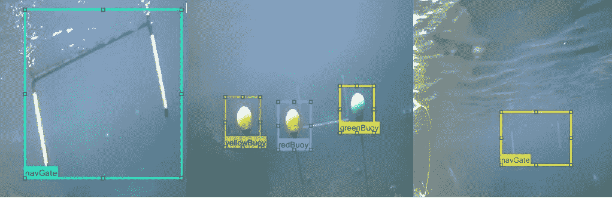
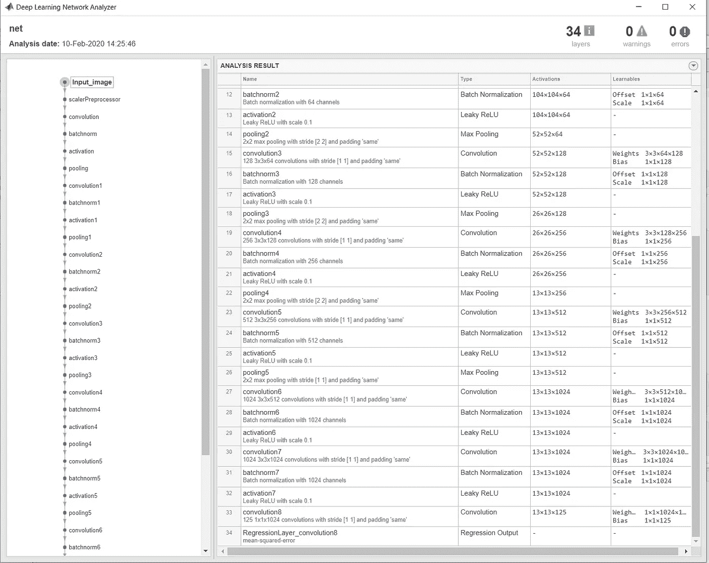
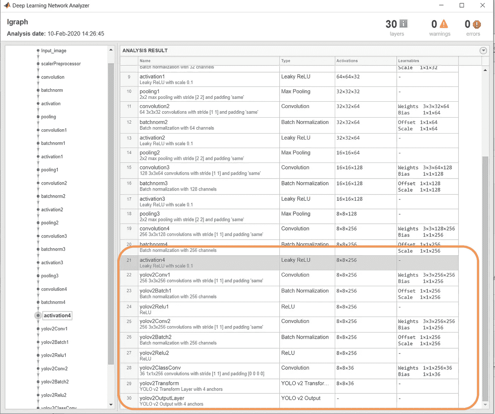
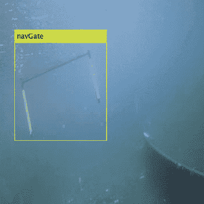
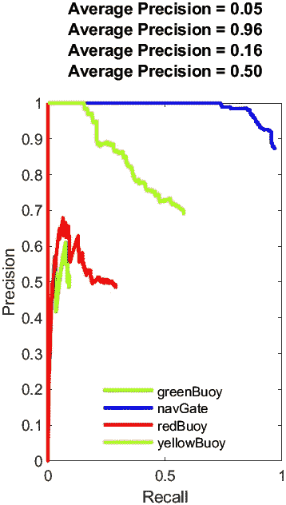
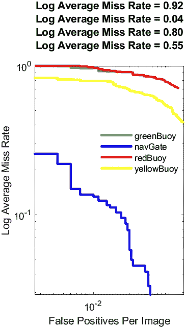

# MATLAB 中 ONNX 模型的 YOLOv2 物体检测

> 原文：<https://towardsdatascience.com/yolov2-object-detection-from-onnx-model-in-matlab-3bb25568aa15?source=collection_archive---------28----------------------->

## 我如何在 MATLAB 中导入微小的 YOLOv2 ONNX 模型，并重新训练网络来检测自定义数据集上的对象



图片由恩布里-里德尔的机器人小组提供

# 数据集

[RoboSub](https://robonation.org/programs/robosub/) 是由 [RoboNation](https://robonation.org/) 举办的一项比赛，学生们建造一个自主水下航行器来执行模拟搜索&救援任务。基本任务是识别和避开水下物体。

这篇报道所用的图像数据由位于[的 Embry-Riddle 的 RoboSub 团队](https://www.roboticsassociation.org/)的机器人协会提供。这些图像是在他们的训练过程中用安装在水下机器人上的实时摄像机拍摄的。完整的数据集可以从谷歌硬盘下载。

# 数据准备

所有图像的大小都被调整为(416 x 416 x 3)并被分成训练、测试和验证三个文件夹。然后使用 MATLAB 中 [***地面真实贴标机应用***](https://www.mathworks.com/help/driving/ug/get-started-with-the-ground-truth-labeler.html) 中的自定义自动化算法对图像进行贴标。要了解更多关于完整标记过程的信息，请参考此 [YouTube 视频](https://www.youtube.com/watch?v=ow_B_30WU1s&list=PLn8PRpmsu08oLufaYWEvcuez8Rq7q4O7D&index=32&t=0s)。

来自地面实况贴标机 app 的数据以 ***地面实况*** 数据对象的形式导出到 MATLAB 中。然后使用函数[***objectDetectorTrainingData***](https://www.mathworks.com/help/vision/ref/objectdetectortrainingdata.html#bvkrwem-1-trainingData)***将其进一步转换为[表格](https://www.mathworks.com/help/vision/ref/objectdetectortrainingdata.html#bvkrwem-1-trainingData)。*** 详细代码文件位于[这里](https://github.com/mathworks-robotics/deep-learning-for-object-detection-yolov2/tree/master/codeFiles)。

> 注意:下载[数据](https://drive.google.com/drive/u/0/folders/1bhohhPoZy03ffbM_rl8ZUPSvJ5py8rM-)并运行数据预处理 *的[脚本，然后继续下一步](https://github.com/mathworks-robotics/deep-learning-for-object-detection-yolov2/tree/master/codeFiles)*。

# 进口和培训

本节将介绍导入 ONNX 模型的步骤，然后根据数据集的类别执行迁移学习。

**第一步**:从 onnx 模型动物园导入 [***微小的 YOLOv2 onnx 模型***](https://github.com/onnx/models/tree/master/vision/object_detection_segmentation/tiny_yolov2)*。*

*文件被下载并存储为文件夹中的 ***model.onnx*** 。*

```
*modelFile = **fullfile**('Utilities','model.onnx');*
```

*[***importONNXNetwork***](https://www.mathworks.com/help/deeplearning/ref/importonnxnetwork.html?s_tid=doc_ta)函数从 onnx 导入预先训练好的网络。作为函数参数，我传递了 *modelFile* 和 *'OutputLayerType"**

```
*net = **importONNXNetwork**(modelFile,'OutputLayerType','regression');*
```

*导入的 tiny YOLOv2 模型是一个共 34 层的网络，结合了: ***输入图像，8 组卷积，batchnorm，激活*** 和 ***合并*** 层，最后一层为 ***卷积 8*** 层。我使用 [analyzeNetwork](https://www.mathworks.com/help/deeplearning/ref/analyzenetwork.html) 函数可视化了网络架构。*

```
***analyzeNetwork**(net);*
```

**

*使用网络分析器可视化导入的 YOLOv2 Onnx 模型。(图片由 Neha Goel 提供)*

***第二步:**根据*训练数据*计算**待检测的班级数**和**锚箱**。*

*在这个项目中，我有 4 个类/对象:*导航门，绿色浮标，红色浮标和黄色浮标。**

```
*numClasses = size(trainingData,2)-1;*
```

*使用聚类方法计算锚盒。下面的详细过程在这里链接[。](https://github.com/mathworks-robotics/deep-learning-for-object-detection-yolov2/blob/master/codeFiles/AnchorBoxes.m)*

```
*Anchors = [43 59
    18 22
    23 29
    84 109];*
```

***第三步:**重新设计并组装 YOLOv2 网络。*

*然后，我根据要检测的类重新设计了导入的网络。我用函数[***yolov 2 layers***](https://www.mathworks.com/help/vision/ref/yolov2layers.html?s_tid=doc_ta)***实现了它。*** 它在提取图层的末端添加了一个 YOLOv2 网络。*

*该函数的参数如下:*

1.  ***输入大小**:给网络的最小输入大小。这里我给了(128 x 128 x 3)。*
2.  ***在上述步骤 2 中计算的等级** ( *numClasses* )和锚的数量*
3.  ***从上述步骤 1 导入的网络** ( *net)**
4.  ***特征提取层**:从该层提取的特征作为输入给 YOLOv2 目标检测子网络。您可以指定除全连接层之外的任何网络层。这里我使用了 *activation4* 命名层的导入网络 *net* 。*

```
*lgraph = **yolov2Layers**([128 128 3], numClasses, Anchors, net, 'activation4');*
```

*下图显示了新网络的样子。观察特征层*激活 4* 后添加在末端的*yolov 2 层*的高亮子网络。*

```
***analyzeNetwork**(lgraph);*
```

**

*添加 yolov 2 图层后可视化修改后的网络(图片由 Neha Goel 提供)*

***第四步:**训练新网络。*

*基于数据集的大小，我用求解器训练了网络——随机梯度下降 100 个时期，初始学习率为 0.001，小批量为 10。考虑到数据的大小以及调整时期和小批量的大小，我执行了较低的学习速率，以便有更多的时间进行训练。我用来选择选项的文件是:[训练选项](https://www.mathworks.com/help/deeplearning/ref/trainingoptions.html?s_tid=doc_ta)。*

```
*options = **trainingOptions**('sgdm', ...
"LearnRateSchedule","piecewise", ...
'LearnRateDropFactor',0.5,...
"LearnRateDropPeriod",5,...
'Verbose' ,true, 'MiniBatchSize',10,'MaxEpochs',100, ...
'Shuffle','every-epoch', 'VerboseFrequency',50, ...
'DispatchInBackgrpund',true,...
'ExecutionEnvironment','auto');*
```

*然后我用[*trainyolov 2 object detector*](https://www.mathworks.com/help/vision/ref/trainyolov2objectdetector.html)*函数来训练我的网络。**

```
**[detectorTinyYolo2, info] = **trainYOLOv2ObjectDetector**(trainingData, lgraph,options);**
```

# ****评估&结果****

**一旦我有了训练好的网络，我就按照下面的步骤在测试数据上评估它的性能。**

****步骤 1:** 创建一个表来保存结果，并初始化一个[可部署的视频播放器](https://www.mathworks.com/help/vision/ref/vision.deployablevideoplayer-system-object.html)来查看图像流。**

```
**results = **table**('Size',[height(TestData) 3],...
'VariableTypes',{'cell','cell','cell'},...
'VariableNames',{'Boxes','Scores', 'Labels'});depVideoPlayer = **vision.DeployableVideoPlayer**;**
```

****步骤 2:** 遍历测试集中的所有图像。**

```
**for i = 1:height(**TestData**)
    *% Read the image*
    I = imread(TestData.imageFilename{i});

    *% Run the detector.*
    [bboxes,scores,labels] = detect(detectorTinyYolo2,I); if ~isempty(bboxes)
         I = **insertObjectAnnotation**(I,'Rectangle',bboxes,cellstr(labels))       

         depVideoPlayer(I);
         pause(0.1);
    else
         depVideoPlayer(I);
    end *% Collect the results in the results table*
    results.Boxes{i} = floor(bboxes);
    results.Scores{i} = scores;
    results.Labels{i} = labels;
endthreshold =0.3;
expectedResults = TestData;**
```

****

**使用可部署的视频播放器，通过测试数据图像循环显示网络检测。(图片由 Neha Goel 提供)**

****第三步**:评估精度指标。**

**我使用[*evaluateDetectionPrecision*](https://www.mathworks.com/help/vision/ref/evaluatedetectionprecision.html)函数来计算数据点，以便使用给定的输入参数和阈值绘制精度-召回曲线。**

```
**[ap, recall, precision] = **evaluateDetectionPrecision**(results, expectedResults(:,2:end),threshold);**
```

**绘制每个类的精度指标。**

```
**plot(recall{1,1},precision{1,1},'g-','LineWidth',2, "DisplayName",'greenBuoy');
hold on;
plot(recall{2,1},precision{2,1},'b-','LineWidth',2, "DisplayName",'navGate');
hold on;
plot(recall{3,1},precision{3,1},'r-','LineWidth',2, "DisplayName",'redBuoy');
hold on;
plot(recall{4,1},precision{4,1},'y-','LineWidth',2, "DisplayName",'yellowBuoy');
hold off;xlabel('Recall');
ylabel('Precision');
title(sprintf('Average Precision = %.2f\n', ap)
legend('Location', 'best');
legend('boxoff');**
```

****

**图片由 Neha Goel 提供**

****步骤 4** :评估目标检测的缺失率指标。**

**使用函数[*evaluateDetectionMissRate*](https://www.mathworks.com/help/vision/ref/evaluatedetectionmissrate.html?s_tid=doc_ta)*I*计算结果的对数平均缺失率，与地面数据和数据点进行比较。****

```
**[am,fppi,missRate] = **evaluateDetectionMissRate**(results, expectedResults(:,2:end),threshold);**
```

**将每个类别的日志未命中率度量标绘为每个图像的误报率。**

```
**loglog(fppi{1,1}, missRate{1,1},'-g','LineWidth',2, "DisplayName",'greenBuoy');
hold on;
loglog(fppi{2,1}, missRate{2,1}, 'b','LineWidth',2,"DisplayName",'navGate');
hold on;
loglog(fppi{3,1}, missRate{3,1},'-r','LineWidth',2, "DisplayName",'redBuoy');
hold on;
loglog(fppi{4,1}, missRate{4,1},'-y','LineWidth',2, "DisplayName",'yellowBuoy');
hold off;xlabel('False Positives Per Image');
ylabel('Log Average Miss Rate');
title(sprintf('Log Average Miss Rate = %.2f\n', am))
legend('Location', 'best');
legend('boxoff');**
```

****

**图片由 Neha Goel 提供**

**正如所观察到的，由于不平衡的等级，对于“ *navGate* ”等级来说，度量更加准确。人们可以使用[过采样和欠采样技术](https://en.wikipedia.org/wiki/Oversampling_and_undersampling_in_data_analysis)来解决类别的不平衡。**

## ****结束语****

**这个故事的主要目的是介绍一种导入 onnx 模型并在 MATLAB 中重新训练定制数据的方法。你可以在这里观看这个故事的视频[。](https://www.youtube.com/watch?v=5bnIYH6P-vE&list=PLn8PRpmsu08oLufaYWEvcuez8Rq7q4O7D&index=46&t=0s)**

**作为下一步的一部分，我在 NVIDIA Jetson 上部署了这个网络，并在直播摄像机上检测了对象。要了解整个项目的更多信息，可以查看这个 GitHub 资源库:[https://GitHub . com/mathworks-robotics/deep-learning-for-object-detection-yolov 2](https://github.com/mathworks-robotics/deep-learning-for-object-detection-yolov2)。**