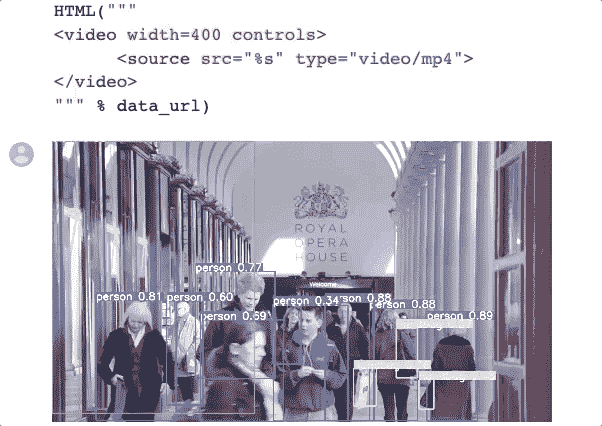
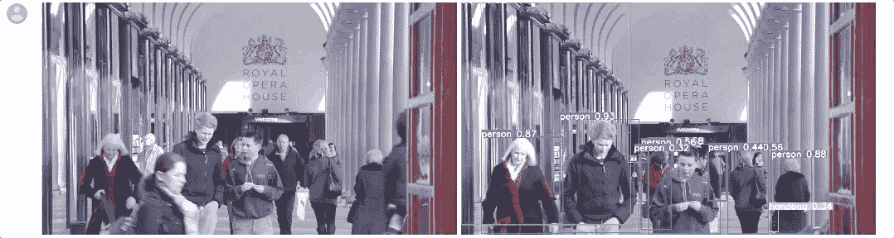

# Google Colab 上的 YOLOv3 PyTorch

> 原文：<https://towardsdatascience.com/yolov3-pytorch-on-google-colab-c4a79eeecdea?source=collection_archive---------27----------------------->

## 在浏览器上进行对象检测视频处理

对于计算机视觉爱好者来说， **YOLO** (你只看一次)是一个非常流行的实时物体检测概念，因为它非常快，性能很好。

在这篇文章中，我将分享处理视频的代码，以获得 **Google Colab** 中每个对象的边界框

我们不会讨论 YOLO 的概念或架构，因为媒体上已经有很多好文章对此进行了阐述。这里我们只讨论**功能码**

# 我们开始吧

照片由[瓦希德·赫内](https://unsplash.com/@wahidkhene?utm_source=medium&utm_medium=referral)在 [Unsplash](https://unsplash.com?utm_source=medium&utm_medium=referral) 上拍摄

> 你可以试试这个[谷歌眼镜。](https://colab.research.google.com/github/vindruid/yolov3-in-colab/blob/master/yolov3_video.ipynb)

我们从 Ultralytics 的一个写得很好并且我最喜欢的 git hub [repo](https://github.com/ultralytics/yolov3) 开始。尽管回购已经包含如何使用 YOLOv3 处理视频，只是运行`python detect.py --source file.mp4`我想分解并尝试**简化代码**，只是删除几个不必要的行，我添加了如何在 Google Colab / Jupyter 笔记本上**显示处理后的视频**

## 准备 YoloV3 和 LoadModel

首先克隆 Ultralytics YoloV3 存储库，然后导入公共包和 repo 函数

设置参数解析器，初始化设备(CPU / CUDA)，初始化 YOLO 模型，然后加载权重。

我们使用的是`YOLOv3-spp-ultralytics`权重，回购公司称其在平均精度上远远优于其他 YOLOv3

函数`torch_utils.select_device()`将自动寻找可用的 GPU，除非输入`'cpu'`

对象`Darknet`在 PyTorch 上初始化 YOLOv3 架构，权重需要使用预先训练的权重加载(我们现在不想训练模型)

## 视频上预测对象检测

接下来，我们将读取视频文件，并用对象边界框重写视频。接下来的 3 GitHub Gist 是最后会用到的函数`predict_one_video`的一部分。

我们正在用 MP4 格式写新视频，它在`vid_writer`上明确声明。而`fps`、`width`和`height`根据原始视频使用

开始循环视频上的每一帧以获得预测。

此型号的图像尺寸为 416。一个名为`letterbox`的函数正在调整图像的大小，并对图像进行填充，因此宽度或高度中的一个变为 416，另一个小于 416，但仍能被 32 整除

第二部分是我们将图像转换成 RGB 格式，并将通道放入第一维`(C,H,W)`。将图像数据放入设备(GPU 或 CPU)并将像素从`0-255`缩放到`0-1`。在我们将图像放入模型之前，我们使用函数`img.unsqeeze(0)`，因为我们必须将图像重新格式化为 4 维`(N,C,H,W)`，其中 N 是图像的数量，在本例中为 1。

在对图像进行预处理后，我们把它放入模型中得到预测盒。但是预测有很多盒子，所以我们需要`non-maximum suppression`来过滤和合并盒子。

非最大抑制(NMS)。[图像来源](https://mc.ai/detection-free-human-instance-segmentation-using-pose2seg-and-pytorch/)

## 绘制边界框和标签，然后编写视频

我们在 NMS 之后循环所有的预测`(pred)`来绘制盒子，但是图像已经被调整到 416 像素，我们需要使用函数`scale_coords`将其缩放回原始大小，然后我们使用函数`plot_one_box`来绘制盒子

# 在 Colab 上显示视频

视频在函数`predict_one_video`上被写成 Mp4 格式，保存为 Mp4 后我们压缩成`h264`，这样视频就可以直接在 Google Colab / Jupyter 上播放了。

## 显示原始视频

我们使用宽度为 400 像素的`IPython.display.HTML`显示视频。使用二进制读取视频

## 压缩并显示处理过的视频

OpenCV video writer 的输出是一个 Mp4 视频，其大小是原始视频的 3 倍，并且不能使用相同的方式在 Google Colab 上显示，解决方案之一是我们进行压缩([来源](https://stackoverflow.com/questions/33134985/cv2-videowriter-will-not-write-file-using-fourcc-h-264-with-logitech-c920-pyth)

我们使用`ffmpeg -i {save_path} -vcodec libx264 {compressed_path}`将 Mp4 视频压缩为 h264

# 结果

左边是原始视频，右边是使用这些代码处理的

# 试试你自己的视频

到 GitHub 上的 Google Colab 文件[这里](https://colab.research.google.com/github/vindruid/yolov3-in-colab/blob/master/yolov3_video.ipynb)

1.  将您的视频上传到`input_video`文件夹
2.  只运行最后一个单元格(预测和显示视频)

# 来源

*   [YoloV3 火炬储存库](https://github.com/ultralytics/yolov3)
*   [谷歌 Colab 高级输出](https://colab.research.google.com/notebooks/snippets/advanced_outputs.ipynb#scrollTo=SucxddsPhOmj)
*   [在 Google Colab 上显示视频](https://stackoverflow.com/questions/57377185/how-play-mp4-video-in-google-colab)
*   [视频压缩](https://stackoverflow.com/questions/33134985/cv2-videowriter-will-not-write-file-using-fourcc-h-264-with-logitech-c920-pyth)

感谢您的阅读，希望对您有所帮助

# 接下来的故事:

*   Yolov3 在 Google Colab 上使用网络摄像头
*   Yolov3 训练手检测
*   Yolov3 训练安全帽

# 干杯！！！