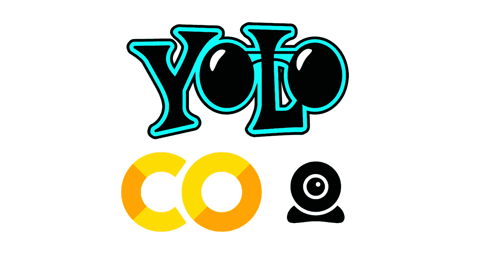
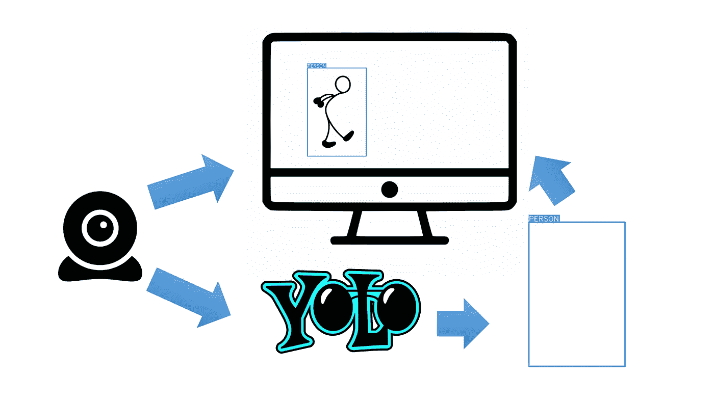
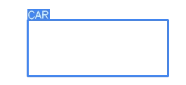

# Google Colab 上的 YOLOv3 PyTorch 流媒体

> 原文：<https://towardsdatascience.com/yolov3-pytorch-streaming-on-google-colab-16f4fe72e7b?source=collection_archive---------12----------------------->

## 使用 Google Colab 在您的浏览器上进行网络摄像头流对象检测

**YOLO** (你只看一次)在计算机视觉和深度学习方面最大的突破之一是能够实时处理**高精度的物体检测。**

在非 GPU 计算机上使用 YOLO 完全是一种痛苦，幸运的是谷歌实验室来拯救我们了！！！每台能够打开 Google Chome 浏览器的电脑都足以使用 Google 的免费 GPU(其他浏览器也可以，但推荐使用 Chome)。

> Google Colab 里有我之前关于 YOLO 的文章:
> [YOLOv3 视频处理](/yolov3-pytorch-on-google-colab-c4a79eeecdea)

我们不会讨论 YOLO 的概念或架构，因为媒体上已经有很多好文章对此进行了阐述。

**这里要讨论的:**
1。使用 JavaScript 将我们的网络摄像头连接到 Google Colab。使用 YOLO 从网络摄像头上的图像中获取对象检测边界框
3。将预测的边界框放入我们的实时网络摄像头显示

工作流程

我们旅程的结果会是这样的

你可以在这个 [Google Colab](https://colab.research.google.com/github/vindruid/yolov3-in-colab/blob/master/yolov3_streaming_webcam.ipynb) 中亲身体验

# 让我们开始行动吧

## 1.使用 JavaScript 将我们的网络摄像头连接到 Google Colab

在 Google Colab 中连接网络摄像头的功能

基本上有两个函数我们需要用到:`start_input`和`take_photo`。

当运行`start_input`时，我们打开网络摄像头(确保你**允许**你的浏览器/ Google Colab 打开你的摄像头)，然后提供画布来放置网络摄像头捕捉到的一切，并显示给我们的 Google Colab 输出。

我们可以通过改变`captureCanvas.width`和`captureCanvas.height`来调整画布的大小。

`take_photo`返回*包含要在 YOLO 处理的图像(以字节为单位)的 JavaScript 对象*，我们将在下一节看到。

最突出显示的输入`take_photo`是`**img_data**`，这是一个*图像*，我们希望覆盖在我们的网络摄像头图像上。在我们的例子中，它是边界框的图像。这将在最后一节讨论。

这是我们如何在 Google Colab 中打开网络摄像头，停止捕捉只需点击输出底部的红色文本。

## 2.从网络摄像头上的图像中使用 YOLO 获得对象检测边界框

首先，我们必须处理来自`take_photo`函数的 JavaScript 输出，我们将其命名为`js_reply`，以获得数组格式的图像。

我们是这样做的，我们把它从一个字节格式解码，然后转换成一个数组。

现在我们有了一个已经**符合 YOLO 模型**的图像。

其次，我们从 ultralytics 制备 YOLO 回购

上面的代码包含**克隆 repo** 和**从 ultralytics 加载预训练模型**。

然后我们从 YOLO 模型中产生边界框，但是这次我们没有直接把它画到输入图像中，而是把边界框画到一个 RGBA 格式的空白画布中。png)，所以我们可以得到一个没有背景的包围盒的图像。

画布的结果大概是这样的。没有背景就查一下。

## 3.将预测的边界框放入我们的实时网络摄像头显示

在我们得到预测结果后，我们需要做的最后一件事就是把结果直接放到我们的网络视频中。

要通过`take_photo`函数中的`img_data`参数将其放回我们的 JavaScript 东西’中，我们需要将预测结果转换/编码为*字节*格式。这是怎么回事:

到目前为止，我们已经有了几个函数，让我们按照使用的顺序再回顾一下:

1.  `start_input` - >打开网络摄像头并显示网络摄像头
2.  `take_photo` - >从网络摄像头获取图像并覆盖边框
3.  `js_reply_to_image` - >将 JS 输出的图像转换成数组
4.  `get_drawing_array` - >从图像数组中获取预测的包围盒
5.  `drawing_array_to_bytes` - >将预测包围盒转换成字节

然后，我们重新运行我们的网络摄像头，使用所有这 5 个功能:

这里可以看到，起初`img_data`是一个空字符串(`''`)，然后在每次迭代中，它将被替换为`drawing_bytes`。这就是我们的边界框如何出现在 Google Colab 的摄像头输出上方。

# 来源

*   [https://github.com/ultralytics/yolov3](https://github.com/ultralytics/yolov3)
*   https://learn . ada fruit . com/tensor flow-in-your-browser-object-detection-with-bounding-box？视图=全部

谢谢你到目前为止阅读:D

如果你想在 [Google Colab](https://github.com/vindruid/yolov3-in-colab/blob/master/yolov3_streaming_webcam.ipynb) 中亲自尝试，请点击链接

希望这篇文章有帮助

# 干杯！！！