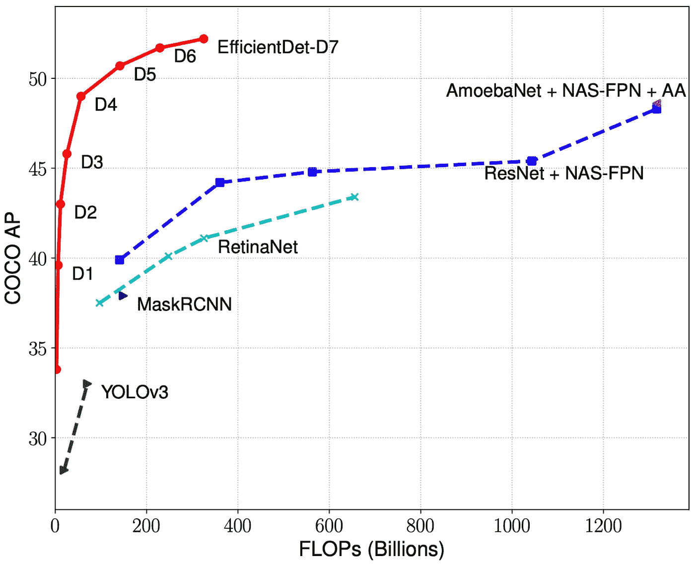
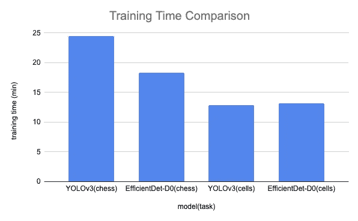
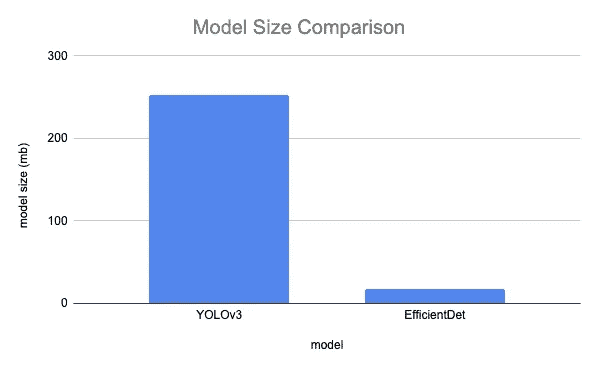
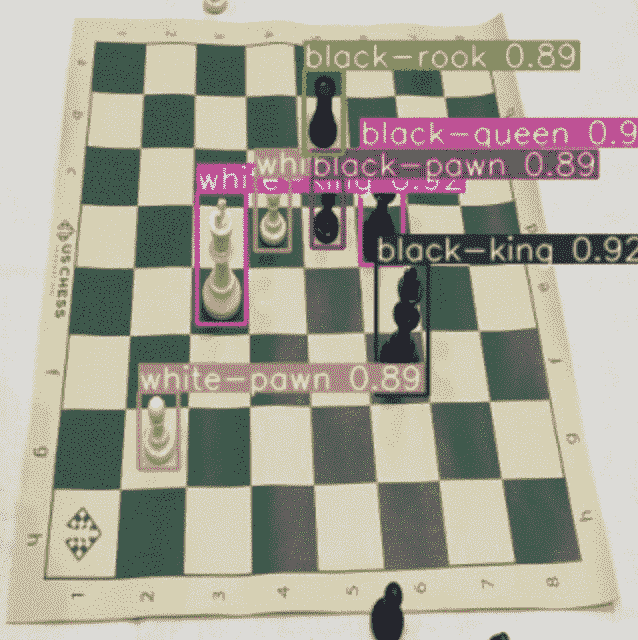
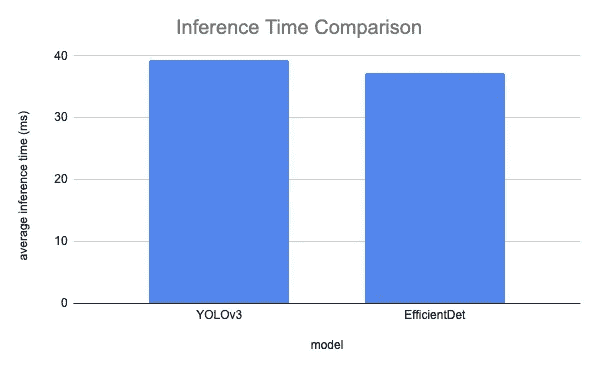
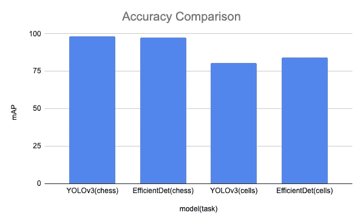

# YOLOv3 与 EfficientDet 的最新物体检测

> 原文：<https://towardsdatascience.com/yolov3-versus-efficientdet-for-state-of-the-art-object-detection-2c80f617c76b?source=collection_archive---------26----------------------->

## 众所周知，YOLOv3 是一个令人难以置信的高性能、最先进的模型架构:快速、准确、可靠。那么,“街区的新成员”EfficientDet 相比如何呢？*请注意:我们还在博客上发布了* [*约洛夫 3 vs EfficientDet*](https://blog.roboflow.ai/yolov3-versus-efficientdet-for-state-of-the-art-object-detection/) *！*

如果没有剧透，我们对这些结果感到惊讶。

* * *注意:YOLOv4 是在此出版物之后出版的，我们在那里发现了更好的结果。请看我们关于[如何用自己的数据训练 YOLOv4 的帖子。](https://blog.roboflow.ai/training-yolov4-on-a-custom-dataset/)

# 我们的范围

在本文中，我们比较了两种最先进的图像检测模型——efficient det 和 YOLOv3 的建模方法、训练时间、模型大小、推理时间和下游性能。这两个模型都是用易于使用的、实用的实现来实现的，任何开发人员都可以部署这些实现。要了解如何训练这些模型，请参见我们关于如何训练 EfficientDet 的[教程和关于如何训练 YOLOv3](https://blog.roboflow.ai/training-efficientdet-object-detection-model-with-a-custom-dataset/) 的[教程。这两个实现都在 PyTorch 中，并导出可以移植到应用程序中进行推理的权重。](https://blog.roboflow.ai/training-a-yolov3-object-detection-model-with-a-custom-dataset/)

*   对于您的自定义数据集，您只需要更改两行代码，其中您的数据集被导入到 COCO json for EfficientDet 和 yolo v3 Darknet for yolo v3 py torch 实现中。
*   如果您愿意:直接跳到比较 YOLOv3 和 EfficientDet 的 [Colab 笔记本](https://colab.research.google.com/drive/1pLvZpz0_Ob0yOQ7hxPhVRT04Cb3FGARb#scrollTo=dFSgxwD9Igo6)
*   当我们写这篇文章时，YOLOv4 已经发布，我们将在以后的文章中比较 YOLOv4 和 EfficientDet。

推理在我的笔记本上运行，用于血细胞检测(ED —绿色红细胞，YOLO —黄色红细胞)

免责声明:我们的工作超越了学术同行评议的界限。它旨在快速衡量这些模型在今天的生产计算机视觉环境中部署的可行性，并提供一个可以在 Colab 笔记本上使用的实际实现。在理想的部署条件下，可以更精确地测量诸如推理时间之类的东西，并进行更适当的配置。

# EfficientDet 简介

[EfficientDet](https://arxiv.org/abs/1911.09070) 最近作为图像检测的最新模型而广受欢迎，因为它相对于其他图像检测模型而言既高效又快速。此前， [YOLOv3](https://pjreddie.com/media/files/papers/YOLOv3.pdf) 一直是图像检测的首选型号。

EfficientDet 在速度和准确性方面都很出色([来源](https://arxiv.org/abs/1911.09070))

在用于图像检测的 COCO 数据集上，相对于模型大小，EfficientDet 被示出在对等模型中具有最佳性能。(参见我们之前的帖子[全面的分解效率测试](https://blog.roboflow.ai/breaking-down-efficientdet/)。)COCO 包含 80 个对象类，跨越一系列视觉语义，被认为是图像检测任务的黄金标准。这个想法是——如果模型能够掌握 COCO，那么它将很好地推广到新的图像检测任务，只要为新任务提供适量的监督数据。

在这篇文章中，我们对 COCO 概括假设进行了测试，我们发现这两个模型在概括新任务方面都做得很好。我们在识别棋子和识别红/白细胞的任务上测试了这两个模型。我们提供了它们在训练时间、模型大小、推理时间和映射方面的性能比较。

# EfficientDet 和 YOLOv3 模型架构

[YOLO](https://arxiv.org/pdf/1506.02640.pdf) 做出了最初的贡献，将目标检测问题构建为一个两步问题，将边界框空间分离为一个回归问题，然后将这些边界框标记分类到预期的类别标签中。事实证明，这种方法对于近实时进行图像检测预测非常有效。在随后的迭代中，训练框架、数据集输入和检测规模在 YOLO、YOLOv2 和 YOLOv3 中得到了改进(当我们写这些代码时，YOLOv4 也在写[！).](https://blog.roboflow.ai/training-yolov4-on-a-custom-dataset/)

EfficientDet 保留了作为边界框回归和类标签分类的任务框架，但仔细实现了网络的特定区域。首先，对于卷积神经网络主干，EfficientDet 使用 EfficientNet，这是由 Google Brain 团队构建的最先进的 ConvNet。第二，EfficientDet 使用神经架构搜索来准确地找出如何组合 EfficientNet 特征层。第三，EfficientDet 论文研究了如何通过搜索有效地缩放网络的每个部分(ConvNet 的大小、特征融合层数、输入分辨率和类/箱网络)。请点击此处查看我们对 EfficientDet 模型的深入讨论摘要。

# 评估任务

我们在计算机视觉中识别[棋子](https://public.roboflow.ai/)和计算机视觉中识别[红/白血球](https://public.roboflow.ai/)的背景下评估这两个模型。(两个数据集都在 Roboflow 上公开托管。)象棋数据集包含大约 300 幅图像和 3000 个注释。血细胞数据集包含大约 400 幅图像和 5000 个类别注释。

对于每个模型，数据都以两种格式从 Roboflow 导入(数据上传后)，即针对 EfficientDet 的 [COCO JSON 和针对 YOLOV3](https://public.roboflow.ai/) PyTorch 实现模型的 [YOLOv3 Darknet。Roboflow 使得接收这些数据下载链接和输入到模型的 train/val/test 数据目录变得非常容易。这使您可以直接进行培训和研究，而不必担心数据操作和清理。](https://public.roboflow.ai/)

# 训练时间对比

为了在国际象棋上训练每个模型，我们通过模型传递数据集 100 个时期。基于验证集的改进，我们选定了 100 个纪元来完成这项任务。我们发现，在我们的实现中，EfficientDet 的训练速度(18.3 分钟)略快于 YOLOv3 (24.5 分钟)。这是有希望的，因为围绕 EfficientDet 的软件库将继续改进，并且这种初始训练时间领先将随着时间的推移而下降。

为了在血细胞上训练每个模型，我们通过模型传递数据集 100 个时期。我们发现 EfficientDet 比 YOLOv3 稍快。

对于您的自定义数据集，历元的数量会有所不同，我们鼓励您寻找最佳点来训练这些模型进行比较。

训练时间结果图表

# 模型尺寸比较

我们根据权重的文件大小来比较每个模型的大小。鉴于 EfficientDet-D0 包含的参数(400 万)比 yolov 3(6500 万)少得多，我们预计它的文件大小会更小。我们的模型实现以[的形式输出经过训练的权重。pth 和。onnx 代表效率检测器](/training-efficientdet-object-detection-model-with-a-custom-dataset-25fb0f190555)和[。效率检测点](/training-efficientdet-object-detection-model-with-a-custom-dataset-25fb0f190555)。以下是生成的模型文件大小:

模型尺寸结果的图表

为了存储，EfficientDet-D0 真的很小——这是*,包括*efficient net conv net 主干。

# 推理时间比较

推理在我的笔记本上运行棋子标记(ED —灰色白棋，YOLO —褐色白棋)

为了度量推理，我们试图缩小到每个实现的确切部分，该部分将网络输入和推理带到网络输出。这有望消除一些关于如何处理图像和保存推断注释的偏见。也就是说，我们再次期望 EfficientDet 实现会随着模型的流行和实现的改进而改进。我们通过推理来传递我们的测试集，并测量每幅图像的推理时间。然后，我们平均推断时间，以创建一个稳定的估计。结果如下:

推理时间结果图

推理时间比我们预期的更接近，但是 EfficientDet 仍然是明显的赢家。同样，我们预计随着实现的改进，这一差距将会扩大。

# 准确度比较

为了估计模型的可比准确性，我们计算了两个数据集的测试集的地图度量。该图评估模型在所有置信度值上的性能，允许模型随着置信度的降低而在精确度和召回率之间进行权衡。这里我们绘制了象棋和血细胞任务的地图。

这里的要点是，这两个模型在国际象棋上表现都非常出色，YOLOv3 略胜一筹。然而，随着性能在 90%以上，这可能是注释中绘制的边距有多宽的假象。对于血细胞，EfficientDet 略胜 yolov 3——两种模型都很好地完成了任务。

# 结论🏆

我们发现 EfficientDet 的实际实现在训练时间、模型大小、推理时间和准确性方面在两个自定义图像检测任务上优于 YOLOv3。我们在一个 [YOLOv3 与 EfficienDet 笔记本](https://colab.research.google.com/drive/1pLvZpz0_Ob0yOQ7hxPhVRT04Cb3FGARb#scrollTo=dFSgxwD9Igo6)中实现了这些测试，您可以很快将其用于您自己的用例。🚀