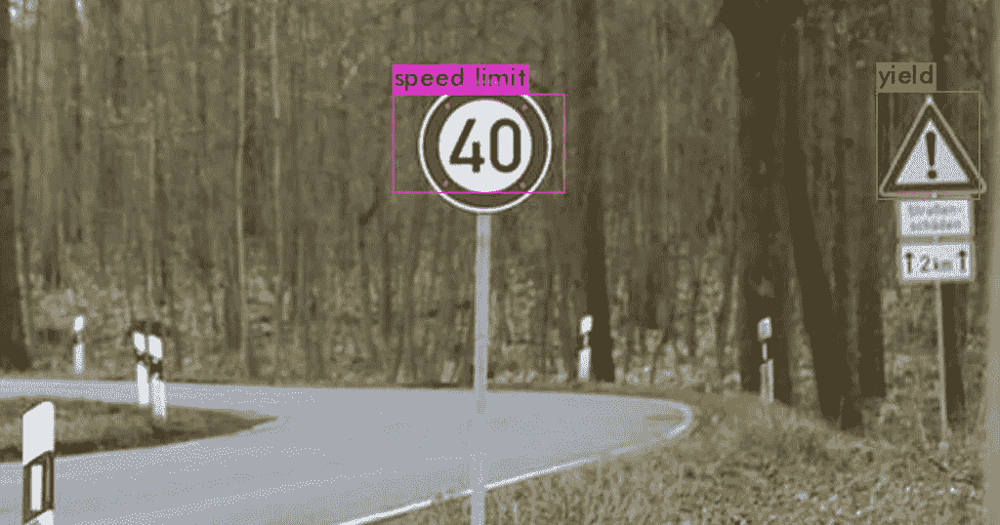
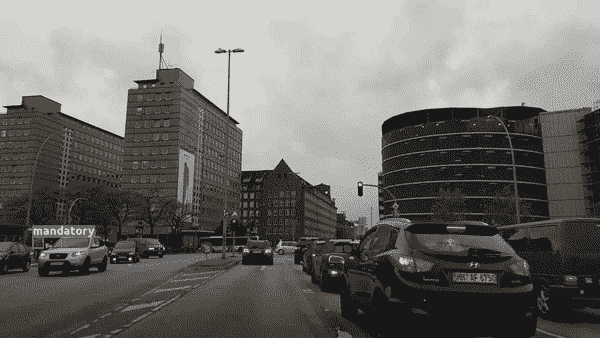
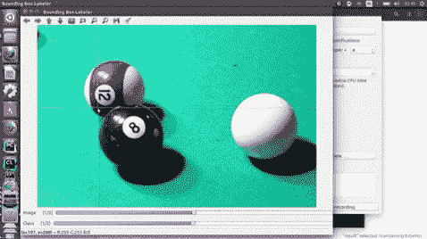
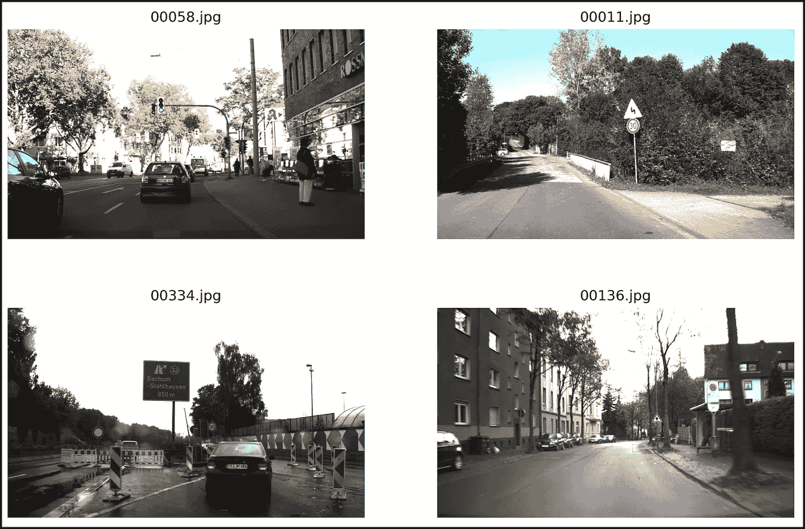
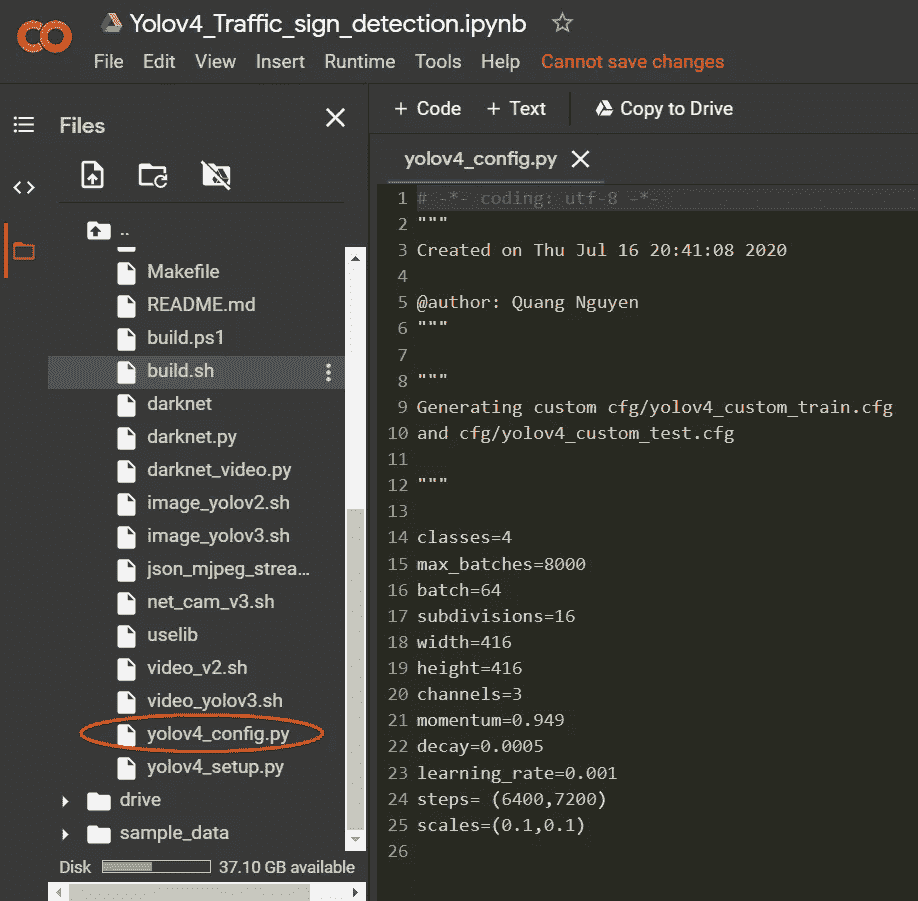
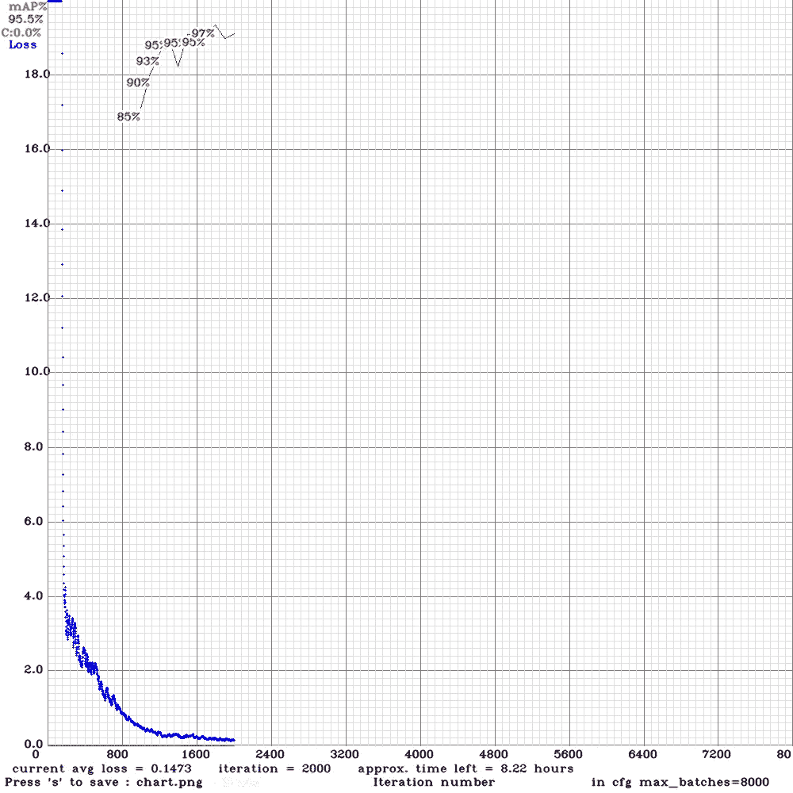
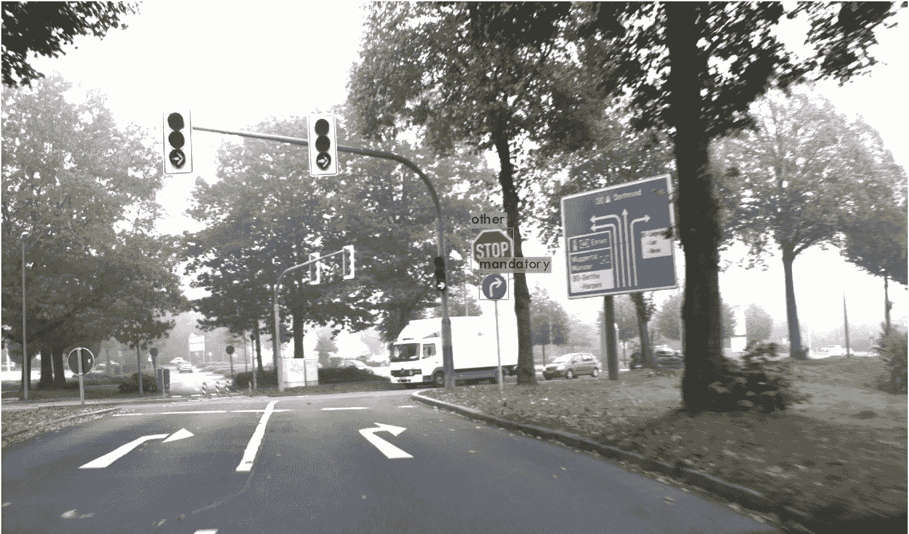

# Google Colab 上的 YOLOv4:轻松训练你的自定义数据集(交通标志)

> 原文：<https://towardsdatascience.com/yolov4-in-google-colab-train-your-custom-dataset-traffic-signs-with-ease-3243ca91c81d?source=collection_archive---------2----------------------->

## 使用 YOLOv4 在 Google Colab 上训练您的自定义数据集的有效而简单的方法！



来源图片由汉斯·阿德里安·伯麦在 Unsplash 上提供



用 YOLOv4 检测交通标志

*   [**用于训练 YOLOv4 的 Colab 笔记本，带有自定义数据集(交通标志)**](https://colab.research.google.com/drive/1VNc-Ywrs1XmfHcsq-BWpXZ5Zv_A2FcFn?usp=sharing)

# 概述

*   [**简介**](#4f2f)
*   [**为什么是 YOLOv4？**](#1c23)
*   [**数据准备**](#658f)
*   [**与 Colab 一起训练**](#eb53)
*   [**用 YOLOv4**](#03b5) 预测
*   [**结论**](#783a)

# 一.导言

前阵子我用 Google Colab 提供的免费 GPU 写了一篇用自定义数据集(枪械检测)训练 YOLOv3 的[教程。在发布教程后，许多人发邮件给我，询问他们在培训过程中面临的问题。我注意到的是，这些问题中的大部分来自于修改不适当的层架构、在不正确的目录路径中运行单元或者缺少一个/一些必需的配置步骤。我也意识到设置过程可能需要时间，而且经常会很混乱。](https://medium.com/@quangnhatnguyenle/how-to-train-yolov3-on-google-colab-to-detect-custom-objects-e-g-gun-detection-d3a1ee43eda1)

出于这些原因，我提出了一种新的方法，其中大多数设置步骤都是通过 python 脚本自动完成的(Colab 允许您直接在其环境中修改和运行 python 脚本)。有了这个新的程序，你唯一需要在本地执行的事情就是按照 YOLO 格式准备你的自定义数据集，而所有的剩余部分将在 Colab 环境中执行。

# 二。为什么是 YOLOv4？


YOLOv4 由阿列克谢·博奇科夫斯基(Alexey Bochkovskiy)、钱和廖宏远(Hong-Yuan Mark Liao)开发。它于 2020 年 4 月发布，并被称为当时最先进的实时物体探测器之一。根据其论文，YOLOv4 比 YOLOv3 快 12%，准确 10%。YOLOV4 的新架构以 CSPDarknet54 为骨干构建，提升了 CNN 的学习能力。此外，通用特征的实现包括加权剩余连接(WRC)、跨阶段部分连接(CSP)、跨小批量归一化(CmBN)、自我对抗训练(SAT)和 Mish 激活，帮助 YOLOv4 获得了非常令人印象深刻的结果。想了解更多关于 YOLOv4 的细节，可以参考原文[这里](https://arxiv.org/pdf/2004.10934.pdf)。[1]

# 三。数据集准备

为了能够用 YOLOv4 训练我们的定制数据集，我们的数据集必须遵循 YOLO 格式。数据集中的每幅图像都会与一个**相关联。txt** 同名文件，其中包含的对象类及其坐标遵循以下语法: ***<对象类><x _ center><y _ center><宽度> <高度>***

有很多开源的 GUI 工具可以帮助你轻松地从图像生成标签文件，比如 [Yolo_label](https://github.com/developer0hye/Yolo_Label) 、 [OpenLabeling](https://github.com/Cartucho/OpenLabeling) 、 [Yolo_mark](https://github.com/AlexeyAB/Yolo_mark) 、 [BBox-Label-Tool](https://github.com/puzzledqs/BBox-Label-Tool) 等。只需简单地拖放你的鼠标来创建一个包围你的对象，然后工具会自动生成标签文件。



带有开放标签的 YOLO 格式图像标签([来源](https://github.com/Cartucho/OpenLabeling)

接下来，你需要创建 3 个文件:***classes . names***，****train . txt***和 ***test.txt*** 。***classes . names***包含以下格式的对象名称:*

```
*object1_name
object2_name
object3_name
...objectn_name*
```

*确保您的 ***<对象类>*** 的索引来自标签文件 ***。txt*** 是对应于你的类名的索引，例如***<object-class>*******object 1 _ name，object2_name，***object 3 _ name 分别是 **0，1，2******。******

*****train.txt*** 和 ***test.txt*** 包含您的训练图像和测试图像的文件路径。其思想是将数据集分为训练集和测试集，以便在训练集上训练模型，并在测试集上验证模型。如果你的训练集中的损失很高，这意味着你的模型**不适合**，你将需要训练更长时间。如果训练集的损失较低，测试集的损失较高，这意味着您的模型**过度拟合，您需要添加更多数据。根据数据集中图像的数量，可以从总数据集中提取大约 5%(小数据集)到 30%(大数据集)的验证集。这两个文件的格式语法与***data/<image _ path>****相同。*****

**在本教程中，我将使用来自 [Kaggle](https://www.kaggle.com/valentynsichkar/traffic-signs-dataset-in-yolo-format) 的**YOLO 格式的交通标志数据集**。您不必现在下载它，因为我们稍后会直接从 Colab 环境下载它。它的一些图像和标签的例子如下所示(注意，一个图像可以有多个对象):**

****

```
**00058.txt: 3 0.5919117647058824 0.518125 0.027941176470588237 0.05125 00011.txt: 0 0.5477941176470589 0.46 0.03676470588235294 0.075 1 0.5477941176470589 0.379375 0.051470588235294115 0.09625 00334.txt: 0 0.25441176470588234 0.59375 0.033823529411764704 0.0575 0 0.5724264705882353 0.566875 0.027205882352941177 0.04625 00136.txt: 1 0.6150735294117647 0.52375 0.030147058823529412 0.045**
```

**总之，我们将在本教程中使用的交通标志数据集是:**

```
**|- ts/
|   |- 00000.jpg|   |- 00000.txt
|   |- ...
|- classes.names
|- train.txt
|- test.txt**
```

# **四。与 Colab 一起培训**

**对于已经熟悉 Colab 的人来说，你可以直接跳到我的 Colab 笔记本[这里](https://colab.research.google.com/drive/1VNc-Ywrs1XmfHcsq-BWpXZ5Zv_A2FcFn?usp=sharing)开始摆弄它。但是，请确保您通过选择**运行时- >更改运行时类型>硬件加速器** > **GPU、**创建目录***yolov 4 _ weight/backup***在您的 **Google Drive** 和[**mount Drive with Colab environment**](https://www.marktechpost.com/2019/06/07/how-to-connect-google-colab-with-google-drive/)**。****

**如前所述，我实施了一些修改，帮助培训过程更加简单明了:**

*   ****assert 函数**:检查您是否在正确的目录路径下运行单元格的函数。如果你在错误的目录，它会提示你应该在哪个目录。如果你不知道如何改变目录，请参考 Linux 终端 **中的这个 [**cd 命令。**](https://www.cyberciti.biz/faq/how-to-change-directory-in-linux-terminal/)****
*   ****darknet _ for _ colab**:darknet 文件夹，专门修改以适应 Colab 环境(不需要修改 MAKEFILE)。**
*   ****yolov4_config.py** :利用 Colab 上的直接 python 编辑特性，您现在只需双击 **yolov4_config.py** 并编辑它即可定义训练参数(*图 1* )。比如我会设置我的**类=4** (我们的交通标志数据集有 4 个类) **max_batches=8000** (训练迭代次数) **batch=64** (一批样本数) **subdivisions=16** (一批 mini_batches 数)等。你可以参考本页找到更多关于每个参数含义的细节。**

****

**图 1:在 yolov4_config.py 中编辑 YOLOv4 架构及其训练参数**

*   ****yolov4 _ setup . py(cell[6]):**一个 python 脚本，它根据 **yolov4_config.py.** 中用户输入的参数自动生成 yolo v4 架构配置文件(**yolo v4 _ custom _ train . CFG**和**yolo v4 _ custom _ test . CFG)****

**下面的笔记本演示了 Colab 上 YOLOv4 培训程序的流程。我会推荐你看一下我的 [Colab 笔记本](https://colab.research.google.com/drive/1VNc-Ywrs1XmfHcsq-BWpXZ5Zv_A2FcFn?usp=sharing)看看你应该期待的每个电池的输出是什么样的。**

**虽然我确实定义了我的 **max_batches=8000** ，但是在 2000 次迭代之后，精度和训练结果的损失都没有太大的改善(*图 2* )。如果使用更多的类或更难学习的数据集进行训练，迭代次数可能会增加。确保您通过双击文件***【chart.png】***来监控损失和准确性，或者只是简单地查看来自输出单元的训练统计。**

****

**图 2:2000 次迭代后的训练结果**

# **动词 （verb 的缩写）用 YOLOv4 预测**

**获得训练权重后，有几种方法可以用第三方框架部署 YOLOv4，包括 [OpenCV](https://github.com/quangnhat185/Machine_learning_projects/blob/master/YOLOv4_traffic_signs_detection/YOLOV4_traffic_sign_detection.ipynb) 、 [Keras](https://github.com/Ma-Dan/keras-yolo4) 、 [Pytorch](https://github.com/Tianxiaomo/pytorch-YOLOv4) 等。然而，这些超出了本教程的范围。您可以使用用于训练过程的相同 Colab 工作空间来预测图像或视频(*图 3 和图 4* )。**单元格 13 和 15** 分别为您提供了预测图像和视频的明确方法。默认情况下，预测图像保存在***predictions.jpg***，而预测视频将保存在***output.mp4。*****

****

**图 3:用 YOLOv4 预测图像**

****

**用 YOLOv4 预测视频流中的交通标志**

# **不及物动词结论**

**本教程介绍了一种新的方法，允许您在 Google Colab 上使用 YOLOv4 轻松训练您的自定义数据集。**所有与神经网络架构和训练参数相关的修改都是自动化的，可以在 Colab 环境中执行，同时集成单元测试以调试常见的编译错误。****

**然而，我想指出的是，使用自动化工具是有代价的。事实上，你不知道背后发生了什么可能会令人不安，尤其是那些想对 YOLOv4 架构有更好的直觉的人。既然如此，你可以参考 YOLOv4 的[原 GitHub 资源库或者阅读](https://github.com/AlexeyAB/darknet)[我在 Colab](https://medium.com/@quangnhatnguyenle/how-to-train-yolov3-on-google-colab-to-detect-custom-objects-e-g-gun-detection-d3a1ee43eda1) 上训练 YOLOv3 的文章。**

# **资源**

**[在 Colab 笔记本上训练 yolov 4](https://colab.research.google.com/drive/1VNc-Ywrs1XmfHcsq-BWpXZ5Zv_A2FcFn?usp=sharing)**

**[colab 知识库的暗网](https://github.com/quangnhat185/darknet_for_colab)**

**[交通标志检测的 YOLOv4 权重(2000 次迭代)](https://drive.google.com/file/d/1-OGmSXd-CIOLRXWeth8UD21ssVhm-113/view?usp=sharing)**

**[YOLO 格式的交通标志数据集](https://1drv.ms/u/s!AmvAoTF_vGyoeTqJMD2K1Ec9DO4?e=Laizbv)**

# **参考**

**[1] Bochkovskiy，Alexey，钱，和廖宏远." YOLOv4:物体探测的最佳速度和精确度."arXiv 预印本 arXiv:2004.10934 (2020)。**